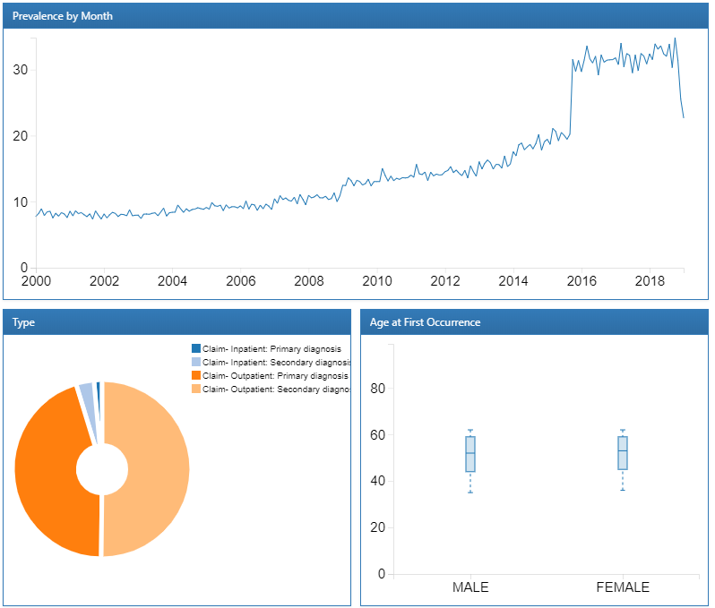
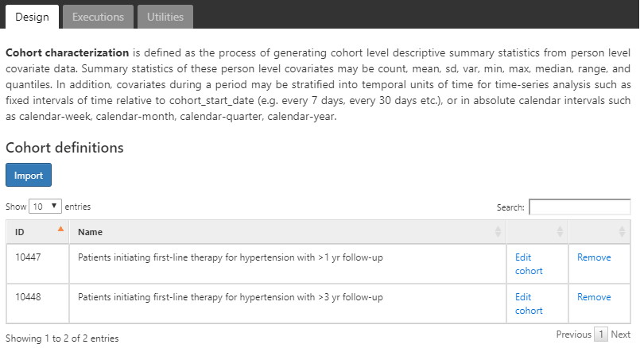
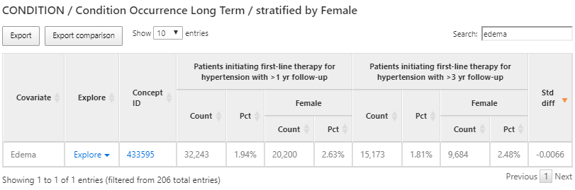
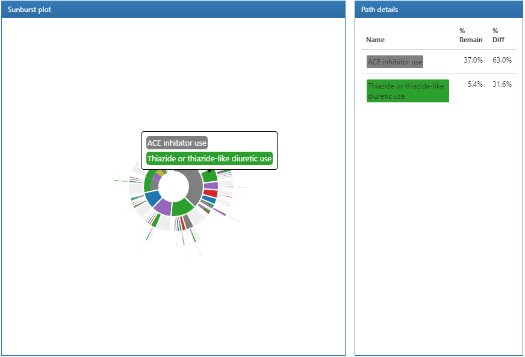
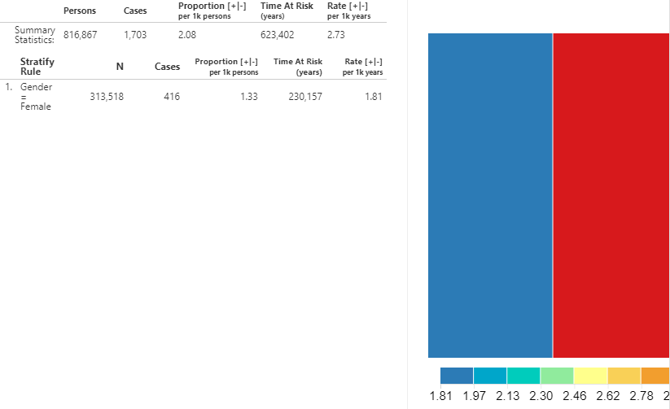

# Characterization {#Characterization}

*Chefs de chapitre : Anthony Sena & Daniel Prieto-Alhambra*

Les bases de données observationnelles sur les soins de santé fournissent une ressource précieuse pour comprendre les variations des populations en fonction d'une multitude de caractéristiques. La caractérisation des populations à travers l'utilisation de statistiques descriptives est une première étape importante pour générer des hypothèses sur les déterminants de la santé et de la maladie. Dans ce chapitre, nous couvrons les méthodes de caractérisation :

* **Caractérisation au niveau de la base de données** : fournit un ensemble de statistiques sommaires de haut niveau pour comprendre le profil de données d'une base de données dans sa totalité.
* **Caractérisation de la cohorte** : décrit une population en termes de son historique médical agrégé.
* **Chemins de traitement** : décrit la séquence d'interventions qu'une personne a reçue pendant une durée de temps.
* **Incidence** : mesure le taux de survenue d'un événement dans une population pendant une période à risque.

À l'exception de la caractérisation au niveau de la base de données, ces méthodes visent à décrire une population par rapport à un événement désigné sous le nom de date d'index. Cette population d'intérêt est définie comme une cohorte, comme décrit au chapitre \@ref(Cohorts). La cohorte définit la date d'index pour chaque personne de la population d'intérêt. En utilisant la date d'index comme point d'ancrage, nous définissons le temps précédant la date d'index comme le temps de **base**. La date d'index et tout le temps après est appelé le temps **post-index**.

Les cas d'utilisation de la caractérisation incluent l'histoire naturelle des maladies, l'utilisation des traitements et l'amélioration de la qualité. Dans ce chapitre, nous décrirons les méthodes de caractérisation. Nous utiliserons une population de personnes hypertendues pour démontrer comment utiliser ATLAS et R pour effectuer ces tâches de caractérisation.\index{caractérisation} \index{caractérisation de cohorte|voir {caractérisation!cohorte}} \index{temps de base} \index{temps post-index} \index{date d'index} \index{histoire naturelle des maladies|voir {caractérisation}} \index{utilisation des traitements|voir {caractérisation}} \index{amélioration de la qualité|voir {caractérisation}}


## Caractérisation au Niveau de la Base de Données

Avant de pouvoir répondre à toute question de caractérisation sur une population d'intérêt, nous devons d'abord comprendre les caractéristiques de la base de données que nous entendons utiliser. La caractérisation au niveau de la base de données cherche à décrire la totalité d'une base de données en termes de tendances temporelles et de distributions. Cette évaluation quantitative d'une base de données inclura généralement des questions telles que :

* Quel est le nombre total de personnes dans cette base de données ?
* Quelle est la distribution des âges des personnes ?
* Combien de temps les personnes sont-elles observées dans cette base de données ?
* Quelle est la proportion de personnes ayant {un traitement, une condition, une procédure, etc.} enregistré/prescrit au fil du temps ?

Ces statistiques descriptives au niveau de la base de données aident également un chercheur à comprendre quelles données peuvent être manquantes dans une base de données. Le chapitre \@ref(DataQuality) donne plus de détails sur la qualité des données. \index{caractérisation!niveau de la base de données}


## Caractérisation de la Cohorte

La caractérisation de la cohorte décrit les caractéristiques de base et post-index des personnes dans une cohorte. OHDSI aborde la caractérisation par le biais de statistiques descriptives de toutes les conditions, expositions aux médicaments et dispositifs, procédures et d'autres observations cliniques présentes dans l'historique de la personne. Nous résumons également les socio-démographiques des membres de la cohorte à la date d'index. Cette approche fournit un résumé complet de la cohorte d'intérêt. Il est important de noter que cela permet une exploration complète de la cohorte en vue de la variation des données, tout en permettant également l'identification de valeurs potentiellement manquantes.

Les méthodes de caractérisation des cohortes peuvent être utilisées pour les études d'utilisation de médicaments (DUS) au niveau de la personne pour estimer la prévalence des indications et des contre-indications parmi les utilisateurs d'un traitement donné. La diffusion de cette caractérisation de cohorte est une pratique recommandée pour les études observationnelles, comme détaillé dans les directives STROBE (Strengthening the Reporting of Observational Studies in Epidemiology). [@VONELM2008344] \index{caractérisation!cohorte} \index{statistiques descriptives|voir {caractérisation}} \index{utilisation des médicaments}


## Chemins de Traitement

Une autre méthode pour caractériser une population est de décrire la séquence de traitement pendant la période post-index. Par exemple, @Hripcsak7329 a utilisé les standards de données communs d'OHDSI pour créer des statistiques descriptives afin de caractériser les chemins de traitement pour le diabète de type 2, l'hypertension et la dépression. En standardisant cette approche analytique, Hripcsak et ses collègues ont pu exécuter la même analyse à travers le réseau OHDSI pour décrire les caractéristiques de ces populations d'intérêt. \index{caractérisation!chemins de traitement} \index{chemins de traitement|voir {caractérisation!chemins de traitement}} \index{chemins de cohorte|voir {caractérisation!chemins de traitement}}

L'analyse des chemins vise à résumer les traitements (événements) reçus par des personnes diagnostiquées avec une condition spécifique depuis la première prescription/délivrance de médicament. Dans cette étude, les traitements ont été décrits après le diagnostic de diabète de type 2, d'hypertension et de dépression respectivement. Les événements pour chaque personne ont ensuite été agrégés en un ensemble de statistiques sommaires et visualisés pour chaque condition et pour chaque base de données.

```{r treatmentPathwaysSunburstDataViz, fig.cap="Visualisation en 'sunburst' des chemins de traitement d'OHDSI pour l'hypertension", echo=FALSE, out.width='100%', fig.align='center'}
knitr::include_graphics("images/Characterization/pnasTreatmentPathwaysSunburst.png")
```

À titre d'exemple, la figure \@ref(fig:treatmentPathwaysSunburstDataViz) représente une population de personnes initiant un traitement pour l'hypertension. Le premier anneau au centre montre la proportion de personnes en fonction de leur traitement de première ligne. Dans cet exemple, l'Hydrochlorothiazide est le traitement de première ligne le plus courant pour cette population. Les boîtes qui s'étendent de la section de l'Hydrochlorothiazide représentent les thérapies de 2ème et 3ème ligne enregistrées pour les personnes de la cohorte.

Une analyse des chemins fournit des preuves importantes sur l'utilisation des traitements au sein d'une population. Grâce à cette analyse, nous pouvons décrire les thérapies de première ligne les plus couramment utilisées, la proportion de personnes qui arrêtent le traitement, changent de traitement ou augmentent leur thérapie. En utilisant l'analyse des chemins, @Hripcsak7329 a découvert que la metformine est le médicament le plus couramment prescrit pour le diabète, confirmant ainsi l'adoption générale de la recommandation de première ligne de l'algorithme de traitement du diabète de l'American Association of Clinical Endocrinologists. De plus, ils ont noté que 10 % des patients diabétiques, 24 % des patients hypertendus et 11 % des patients dépressifs suivaient un chemin de traitement qui n'était partagé avec personne d'autre dans les sources de données.

En terminologie DUS classique, les analyses de chemins de traitement incluent certaines estimations DUS au niveau de la population telles que la prévalence d'utilisation d'un ou plusieurs médicaments dans une population spécifiée, ainsi que certaines analyses DUS au niveau de la personne incluant des mesures de persistance et de changement entre différentes thérapies.


## Incidence

Les taux et proportions d'incidence sont des statistiques utilisées en santé publique pour évaluer la survenue d'un nouvel événement dans une population pendant un temps à risque (TAR). La figure \@ref(fig:incidenceTimeline) vise à montrer les composants d'un calcul d'incidence pour une seule personne : \index{incidence}

```{r incidenceTimeline, fig.cap="Vue au niveau de la personne des composants du calcul d'incidence. Dans cet exemple, le temps à risque est défini pour commencer un jour après le début de la cohorte et se terminer à la fin de la cohorte.",echo=FALSE, out.width='100%', fig.align='center'}
knitr::include_graphics("images/Characterization/incidenceTimeline.png")
```

Dans la figure \@ref(fig:incidenceTimeline), une personne a une période de temps où elle est observée dans les données, définie par son temps de début et de fin d'observation. Ensuite, la personne a un point dans le temps où elle entre et sort d'une cohorte en répondant à certains critères d'éligibilité. La fenêtre de temps à risque désigne alors quand nous cherchons à comprendre la survenue d'un événement. Si l'événement tombe dans le TAR, nous comptons cela comme une incidence de l'événement.

Il existe deux métriques pour calculer l'incidence :

$$
Incidence\;Proportion = \frac{\#\;personnes\;dans\;la\;cohorte\;avec\;un\;nouvel\;événement\;pendant\;le\;TAR}{\#\;personnes\;dans\;la\;cohorte\;avec\;TAR}
$$

Une proportion d'incidence fournit une mesure des nouveaux événements par personne dans la population pendant le temps à risque. Dit autrement, c'est la proportion de la population d'intérêt qui a développé l'événement dans un délai défini.\index{incidence!proportion}

$$
Incidence\;Rate = \frac{\#\;personnes\;dans\;la\;cohorte\;avec\;un\;nouvel\;événement\;pendant\;le\;TAR}{temps\;personne\;à\;risque\;contribué\;par\;les\;personnes\;dans\;la\;cohorte}
$$

Un taux d'incidence est une mesure du nombre de nouveaux événements pendant le TAR cumulé pour la population. Lorsqu'une personne subit l'événement pendant le TAR, sa contribution au temps-personne total s'arrête à la survenue de l'événement. Le TAR cumulé est appelé **temps-personne** et est exprimé en jours, mois ou années.\index{incidence!taux} \index{temps-personne}

Lorsqu'ils sont calculés pour les thérapies, les proportions et les taux d'incidence d'utilisation d'une thérapie donnée sont des DUS classiques au niveau de la population.

## Caractériser les personnes hypertendues

Selon le rapport mondial de l'Organisation Mondiale de la Santé (OMS) sur l'hypertension [@WHOHypertension], de grands bénéfices pour la santé et l'économie sont attachés à la détection précoce, au traitement adéquat et à un bon contrôle de l'hypertension. Ce rapport de l'OMS offre un aperçu de l'hypertension et caractérise le fardeau de la maladie à travers différents pays. L'OMS fournit des statistiques descriptives autour de l'hypertension pour les régions géographiques, les classes socio-économiques et le genre.

Les sources de données observationnelles offrent un moyen de caractériser les populations hypertendues comme l'a fait l'OMS. Dans les sections suivantes de ce chapitre, nous explorerons les façons dont nous utilisons ATLAS et R pour explorer une base de données afin de comprendre sa composition pour l'étude des populations hypertendues. Ensuite, nous utiliserons ces mêmes outils pour décrire l'histoire naturelle et les modèles de traitement des populations hypertendues.

## Caractérisation de la base de données dans ATLAS

Ici, nous démontrons comment utiliser le module des sources de données dans ATLAS pour explorer les statistiques de caractérisation de base de données créées avec [ACHILLES](https://github.com/OHDSI/Achilles) afin de trouver des caractéristiques au niveau de la base de données relatives aux personnes hypertendues. Commencez par cliquer sur  dans la barre de gauche d'ATLAS pour commencer. Dans la première liste déroulante affichée dans ATLAS, sélectionnez la base de données à explorer. Ensuite, utilisez la liste déroulante sous la base de données pour commencer à explorer les rapports. Pour ce faire, sélectionnez le rapport "Condition Occurrence" dans la liste déroulante qui révélera une visualisation en carte arborescente de toutes les conditions présentes dans la base de données :

```{r atlasDataSourcesConditionTreemap, fig.cap="Atlas Data Sources: Condition Occurrence Treemap", echo=FALSE, out.width='100%', fig.align='center'}
knitr::include_graphics("images/Characterization/atlasDataSourcesConditionTreemap.png")
```

Pour rechercher une condition spécifique d'intérêt, cliquez sur l'onglet "Table" pour révéler la liste complète des conditions dans la base de données avec le nombre de personnes, la prévalence et les enregistrements par personne. En utilisant la case de filtre en haut, nous pouvons filtrer les entrées dans le tableau en fonction du nom du concept contenant le terme "hypertension":

```{r atlasDataSourcesConditionFiltered, fig.cap="Atlas Data Sources: Conditions with \"hypertension\" found in the concept name", echo=FALSE, out.width='100%', fig.align='center'}
knitr::include_graphics("images/Characterization/atlasDataSourcesConditionFiltered.png")
```

Nous pouvons explorer un rapport détaillé sur une condition en cliquant sur une ligne. Dans ce cas, nous sélectionnerons "essential hypertension" pour obtenir une répartition des tendances de la condition sélectionnée au fil du temps et selon le genre, la prévalence de la condition par mois, le type enregistré avec la condition et l'âge à la première occurrence du diagnostic :

```{r atlasDataSourcesDrillDownReport, fig.cap="Atlas Data Sources: Essential hypertension drill down report", echo=FALSE, out.width='100%', fig.align='center'}

```

Maintenant que nous avons passé en revue les caractéristiques de la base de données pour la présence de concepts d'hypertension et les tendances au fil du temps, nous pouvons également explorer les médicaments utilisés pour traiter les personnes hypertendues. Le processus pour ce faire suit les mêmes étapes, sauf que nous utilisons le rapport "Drug Era" pour examiner les caractéristiques des médicaments résumées à leur ingrédient RxNorm. Une fois que nous avons exploré les caractéristiques de la base de données pour examiner les éléments d'intérêt, nous sommes prêts à aller de l'avant avec la construction de cohortes pour identifier les personnes hypertendues à caractériser.
## Caractérisation des Cohortes dans ATLAS

Ici, nous montrons comment utiliser ATLAS pour effectuer une caractérisation à grande échelle de plusieurs cohortes. Cliquez sur le  dans la barre de gauche d'ATLAS et créez une nouvelle analyse de caractérisation. Donnez un nom à l'analyse et sauvegardez-la en utilisant le bouton .

### Conception

Une analyse de caractérisation nécessite au moins une cohorte et au moins une caractéristique à caractériser. Pour cet exemple, nous utiliserons deux cohortes. La première cohorte définira les personnes commençant un traitement pour l'hypertension comme leur date d'index avec au moins un diagnostic d'hypertension dans l'année précédente. Nous exigerons également que les personnes de cette cohorte aient au moins un an d'observation après avoir commencé le médicament antihypertenseur (Appendice \@ref(HTN1yrFO)). La seconde cohorte est identique à la première cohorte décrite avec une exigence d'avoir au moins trois ans d'observation au lieu d'un (Appendice \@ref(HTN3yrFO)).

#### Définitions des Cohortes {-}

```{r atlasCharacterizationCohortSelection, fig.cap="Onglet de conception de la caractérisation - sélection de la définition de la cohorte",echo=FALSE, out.width='100%', fig.align='center'}

```

Nous supposons que les cohortes ont déjà été créées dans ATLAS comme décrit dans le Chapitre \@ref(Cohorts). Cliquez sur  et sélectionnez les cohortes comme indiqué dans la figure \@ref(fig:atlasCharacterizationCohortSelection). Ensuite, nous définirons les caractéristiques à utiliser pour caractériser ces deux cohortes.

#### Sélection des Caractéristiques {-}

ATLAS est livré avec près de 100 analyses de caractéristiques prédéfinies qui sont utilisées pour effectuer la caractérisation dans les domaines cliniques modélisés dans l'OMOP CDM. Chacune de ces analyses de caractéristiques prédéfinies effectue des fonctions d'agrégation et de résumés sur les observations cliniques pour les cohortes cibles sélectionnées. Ces calculs fournissent potentiellement des milliers de caractéristiques pour décrire les caractéristiques de base et post-index des cohortes. En coulisse, ATLAS utilise le package R OHDSI FeatureExtraction pour effectuer la caractérisation de chaque cohorte. Nous couvrirons l'utilisation de FeatureExtraction et R plus en détail dans la section suivante. \index{feature analyses}

Cliquez sur  pour sélectionner la caractéristique à caractériser. Voici une liste des caractéristiques que nous utiliserons pour caractériser ces cohortes :

```{r atlasCharacterizationFeatureSelection, fig.cap="Onglet de conception de la caractérisation - sélection des caractéristiques.",echo=FALSE, out.width='100%', fig.align='center'}
knitr::include_graphics("images/Characterization/atlasCharacterizationFeatureSelection.png")
```

La figure ci-dessus montre la liste des caractéristiques sélectionnées ainsi qu'une description de ce que chaque caractéristique va caractériser pour chaque cohorte. Les caractéristiques qui commencent par le nom "Démographie" calculeront les informations démographiques pour chaque personne à la date de début de la cohorte. Pour les caractéristiques qui commencent par un nom de domaine (c'est-à-dire Visite, Procédure, Condition, Médicament, etc.), celles-ci caractériseront toutes les observations enregistrées dans ce domaine. Chaque caractéristique de domaine a quatre options de fenêtre temporelle précédant le début de la cohorte, à savoir :

* **À tout moment avant** : utilise tout le temps disponible avant le début de la cohorte qui tombe dans la période d'observation de la personne.
* **Long terme** : 365 jours avant jusqu'à et y compris la date de début de la cohorte.
* **Moyen terme** : 180 jours avant jusqu'à et y compris la date de début de la cohorte.
* **Court terme** : 30 jours avant jusqu'à et y compris la date de début de la cohorte.

#### Analyse de Sous-Groupe {-}

Que faire si nous étions intéressés par la création de différentes caractéristiques basées sur le sexe ? Nous pouvons utiliser la section "analyses de sous-groupes" pour définir de nouveaux sous-groupes d'intérêt à utiliser dans notre caractérisation.

Pour créer un sous-groupe, cliquez et ajoutez vos critères pour l'appartenance au sous-groupe. Cette étape est similaire aux critères utilisés pour identifier l'inscription à la cohorte. Dans cet exemple, nous définirons un ensemble de critères pour identifier les femmes parmi nos cohortes :

```{r atlasCharacterizationSubgroup, fig.cap="Conception de la caractérisation avec analyse du sous-groupe féminin.",echo=FALSE, out.width='100%', fig.align='center'}
knitr::include_graphics("images/Characterization/atlasCharacterizationSubgroup.png")
```

```{block2, type='rmdimportant'}
Les analyses de sous-groupes dans ATLAS ne sont pas les mêmes que les strates. Les strates sont mutuellement exclusives tandis que les sous-groupes peuvent inclure les mêmes personnes en fonction des critères choisis.
```

### Exécutions
Une fois que nous avons conçu notre caractérisation, nous pouvons exécuter cette conception sur une ou plusieurs bases de données dans notre environnement. Rendez-vous sur l'onglet Exécutions et cliquez sur le bouton Générer pour démarrer l'analyse sur une base de données :

```{r atlasCharacterizationExecutions, fig.cap="Exécution de la conception de la caractérisation - sélection de la source CDM.",echo=FALSE, out.width='100%', fig.align='center'}

```

Une fois l'analyse terminée, nous pouvons afficher les rapports en cliquant sur le bouton "All Executions" et dans la liste des exécutions, sélectionnez "View Reports". Alternativement, vous pouvez cliquer sur "View latest result" pour voir la dernière exécution effectuée.

### Résultats

```{r atlasCharacterizationResultsSummary, fig.cap="Résultats de la caractérisation - occurrence des conditions à long terme.",echo=FALSE, out.width='100%', fig.align='center'}
knitr::include_graphics("images/Characterization/atlasCharacterizationResultsSummary.png")
```

Les résultats fournissent une vue tabulaire des différentes caractéristiques de chaque cohorte sélectionnée dans la conception. Dans la figure \@ref(fig:atlasCharacterizationResultsSummary), un tableau fournit un résumé de toutes les conditions présentes dans les deux cohortes au cours des 365 jours précédant le début de la cohorte. Chaque covariable a un compte et un pourcentage pour chaque cohorte et le sous-groupe féminin que nous avons défini dans chaque cohorte.

Nous avons utilisé la boîte de recherche pour filtrer les résultats afin de voir quelle proportion de personnes ont une `arythmie cardiaque` dans leur historique dans le but de comprendre quels diagnostics liés au cardiovasculaire sont observés dans les populations. Nous pouvons utiliser le lien `Explore` à côté du concept d'arythmie cardiaque pour ouvrir une nouvelle fenêtre avec plus de détails sur le concept pour une seule cohorte comme montré dans la figure \@ref(fig:atlasCharacterizationResultsExplore) :

```{r atlasCharacterizationResultsExplore, fig.cap="Résultats de la caractérisation - exploration d'un concept unique.",echo=FALSE, out.width='100%', fig.align='center'}
knitr::include_graphics("images/Characterization/atlasCharacterizationResultsExplore.png")
```

Puisque nous avons caractérisé tous les concepts de conditions pour nos cohortes, l'option d'exploration permet une vue de tous les concepts ancêtres et descendants pour le concept sélectionné, dans ce cas l'arythmie cardiaque. Cette exploration nous permet de naviguer dans la hiérarchie des concepts pour explorer d'autres maladies cardiaques pouvant apparaître chez nos personnes hypertendues. Comme dans la vue récapitulative, le compte et le pourcentage sont affichés.

Nous pouvons également utiliser les mêmes résultats de caractérisation pour trouver des conditions qui sont contre-indiquées pour certains traitements antihypertenseurs tels que l'œdème de Quincke. Pour ce faire, nous suivrons les mêmes étapes ci-dessus, mais cette fois, nous rechercherons ‘œdème’ comme montré dans la figure \@ref(fig:atlasCharacterizationResultsContra) :

```{r atlasCharacterizationResultsContra, fig.cap="Résultats de la caractérisation - exploration d'une condition contre-indiquée.",echo=FALSE, out.width='100%', fig.align='center'}

```

Encore une fois, nous utiliserons la fonctionnalité d'exploration pour voir les caractéristiques de l'œdème dans la population hypertensive afin de trouver la prévalence de l'œdème de Quincke :

```{r atlasCharacterizationResultsContraExplore, fig.cap="Résultats de la caractérisation - exploration des détails d'une condition contre-indiquée.",echo=FALSE, out.width='100%', fig.align='center'}
knitr::include_graphics("images/Characterization/atlasCharacterizationResultsContraExplore.png")
```

Ici, nous constatons qu'une partie de cette population a un dossier d'œdème de Quincke dans l'année précédant le début d'un médicament antihypertenseur.

```{r atlasCharacterizationResultsContinuous, fig.cap="Résultats de la caractérisation de l'âge pour chaque cohorte et sous-groupe.",echo=FALSE, out.width='100%', fig.align='center'}
knitr::include_graphics("images/Characterization/atlasCharacterizationResultsContinuous.png")
```

Alors que les covariables de domaine sont calculées à l'aide d'un indicateur binaire (c'est-à-dire qu'un dossier du code était présent dans le délai précédent), certaines variables fournissent une valeur continue telle que l'âge des personnes au début de la cohorte. Dans l'exemple ci-dessus, nous montrons l'âge des 2 cohortes caractérisées exprimé par le compte des personnes, l'âge moyen, l'âge médian et l'écart type.

### Définir des Caractéristiques Personnalisées

En plus des caractéristiques prédéfinies, ATLAS prend en charge la possibilité de permettre des caractéristiques personnalisées définies par l'utilisateur. Pour ce faire, cliquez sur l'élément de menu gauche **Characteristic**, puis cliquez sur l'onglet **Feature Analysis** et cliquez sur le bouton **New Feature Analysis**. Fournissez un nom pour la caractéristique personnalisée et enregistrez-la à l'aide du bouton . \index{ATLAS!characterization features}

Dans cet exemple, nous définirons une caractéristique personnalisée qui identifiera le nombre de personnes dans chaque cohorte ayant un épisode de médicament inhibiteur de l'ECA dans leur historique après le début de la cohorte :

```{r atlasCharacterizationCustomFeature, fig.cap="Définition d'une caractéristique personnalisée dans ATLAS.",echo=FALSE, out.width='100%', fig.align='center'}

```

Les critères définis ci-dessus supposent qu'ils seront appliqués à une date de début de la cohorte. Une fois que nous avons défini les critères et que nous les avons sauvegardés, nous pouvons les appliquer à la conception de caractérisation que nous avons créée dans la section précédente. Pour ce faire, ouvrez la conception de caractérisation et accédez à la section Feature Analysis. Cliquez sur le bouton  et dans le menu, sélectionnez les nouvelles caractéristiques personnalisées. Elles apparaîtront maintenant dans la liste des caractéristiques pour la conception de caractérisation. Comme décrit précédemment, nous pouvons exécuter cette conception sur une base de données pour produire la caractérisation de cette caractéristique personnalisée :

```{r atlasCharacterizationCustomFeatureResults, fig.cap="Affichage des résultats de la caractéristique personnalisée.",echo=FALSE, out.width='100%', fig.align='center'}
knitr::include_graphics("images/Characterization/atlasCharacterizationCustomFeatureResults.png")
```

## Caractérisation des Cohortes en R

Nous pouvons également choisir de caractériser des cohortes en utilisant R. Ici, nous décrirons comment utiliser le package R OHDSI FeatureExtraction pour générer des caractéristiques de base (covariables) pour nos cohortes d'hypertension. FeatureExtraction permet aux utilisateurs de construire des covariables de trois manières : \index{FeatureExtraction}

* Choisir l'ensemble par défaut de covariables
* Choisir parmi un ensemble d'analyses prédéfinies
* Créer un ensemble d'analyses personnalisées

FeatureExtraction crée des covariables de deux manières distinctes : les caractéristiques au niveau individuel et les caractéristiques agrégées. Les caractéristiques au niveau individuel sont utiles pour les applications d'apprentissage automatique. Dans cette section, nous nous concentrerons sur l'utilisation des caractéristiques agrégées qui sont utiles pour générer des covariables de base décrivant la cohorte d'intérêt. De plus, nous nous concentrerons sur les deux dernières manières de construire des covariables : les analyses prédéfinies et personnalisées, et laisserons l'utilisation de l'ensemble par défaut comme un exercice pour le lecteur.

### Instauration des Cohortes

Nous devons d'abord instancier la cohorte pour la caractériser. L'instauration des cohortes est décrite au Chapitre \@ref(Cohorts). Dans cet exemple, nous utiliserons les personnes initiant une thérapie de première ligne pour l'hypertension avec un suivi de 1 an (Appendice \@ref(HTN1yrFO)). Nous laissons la caractérisation des autres cohortes dans l'Appendice \@ref(CohortDefinitions) comme un exercice pour le lecteur. Nous supposerons que la cohorte a été instanciée dans une table appelée `scratch.my_cohorts` avec un identifiant de définition de cohorte égal à 1.

### Extraction des Données

Nous devons d'abord dire à R comment se connecter au serveur. FeatureExtraction utilise le package DatabaseConnector, qui fournit une fonction appelée `createConnectionDetails`. Tapez `?createConnectionDetails` pour les paramètres spécifiques requis pour les différents systèmes de gestion de base de données (SGBD). Par exemple, on pourrait se connecter à une base de données PostgreSQL en utilisant ce code :

```{r tidy=FALSE,eval=FALSE}
library(FeatureExtraction)
connDetails <- createConnectionDetails(dbms = "postgresql",
                                       server = "localhost/ohdsi",
                                       user = "joe",
                                       password = "supersecret")

cdmDbSchema <- "my_cdm_data"
cohortsDbSchema <- "scratch"
cohortsDbTable <- "my_cohorts"
cdmVersion <- "5"
```

Les quatre dernières lignes définissent les variables `cdmDbSchema`, `cohortsDbSchema`, et `cohortsDbTable`, ainsi que la version du CDM. Nous utiliserons ces informations plus tard pour indiquer à R où résident les données au format CDM, où les cohortes d'intérêt ont été créées, et quelle version du CDM est utilisée. Notez que pour Microsoft SQL Server, les schémas de bases de données doivent spécifier à la fois la base de données et le schéma, par exemple `cdmDbSchema <- "my_cdm_data.dbo"`.

### Utilisation des Analyses Prédéfinies

La fonction `createCovariateSettings` permet à l'utilisateur de choisir parmi un large ensemble de covariables prédéfinies. Tapez `?createCovariateSettings` pour obtenir un aperçu des options disponibles. Par exemple :

```{r tidy=FALSE,eval=FALSE}
settings <- createCovariateSettings(
  useDemographicsGender = TRUE,
  useDemographicsAgeGroup = TRUE,
  useConditionOccurrenceAnyTimePrior = TRUE)
```

Cela créera des covariables binaires pour le genre, l'âge (par groupes de 5 ans), et chaque concept observé dans la table condition_occurrence à tout moment avant (et incluant) la date de début de la cohorte.

Bon nombre des analyses prédéfinies font référence à une fenêtre de temps courte, moyenne ou longue. Par défaut, ces fenêtres sont définies comme suit :

* **Long terme** : 365 jours avant jusqu'à (et incluant) la date de début de la cohorte.
* **Moyen terme** : 180 jours avant jusqu'à (et incluant) la date de début de la cohorte.
* **Court terme** : 30 jours avant jusqu'à (et incluant) la date de début de la cohorte.

Cependant, l'utilisateur peut modifier ces valeurs. Par exemple :

```{r tidy=FALSE,eval=FALSE}
settings <- createCovariateSettings(useConditionEraLongTerm = TRUE,
                                    useConditionEraShortTerm = TRUE,
                                    useDrugEraLongTerm = TRUE,
                                    useDrugEraShortTerm = TRUE,
                                    longTermStartDays = -180,
                                    shortTermStartDays = -14,
                                    endDays = -1)
```

Cela redéfinit la fenêtre à long terme comme étant 180 jours avant jusqu'à (mais non incluant) la date de début de la cohorte, et redéfinit la fenêtre à court terme comme étant 14 jours avant jusqu'à (mais non incluant) la date de début de la cohorte.

Encore une fois, nous pouvons également spécifier quels identifiants de concept doivent ou ne doivent pas être utilisés pour construire des covariables :

```{r tidy=FALSE,eval=FALSE}
settings <- createCovariateSettings(useConditionEraLongTerm = TRUE,
                                    useConditionEraShortTerm = TRUE,
                                    useDrugEraLongTerm = TRUE,
                                    useDrugEraShortTerm = TRUE,
                                    longTermStartDays = -180,
                                    shortTermStartDays = -14,
                                    endDays = -1,
                                    excludedCovariateConceptIds = 1124300,
                                    addDescendantsToExclude = TRUE,
                                    aggregated = TRUE)
```

```{block2, type='rmdimportant'}
L'utilisation de `aggregated = TRUE` pour tous les exemples ci-dessus indique à FeatureExtraction de fournir des statistiques sommaires. Exclure ce drapeau calculera les covariables pour chaque personne dans la cohorte.
```

### Création de Covariables Agrégées

Le bloc de code suivant générera des statistiques agrégées pour une cohorte :

```{r tidy=FALSE,eval=FALSE}
covariateSettings <- createDefaultCovariateSettings()

covariateData2 <- getDbCovariateData(
  connectionDetails = connectionDetails,
  cdmDatabaseSchema = cdmDatabaseSchema,
  cohortDatabaseSchema = resultsDatabaseSchema,
  cohortTable = "cohorts_of_interest",
  cohortId = 1,
  covariateSettings = covariateSettings,
  aggregated = TRUE)

summary(covariateData2)
```

Et la sortie ressemblera à ce qui suit :

```

## Résumé de l'objet CovariateData
##

## Nombre de Covariables : 41330

## Nombre de Valeurs de Covariables Non-Zéro : 41330
```

### Format de Sortie

Les deux composants principaux de l'objet `covariateData` agrégé sont `covariates` et `covariatesContinuous` pour les covariables binaires et continues respectivement :

```{r tidy=FALSE,eval=FALSE}
covariateData2$covariates
covariateData2$covariatesContinuous
```

### Covariables Personnalisées

FeatureExtraction offre également la possibilité de définir et d'utiliser des covariables personnalisées. Ces détails sont un sujet avancé et sont couverts dans la documentation utilisateur : http://ohdsi.github.io/FeatureExtraction/.
## Chemins de Cohortes dans ATLAS

L'objectif de l'analyse des chemins est de comprendre la séquence des traitements dans une ou plusieurs cohortes d'intérêt. Les méthodes appliquées sont basées sur le design rapporté par @Hripcsak7329. Ces méthodes ont été généralisées et codifiées dans une fonctionnalité appelée Cohort Pathways dans ATLAS.

Les chemins de cohortes visent à fournir des capacités analytiques pour résumer les événements suivant la date de début de cohorte d'une ou plusieurs cohortes cibles. Pour ce faire, nous créons un ensemble de cohortes pour identifier les événements cliniques d'intérêt pour la population cible, appelées cohortes d'événements. En se concentrant sur ce à quoi cela pourrait ressembler pour une personne dans la cohorte cible :

```{r pathwaysPersonEventView, fig.cap="Analyse des chemins dans le contexte d'une seule personne.",echo=FALSE, out.width='100%', fig.align='center'}
knitr::include_graphics("images/Characterization/pathwaysPersonEventView.png")
```

Dans la figure \@ref(fig:pathwaysPersonEventView), la personne fait partie de la cohorte cible avec une date de début et de fin définie. Ensuite, les segments de ligne numérotés représentent où cette personne est également identifiée dans une cohorte d'événements pour une durée déterminée. Les cohortes d'événements nous permettent de décrire tout événement clinique d'intérêt représenté dans le CDM de sorte que nous ne sommes pas contraints de créer un chemin pour un seul domaine ou concept.

Pour commencer, cliquez sur  dans la barre de gauche d'ATLAS pour créer une nouvelle étude de chemins de cohortes. Fournissez un nom descriptif et appuyez sur le bouton de sauvegarde.

### Conception

Pour commencer, nous continuerons à utiliser les cohortes initiant une thérapie de première ligne pour l'hypertension avec un suivi de 1 et 3 ans (Appendice \@ref(HTN1yrFO), \@ref(HTN3yrFO)). Utilisez le bouton pour importer les 2 cohortes.

```{r atlasPathwaysTargetCohorts, fig.cap="Analyse des chemins avec des cohortes cibles sélectionnées.",echo=FALSE, out.width='100%', fig.align='center'}
knitr::include_graphics("images/Characterization/atlasPathwaysTargetCohorts.png")
```

Ensuite, nous définirons les cohortes d'événements en créant une cohorte pour chaque médicament antihypertenseur de première ligne d'intérêt. Pour cela, nous commencerons par créer une cohorte d'utilisateurs d'inhibiteurs de l'ECA et définirons la date de fin de la cohorte comme la fin de l'exposition continue. Nous ferons de même pour 8 autres médicaments antihypertenseurs et noterons que ces définitions se trouvent dans l'Appendice \@ref(ACEiUse)-\@ref(A1BUse). Une fois terminé, utilisez le bouton  pour les importer dans la section Cohorte d'événements de la conception des chemins :

```{r atlasPathwaysEventCohorts, fig.cap="Cohortes d'événements pour la conception des chemins pour initier une thérapie antihypertensive de première ligne.",echo=FALSE, out.width='100%', fig.align='center'}
knitr::include_graphics("images/Characterization/atlasPathwaysEventCohorts.png")
```

Une fois terminé, votre conception devrait ressembler à celle ci-dessus. Ensuite, nous devrons décider de quelques paramètres d'analyse supplémentaires :

* **Fenêtre de combinaison** : Ce paramètre vous permet de définir une fenêtre de temps, en jours, dans laquelle le chevauchement entre les événements est considéré comme une combinaison d'événements. Par exemple, si deux médicaments représentés par 2 cohortes d'événements (cohorte d'événements 1 et cohorte d'événements 2) se chevauchent dans la fenêtre de combinaison, l'algorithme des chemins les combinera en "cohorte d'événements 1 + cohorte d'événements 2".
* **Nombre minimum de cellules** : Les cohortes d'événements avec moins de ce nombre de personnes seront censurées (supprimées) des résultats pour protéger la vie privée.
* **Longueur maximale du chemin** : Cela fait référence au nombre maximal d'événements séquentiels à considérer pour l'analyse.

### Exécutions

Une fois notre analyse des chemins conçue, nous pouvons exécuter cette conception sur une ou plusieurs bases de données dans notre environnement. Cela fonctionne de la même manière que nous l'avons décrit pour la caractérisation des cohortes dans ATLAS. Une fois terminé, nous pouvons examiner les résultats de l'analyse.

### Visualisation des résultats

```{r atlasPathwaysResults, fig.cap="Résultats des chemins légende et visualisation sunburst.",echo=FALSE, out.width='100%', fig.align='center'}
knitr::include_graphics("images/Characterization/atlasPathwaysResults.png")
```

Les résultats d'une analyse de chemin sont divisés en 3 sections : La section de légende affiche le nombre total de personnes dans la cohorte cible ainsi que le nombre de personnes ayant eu 1 ou plusieurs événements dans l'analyse des chemins. En dessous de ce résumé, les désignations de couleur pour chacune des cohortes apparaissent dans le graphique en anneaux au centre.

Le graphique en anneaux est une visualisation qui représente les différents chemins d'événements empruntés par les personnes au fil du temps. Le centre du graphique représente l'entrée dans la cohorte et le premier anneau coloré montre la proportion de personnes dans chaque cohorte d'événements. Dans notre exemple, le centre du cercle représente les personnes hypertendues initiant une thérapie de première ligne. Ensuite, le premier anneau dans le graphique montre la proportion de personnes ayant initié un type de thérapie de première ligne défini par les cohortes d'événements (c'est-à-dire les inhibiteurs de l'ECA, les bloqueurs des récepteurs de l'angiotensine, etc). Le deuxième ensemble d'anneaux représente la 2ème cohorte d'événements pour les personnes. Dans certaines séquences d'événements, une personne peut ne jamais avoir un 2ème événement observé dans les données et cette proportion est représentée par la partie grise de l'anneau.

```{r atlasPathwaysResultsPathDetails, fig.cap="Résultats des chemins affichant les détails du chemin.",echo=FALSE, out.width='100%', fig.align='center'}

```

Cliquer sur une section du graphique en anneaux affichera les détails du chemin sur la droite. Ici, nous pouvons voir que la plus grande proportion de personnes dans notre cohorte cible a initié une thérapie de première ligne avec des inhibiteurs de l'ECA et de ce groupe, une proportion plus petite a commencé une thérapie avec des thiazidiques ou des diurétiques thiazidiques.

## Analyse d'incidence dans ATLAS

Dans le cadre d'un calcul d'incidence, nous décrivons : parmi les personnes de la cohorte cible, celles qui ont connu la cohorte des résultats pendant la période de risque. Ici, nous concevrons une analyse d'incidence pour caractériser les issues d'angioedème et d'infarctus aigu du myocarde chez les nouveaux utilisateurs d'inhibiteurs de l'ECA (IEC) et de diurétiques thiazidiques et thiazidiques apparentés (THZ). Nous évaluerons ces issues pendant la période de risque pendant laquelle une personne était exposée au médicament. De plus, nous ajouterons un résultat d'exposition à des bloqueurs des récepteurs de l'angiotensine (BRA) pour mesurer l'incidence de l'utilisation de nouveaux BRA pendant l'exposition aux cohortes cibles (IEC et THZ). Cette définition de résultat permet de comprendre comment les BRA sont utilisés parmi les populations cibles.


Pour commencer, cliquez sur  dans la barre de gauche d'ATLAS pour créer une nouvelle analyse d'incidence. Fournissez un nom descriptif et appuyez sur le bouton de sauvegarde .

### Conception

Nous supposons que les cohortes utilisées dans cet exemple ont déjà été créées dans ATLAS comme décrit au Chapitre \@ref(Cohorts). L'annexe fournit les définitions complètes des cohortes cibles (Annexe \@ref(AceInhibitorsMono), \@ref(ThiazidesMono)), et des résultats (Annexe \@ref(Angioedema), \@ref(Ami), \@ref(ARBUse)).

```{r atlasIncidenceCohortSelection, fig.cap="Incidence Rate target and outcome definition.", echo=FALSE, out.width='100%', fig.align='center'}
knitr::include_graphics("images/Characterization/atlasIncidenceCohortSelection.png")
```

Dans l'onglet de définition, cliquez pour choisir la cohorte *Nouveaux utilisateurs d'inhibiteurs de l'ECA* et la cohorte *Nouveaux utilisateurs de diurétiques thiazidiques ou thiazidiques apparentés*. Fermez la boîte de dialogue pour voir que ces cohortes sont ajoutées à la conception. Ensuite, nous ajoutons nos cohortes de résultats en cliquant et en sélectionnant les cohortes de résultats des événements *infarctus aigu du myocarde*, des événements *d'angioedème* et de *l'utilisation de bloqueurs des récepteurs de l'angiotensine (BRA)*. Encore une fois, fermez la fenêtre pour voir que ces cohortes sont ajoutées à la section des cohortes de résultats de la conception.

```{r atlasIncidenceTimeAtRisk, fig.cap="Incidence Rate target and outcome definition.", echo=FALSE, out.width='100%', fig.align='center'}
knitr::include_graphics("images/Characterization/atlasIncidenceTimeAtRisk.png")
```

Ensuite, nous définirons la fenêtre de temps à risque pour l'analyse. Comme montré ci-dessus, la fenêtre de temps à risque est définie par rapport aux dates de début et de fin de la cohorte. Ici, nous définissons le début du temps à risque comme étant 1 jour après le début de la cohorte pour nos cohortes cibles. Ensuite, nous définirons la fin du temps à risque à la date de fin de la cohorte. Dans ce cas, la définition des cohortes IEC et THZ a une date de fin de cohorte lorsque l'exposition au médicament se termine.

ATLAS offre également un moyen de stratifier les cohortes cibles dans le cadre de la spécification de l'analyse :

```{r atlasIncidenceStratifyFemale, fig.cap="Incidence Rate strata definition for females.", echo=FALSE, out.width='100%', fig.align='center'}
knitr::include_graphics("images/Characterization/atlasIncidenceStratifyFemale.png")
```

Pour ce faire, cliquez sur le bouton *Nouveau critère de stratification* et suivez les mêmes étapes décrites au Chapitre 11. Maintenant que nous avons complété la conception, nous pouvons passer à l'exécution de notre conception sur une ou plusieurs bases de données.

### Exécutions

Cliquez sur l'onglet de Génération puis sur le bouton  pour révéler une liste de bases de données à utiliser pour exécuter l'analyse :

```{r atlasIncidenceSourceSelection, fig.cap="Incidence Rate analysis execution.", echo=FALSE, out.width='100%', fig.align='center'}
knitr::include_graphics("images/Characterization/atlasIncidenceSourceSelection.png")
```

Sélectionnez une ou plusieurs bases de données et cliquez sur le bouton Générer pour démarrer l'analyse afin d'analyser toutes les combinaisons de cibles et de résultats spécifiés dans la conception.

### Visualisation des résultats

Dans l'onglet de Génération, la partie supérieure de l'écran vous permet de sélectionner une cible et un résultat pour visualiser les résultats. Juste en dessous, un résumé de l'incidence est montré pour chaque base de données utilisée dans l'analyse.

Sélectionnez la cohorte cible des utilisateurs d'IEC et l'infarctus aigu du myocarde (AMI) dans les listes déroulantes respectives. Cliquez sur le bouton  pour révéler les résultats de l'analyse d'incidence :

```{r atlasIncidenceResults, fig.cap="Incidence Rate analysis output - New ACEi users with AMI outcome.", echo=FALSE, out.width='100%', fig.align='center'}

```

Un résumé pour la base de données montre le nombre total de personnes dans la cohorte qui ont été observées pendant le TAR ainsi que le nombre total de cas. La proportion montre le nombre de cas pour 1000 personnes. Le temps à risque, en années, est calculé pour la cohorte cible. Le taux d'incidence est exprimé en nombre de cas pour 1000 personnes-années.

Nous pouvons également visualiser les métriques d'incidence pour les strates que nous avons définies dans la conception. Les mêmes métriques mentionnées ci-dessus sont calculées pour chaque strate. De plus, une visualisation en treemap fournit une représentation de la proportion de chaque strate représentée par les zones encadrées. La couleur représente le taux d'incidence comme montré dans l'échelle en bas.

Nous pouvons obtenir les mêmes informations pour voir l'incidence de la nouvelle utilisation des BRA parmi la population d'IEC. En utilisant la liste déroulante en haut, changez le résultat pour l'utilisation des BRA et cliquez sur le bouton  pour révéler les détails.

```{r atlasIncidenceResultsARB, fig.cap="Incidence Rate - New users of ACEi receiving ARBs treatment during ACEi exposure.", echo=FALSE, out.width='100%', fig.align='center'}
knitr::include_graphics("images/Characterization/atlasIncidenceResultsARB.png")
```

Comme montré, les métriques calculées sont les mêmes mais l'interprétation est différente puisque l'entrée (utilisation des BRA) se réfère à une estimation de l'utilisation de médicaments au lieu d'un résultat de santé.

## Résumé

```{block2, type='rmdsummary'}
- OHDSI propose des outils pour caractériser une base de données entière ou une cohorte d'intérêt.

- La caractérisation des cohortes décrit une cohorte d'intérêt pendant le temps précédant la date d'index (**baseline**) et le temps après l'index (**post-index**).

- Le module de caractérisation d'ATLAS et la bibliothèque de méthodes d'OHDSI permettent de calculer les caractéristiques de baseline pour plusieurs fenêtres temporelles.

- Les modules de parcours et de taux d'incidence d'ATLAS offrent des statistiques descriptives pendant la période post-index.

```

## Exercices

#### Prérequis {-}

Pour ces exercices, l'accès à une instance d'ATLAS est requis. Vous pouvez utiliser l'instance à [http://atlas-demo.ohdsi.org](http://atlas-demo.ohdsi.org) ou toute autre instance à laquelle vous avez accès.

```{exercise, exerciseCharacterization1}
Nous aimerions comprendre comment le célécoxib est utilisé dans le monde réel. Pour commencer, nous aimerions comprendre quelles données une base de données possède sur ce médicament. Utilisez le module de sources de données d'ATLAS pour trouver des informations sur le célécoxib.

```

```{exercise, exerciseCharacterization2}
Nous aimerions mieux comprendre l'histoire naturelle de la maladie chez les utilisateurs de célécoxib. Créez une cohorte simple de nouveaux utilisateurs de célécoxib en utilisant une période de washout de 365 jours (voir le chapitre \@ref(Cohorts) pour plus de détails sur la façon de le faire), et utilisez ATLAS pour créer une caractérisation de cette cohorte, montrant les conditions co-morbides et les expositions aux médicaments.

```

```{exercise, exerciseCharacterization3}
Nous nous intéressons à comprendre à quelle fréquence des saignements gastro-intestinaux (GI) se produisent à tout moment après que les gens commencent à traiter avec célécoxib. Créez une cohorte d'événements de saignements GI, définie simplement comme toute occurrence du concept [192671](http://athena.ohdsi.org/search-terms/terms/192671) ("Hémorragie gastro-intestinale") ou de l'un de ses descendants. Calculez le taux d'incidence de ces événements GI après l'initiation du célécoxib, en utilisant la cohorte d'exposition définie dans l'exercice précédent.

```

Les réponses suggérées se trouvent dans l'annexe \@ref(Characterizationanswers).
