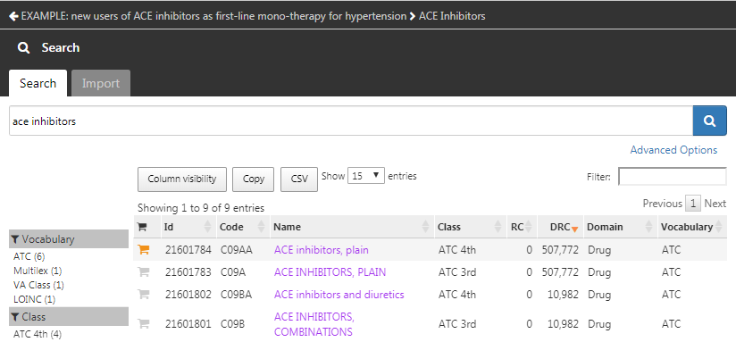
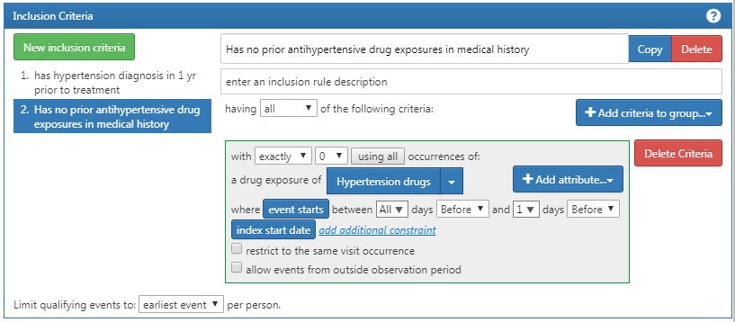

# Définir des Cohortes {#Cohortes}

*Chef de chapitre : Kristin Kostka*

Les données de santé observationnelles, également appelées *données du monde réel*, sont les données liées à l'état de santé des patients et/ou à la prestation des soins de santé, recueillies de manière routinière à partir de diverses sources. En tant que telles, les gestionnaires de données OHDSI (collaborateurs OHDSI qui maintiennent les données dans le CDM pour leurs sites) peuvent capturer des données provenant de plusieurs sources, y compris les dossiers de santé électroniques (DSE), les réclamations d'assurance santé et les activités de facturation, les registres de produits et de maladies, les données générées par les patients y compris en milieu domestique, et les données recueillies à partir d'autres sources pouvant fournir des informations sur l'état de santé, telles que les appareils mobiles. Comme ces données n’ont pas été collectées à des fins de recherche, elles peuvent ne pas capturer explicitement les éléments de données cliniques qui nous intéressent.

Par exemple, une base de données de réclamations d'assurance maladie est conçue pour capturer tous les soins fournis pour une certaine condition (par exemple, l’angio-œdème) afin que les coûts associés puissent être remboursés de manière appropriée, et les informations sur la condition réelle ne sont capturées que dans le cadre de cet objectif. Si nous souhaitons utiliser de telles données observationnelles à des fins de recherche, nous devrons souvent rédiger une logique utilisant *ce qui est capturé dans les données* pour en déduire *ce qui nous intéresse réellement*. En d'autres termes, nous devons souvent créer une cohorte en utilisant une certaine définition de la façon dont un événement clinique se manifeste. Ainsi, si nous voulons identifier les événements d'angio-œdème dans une base de données de réclamations d'assurance, nous pouvons définir une logique exigeant un code de diagnostic d'angio-œdème enregistré dans un cadre de salle d'urgence, pour distinguer des réclamations qui décrivent simplement les soins de suivi pour une occurrence passée d'angio-œdème. Des considérations similaires peuvent s’appliquer aux données capturées lors d’interactions de soins de santé de routine enregistrées dans un DSE. Étant donné que les données sont utilisées à des fins secondaires, nous devons être conscients de ce que chaque base de données a été initialement conçue pour faire. Chaque fois que nous concevons une étude, nous devons réfléchir aux nuances de la façon dont notre cohorte existe dans divers contextes de soins de santé.

Le chapitre sert à expliquer ce que signifie créer et partager des définitions de cohortes, les méthodes de développement des cohortes, et comment construire vos propres cohortes en utilisant ATLAS ou SQL.


## Qu'est-ce qu'une Cohorte ?

Dans les recherches OHDSI, nous définissons une cohorte comme un ensemble de personnes qui satisfont un ou plusieurs critères d'inclusion pendant une durée de temps. Le terme cohorte est souvent utilisé de manière interchangeable avec le terme *phénotype*. Les cohortes sont utilisées dans tous les outils analytiques OHDSI et les études en réseau comme les blocs de construction primaires pour exécuter une question de recherche. Par exemple, dans une étude visant à prédire le risque d'angio-œdème dans un groupe de personnes commençant des inhibiteurs de l'enzyme de conversion de l'angiotensine (ECA), nous définissons deux cohortes : la cohorte d'issue (angio-œdème), et la cohorte cible (personnes commençant des inhibiteurs ECA). Un aspect important des cohortes dans OHDSI est qu'elles sont généralement définies indépendamment des autres cohortes de l'étude, permettant ainsi la réutilisation. Par exemple, dans notre exemple, la cohorte d'angio-œdème identifierait tous les événements d'angio-œdème dans la population, y compris ceux en dehors de la population cible. Nos outils analytiques prendront l'intersection de ces deux cohortes lorsqu'il le faut lors de l'analyse. L'avantage de cela est que la même définition de la cohorte d'angio-œdème peut désormais également être utilisée dans d'autres analyses, par exemple une étude d'estimation comparant les inhibiteurs ECA à une autre exposition. Les définitions de cohortes peuvent varier d'une étude à l'autre en fonction de la question de recherche d'intérêt.

```{block2, type='rmdimportant'}
Une cohorte est un ensemble de personnes qui satisfont un ou plusieurs critères d'inclusion pendant une durée de temps.

```

\index{cohorte} \index{définition de cohorte}
Il est important de comprendre que cette définition d'une cohorte utilisée dans OHDSI pourrait différer de celle utilisée par d'autres dans le domaine. Par exemple, dans de nombreux manuscrits scientifiques évalués par des pairs, une cohorte est suggérée être analogue à un ensemble de codes spécifiques cliniques (par exemple, ICD-9/ICD-10, NDC, HCPCS, etc.). Bien que les ensembles de codes soient une pièce importante dans l'assemblage d'une cohorte, une cohorte n'est pas définie par un ensemble de codes. Une cohorte nécessite une logique spécifique pour utiliser l'ensemble de codes pour les critères (par exemple, est-ce la première occurrence du code ICD-9/ICD-10 ? toute occurrence ?). Une cohorte bien définie spécifie comment un patient entre dans une cohorte et comment un patient sort d'une cohorte.
\index{ensemble de codes}

\index{phénotype}
Il y a des nuances uniques à l'utilisation de la définition d'une cohorte par OHDSI, notamment :

- Une personne peut appartenir à plusieurs cohortes
- Une personne peut appartenir à la même cohorte pendant plusieurs périodes différentes
- Une personne ne peut pas appartenir à la même cohorte plusieurs fois pendant la même période de temps
- Une cohorte peut avoir zéro ou plusieurs membres

Il existe deux approches principales pour construire une cohorte :

1. **Définitions de cohortes basées sur des règles** utilisent des règles explicites pour décrire quand un patient fait partie de la cohorte. La définition de ces règles repose généralement fortement sur l'expertise dans le domaine thérapeutique de la personne qui conçoit la cohorte pour utiliser ses connaissances du domaine thérapeutique d’intérêt pour construire des règles pour les critères d'inclusion de la cohorte.
2. **Définitions de cohortes probabilistes** utilisent un modèle probabiliste pour calculer une probabilité comprise entre 0 et 100 % que le patient fasse partie de la cohorte. Cette probabilité peut être transformée en une classification oui-non en utilisant un certain seuil, ou dans certains plans d'études peut être utilisée telle quelle. Le modèle probabiliste est généralement entraîné à l'aide de l’apprentissage automatique (par exemple, la régression logistique) sur certaines données d'exemple pour identifier automatiquement les caractéristiques pertinentes des patients qui sont prédictives.

Les sections suivantes discuteront de ces approches plus en détail.
## Définition de Cohorte Basée sur des Règles

Une définition de cohorte basée sur des règles commence par l'énoncé explicite d'un ou plusieurs critères d'inclusion (par exemple « personnes atteintes d'œdème de Quincke ») sur une durée spécifique (par exemple « ayant développé cette condition au cours des 6 derniers mois »). \index{cohort!rule-based design}

Les composants standards que nous utilisons pour assembler ces critères sont :

- **Domaine** : Le(s) domaine(s) du CDM où les données sont stockées (par exemple "Procédure", "Exposition aux Médicaments") définissent le type d'information clinique et les concepts admissibles qui peuvent être représentés dans cette table CDM. Les domaines sont abordés plus en détail dans la Section \@ref(domains).

- **Ensemble de concepts** : Une expression agnostique aux données qui définit un ou plusieurs Concepts Standard englobant l'entité clinique d'intérêt. Ces ensembles de concepts sont interopérables entre différentes données de santé observationnelles car ils représentent les termes standards auxquels l'entité clinique est mappée dans le Vocabulaire. Les ensembles de concepts sont discutés dans la Section \@ref(conceptSets).

- **Attribut spécifique au domaine** : Attributs supplémentaires liés à l'entité clinique d'intérêt (par exemple, DAYS_SUPPLY pour un DRUG_EXPOSURE, ou VALUE_AS_NUMBER ou RANGE_HIGH pour une MEASUREMENT).

- **Logique temporelle** : Les intervalles de temps dans lesquels la relation entre un critère d'inclusion et un événement est évaluée (par exemple, la condition indiquée doit se produire dans les 365 jours précédant ou lors du début de l'exposition).

Lors de la construction de votre définition de cohorte, il peut être utile de penser aux Domaines comme des blocs de construction (voir Figure \@ref(fig:cohortLegos)) représentant les attributs de cohorte. Si vous êtes confus quant au contenu admissible dans chaque domaine, vous pouvez toujours vous référer au chapitre du Modèle de Données Communs (Chapitre \@ref(CommonDataModel)) pour obtenir de l'aide.

```{r cohortLegos, fig.cap="Building Blocks of Cohort definitions.",echo=FALSE, out.width='50%', fig.align='center'}
knitr::include_graphics("images/Cohorts/cohort-legos.png")
```

Lors de la création d'une définition de cohorte, vous devez vous poser les questions suivantes :

- *Quel événement initial définit la date d'entrée dans la cohorte ?*
- *Quels critères d'inclusion sont appliqués aux événements initiaux ?*
- *Qu'est-ce qui définit la date de sortie de la cohorte ?*

**Événement d'entrée dans la cohorte** : L'événement d'entrée dans la cohorte (événement initial) définit le moment où les personnes entrent dans la cohorte, appelé la **date indice de la cohorte**. Un événement d'entrée de cohorte peut être tout événement enregistré dans le CDM, tel que des expositions à des médicaments, des conditions, des procédures, des mesures et des visites. Les événements initiaux sont définis par le domaine CDM où les données sont stockées (par exemple PROCEDURE_OCCURRENCE, DRUG_EXPOSURE, etc.), les ensembles de concepts construits pour identifier l'activité clinique (par exemple, les codes SNOMED pour les conditions, les codes RxNorm pour les médicaments) ainsi que tout autre attribut spécifique (par exemple, âge à la survenue, premier diagnostic/procédure/ etc., spécifiant la date de début et de fin, spécifiant le type de visite ou de critère, jours de fourniture, etc). L'ensemble des personnes ayant un événement d'entrée est appelé la **cohorte d'événement initial**.  \index{cohort!entry event}

**Critères d'inclusion** : Les critères d'inclusion sont appliqués à la cohorte d'événement initial pour restreindre davantage l'ensemble des personnes. Chaque critère d'inclusion est défini par le(s) domaine(s) CDM où les données sont stockées, les ensembles de concepts représentant l'activité clinique, les attributs spécifiques au domaine (par exemple, jours de fourniture, type de visite, etc.), et la logique temporelle par rapport à la date indice de la cohorte. Chaque critère d'inclusion peut être évalué pour déterminer l'impact des critères sur l'attrition des personnes de la cohorte d'événement initial. La **cohorte qualifiante** est définie comme toutes les personnes de la cohorte d'événement initial qui satisfont à tous les critères d'inclusion. \index{cohort!inclusion criteria}

**Critères de sortie de cohorte** : L'événement de sortie de la cohorte signifie lorsque qu'une personne ne satisfait plus aux critères de la cohorte. La sortie de la cohorte peut être définie de plusieurs manières telles que la fin de la période d'observation, un intervalle de temps fixe par rapport à l'événement d'entrée initial, le dernier événement d'une séquence d'observations connexes (par exemple, exposition médicamenteuse persistante) ou par d'autres censures de la période d'observation. La stratégie de sortie de cohorte aura un impact sur le fait qu'une personne peut appartenir à la cohorte plusieurs fois pendant des intervalles de temps différents. \index{cohort!exit criteria}

```{block2, type='rmdimportant'}
Dans les outils OHDSI, il n'y a pas de distinction entre les critères d'inclusion et d'exclusion. Tous les critères sont formulés comme des critères d'inclusion. Par exemple, le critère d'exclusion « Exclure les personnes ayant une hypertension antérieure » peut être formulé comme le critère d'inclusion « Inclure les personnes ayant 0 occurrences d'hypertension antérieure ».
```

## Ensembles de Concepts {#conceptSets}

\index{concept set}

Un ensemble de concepts est une expression représentant une liste de concepts pouvant être utilisée comme composant réutilisable dans diverses analyses. Il peut être considéré comme un équivalent normalisé et exécutable par ordinateur des listes de codes souvent utilisées dans les études observationnelles. Une expression d'ensemble de concepts se compose d'une liste de concepts avec les attributs suivants :

- **Exclure** : Exclure ce concept (et chacun de ses descendants si sélectionné) de l'ensemble de concepts.
- **Descendants** : Considérer non seulement ce concept, mais aussi tous ses descendants.
- **Cartographié** : Permettre la recherche de concepts non standards.

Par exemple, une expression d'ensemble de concepts pourrait contenir deux concepts comme illustré dans le Tableau \@ref(tab:conceptSetExpression). Ici, nous incluons le concept [4329847](http://athena.ohdsi.org/search-terms/terms/4329847) (« Infarctus du myocarde ») et tous ses descendants, mais excluons le concept [314666](http://athena.ohdsi.org/search-terms/terms/314666) (« Ancien infarctus du myocarde ») et tous ses descendants.

Tableau : (\#tab:conceptSetExpression) Un exemple d'expression d'ensemble de concepts.

| Id Concept | Nom du Concept | Exclu | Descendants | Cartographié |
| ---------- |:-------------- | ----- | ----------- | ------------ |
| 4329847    | Infarctus du myocarde | NON | OUI | NON |
| 314666     | Ancien infarctus du myocarde | OUI | OUI | NON |

Comme montré dans la Figure \@ref(fig:conceptSet), cela inclura « Infarctus du myocarde » et tous ses descendants sauf « Ancien infarctus du myocarde » et ses descendants. Au total, cette expression d'ensemble de concepts implique près d'une centaine de Concepts Standards. Ces Concepts Standards à leur tour reflètent des centaines de codes sources (par exemple, codes CIM-9 et CIM-10) qui peuvent apparaître dans les différentes bases de données.

```{r conceptSet, fig.cap="A concept set including \"Myocardial infarction\" (with descendants), but excluding \"Old myocardial infarction\" (with descendants).",echo=FALSE, out.width='100%', fig.align='center'}
knitr::include_graphics("images/Cohorts/conceptSet.png")
```


## Définitions de Cohorte Probabilistes

Les définitions de cohorte basées sur des règles sont une méthode populaire pour assembler des définitions de cohorte. Cependant, rassembler le consensus nécessaire d'experts pour créer une cohorte d'étude peut être prohibitif en termes de temps. La conception de cohorte probabiliste est une méthode alternative, pilotée par une machine, pour accélérer la sélection des attributs de cohorte. Dans cette approche, l'apprentissage machine supervisé permet à un algorithme de phénotypage d'apprendre à partir d'un ensemble d'exemples étiquetés (cas) quels attributs contribuent à l'appartenance à la cohorte. Cet algorithme peut ensuite être utilisé pour mieux déterminer les caractéristiques définissant un phénotype et quels compromis se produisent dans la précision globale de l'étude lorsqu'on choisit de modifier les critères de phénotype. \index{cohort!probabilistic design}

Un exemple d'application de cette approche sur les données du CDM est le package R APHRODITE (Automated PHenotype Routine for Observational Definition, Identification, Training and Evaluation)[^aphroditeUrl] . Ce package fournit un cadre de construction de cohorte qui combine la capacité d'apprentissage à partir de données imparfaitement étiquetées. [@Banda2017APHRODITE] \index{APHRODITE}

[^aphroditeUrl]: https://github.com/OHDSI/Aphrodite

## Validité de la Définition d'une Cohorte

Lorsque vous construisez une cohorte, vous devez considérer ce qui est le plus important pour vous : *trouver tous les patients éligibles ?* ou *obtenir seulement ceux dont vous êtes sûr ?*

Votre stratégie pour construire votre cohorte dépendra de la rigueur clinique de la façon dont votre consensus d'experts définit la maladie. Autrement dit, la bonne conception de la cohorte dépendra de la question que vous tentez de répondre. Vous pouvez choisir de construire une définition de cohorte qui utilise tout ce que vous pouvez obtenir, utilise le plus petit dénominateur commun pour que vous puissiez la partager à travers les sites d'OHDSI ou trouve un compromis entre les deux. En fin de compte, il appartient au chercheur de décider quel seuil de rigueur est nécessaire pour étudier adéquatement la cohorte d'intérêt.

Comme mentionné au début du chapitre, une définition de cohorte est une tentative d'inférer quelque chose que nous aimerions observer à partir des données enregistrées. Cela soulève la question de savoir dans quelle mesure nous avons réussi dans cette tentative. En général, la validation d'une définition de cohorte basée sur des règles ou d'un algorithme probabiliste peut être envisagée comme un test de la cohorte proposée par rapport à une sorte de référence "gold standard" (par exemple, une révision manuelle des dossiers des cas). Ceci est discuté en détail dans le Chapitre \@ref(ClinicalValidity) ("Validité Clinique").

### Bibliothèque de Phénotypes Gold Standard d'OHDSI

Pour aider la communauté dans l'inventaire et l'évaluation globale des définitions de cohortes et algorithmes existants, le Groupe de Travail de la Bibliothèque de Phénotypes Gold Standard (GSPL) d'OHDSI a été formé. Le but du groupe de travail GSPL est de développer une bibliothèque de phénotypes soutenue par la communauté à partir de méthodes basées sur des règles et probabilistes. La GSPL permet aux membres de la communauté OHDSI de trouver, évaluer et utiliser des définitions de cohortes validées par la communauté pour la recherche et d'autres activités. Ces définitions "gold standard" résideront dans une bibliothèque, dont les entrées sont tenues à des normes spécifiques de conception et d'évaluation. Pour des informations supplémentaires relatives à la GSPL, consultez la page du groupe de travail OHDSI.[^gsplUrl] Les recherches au sein de ce groupe de travail comprennent APHRODITE [@Banda2017APHRODITE] et l'outil PheValuator [@Swerdel2019phevaluator], discutés dans la section précédente, ainsi que le travail effectué pour partager la Bibliothèque des Phénotypes des Dossiers Médicaux Électroniques et de la Génomique [eMERGE](https://emerge.mc.vanderbilt.edu/) [Bibliothèque des Phénotypes](https://phekb.org/phenotypes) à travers le réseau OHDSI [@Hripcsak2019eMERGE]. Si la curation des phénotypes vous intéresse, pensez à contribuer à ce groupe de travail. \index{bibliothèque de phénotypes}

[^gsplUrl]: https://www.ohdsi.org/web/wiki/doku.php?id=projects:workgroups:gold-library-wg

## Définir une Cohorte pour l'Hypertension

Nous commençons à pratiquer nos compétences en matière de cohorte en assemblant une définition de cohorte en utilisant une approche basée sur des règles. Dans cet exemple, nous voulons trouver les *patients qui initient une monothérapie par inhibiteurs de l'ECA comme traitement de première ligne pour l'hypertension*.

Avec ce contexte en tête, nous allons maintenant construire notre cohorte. Au fur et à mesure de cet exercice, nous approcherons la construction de notre cohorte de manière similaire à un diagramme d'attrition standard. La Figure \@ref(fig:CohortPractice) montre le cadre logique pour la manière dont nous voulons construire cette cohorte.

```{r CohortPractice, fig.cap="Diagramme Logique de la Cohorte Prévue", echo=FALSE, out.width='100%', fig.align='center'}
knitr::include_graphics("images/Cohorts/CohortPractice.png")
```

Vous pouvez construire une cohorte dans l'interface utilisateur d'ATLAS ou vous pouvez écrire directement une requête contre votre CDM. Nous discuterons brièvement des deux dans ce chapitre.
## Mise en œuvre d'une Cohorte avec ATLAS

Pour commencer avec ATLAS, cliquez sur le module . Lorsque le module se charge, cliquez sur "Nouvelle cohorte". L'écran suivant que vous verrez sera une définition de cohorte vide. La Figure \@ref(fig:ATLASdefineacohort) montre ce que vous verrez sur votre écran.

```{r ATLASdefineacohort, fig.cap="Définition d'une Nouvelle Cohorte",echo=FALSE, out.width='100%', fig.align='center'}
knitr::include_graphics("images/Cohorts/ATLAS-defineacohort.png")
```

Avant de faire autre chose, il est recommandé de changer le nom de la cohorte de "Nouvelle Définition de Cohorte" à un nom unique pour cette cohorte. Vous pouvez opter pour un nom comme "Nouveaux utilisateurs d'inhibiteurs de l'ECA en monothérapie de première ligne pour l'hypertension".

```{block2, type='rmdimportant'}
ATLAS ne permet pas à deux cohortes d'avoir exactement les mêmes noms. ATLAS vous donnera un message d'erreur en pop-up si vous choisissez un nom déjà utilisé par une autre cohorte ATLAS.
```

Une fois que vous avez choisi un nom, vous pouvez enregistrer la cohorte en cliquant sur .

### Critères de l'Événement Initial

Maintenant nous pouvons procéder à la définition de l'événement initial de la cohorte. Cliquez sur "Ajouter événement initial". Vous devez maintenant choisir quel domaine vous construisez des critères autour. Vous pourriez vous demander, "Comment savoir quel domaine est l'événement initial de la cohorte?" Découvrons-le.

```{r ATLASinitialevent, fig.cap="Ajout d'un Événement Initial",echo=FALSE, out.width='100%', fig.align='center'}
knitr::include_graphics("images/Cohorts/ATLAS-initialevent.png")
```

Comme nous le voyons dans la Figure \@ref(fig:ATLASinitialevent), ATLAS fournit des descriptions sous chaque critère pour vous aider. Si nous construisions des critères basés sur CONDITION_OCCURRENCE, notre question porterait sur les patients avec un diagnostic spécifique. Si nous construisions des critères basés sur DRUG_EXPOSURE, notre question porterait sur les patients prenant un médicament ou une classe de médicaments spécifiques. Puisque nous voulons trouver des patients qui commencent une monothérapie inhibiteurs de l'ECA en tant que traitements de première ligne pour l'hypertension, nous voulons choisir un critère DRUG_EXPOSURE. Vous pourriez dire, "Mais nous nous soucions également de l'hypertension en tant que diagnostic". Vous avez raison. L'hypertension est un autre critère que nous allons construire. Cependant, la date de début de la cohorte est définie par le début du traitement par inhibiteur de l'ECA, qui est donc l'événement initial. Le diagnostic d'hypertension est ce que nous appelons un *critère de qualification supplémentaire*. Nous y reviendrons une fois que nous aurons construit ce critère. Nous cliquerons sur "Ajouter Exposition Médicamenteuse".

L'écran se mettra à jour avec votre critère sélectionné mais vous n'avez pas encore terminé. Comme nous le voyons dans la Figure \@ref(fig:ATLASdrugexposure), ATLAS ne sait pas quel médicament nous recherchons. Nous devons dire à ATLAS quel ensemble de concepts est associé aux inhibiteurs de l'ECA.

```{r ATLASdrugexposure, fig.cap="Définition d'une Exposition Médicamenteuse",echo=FALSE, out.width='100%', fig.align='center'}
knitr::include_graphics("images/Cohorts/ATLAS-drugexposure.png")
```

### Définir l'Ensemble de Concepts

Vous devrez cliquer sur  pour ouvrir la boîte de dialogue qui vous permettra de récupérer un ensemble de concepts pour définir les inhibiteurs de l'ECA.

#### Scénario 1 : Vous n'avez pas construit un Ensemble de Concepts{-}
Si vous n'avez pas assemblé vos ensembles de concepts pour les appliquer à vos critères, vous devrez le faire avant de continuer. Vous pouvez construire un ensemble de concepts dans la définition de la cohorte en naviguant vers l'onglet "Ensemble de concepts" et en cliquant sur "Nouvel Ensemble de Concepts". Vous devrez renommer l'ensemble de concepts de "Ensemble de Concepts non nommé" à un nom de votre choix. De là, vous pouvez utiliser le module  pour rechercher des concepts cliniques représentant les inhibiteurs de l'ECA (Figure \@ref(fig:aceinhibitors)).

```{r aceinhibitors, fig.cap="Recherche dans le Vocabulaire - Inhibiteurs de l'ECA",echo=FALSE, out.width='100%', fig.align='center'}

```

Lorsque vous avez trouvé les termes que vous souhaitez utiliser pour définir cette exposition médicamenteuse, vous pouvez sélectionner le concept en cliquant sur . Vous pouvez retourner à votre définition de cohorte en utilisant la flèche gauche en haut à gauche de la Figure \@ref(fig:aceinhibitors). Vous pouvez vous référer au Chapitre \@ref(StandardizedVocabularies) (Vocabulaires Standardisés) pour savoir comment naviguer les vocabulaires pour trouver les concepts cliniques d'intérêt.

La Figure \@ref(fig:aceConceptSetExpression) montre notre expression de l'ensemble de concepts. Nous avons sélectionné tous les ingrédients inhibiteurs de l'ECA qui nous intéressent, et incluons tous leurs descendants, incluant ainsi tous les médicaments contenant l'un de ces ingrédients. Nous pouvons cliquer sur "Concepts inclus" pour voir tous les 21,536 concepts impliqués par cette expression, ou nous pouvons cliquer sur "Codes Sources Inclus" pour explorer tous les codes sources dans les différents systèmes de codage qui sont impliqués.

```{r aceConceptSetExpression, fig.cap="Un ensemble de concepts contenant des médicaments inhibiteurs de l'ECA.",echo=FALSE, out.width='100%', fig.align='center'}
knitr::include_graphics("images/Cohorts/aceConceptSetExpression.png")
```

#### Scénario 2 : Vous avez déjà construit un Ensemble de Concepts{-}
Si vous avez déjà créé un ensemble de concepts et l'avez enregistré dans ATLAS, vous pouvez cliquer sur "Importer un Ensemble de Concepts". Une boîte de dialogue s'ouvrira et vous invitera à trouver votre concept dans le référentiel d'ensembles de concepts de votre ATLAS comme montré dans la Figure \@ref(fig:ATLASfindyourconcept). Dans la figure d'exemple, l'utilisateur récupère des ensembles de concepts stockés dans ATLAS. L'utilisateur a tapé le nom donné à cet ensemble de concepts "inhibiteurs de l'ECA" dans la recherche à droite. Cela a réduit la liste des ensembles de concepts uniquement aux concepts correspondants. De là, l'utilisateur peut cliquer sur la ligne de l'ensemble de concepts pour le sélectionner. (Note: La boîte de dialogue disparaîtra une fois que vous aurez sélectionné un ensemble de concepts.) Vous saurez que cette action a réussi lorsque la boîte Any Drug sera mise à jour avec le nom de l'ensemble de concepts que vous avez sélectionné.

```{r ATLASfindyourconcept, fig.cap="Importer un Ensemble de Concepts depuis le Référentiel ATLAS",echo=FALSE, out.width='100%', fig.align='center'}
knitr::include_graphics("images/Cohorts/ATLAS-findingyourconcept.png")
```

### Critères Additionnels de l’Événement Initial
Maintenant que vous avez attaché un ensemble de concepts, vous n'avez pas encore terminé. Votre question recherche de nouveaux utilisateurs ou la première fois dans l'historique de quelqu'un où ils sont exposés aux inhibiteurs de l'ECA. Cela se traduit par la *première exposition* aux inhibiteurs de l'ECA dans le dossier du patient. Pour spécifier cela, vous devez cliquer sur "+Ajouter attribut". Vous voudrez sélectionner "Ajouter le critère de première exposition". Notez que vous pourriez spécifier d'autres attributs d'un critère que vous construisez. Vous pourriez spécifier un attribut de l'âge à l'occurrence, la date de l'occurrence, le genre ou d'autres attributs liés au médicament. Les critères disponibles à la sélection seront différents pour chaque domaine.

De là, la fenêtre se fermera automatiquement. Une fois sélectionné, cet attribut supplémentaire apparaîtra dans la même case que les critères initiaux (voir Figure \@ref(fig:initialEventAce)).

```{block2, type='rmdimportant'}
La conception actuelle d'ATLAS peut en tromper certains. Malgré son apparence, le  n'est pas destiné à signifier "Non". C'est une fonctionnalité actionnable qui permet à l'utilisateur de supprimer le critère. Si vous cliquez sur , ce critère disparaitra. Ainsi, vous devez laisser le critère avec le  pour garder le critère actif.
```

Maintenant que vous avez construit un événement de qualification initial. Pour vous assurer que vous capturez la première exposition médicamenteuse observée, vous voudrez ajouter une fenêtre de rétro-observation pour savoir que vous regardez suffisamment de l'historique du patient pour savoir ce qui vient en premier. Il est possible qu'un patient avec une période d'observation courte ait reçu une exposition ailleurs que nous ne voyons pas. Nous ne pouvons pas contrôler cela mais nous pouvons mandater une durée minimale de temps pendant laquelle le patient doit être dans les données avant la date d'index. Vous pouvez le faire en ajustant les listes déroulantes d'observation continue. Vous pouvez également cliquer sur la boîte et taper une valeur pour ces fenêtres. Nous exigerons 365 jours d'observation continue avant l'événement initial. Vous mettrez à jour votre période d'observation à : *avec observation continue de 365 jours avant*, comme montré dans la Figure \@ref(fig:initialEventAce). Cette fenêtre de rétro-observation est à la discrétion de votre équipe d'étude. Vous pouvez choisir différemment pour d'autres cohortes. Cela crée, autant que nous le pouvons, une période minimale de temps où nous voyons le patient pour s'assurer que nous capturons le premier enregistrement. Ce critère concerne l'historique préalable et n'implique pas de temps après l'événement d'index. Par conséquent, nous exigeons 0 jours après l'événement d'index. Notre événement de qualification est l'utilisation pour la première fois des inhibiteurs de l'ECA. Ainsi, nous limitons les événements initiaux au "premier événement" par personne.

```{r initialEventAce, fig.cap="Définir l'observation continue requise avant la date d'index.",echo=FALSE, out.width='100%', fig.align='center'}
knitr::include_graphics("images/Cohorts/initialEventAce.png")
```

Pour mieux expliquer comment cette logique se met en place, vous pouvez penser assembler des chronologies de patients.

```{r EarliestEventExplained, fig.cap="Explication de l'éligibilité des patients par critères appliqués",echo=FALSE, out.width='100%', fig.align='center'}
knitr::include_graphics("images/Cohorts/EarliestEventExplained.png")
```

Dans la Figure \@ref(fig:EarliestEventExplained), chaque ligne représente un patient unique qui peut être éligible pour rejoindre la cohorte. Les étoiles remplies représentent un moment où le patient remplit les critères spécifiés. Au fur et à mesure que des critères supplémentaires sont appliqués, vous pouvez voir que certaines étoiles sont d'une teinte plus claire. Cela signifie que ces patients ont d'autres enregistrements remplissant les critères mais il y a un autre enregistrement qui précède cela. Au moment où nous arrivons au dernier critère, nous examinons la vue cumulative des patients qui ont des inhibiteurs de l'ECA pour la première fois et ont 365 jours avant la première fois de l'occurrence. Logiquement, limiter à l'événement initial est redondant bien que cela soit utile de maintenir notre logique explicite dans chaque sélection que nous faisons. Lorsque vous construisez vos propres cohortes, vous pouvez choisir de consulter la section Chercheurs du [Forum OHDSI](http://forums.ohdsi.org) pour obtenir un second avis sur la façon de construire votre logique de cohorte.

### Critères d’Inclusion

Une fois que nous avons spécifié un événement d'entrée de cohorte, vous pouvez procéder à l'un des deux endroits pour ajouter vos événements de qualification supplémentaires : "Restreindre les événements initiaux" et "Nouveaux critères d'inclusion". La différence fondamentale entre ces deux options est l'information intérimaire que vous voulez qu'ATLAS vous renvoie. Si vous ajoutez des critères de qualification supplémentaires dans la boîte d'événement d'entrée de la cohorte en sélectionnant "Restreindre les événements initiaux", lorsque vous choisissez de générer un compte dans ATLAS, vous recevrez uniquement le nombre de personnes qui remplissent TOUS ces critères. Si vous choisissez d'ajouter des critères dans "Nouveaux critères d'inclusion", vous obtiendrez un graphique d'attrition pour vous montrer combien de patients sont perdus en appliquant des critères d'inclusion supplémentaires. Il est fortement encouragé d'utiliser la section des Critères d'Inclusion afin de comprendre l'impact de chaque règle sur le succès global de la définition de la cohorte. Vous pouvez trouver un certain critère d'inclusion limitant sévèrement le nombre de personnes qui finissent dans la cohorte. Vous pouvez choisir de relâcher ce critère pour obtenir une cohorte plus large. Cela sera finalement à la discrétion du consensus expert assemblant cette cohorte.

Vous voudrez maintenant cliquer sur "Nouveaux critères d'inclusion" pour ajouter une logique supplémentaire sur l'appartenance à cette cohorte. La fonctionnalité de cette section est identique à la façon dont nous avons discuté de la construction des critères de cohorte ci-dessus. Vous pouvez spécifier les critères et ajouter des attributs spécifiques. Notre premier critère supplémentaire est de sous-ensemble la cohorte seulement aux patients: *Avec au moins 1 occurrence d'un trouble hypertensif entre 365 et 0 jours après la date d'index (premières initiations d'un inhibiteur de l'ECA)*. Vous cliquerez sur "Nouveaux critères d'inclusion" pour ajouter un nouveau critère. Vous devez nommer votre critère et, si vous le souhaitez, mettre une petite description de ce que vous recherchez. Cela est pour vos propres besoins pour se rappeler ce que vous construisez -- cela n'impactera pas l'intégrité de la cohorte que vous définissez.

Une fois que vous avez annoté ce nouveau critère, vous cliquerez sur le bouton "+Ajouter un critère au groupe" pour construire votre critère réel pour cette règle. Ce bouton fonctionne de manière similaire au bouton "Ajouter événement initial" sauf que nous ne spécifions plus d'événement initial. Nous pourrions ajouter plusieurs critères à cela -- c'est pourquoi il spécifie "ajouter un critère au groupe". Un exemple serait si vous avez plusieurs façons de trouver une maladie (par exemple, une logique pour un CONDITION_OCCURRENCE, une logique utilisant un DRUG_EXPOSURE comme proxy pour cette condition, une logique utilisant une MEASUREMENT comme proxy pour cette condition). Ceux-ci seraient des domaines séparés et nécessiteraient des critères différents mais peuvent être regroupés en un critère recherchant cette condition. Dans ce cas, nous voulons trouver un diagnostic de l'hypertension donc nous "Ajoutons une occurrence de condition". Nous suivrons des étapes similaires à celles de l'événement initial en attachant un ensemble de concepts à cet enregistrement. Nous voulons également spécifier que l'événement commence entre 365 jours avant et 0 jours après la date d'index (l'occurrence de la première utilisation d'un inhibiteur de l'ECA). Vérifiez maintenant votre logique par rapport à la Figure \@ref(fig:ATLASIC1).

```{r ATLASIC1, fig.cap="Critères d'Inclusion Supplémentaires 1",echo=FALSE, out.width='100%', fig.align='center'}
knitr::include_graphics("images/Cohorts/ATLAS-IC1.png")
```

Vous voudrez ensuite ajouter un autre critère pour rechercher des patients: *avec exactement 0 occurrences de médicaments contre l'hypertension TOUS les jours avant et 1 jour avant la date d'index (aucune exposition à des médicaments anti-hypertensifs avant un inhibiteur de l'ECA)*. Ce processus commence comme avant en cliquant sur le bouton "Nouveaux critères d'inclusion", en ajoutant vos annotations à ce critère, puis en cliquant sur "+Ajouter un critère au groupe". Il s'agit d'une DRUG_EXPOSURE, donc vous cliquerez sur "Ajouter Exposition Médicamenteuse", attacherez un ensemble de concepts pour les médicaments anti-hypertensifs, et spécifierez TOUS les jours avant et 0 jours après (ou "1 jours avant" est équivalent comme vu dans la figure) la date d'index. Assurez-vous de confirmer que vous avez sélectionné *exactement 0* occurrence. Vérifiez maintenant votre logique par rapport à la Figure \@ref(fig:ATLASIC2).

```{r ATLASIC2, fig.cap="Critères d'Inclusion Supplémentaires 2",echo=FALSE, out.width='100%', fig.align='center'}

```

Vous pourriez être confus pourquoi "ne pas avoir d'occurrences" est codé comme "exactement 0 occurrences". C'est une nuance de la façon dont ATLAS consomme la connaissance. ATLAS consomme uniquement les critères d'inclusion. Vous devez utiliser des opérateurs logiques pour indiquer quand vous voulez l'absence d'un attribut spécifique comme: "Exactement 0". Au fil du temps, vous vous familiariserez avec les opérateurs logiques disponibles dans les critères ATLAS.

Enfin, vous voudrez ajouter un autre critère pour rechercher des patients: *avec exactement 1 occurrence de médicaments contre l'hypertension entre 0 jours avant et 7 jours après la date d'index ET ne peut commencer qu'un seul médicament HT (un inhibiteur de l'ECA)*. Ce processus commence comme avant en cliquant sur le bouton "Nouveaux critères d'inclusion", en ajoutant vos annotations à ce critère, puis en cliquant sur "+Ajouter un critère au groupe". Il s'agit d'un DRUG_ERA donc vous cliquerez sur "Ajouter Époque Médicamenteuse", attacherez un ensemble de concepts pour les médicaments anti-hypertensifs, et spécifierez 0 jours avant et 7 jours après la date d'index. Vérifiez maintenant votre logique
## Implémentation de la Cohorte en Utilisant SQL

Ici, nous décrivons comment créer la même cohorte, mais en utilisant SQL et R. Comme discuté dans le Chapitre \@ref(SqlAndR), OHDSI fournit deux packages R, appelés SqlRender et DatabaseConnector, qui permettent ensemble d'écrire du code SQL pouvant être automatiquement traduit et exécuté sur une grande variété de plateformes de bases de données.

Pour plus de clarté, nous allons diviser le SQL en plusieurs morceaux, chaque morceau générant une table temporaire utilisée dans le suivant. Ce n'est probablement pas la méthode la plus efficace d'un point de vue computationnel, mais elle est plus facile à lire qu'une seule déclaration très longue.

### Connexion à la Base de Données

Nous devons d'abord indiquer à R comment se connecter au serveur. Nous utilisons le package [DatabaseConnector](https://ohdsi.github.io/DatabaseConnector/), qui fournit une fonction appelée `createConnectionDetails`. Tapez `?createConnectionDetails` pour les paramètres spécifiques requis pour les divers systèmes de gestion de base de données (SGDB). Par exemple, on pourrait se connecter à une base de données PostgreSQL en utilisant ce code :

```{r tidy=FALSE,eval=FALSE}
library(CohortMethod)
connDetails <- createConnectionDetails(dbms = "postgresql",
                                       server = "localhost/ohdsi",
                                       user = "joe",
                                       password = "supersecret")

cdmDbSchema <- "my_cdm_data"
cohortDbSchema <- "scratch"
cohortTable <- "my_cohorts"
```

Les trois dernières lignes définissent les variables `cdmDbSchema`, `cohortDbSchema` et `cohortTable`. Nous les utiliserons plus tard pour indiquer à R où les données au format CDM se trouvent, et où les cohortes d'intérêt doivent être créées. Notez que pour Microsoft SQL Server, les schémas de base de données doivent spécifier à la fois la base de données et le schéma, par exemple `cdmDbSchema <- "my_cdm_data.dbo"`.

### Spécification des Concepts

Pour plus de lisibilité, nous allons définir les IDs de concepts nécessaires dans R et les passer au SQL :

```{r eval=FALSE}
aceI <- c(1308216, 1310756, 1331235, 1334456, 1335471, 1340128, 1341927,
          1342439, 1363749, 1373225)

hypertension <- 316866

allHtDrugs <- c(904542, 907013, 932745, 942350, 956874, 970250, 974166,
                  978555, 991382, 1305447, 1307046, 1307863, 1308216,
                  1308842, 1309068, 1309799, 1310756, 1313200, 1314002,
                  1314577, 1317640, 1317967, 1318137, 1318853, 1319880,
                  1319998, 1322081, 1326012, 1327978, 1328165, 1331235,
                  1332418, 1334456, 1335471, 1338005, 1340128, 1341238,
                  1341927, 1342439, 1344965, 1345858, 1346686, 1346823,
                  1347384, 1350489, 1351557, 1353766, 1353776, 1363053,
                  1363749, 1367500, 1373225, 1373928, 1386957, 1395058,
                  1398937, 40226742, 40235485)
```

### Trouver la Première Utilisation

Nous allons d'abord trouver la première utilisation des inhibiteurs de l'ECA pour chaque patient :

```{r eval=FALSE}
conn <- connect(connectionDetails)

sql <- "SELECT person_id AS subject_id,
  MIN(drug_exposure_start_date) AS cohort_start_date
INTO #first_use
FROM @cdm_db_schema.drug_exposure
INNER JOIN @cdm_db_schema.concept_ancestor
  ON descendant_concept_id = drug_concept_id
WHERE ancestor_concept_id IN (@ace_i)
GROUP BY person_id;"

renderTranslateExecuteSql(conn,
                          sql,
                          cdm_db_schema = cdmDbSchema,
                          ace_i = aceI)
```

Notez que nous rejoignons la table DRUG_EXPOSURE à la table CONCEPT_ANCESTOR pour trouver tous les médicaments contenant un inhibiteur de l'ECA.

### Exiger 365 Jours d'Observation Préalable

Ensuite, nous exigeons 365 jours d'observation continue préalable en rejoignant la table OBSERVATION_PERIOD :

```{r eval=FALSE}
sql <- "SELECT subject_id,
  cohort_start_date
INTO #has_prior_obs
FROM #first_use
INNER JOIN @cdm_db_schema.observation_period
  ON subject_id = person_id
    AND observation_period_start_date <= cohort_start_date
    AND observation_period_end_date >= cohort_start_date
WHERE DATEADD(DAY, 365, observation_period_start_date) < cohort_start_date;"

renderTranslateExecuteSql(conn, sql, cdm_db_schema = cdmDbSchema)
```

### Exiger une Hypertension Préalable

Nous exigeons un diagnostic d'hypertension dans les 365 jours précédents :

```{r eval=FALSE}
sql <- "SELECT DISTINCT subject_id,
  cohort_start_date
INTO #has_ht
FROM #has_prior_obs
INNER JOIN @cdm_db_schema.condition_occurrence
  ON subject_id = person_id
    AND condition_start_date <= cohort_start_date
    AND condition_start_date >= DATEADD(DAY, -365, cohort_start_date)
INNER JOIN @cdm_db_schema.concept_ancestor
  ON descendant_concept_id = condition_concept_id
WHERE ancestor_concept_id = @hypertension;"

renderTranslateExecuteSql(conn,
                          sql,
                          cdm_db_schema = cdmDbSchema,
                          hypertension = hypertension)
```

Notez que nous `SELECT DISTINCT`, car sinon si une personne a plusieurs diagnostics d'hypertension dans son passé, nous créerions des entrées de cohorte en double.

### Pas de Traitement Préalable

Nous exigeons aucune exposition préalable à un traitement de l'hypertension :

```{r eval=FALSE}
sql <- "SELECT subject_id,
  cohort_start_date
INTO #no_prior_ht_drugs
FROM #has_ht
LEFT JOIN (
  SELECT *
  FROM @cdm_db_schema.drug_exposure
  INNER JOIN @cdm_db_schema.concept_ancestor
    ON descendant_concept_id = drug_concept_id
  WHERE ancestor_concept_id IN (@all_ht_drugs)
) ht_drugs
  ON subject_id = person_id
    AND drug_exposure_start_date < cohort_start_date
WHERE person_id IS NULL;"

renderTranslateExecuteSql(conn,
                          sql,
                          cdm_db_schema = cdmDbSchema,
                          all_ht_drugs = allHtDrugs)
```

Notez que nous utilisons une jonction gauche, et nous n'autorisons que les lignes où le person_id, qui vient de la table DRUG_EXPOSURE, est NULL, ce qui signifie qu'aucun enregistrement correspondant n'a été trouvé.

### Monothérapie

Nous exigeons qu'il n'y ait qu'une seule exposition au traitement de l'hypertension dans les sept premiers jours suivant l'entrée dans la cohorte :

```{r eval=FALSE}
sql <- "SELECT subject_id,
  cohort_start_date
INTO #monotherapy
FROM #no_prior_ht_drugs
INNER JOIN @cdm_db_schema.drug_exposure
  ON subject_id = person_id
    AND drug_exposure_start_date >= cohort_start_date
    AND drug_exposure_start_date <= DATEADD(DAY, 7, cohort_start_date)
INNER JOIN @cdm_db_schema.concept_ancestor
  ON descendant_concept_id = drug_concept_id
WHERE ancestor_concept_id IN (@all_ht_drugs)
GROUP BY subject_id,
  cohort_start_date
HAVING COUNT(*) = 1;"

renderTranslateExecuteSql(conn,
                          sql,
                          cdm_db_schema = cdmDbSchema,
                          all_ht_drugs = allHtDrugs)
```

### Sortie de la Cohorte

Nous avons maintenant spécifié complètement notre cohorte sauf la date de fin de la cohorte. La cohorte est définie pour se terminer lorsque l'exposition s'arrête, permettant un écart maximum de 30 jours entre les expositions subséquentes. Cela signifie que nous devons non seulement considérer la première exposition au médicament, mais aussi les expositions suivantes aux inhibiteurs de l'ECA. Le SQL pour combiner les expositions subséquentes en ères peut être très complexe. Heureusement, du code standard a été défini pour créer efficacement des ères. (Ce code a été écrit par Chris Knoll, et est souvent appelé au sein de l'OHDSI comme 'la magie'). Nous créons d'abord une table temporaire contenant toutes les expositions que nous souhaitons fusionner :

```{r eval=FALSE}
sql <- "
  SELECT person_id,
    CAST(1 AS INT) AS concept_id,
    drug_exposure_start_date AS exposure_start_date,
    drug_exposure_end_date AS exposure_end_date
  INTO #exposure
  FROM @cdm_db_schema.drug_exposure
  INNER JOIN @cdm_db_schema.concept_ancestor
    ON descendant_concept_id = drug_concept_id
  WHERE ancestor_concept_id IN (@ace_i);"
renderTranslateExecuteSql(conn,
                          sql,
                          cdm_db_schema = cdmDbSchema,
                          ace_i = aceI)
```

Nous exécutons ensuite le code standard pour fusionner les expositions séquentielles :

```{r eval=FALSE}
sql <- "
SELECT ends.person_id AS subject_id,
	ends.concept_id AS cohort_definition_id,
  MIN(exposure_start_date) AS cohort_start_date,
  ends.era_end_date AS cohort_end_date
INTO #exposure_era
FROM (
  SELECT exposure.person_id,
    exposure.concept_id,
    exposure.exposure_start_date,
    MIN(events.end_date) AS era_end_date
  FROM #exposure exposure
  JOIN (
--cteEndDates
    SELECT person_id,
      concept_id,
      DATEADD(DAY, - 1 * @max_gap, event_date) AS end_date
    FROM (
      SELECT person_id,
        concept_id,
        event_date,
        event_type,
        MAX(start_ordinal) OVER (
          PARTITION BY person_id ,concept_id ORDER BY event_date,
              event_type ROWS UNBOUNDED PRECEDING
          ) AS start_ordinal,
        ROW_NUMBER() OVER (
          PARTITION BY person_id, concept_id ORDER BY event_date,
            event_type
          ) AS overall_ord
      FROM (
-- select the start dates, assigning a row number to each
        SELECT person_id,
          concept_id,
          exposure_start_date AS event_date,
          0 AS event_type,
          ROW_NUMBER() OVER (
            PARTITION BY person_id, concept_id ORDER BY exposure_start_date
            ) AS start_ordinal
        FROM #exposure exposure

        UNION ALL
-- add the end dates with NULL as the row number, padding the end dates by
-- @max_gap to allow a grace period for overlapping ranges.

        SELECT person_id,
          concept_id,
          DATEADD(day, @max_gap, exposure_end_date),
          1 AS event_type,
          NULL
        FROM #exposure exposure
        ) rawdata
    ) events
  WHERE 2 * events.start_ordinal - events.overall_ord = 0
  ) events
  ON exposure.person_id = events.person_id
      AND exposure.concept_id = events.concept_id
      AND events.end_date >= exposure.exposure_end_date
  GROUP BY exposure.person_id,
      exposure.concept_id,
      exposure.exposure_start_date
  ) ends
GROUP BY ends.person_id,
  concept_id,
  ends.era_end_date;"

renderTranslateExecuteSql(conn,
                          sql,
                          cdm_db_schema = cdmDbSchema,
                          max_gap = 30)
```

Ce code fusionne toutes les expositions subséquentes, permettant un écart entre les expositions tel que défini par l'argument `max_gap`. Les ères d'exposition aux médicaments résultants sont écrites dans une table temporaire appelée `#exposure_era`.

Ensuite, nous joignons simplement ces ères d'exposition aux inhibiteurs de l'ECA à notre cohorte d'origine pour utiliser les dates de fin des ères comme nos dates de fin de cohorte :

```{r eval=FALSE}
sql <- "SELECT ee.subject_id,
  CAST(1 AS INT) AS cohort_definition_id,
  ee.cohort_start_date,
  ee.cohort_end_date
INTO @cohort_db_schema.@cohort_table
FROM #monotherapy mt
INNER JOIN #exposure_era ee
  ON mt.subject_id = ee.subject_id
    AND mt.cohort_start_date = ee.cohort_start_date;"

renderTranslateExecuteSql(conn,
                          sql,
                          cohort_db_schema = cohortDbSchema,
                          cohort_table = cohortTable)
```

Ici, nous stockons la cohorte finale dans le schéma et la table que nous avons définis précédemment. Nous lui attribuons un ID de définition de cohorte de 1, pour la distinguer d'autres cohortes que nous pourrions vouloir stocker dans la même table.

### Nettoyage

Enfin, il est toujours recommandé de nettoyer toutes les tables temporaires qui ont été créées et de se déconnecter du serveur de la base de données :

```{r eval=FALSE}
sql <- "TRUNCATE TABLE #first_use;
DROP TABLE #first_use;

TRUNCATE TABLE #has_prior_obs;
DROP TABLE #has_prior_obs;

TRUNCATE TABLE #has_ht;
DROP TABLE #has_ht;

TRUNCATE TABLE #no_prior_ht_drugs;
DROP TABLE #no_prior_ht_drugs;

TRUNCATE TABLE #monotherapy;
DROP TABLE #monotherapy;

TRUNCATE TABLE #exposure;
DROP TABLE #exposure;

TRUNCATE TABLE #exposure_era;
DROP TABLE #exposure_era;"

renderTranslateExecuteSql(conn, sql)

disconnect(conn)
```
## Résumé

```{block2, type='rmdsummary'}
- Une cohorte est un ensemble de personnes qui satisfont à un ou plusieurs critères d'inclusion pendant une durée de temps.

- Une définition de cohorte est la description de la logique utilisée pour identifier une cohorte particulière.

- Les cohortes sont utilisées (et ré-utilisées) dans les outils analytiques d'OHDSI pour définir, par exemple, les expositions et les résultats d'intérêt.

- Il existe deux approches principales pour construire une cohorte : basée sur des règles et probabilistique.

- Les définitions de cohortes basées sur des règles peuvent être créées dans ATLAS, ou en utilisant SQL.

```

## Exercices

#### Prérequis {-}

Pour le premier exercice, un accès à une instance ATLAS est requis. Vous pouvez utiliser l'instance à [http://atlas-demo.ohdsi.org](http://atlas-demo.ohdsi.org), ou toute autre instance à laquelle vous avez accès.

```{exercise, exerciseCohortsAtlas}
Utilisez ATLAS pour créer une définition de cohorte suivant ces critères :

- Nouveaux utilisateurs de diclofénac
- Âgés de 16 ans ou plus
- Avec au moins 365 jours d'observation continue avant l'exposition
- Sans exposition antérieure à aucun AINS (Anti-Inflammatoire Non Stéroïdien)
- Sans diagnostic antérieur de cancer
- Avec sortie de cohorte définie comme l'arrêt de l'exposition (permettant un écart de 30 jours)

```

#### Prérequis {-}

Pour le deuxième exercice, nous supposons que R, R-Studio et Java ont été installés comme décrit dans la section \@ref(installR). Les packages [SqlRender](https://ohdsi.github.io/SqlRender/), [DatabaseConnector](https://ohdsi.github.io/DatabaseConnector/), et [Eunomia](https://ohdsi.github.io/Eunomia/) sont également nécessaires, et peuvent être installés en utilisant :

```{r eval=FALSE}
install.packages(c("SqlRender", "DatabaseConnector", "remotes"))
remotes::install_github("ohdsi/Eunomia", ref = "v1.0.0")
```

Le package Eunomia fournit un jeu de données simulé dans le CDM qui s'exécutera dans votre session R locale. Les détails de connexion peuvent être obtenus en utilisant :

```{r eval=FALSE}
connectionDetails <- Eunomia::getEunomiaConnectionDetails()
```

Le schéma de la base de données CDM est "main".

```{exercise, exerciseCohortsSql}
Utilisez SQL et R pour créer une cohorte pour l'infarctus du myocarde aigu (AMI) dans la table existante COHORT, suivant ces critères :

- Une occurrence d'un diagnostic d'infarctus du myocarde (concept 4329847 "Infarctus du myocarde" et tous ses descendants, à l'exception du concept 314666 "Ancien infarctus du myocarde" et de tous ses descendants).
- Au cours d'une visite en hospitalisation ou aux urgences (concepts 9201, 9203, et 262 pour "Visite en hospitalisation", "Visite aux urgences", et "Visite aux urgences et en hospitalisation", respectivement).

```

Les réponses suggérées peuvent être trouvées dans l'annexe \@ref(Cohortsanswers).
