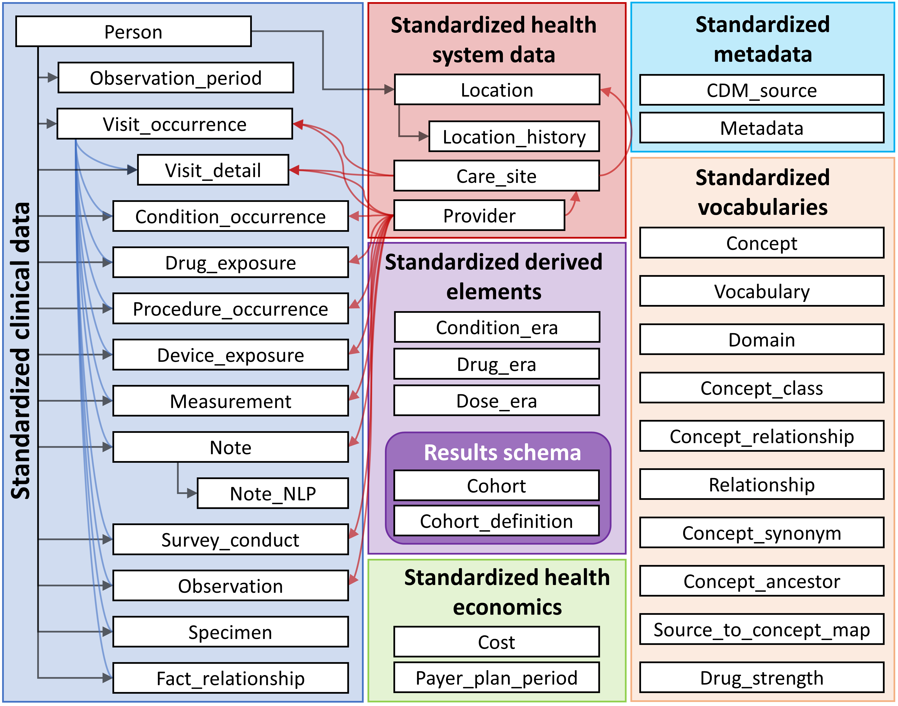
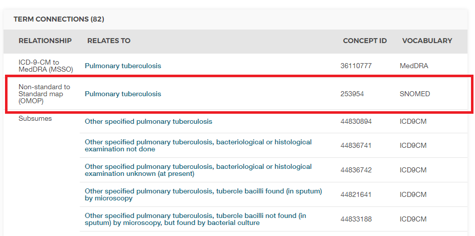

# (PART) Représentation Uniforme des Données {-}

# Le Modèle de Données Commun {#CommonDataModel}

*Responsable du chapitre : Clair Blacketer*

Les données observationnelles fournissent une vue de ce qui arrive à un patient pendant qu'il reçoit des soins médicaux. Les données sont collectées et stockées pour des nombres croissants de patients à travers le monde, créant ce qu'on appelle souvent Big Health Data. Le but de ces collections est triple : (i) directement pour faciliter la recherche (souvent sous la forme de données d'enquêtes ou de registres), ou (ii) pour soutenir la conduite des soins de santé (généralement appelés DME - Dossiers Médicaux Électroniques) ou (iii) pour gérer le paiement des soins de santé (généralement appelés données de réclamations). Les trois sont couramment utilisés pour la recherche clinique, les deux derniers comme données d'utilisation secondaire, et les trois ont généralement leur propre formatage et codage du contenu. \index{Common Data Model} \index{CDM |see {Common Data Model}} \index{modèle de données relationnelles|see {Common Data Model}}

Pourquoi avons-nous besoin d'un Modèle de Données Commun pour les données de santé observationnelles ?

En fonction de leurs besoins primaires, aucune des bases de données observationnelles ne capture tous les événements cliniques de manière égale. Par conséquent, les résultats de recherche doivent être tirés de nombreuses sources de données disparates et comparés et contrastés pour comprendre l'effet des biais de capture potentiels. De plus, pour tirer des conclusions avec une puissance statistique, nous avons besoin d'un grand nombre de patients observés. Cela explique la nécessité d'évaluer et d'analyser plusieurs sources de données simultanément. Pour ce faire, les données doivent être harmonisées en une norme de données commune. De plus, les données des patients nécessitent un haut niveau de protection. Extraire des données à des fins d'analyse, comme cela se fait traditionnellement, nécessite des accords stricts d'utilisation des données et un contrôle d'accès complexe. Une norme de données commune peut alléger ce besoin en omettant l'étape d'extraction et en permettant l'exécution d'une analyse standardisée sur les données dans leur environnement natif - l'analyse vient aux données au lieu des données à l'analyse.

Cette norme est fournie par le Modèle de Données Commun (CDM). Le CDM, combiné avec son contenu standardisé (voir Chapitre \@ref(StandardizedVocabularies)), assurera que les méthodes de recherche peuvent être systématiquement appliquées pour produire des résultats significativement comparables et reproductibles. Dans ce chapitre, nous proposons une vue d'ensemble du modèle de données lui-même, de sa conception, de ses conventions et une discussion sur certaines tables choisies.

Un aperçu de toutes les tables du CDM est fourni dans la Figure \@ref(fig:cdmDiagram). \index{Common Data Model!schéma du modèle de données}

<div class="figure">

<p class="caption">(\#fig:cdmDiagram)Aperçu de toutes les tables dans le CDM version 6.0. Notez que toutes les relations entre les tables ne sont pas montrées.</p>
</div>

## Principes de Conception

Le CDM est optimisé pour les objectifs typiques de la recherche observationnelle de \index{Common Data Model!principes de conception}

* Identifier les populations de patients avec certaines interventions de soins de santé (exposition aux médicaments, procédures, changements de politique de santé, etc.) et résultats (conditions, procédures, autres expositions aux médicaments, etc.),
* Caractériser ces populations de patients pour divers paramètres comme les informations démographiques, l'histoire naturelle de la maladie, la prestation des soins de santé, l'utilisation et le coût, les morbidités, les traitements et la séquence de traitement, etc.,
* Prédire l'apparition de ces résultats chez les patients individuels - voir Chapitre \@ref(PatientLevelPrediction),
* Estimer l'effet de ces interventions sur une population - voir Chapitre \@ref(PopulationLevelEstimation),

Pour atteindre cet objectif, le développement du CDM suit les éléments de conception suivants :

  - **Adéquation à l'objectif** : Le CDM vise à fournir des données organisées de manière optimale pour l'analyse, plutôt que pour répondre aux besoins opérationnels des fournisseurs de soins de santé ou des payeurs. \index{Common Data Model!adéquation à l'objectif}
  - **Protection des données** : Toutes les données pouvant compromettre l'identité et la protection des patients, telles que les noms, les dates d'anniversaire précises, etc., sont limitées. Des exceptions sont possibles lorsque la recherche nécessite expressément des informations plus détaillées, telles que des dates de naissance précises pour l'étude des nourrissons.\index{Common Data Model!protection des données}
  - **Conception des domaines** : Les domaines sont modélisés dans un modèle de données relationnelles centré sur la personne, où pour chaque enregistrement l'identité de la personne et une date sont capturées comme minimum. Ici, un modèle de données relationnelles est un modèle où les données sont représentées comme une collection de tables liées par des clés primaires et étrangères.
  - **Raison d'être des domaines** : Les domaines sont identifiés et définis séparément dans un modèle entité-relation s'ils ont un cas d'utilisation analytique (les conditions, par exemple) et le domaine a des attributs spécifiques qui ne sont pas autrement applicables. Toutes les autres données peuvent être conservées comme une observation dans la table des observations dans une structure entité-attribut-valeur. \index{Common Data Model!domaines}
  - **Vocabulaires standardisés** : Pour normaliser le contenu de ces enregistrements, le CDM repose sur les Vocabulaires Standardisés contenant tous les concepts de soins de santé nécessaires et appropriés correspondants.
  - **Réutilisation des vocabulaires existants** : Si possible, ces concepts sont tirés d'organisations ou d'initiatives de normalisation nationale ou sectorielle de définition de vocabulaire, telles que la Bibliothèque Nationale de Médecine, le Département des Anciens Combattants, le Centre de Contrôle et de Prévention des Maladies, etc.
  - **Maintien des codes sources** : Même si tous les codes sont mappés aux Vocabulaires Standardisés, le modèle stocke également le code source original pour garantir qu'aucune information n'est perdue. \index{Common Data Model!Codes Sources} \index{Common Data Model!prévention de la perte de données}
  - **Neutralité technologique** : Le CDM ne nécessite pas de technologie spécifique. Il peut être réalisé dans n'importe quelle base de données relationnelle, telle qu'Oracle, SQL Server, etc., ou sous forme de jeux de données analytiques SAS.\index{Common Data Model!neutralité technologique}
  - **Scalabilité** : Le CDM est optimisé pour le traitement des données et l'analyse computationnelle afin de s'adapter aux sources de données de tailles variées, y compris les bases de données avec jusqu'à des centaines de millions de personnes et des milliards d'observations cliniques. \index{Common Data Model!scalabilité}
  - **Compatibilité ascendante** : Tous les changements par rapport aux versions précédentes du CDM sont clairement délimités dans le dépôt github [(https://github.com/OHDSI/CommonDataModel)](https://github.com/OHDSI/CommonDataModel). Les versions plus anciennes du CDM peuvent être facilement créées à partir de la version actuelle, et aucune information n'est perdue qui était présente précédemment. \index{Common Data Model!compatibilité ascendante}
## Conventions du Modèle de Données

De nombreuses conventions implicites et explicites ont été adoptées dans le CDM. Les développeurs de méthodes qui fonctionnent avec le CDM doivent comprendre ces conventions. \index{Common Data Model!conventions}

### Conventions Générales du Modèle{#model-Conv}

Le CDM est considéré comme un modèle "centré sur la personne", ce qui signifie que toutes les tables d'événements cliniques sont liées à la table PERSON. Associé à la date ou à la date de début, cela permet une vue longitudinale de tous les événements pertinents pour la santé par personne. Les exceptions à cette règle sont les tables de données du système de santé standardisées, qui sont directement liées aux événements des différents domaines.

### Conventions Générales des Schémas

Les schémas, ou utilisateurs de bases de données dans certains systèmes, permettent une séparation entre les tables en lecture seule et les tables en lecture-écriture. Les tables d'événements cliniques et de vocabulaire sont dans le schéma "CDM" et sont considérées comme en lecture seule pour l'utilisateur final ou l'outil analytique. Les tables qui doivent être manipulées par des outils en ligne ou des utilisateurs finaux sont stockées dans le schéma "Results". Les deux tables du schéma "Results" sont COHORT et COHORT_DEFINITION. Ces tables sont destinées à décrire des groupes d'intérêt que l'utilisateur pourrait définir, comme détaillé dans le chapitre \@ref(Cohorts). Ces tables peuvent être écrites, ce qui signifie qu'une cohorte peut être stockée dans la table COHORT au moment de l'exécution. Comme il n'y a qu'un seul schéma en lecture-écriture pour tous les utilisateurs, il appartient à l'implémentation du CDM d'organiser et de contrôler l'accès multiple des utilisateurs.

### Conventions Générales des Tables de Données

Le CDM est indépendant de la plateforme. Les types de données sont définis de manière générique en utilisant les types de données ANSI SQL (VARCHAR, INTEGER, FLOAT, DATE, DATETIME, CLOB). La précision n'est fournie que pour VARCHAR. Elle reflète la longueur minimale requise de la chaîne, mais peut être étendue dans une instanciation concrète du CDM. Le CDM ne prescrit pas le format de date et datetime. Les requêtes standard contre le CDM peuvent varier pour les instances locales et les configurations de date/datetime.

*Remarque*: Bien que le modèle de données lui-même soit indépendant de la plateforme, de nombreux outils développés pour fonctionner avec celui-ci nécessitent certaines spécifications. Pour plus d'informations à ce sujet, veuillez consulter le chapitre \@ref(OhdsiAnalyticsTools).

### Conventions Générales des Domaines{#domains}

Les événements de nature différente sont organisés en domaines. Ces événements sont stockés dans des tables et des champs spécifiques aux domaines et représentés par des concepts standard spécifiques aux domaines tels que définis dans les vocabulaires standardisés (voir section \@ref(conceptDomains)). Chaque concept standard a une affectation de domaine unique, qui définit dans quelle table ils sont enregistrés. Même si l'affectation correcte des domaines fait l'objet de débats dans la communauté, cette règle stricte de correspondance domaine-table-champ garantit qu'il y a toujours un emplacement sans ambiguïté pour tout code ou concept. Par exemple, les signes, symptômes et concepts de diagnostic appartiennent au domaine Condition et sont enregistrés dans le CONDITION_CONCEPT_ID de la table CONDITION_OCCURRENCE. Les soi-disant médicaments de procédure sont généralement enregistrés sous forme de codes de procédure dans une table de procédures dans les données source. Dans un CDM, ces enregistrements se trouvent dans la table DRUG_EXPOSURE car les concepts standard mappés ont l'affectation de domaine Drug. Il y a un total de 30 domaines, comme le montre le tableau \@ref(tab:domains).

Table: (\#tab:domains) Nombre de concepts standard appartenant à chaque domaine.

Nombre de Concepts|ID du Domaine|Nombre de Concepts|ID du Domaine
:----------------- |:------------|:----------------- |:------------
1731378|Drug|183|Route
477597|Device|180|Currency
257000|Procedure|158|Payer
163807|Condition|123|Visit
145898|Observation|51|Cost
89645|Measurement|50|Race
33759|Spec Anatomic Site|13|Plan Stop Reason
17302|Meas Value|11|Plan
1799|Specimen|6|Episode
1215|Provider Specialty|6|Sponsor
1046|Unit|5|Meas Value Operator
944|Metadata|3|Spec Disease Status
538|Revenue Code|2|Gender
336|Type Concept|2|Ethnicity
194|Relationship|1|Observation Type

### Représentation du Contenu par des Concepts

Dans les tables de données du CDM, le contenu de chaque enregistrement est entièrement normalisé et représenté par des concepts. Les concepts sont stockés dans les tables d'événements avec leurs valeurs CONCEPT_ID, lesquelles sont des clés étrangères vers la table CONCEPT, qui sert de table de référence générale. Toutes les instances de CDM utilisent la même table CONCEPT comme référence des concepts, ce qui, avec le Common Data Model, est un mécanisme clé d'interopérabilité et la fondation du réseau de recherche OHDSI. Si un concept standard n'existe pas ou ne peut pas être identifié, la valeur de CONCEPT_ID est définie à 0, représentant un concept inexistant, une valeur inconnue ou non mappable.

Les enregistrements dans la table CONCEPT contiennent des informations détaillées sur chaque concept (nom, domaine, classe, etc.). Les concepts, les relations entre concepts, les ancêtres de concepts et d'autres informations relatives aux concepts sont contenus dans les tables des vocabulaires standardisés (voir chapitre \@ref(StandardizedVocabularies)).

### Conventions Générales de Nomination des Champs

Les noms de variables dans toutes les tables suivent une convention :

Table: (\#tab:fieldConventions) Conventions de dénomination des champs.

|Notation|Description|
|:-------|:----------|
|[Event]_ID|Identifiant unique pour chaque enregistrement, qui sert de clé étrangère pour établir des relations entre les tables d'événements. Par exemple, PERSON_ID identifie chaque individu de manière unique. VISIT_OCCURRENCE_ID identifie de manière unique une visite.|
|[Event]_CONCEPT_ID|Clé étrangère vers un enregistrement de concept standard dans la table de référence CONCEPT. C'est la principale représentation de l'événement, servant de base principale pour toutes les analyses standardisées. Par exemple, CONDITION_CONCEPT_ID = [31967](http://athena.ohdsi.org/search-terms/terms/31967) contient la valeur de référence pour le concept SNOMED de "Nausée".|
|[Event]_SOURCE_CONCEPT_ID|Clé étrangère vers un enregistrement de la table de référence CONCEPT. Ce concept est l'équivalent de la valeur source (ci-dessous), et il peut s'agir d'un concept standard, auquel cas il serait identique à [Event]_CONCEPT_ID, ou un autre concept non standard. Par exemple, CONDITION_SOURCE_CONCEPT_ID = [45431665](http://athena.ohdsi.org/search-terms/terms/45431665) dénote le concept de "Nausée" dans la terminologie Read, et l'analogue CONDITION_CONCEPT_ID est le concept standard SNOMED-CT [31967](http://athena.ohdsi.org/search-terms/terms/31967). L'utilisation des concepts de source pour les applications analytiques standard est déconseillée car seuls les concepts standard représentent le contenu sémantique d'un événement de manière non équivoque et, par conséquent, les concepts de source ne sont pas interopérables.|
|[Event]_TYPE_CONCEPT_ID|Clé étrangère vers un enregistrement de la table de référence CONCEPT, représentant l'origine de l'information source, standardisée dans les vocabulaires standardisés. Notez que malgré le nom du champ, ce n'est pas un type d'événement ou un type de concept, mais cela déclare le mécanisme de capture qui a créé cet enregistrement. Par exemple, DRUG_TYPE_CONCEPT_ID discrimine si un enregistrement de médicament a été dérivé d'un événement de délivrance en pharmacie ("Délivrance en pharmacie") ou d'une application de prescription électronique ("Prescription rédigée").|
|[Event]_SOURCE_VALUE|Code littéral ou chaîne de texte libre reflétant comment cet événement était représenté dans les données sources. Son utilisation est déconseillée pour les applications analytiques standard, car ces valeurs sources ne sont pas harmonisées entre les différentes sources de données. Par exemple, CONDITION_SOURCE_VALUE pourrait contenir un enregistrement de "78702", correspondant au code ICD-9 787.02 écrit dans une notation omettant le point.|

### Différence Entre Concepts et Valeurs Sources{#concepts-Sources}

De nombreuses tables contiennent des informations équivalentes à plusieurs endroits : comme une valeur source, un concept de source et comme un concept standard.

* **Valeurs sources** sont la représentation originale d'un enregistrement d'événement dans les données sources. Elles peuvent être des codes provenant de systèmes de codage largement utilisés et souvent de domaine public, tels que ICD9CM, NDC ou Read, des systèmes de codage propriétaires comme CPT4, GPI ou MedDRA, ou des vocabulaires contrôlés utilisés uniquement dans les données sources, tels que F pour féminin et M pour masculin. Elles peuvent également être de courtes phrases de texte libre qui ne sont pas standardisées et contrôlées. Les valeurs sources sont stockées dans les champs [Event]_SOURCE_VALUE des tables de données.
* **Concepts** sont des entités spécifiques au CDM qui normalisent la signification d'un fait clinique. La plupart des concepts sont basés sur des systèmes de codage publics ou propriétaires existants dans le domaine de la santé, tandis que d'autres ont été créés de novo (le CONCEPT_CODE commence par "OMOP"). Les concepts ont des identifiants uniques dans tous les domaines.
* **Concepts de source** sont les concepts qui représentent le code utilisé dans la source. Les concepts de source ne sont utilisés que pour les systèmes de codage publics ou propriétaires existants, pas pour les concepts générés par OMOP. Les concepts de source sont stockés dans le champ [Event]_SOURCE_CONCEPT_ID des tables de données.
* **Concepts standards** sont ceux qui sont utilisés pour définir de manière unique la signification d'une entité clinique dans toutes les bases de données, indépendamment du système de codage utilisé dans les sources. Les concepts standards sont généralement tirés de sources de vocabulaire publiques ou propriétaires existantes. Les concepts non standard qui ont une signification équivalente à un concept standard ont une mappage vers le concept standard dans les vocabulaires standardisés. Les concepts standards sont référencés dans le champ [Event]_CONCEPT_ID des tables de données.

Les valeurs sources ne sont fournies que pour des raisons de commodité et de garantie de qualité (QA). Elles peuvent contenir des informations qui ne sont significatives que dans le contexte d'une source de données spécifique. L'utilisation des valeurs sources et des concepts de source est facultative, bien que **fortement recommandée** si les données sources utilisent des systèmes de codage. Cependant, les concepts standards **sont obligatoires**. Cette utilisation obligatoire de concepts standards est ce qui permet à toutes les instances de CDM de parler le même langage. Par exemple, la condition "Tuberculose pulmonaire" (TB, Figure \@ref(fig:pulmTubICD9)) montre que le code ICD9CM pour la TB est 011.

<div class="figure" style="text-align: center">

<p class="caption">(\#fig:pulmTubICD9)ICD9CM code for Pulmonary Tuberculosis</p>
</div>

Sans contexte, le code 011 pourrait être interprété comme "Hospital Inpatient (Including Medicare Part A)" du vocabulaire UB04, ou comme "Nervous System Neoplasms without Complications, Comorbidities" du vocabulaire DRG. C'est ici que les identifiants de concepts, qu'ils soient de source ou standards, sont précieux. La valeur CONCEPT_ID qui représente le code 011 ICD9CM est [44828631](http://athena.ohdsi.org/search-terms/terms/44828631). Cela différencie l'ICD9CM du UBO4 et du DRG. Le concept de source ICD9CM TB se mappe sur le concept standard [253954](http://athena.ohdsi.org/search-terms/terms/253954) du vocabulaire SNOMED à travers la relation "Non-standard to Standard map (OMOP)" comme montré dans la figure \@ref(fig:pulmTubMap). Cette même relation de mappage existe pour les codes Read, ICD10, CIEL et MeSH, entre autres, de sorte que toute recherche qui se réfère au concept standard SNOMED est sûre d'inclure tous les codes sources supportés.

<div class="figure">

<p class="caption">(\#fig:pulmTubMap)SNOMED code for Pulmonary Tuberculosis</p>
</div>

Un exemple de la manière dont la relation entre concept standard et concept de source est représentée est montré dans le tableau \@ref(tab:conditionOccurrence).
## Tables standardisées CDM

\index{Common Data Model!tableaux standardisés}

La CDM contient 16 tableaux d'événements cliniques, 10 tableaux de vocabulaire, 2 tableaux de métadonnées, 4 tableaux de données relatives au système de santé, 2 tableaux de données économiques de santé, 3 éléments dérivés standardisés et 2 tableaux de schéma de résultats. Ces tableaux sont entièrement spécifiés dans le Wiki CDM.[^cdmWikiUrl1]

[^cdmWikiUrl1]: https://github.com/OHDSI/CommonDataModel/wiki

Pour illustrer comment ces tableaux sont utilisés en pratique, les données d'une personne seront utilisées comme fil conducteur tout au long du reste du chapitre.

### Exemple en cours : Endométriose

L'endométriose est une condition douloureuse dans laquelle des cellules normalement présentes dans la paroi de l'utérus d'une femme se trouvent ailleurs dans le corps. Les cas sévères peuvent entraîner l'infertilité, ainsi que des problèmes intestinaux et urinaires. Les sections suivantes détailleront l'expérience d'une patiente avec cette maladie et comment elle pourrait être représentée dans le Modèle de Données Commun.


> Chaque étape de ce douloureux parcours, j'ai dû convaincre tout le monde de la douleur que je ressentais.

Lauren souffrait des symptômes de l'endométriose depuis de nombreuses années ; cependant, ce n'est qu'après la rupture d'un kyste dans son ovaire qu'elle a été diagnostiquée. Vous pouvez en savoir plus sur Lauren à [https://endometriosis-uk.org/laurens-story](https://endometriosis-uk.org/laurens-story).

### Tableau PERSON {#person}

#### Que savons-nous de Lauren?  {-}

* Elle est une femme de 36 ans
* Son anniversaire est le 12 mars 1982
* Elle est blanche
* Elle est anglaise

Avec cela en tête, son tableau PERSON pourrait ressembler à ceci :

Tableau: (\#tab:person) Le tableau PERSON.

Nom de colonne|Valeur|Explication
:---------------------|:-----------|:--------------------------------------
|PERSON_ID|1|Le PERSON_ID doit être un entier, soit directement issu de la source soit généré dans le cadre du processus de création.|
|GENDER_CONCEPT_ID|8532|L'ID de concept se référant au genre féminin est [8532](http://athena.ohdsi.org/search-terms/terms/8532).|
|YEAR_OF_BIRTH|1982||
|MONTH_OF_BIRTH|3||
|DAY_OF_BIRTH|12||
|BIRTH_DATETIME|1982-03-12 00:00:00|Lorsque l'heure n'est pas connue, minuit est utilisé.|
|DEATH_DATETIME|||
|RACE_CONCEPT_ID|8527|L'ID de concept se référant à la race blanche est [8527](http://athena.ohdsi.org/search-terms/terms/8527). L'ethnicité anglaise est [4093769](http://athena.ohdsi.org/search-terms/terms/4093769). L'un ou l'autre est correct, ce dernier correspondant au premier. Notez que les ethnicités sont stockées ici en tant que races, et non dans le ETHNICITY_CONCEPT_ID|
|ETHNICITY_CONCEPT_ ID|38003564|C'est une notation typique des États-Unis pour distinguer les Hispaniques des autres. Les ethnicités, dans ce cas anglaise, sont stockées dans le RACE_CONCEPT_ID. En dehors des États-Unis, cela n'est pas utilisé. [38003564](http://athena.ohdsi.org/search-terms/terms/38003564) se réfère à "Non hispanique".|
|LOCATION_ID||Son adresse est inconnue.|
|PROVIDER_ID||Son médecin traitant est inconnu.|
|CARE_SITE||Son site de soins principal est inconnu.|
|PERSON_SOURCE_ VALUE|1|Il s'agirait généralement de son identifiant dans les données sources, bien que souvent il soit le même que le PERSON_ID.|
|GENDER_SOURCE_ VALUE|F|La valeur du genre telle qu'elle apparaît dans la source est stockée ici.|
|GENDER_SOURCE_ CONCEPT_ID|0|Si la valeur du genre dans la source était codée en utilisant un schéma de codage pris en charge par OHDSI, ce concept irait ici. Par exemple, si son genre était "sex-F" dans la source et qu'il était indiqué être dans le vocabulaire PCORNet, le concept [44814665](http://athena.ohdsi.org/search-terms/terms/44814665) irait dans ce champ.|
|RACE_SOURCE_ VALUE|white|La valeur de la race telle qu'elle apparaît dans la source est stockée ici.|
|RACE_SOURCE_ CONCEPT_ID|0|Même principe que GENDER_SOURCE_CONCEPT_ID.|
|ETHNICITY_SOURCE_ VALUE|english|La valeur de l'ethnicité telle qu'elle apparaît dans la source est stockée ici.|
|ETHNICITY_SOURCE_ CONCEPT_ID|0|Même principe que GENDER_SOURCE_CONCEPT_ID.|

### Tableau OBSERVATION_PERIOD {#observationPeriod}

Le tableau OBSERVATION_PERIOD est conçu pour définir la période pendant laquelle au moins les données démographiques, les conditions, les procédures et les médicaments d'un patient sont enregistrées dans le système source avec une sensibilité et une spécificité raisonnables. Pour les données d'assurance, cela correspond généralement à la période d'inscription du patient. C'est plus compliqué dans les dossiers de santé électroniques (EHR), car la plupart des systèmes de santé ne déterminent pas quel établissement ou fournisseur de soins de santé est visité. En tant que meilleure solution alternative, le premier enregistrement du système est souvent considéré comme la date de début de la période d'observation et le dernier enregistrement est considéré comme la date de fin.

#### Comment est définie la période d'observation de Lauren? {-}

Disons que les informations de Lauren, comme montré dans le Tableau \@ref(tab:encounters), sont enregistrées comme dans un système EHR. Ses rencontres à partir desquelles la période d'observation a été dérivée sont :

Tableau: (\#tab:encounters) Rencontres de soins de santé de Lauren.

ID de rencontre|Date de début|Date de fin|Type|
:--------|:-----|:------|:-----------
|70|2010-01-06|2010-01-06|ambulatoire|
|80|2011-01-06|2011-01-06|ambulatoire|
|90|2012-01-06|2012-01-06|ambulatoire|
|100|2013-01-07|2013-01-07|ambulatoire|
|101|2013-01-14|2013-01-14|ambulatoire|
|102|2013-01-17|2013-01-24|hospitalisation|

Sur la base des enregistrements de rencontre, son tableau OBSERVATION_PERIOD pourrait ressembler à ceci :

Tableau: (\#tab:observationPeriod) Le tableau OBSERVATION_PERIOD.

Nom de colonne|Valeur|Explication
:----------------------|:----------|:--------------------------------------
|OBSERVATION_ PERIOD_ID|1|Il s'agit généralement d'une valeur générée automatiquement, créant un identifiant unique pour chaque enregistrement dans le tableau.|
|PERSON_ID|1|Ceci est une clé étrangère vers l'enregistrement de Laura dans le tableau PERSON et lie PERSON au tableau OBSERVATION_PERIOD.|
|OBSERVATION_PERIOD_ START_DATE|2010-01-06|Il s'agit de la date de début de sa première rencontre enregistrée.|
|OBSERVATION_PERIOD_ END_DATE|2013-01-24|Il s'agit de la date de fin de sa dernière rencontre enregistrée.|
|PERIOD_TYPE_ CONCEPT_ID|44814725|La meilleure option dans le Vocabulaire avec la catégorie de concept "Type de période d'observation" est [44814724](http://athena.ohdsi.org/search-terms/terms/44814724), qui représente "Période couvrant les rencontres de soins de santé".|

### VISIT_OCCURRENCE {#visitOccurrence}

Le tableau VISIT_OCCURRENCE contient des informations sur les rencontres des patients avec le système de santé. Dans la terminologie OHDSI, celles-ci sont appelées visites et sont considérées comme des événements distincts. Il existe 12 catégories principales de visites avec une hiérarchie étendue, représentant les nombreuses différentes circonstances dans lesquelles les soins de santé peuvent être dispensés. Les visites les plus couramment enregistrées sont les hospitalisations, les consultations externes, les urgences et les visites dans des institutions non médicales.

#### Comment les rencontres de Lauren sont-elles représentées en tant que visites?  {-}

À titre d'exemple, représentons la rencontre hospitalière dans le Tableau \@ref(tab:encounters) dans le tableau VISIT_OCCURRENCE.

Tableau: (\#tab:visitOccurrence) Le tableau VISIT_OCCURRENCE.

Nom de colonne|Valeur|Explication
:---------------------|:-----------|:--------------------------------------
|VISIT_OCCURRENCE_ ID|514|Il s'agit généralement d'une valeur générée automatiquement créant un identifiant unique pour chaque enregistrement.|
|PERSON_ID|1|Ceci est une clé étrangère vers l'enregistrement de Laura dans le tableau PERSON et lie PERSON à VISIT_OCCURRENCE.|
|VISIT_CONCEPT_ID|9201|Une clé étrangère se référant à une visite hospitalière est [9201](http://athena.ohdsi.org/search-terms/terms/9201).|
|VISIT_START_DATE|2013-01-17|La date de début de la visite.|
|VISIT_START_ DATETIME|2013-01-17 00:00:00|La date et l'heure de la visite. L'heure est inconnue, donc minuit est utilisé.|
|VISIT_END_DATE|2013-01-24|La date de fin de la visite. Si c'est une visite d'une seule journée, la date de fin doit correspondre à la date de début.|
|VISIT_END_DATETIME|2013-01-24 00:00:00|La date et l'heure de fin de la visite. L'heure est inconnue, donc minuit est utilisé.|
|VISIT_TYPE_ CONCEPT_ID|32034|Cela fournit des informations sur la provenance de l'enregistrement de la visite, i.e. cela provient-il d'une réclamation d'assurance, d'une facturation hospitalière, d'un EHR, etc. Pour cet exemple, l'ID du concept [32035](http://athena.ohdsi.org/search-terms/terms/32035) ("Visite dérivée d'un enregistrement de rencontre EHR") est utilisé car les rencontres sont similaires aux dossiers de santé électroniques|
|PROVIDER_ID*|NULL|Si l'enregistrement de la rencontre a un prestataire associé, l'ID de ce prestataire va dans ce champ. Cela devrait être le contenu du champ PROVIDER_ID du tableau PROVIDER.|
|CARE_SITE_ID|NULL|Si l'enregistrement de la rencontre a un site de soins associé, l'ID de ce site de soins va dans ce champ. Cela devrait être le CARE_SITE_ID du tableau CARE_SITE.|
|VISIT_SOURCE_ VALUE|inpatient|La valeur de la visite telle qu'elle apparaît dans la source va ici. Les données de Lauren ne l'ont pas.|
|VISIT_SOURCE_ CONCEPT_ID|0|Si la valeur de la visite de la source est codée en utilisant un vocabulaire reconnu par OHDSI, la valeur CONCEPT_ID représentant le code source se trouverait ici. Les données de Lauren ne l'ont pas.|
|ADMITTED_FROM_ CONCEPT_ID|0|Si connu, cela contient un Concept représentant d'où le patient a été admis. Ce concept devrait avoir le domaine "Visite". Par exemple, si le patient a été admis à l'hôpital depuis son domicile, il contiendrait [8536](http://athena.ohdsi.org/search-terms/terms/8536) ("Domicile").|
|ADMITTED_FROM_ SOURCE_CONCEPT_ID|NULL|C'est la valeur de la source qui représente d'où le patient a été admis. En utilisant l'exemple ci-dessus, cela serait "domicile".|
|DISCHARGE_TO_ CONCEPT_ID|0|Si connu, cela se réfère à un Concept représentant où le patient a été transféré à la sortie. Ce concept doit avoir le domaine "Visite". Par exemple, si un patient a été libéré dans un établissement de vie assistée, l'ID du concept serait [8615](http://athena.ohdsi.org/search-terms/terms/8615) ("Établissement de vie assistée").|
|DISCHARGE_TO_ SOURCE_VALUE|0|C'est la valeur de la source qui représente où le patient a été transféré à la sortie. En utilisant l'exemple ci-dessus, cela serait "Établissement de vie assistée".|
|PRECEDING_VISIT_ OCCURRENCE_ID|NULL|Cela désigne la visite immédiatement précédente. Contrairement à ADMITTED_FROM_CONCEPT_ID, cela renvoie au véritable enregistrement de la visite plutôt qu'à un concept de visite. Notez qu'il n'y a pas d'enregistrement pour la visite suivante, les visites ne sont reliées que par ce champ.|

* Un patient peut interagir avec plusieurs prestataires de soins de santé lors d'une même visite, comme c'est souvent le cas lors de séjours hospitaliers. Ces interactions peuvent être enregistrées dans le tableau VISIT_DETAIL. Bien que non couvert en profondeur dans ce chapitre, vous pouvez en savoir plus sur le tableau VISIT_DETAIL dans le [wiki CDM](https://github.com/OHDSI/CommonDataModel/wiki/VISIT_DETAIL).

### CONDITION_OCCURRENCE {#conditionOccurrence}

Les enregistrements dans le tableau CONDITION_OCCURRENCE sont des diagnostics, des signes ou des symptômes d'une condition soit observés par un prestataire, soit rapportés par le patient.

#### Quelles sont les conditions de Lauren? {-}

En revisitant son témoignage, elle dit:

> Il y a environ 3 ans, j'ai remarqué que mes règles, qui avaient toujours été douloureuses, devenaient de plus en plus douloureuses. J'ai commencé à ressentir une douleur vive juste à côté de mon côlon et à me sentir sensible et ballonnée autour de mon coccyx et de ma région pelvienne inférieure. Mes règles étaient devenues tellement douloureuses que je manquais 1 à 2 jours de travail par mois. Les analgésiques atténuaient parfois la douleur, mais souvent ils ne faisaient pas grand-chose.

Le code SNOMED pour les crampes menstruelles douloureuses, autrement appelé dysménorrhée, est 266599000. Le Tableau \@ref(tab:conditionOccurrence) montre comment cela serait représenté dans le tableau CONDITION_OCCURRENCE:

Tableau: (\#tab:conditionOccurrence) Le tableau CONDITION_OCCURRENCE.

Nom de colonne|Valeur|Explication
:---------------------|:-----------|:--------------------------------------
|CONDITION_ OCCURRENCE_ID|964|Ceci est généralement une valeur générée automatiquement, créant un identifiant unique pour chaque enregistrement.|
|PERSON_ID|1|Ceci est une clé étrangère vers l'enregistrement de Laura dans le tableau PERSON et lie PERSON à CONDITION_OCCURRENCE.|
|CONDITION_ CONCEPT_ID|194696|Une clé étrangère se référant au code SNOMED 266599000 : [194696](http://athena.ohdsi.org/search-terms/terms/194696).|
|CONDITION_START_ DATE|2010-01-06|La date à laquelle l'instance de la condition est enregistrée.|
|CONDITION_START_ DATETIME|2010-01-06 00:00:00|La date et l'heure à laquelle l'instance de la condition est enregistrée. Minuit est utilisé car l'heure est inconnue.|
|CONDITION_END_ DATE|NULL|C'est la date à laquelle l'instance de la condition est considérée comme terminée, mais cela est rarement enregistré.|
|CONDITION_END_ DATETIME|NULL|Si connu, c'est la date et l'heure à laquelle l'instance de la condition est considérée comme terminée.|
|CONDITION_TYPE_ CONCEPT_ID|32020|Cette colonne est destinée à fournir des informations sur la provenance de l'enregistrement, c'est-à-dire qu'il provient d'une réclamation d'assurance, d'un dossier de facturation hospitalière, d'un EHR, etc. Pour cet exemple, le concept [32020](http://athena.ohdsi.org/search-terms/terms/32020) ("Diagnostic de rencontre EHR") est utilisé car les rencontres sont similaires aux dossiers de santé électroniques. Les concepts dans ce champ devraient être dans le vocabulaire "Condition Type".|
|CONDITION_STATUS_ CONCEPT_ID|0|Si connu, cela indique la circonstance. Par exemple, une condition pourrait être un diagnostic d'admission, auquel cas l'ID du concept [4203942](http://athena.ohdsi.org/search-terms/terms/4203942) serait utilisé.|
|STOP_REASON|NULL|Si connu, la raison pour laquelle la condition n'était plus présente, comme indiqué dans les données sources.|
|PROVIDER_ID|NULL|Si l'enregistrement de la condition a un prestataire de diagnostic listé, l'ID de ce prestataire va dans ce champ. Cela devrait être le provider_id du tableau PROVIDER représentant le prestataire lors de la rencontre.|
|VISIT_OCCURRENCE_ ID|509|La visite (clé étrangère vers le VISIT_OCCURRENCE_ID dans le tableau VISIT_OCCURRENCE) au cours de laquelle la condition a été diagnostiquée.|
|CONDITION_SOURCE_ VALUE|266599000|C'est la valeur source originale représentant la condition. Dans le cas de Lauren, la dysménorrhée est stockée ici via le code SNOMED, tandis que le concept représentant le code allait vers CONDITION_SOURCE_CONCEPT_ID et le concept standard mappé à partir de cela est stocké dans le champ CONDITION_CONCEPT_ID.|
|CONDITION_SOURCE_ CONCEPT_ID|194696|Si la valeur de la condition de la source est codée en utilisant un vocabulaire reconnu par OHDSI, l'ID du concept représentant cette valeur irait ici. Dans l'exemple de la dysménorrhée, la valeur source est un code SNOMED, donc le concept représentant ce code est 194696. Dans ce cas, il a la même valeur que
## Informations supplémentaires

Ce chapitre couvre seulement une partie des tables disponibles dans le CDM comme exemples de la manière dont les données sont représentées. Vous êtes encouragés à visiter le site wiki[^cdmWikiUrl] pour plus d'informations.

[^cdmWikiUrl]: https://github.com/OHDSI/CommonDataModel/wiki


## Résumé

\BeginKnitrBlock{rmdsummary}<div class="rmdsummary">- Le CDM est conçu pour soutenir un large éventail d'activités de recherche observationnelle.

- Le CDM est un modèle centré sur la personne.

- Le CDM standardise non seulement la structure des données, mais grâce aux Vocabularies Standardisés, il standardise également la représentation du contenu.

- Les codes sources sont maintenus dans le CDM pour une traçabilité complète.
</div>\EndKnitrBlock{rmdsummary}


## Exercices

#### Prérequis {-}

Pour ces premiers exercices, vous devrez revoir les tables du CDM discutées précédemment, et vous devrez rechercher des concepts dans le Vocabulary, ce qui peut être fait via ATHENA[^athenaCdmUrl] ou ATLAS.[^atlasCdmUrl]

[^athenaCdmUrl]: http://athena.ohdsi.org/
[^atlasCdmUrl]: http://atlas-demo.ohdsi.org

::: {.exercise #exerciseJohnPerson}
John est un homme afro-américain né le 4 août 1974. Définissez une entrée dans la table PERSON qui encode ces informations.

:::

::: {.exercise #exerciseJohnOp}
John s'est inscrit à son assurance actuelle le 1er janvier 2015. Les données de sa base de données d'assurance ont été extraites le 1er juillet 2019. Définissez une entrée dans la table OBSERVATION_PERIOD qui encode ces informations.

:::

::: {.exercise #exerciseJohnDrug}
On a prescrit à John une fourniture de 30 jours d'Ibuprofène 200 MG comprimés oraux (code NDC : 76168009520) le 1er mai 2019. Définissez une entrée dans la table DRUG_EXPOSURE qui encode ces informations.

:::

#### Prérequis {-}

Pour ces trois derniers exercices, nous supposons que R, R-Studio et Java ont été installés comme décrit dans la Section \@ref(installR). Il est également nécessaire d'installer les packages [SqlRender](https://ohdsi.github.io/SqlRender/), [DatabaseConnector](https://ohdsi.github.io/DatabaseConnector/) et [Eunomia](https://ohdsi.github.io/Eunomia/), qui peuvent être installés avec :


``` r
install.packages(c("SqlRender", "DatabaseConnector", "remotes"))
remotes::install_github("ohdsi/Eunomia", ref = "v1.0.0")
```

Le package Eunomia fournit un jeu de données simulé dans le CDM qui fonctionnera à l'intérieur de votre session R locale. Les détails de connexion peuvent être obtenus avec :


``` r
connectionDetails <- Eunomia::getEunomiaConnectionDetails()
```

Le schéma de la base de données CDM est "main". Voici un exemple de requête SQL pour récupérer une ligne de la table CONDITION_OCCURRENCE :


``` r
library(DatabaseConnector)
connection <- connect(connectionDetails)
sql <- "SELECT *
FROM @cdm.condition_occurrence
LIMIT 1;"
result <- renderTranslateQuerySql(connection, sql, cdm = "main")
```


::: {.exercise #exerciseGiBleedRecords}
En utilisant SQL et R, récupérez tous les enregistrements de la condition "Hémorragie gastro-intestinale" (avec l'ID de concept [192671](http://athena.ohdsi.org/search-terms/terms/192671)).

:::

::: {.exercise #exercisePersonSource}
En utilisant SQL et R, récupérez tous les enregistrements de la condition "Hémorragie gastro-intestinale" en utilisant les codes sources. Cette base de données utilise la CIM-10, et le code CIM-10 pertinent est "K92.2".

:::

::: {.exercise #exercisePerson61Records}
En utilisant SQL et R, récupérez la période d'observation de la personne avec PERSON_ID 61.

:::


Les réponses suggérées peuvent être trouvées dans l'Appendice \@ref(Cdmanswers).
