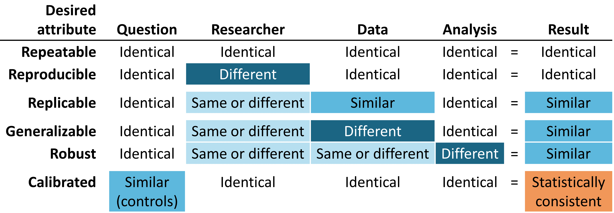

# (PART) Qualité des preuves {-}

# Qualité des preuves {#EvidenceQuality}

*Leaders du chapitre : Patrick Ryan & Jon Duke*

\index{qualité des preuves}

## Attributs des preuves fiables

Avant d'entreprendre n'importe quel voyage, il peut être utile d'imaginer à quoi pourrait ressembler la destination idéale. Pour soutenir notre voyage des données aux preuves, nous mettons en avant les attributs souhaités qui peuvent sous-tendre ce qui fait la fiabilité de la qualité des preuves.

(\#fig:attributesOfEvidence)Attributs désirés des preuves fiables

Les preuves fiables doivent être **répétables**, ce qui signifie que les chercheurs doivent s'attendre à produire des résultats identiques lorsqu'ils appliquent la même analyse aux mêmes données pour une question donnée. Implicite dans cette exigence minimale est la notion que les preuves sont le résultat de l'exécution d'un processus défini avec une entrée spécifiée, et doivent être exemptes d'intervention manuelle de prises de décisions a posteriori en cours de route. Plus idéalement encore, les preuves fiables devraient être **reproductibles**, de sorte qu'un chercheur différent devrait être capable d'effectuer la même tâche d'exécution d'une analyse donnée sur une base de données donnée et s'attendre à produire un résultat identique au premier chercheur. La reproductibilité exige que le processus soit entièrement spécifié, généralement à la fois sous une forme lisible par l'homme et exécutable par ordinateur, de sorte qu'aucune décision d'étude ne soit laissée à la discrétion de l'enquêteur. La solution la plus efficace pour atteindre la répétabilité et la reproductibilité est d'utiliser des routines analytiques standardisées ayant des entrées et des sorties définies, et d'appliquer ces procédures à des bases de données contrôlées par version.

Nous sommes plus susceptibles d'avoir confiance dans la fiabilité de nos preuves si elles peuvent être montrées comme étant **réplicables**, de sorte que la même question abordée en utilisant l'analyse identique contre des données similaires donne des résultats similaires. Par exemple, des preuves générées à partir d'une analyse contre une base de données de réclamations administratives d'un grand assureur privé peuvent être renforcées si elles sont répliquées sur des données de réclamations d'un autre assureur. Dans le contexte de l'estimation de l'effet au niveau de la population, cet attribut s'aligne bien avec le point de vue causal de Sir Austin Bradford Hill sur la cohérence, "A-t-il été observé à plusieurs reprises par des personnes différentes, dans différents endroits, circonstances et moments?... si le hasard est l'explication ou si un vrai danger a été révélé peut parfois être répondu seulement par une répétition des circonstances et des observations." [@hill_1965] Dans le contexte de la prédiction au niveau des patients, la réplicabilité met en évidence la valeur de la validation externe et la capacité d'évaluer les performances d'un modèle formé sur une base de données en observant son exactitude discriminative et sa calibration lorsqu'il est appliqué à une autre base de données. Dans des circonstances où des analyses identiques sont effectuées sur différentes bases de données et montrent encore des résultats de manière systématiquement similaire, nous avons encore plus confiance que nos preuves sont **généralisables**. Une valeur clé du réseau de recherche OHDSI est la diversité représentée par les différentes populations, géographies et processus de collecte de données. @madigan_2013 a montré que les estimations d'effet peuvent être sensibles au choix des données. En reconnaissant que chaque source de données comporte des limitations inhérentes et des biais uniques qui limitent notre confiance dans des résultats uniques, il y a une grande puissance à observer des modèles similaires à travers des ensembles de données hétérogènes car cela diminue grandement la probabilité que des biais spécifiques à la source expliquent seuls les résultats. Lorsque des études de réseau montrent des estimations d'effet au niveau de la population cohérentes à travers plusieurs bases de données de réclamations et de données électroniques de santé aux États-Unis, en Europe et en Asie, elles doivent être reconnues comme des preuves plus fortes sur l'intervention médicale pouvant avoir une portée plus large sur la prise de décision médicale.

Les preuves fiables doivent être **robustes**, ce qui signifie que les conclusions ne doivent pas être excessivement sensibles aux choix subjectifs qui peuvent être faits dans le cadre d'une analyse. S'il existe des méthodes statistiques alternatives pouvant être considérées comme potentiellement raisonnables pour une étude donnée, il peut être rassurant de voir que les différentes méthodes donnent des résultats similaires, ou au contraire donner des avertissements en cas de résultats discordants. [@madigan2013design] Pour l'estimation de l'effet au niveau de la population, les analyses de sensibilité peuvent inclure des choix de conception d'étude de haut niveau, tels que l'application ou non d'une conception de cohorte comparative ou d'une série de cas autocontrôlés, ou se concentrer sur des considérations analytiques intégrées dans une conception, telles que l'exécution du jumelage, la stratification ou la pondération des scores de propension comme stratégie d'ajustement des biais de confusion dans le cadre de la cohorte comparative.

Enfin, mais peut-être le plus important, les preuves doivent être **calibrées**. Il ne suffit pas d'avoir un système générateur de preuves qui produit des réponses à des questions inconnues si les performances de ce système ne peuvent être vérifiées. Un système fermé doit avoir des caractéristiques de fonctionnement connues, qui doivent pouvoir être mesurées et communiquées en tant que contexte pour interpréter tous les résultats que le système produit. Les artefacts statistiques doivent pouvoir être empiriquement démontrés comme ayant des propriétés bien définies, telles qu'un intervalle de confiance à 95% ayant une probabilité de couverture de 95% ou une cohorte avec une probabilité prédite de 10% ayant une proportion observée d'événements dans 10% de la population. Une étude observationnelle devrait toujours être accompagnée de diagnostics d'étude qui testent les hypothèses autour de la conception, des méthodes et des données. Ces diagnostics doivent être centrés sur l'évaluation des principales menaces à la validité de l'étude : les biais de sélection, la confusion et l'erreur de mesure. Il a été démontré que les contrôles négatifs constituent un outil puissant pour identifier et atténuer les erreurs systématiques dans les études observationnelles. [@schuemie_2016; @schuemie_2018; @schuemie_2018b]

## Comprendre la qualité des preuves

Mais comment savons-nous si les résultats d'une étude sont suffisamment fiables ? Peuvent-ils être utilisés en milieu clinique ? Qu'en est-il de la prise de décision réglementaire ? Peuvent-ils servir de base pour de futures recherches ? Chaque fois qu'une nouvelle étude est publiée ou diffusée, les lecteurs doivent se poser ces questions, que le travail soit un essai contrôlé randomisé, une étude observationnelle ou un autre type d'analyse. \index{qualité des preuves} \index{prise de décision réglementaire}

L'une des préoccupations souvent soulevées concernant les études observationnelles et l'utilisation des "données du monde réel" est le sujet de la qualité des données. [@botsis2010secondary; @hersh2013caveats; @sherman2016real] Il est souvent noté que les données utilisées dans la recherche observationnelle n'ont pas été initialement recueillies à des fins de recherche et peuvent donc souffrir de captures de données incomplètes ou inexactes ainsi que de biais inhérents. Ces préoccupations ont donné lieu à un corpus croissant de recherches sur la manière de mesurer, de caractériser et idéalement d'améliorer la qualité des données. [@kahn2012pragmatic; @liaw2013towards; @weiskopf_2013] La communauté OHDSI est une forte militante de telles recherches et les membres de la communauté ont mené et participé à de nombreuses études sur la qualité des données dans l'OMOP CDM et le réseau OHDSI. [@huser_multisite_2016; @kahn_transparent_2015; @callahan2017comparison; @yoon_2016] \index{qualité des données} \index{communauté}

Compte tenu des conclusions de la dernière décennie dans ce domaine, il est devenu apparent que la qualité des données n'est pas parfaite et ne le sera jamais. Cette notion est bien reflétée dans cette citation du Dr Clem McDonald, un pionnier dans le domaine de l'informatique médicale :

> La perte de fidélité commence avec le transfert des données du cerveau du médecin vers le dossier médical. \index{Clem McDonald}

Ainsi, en tant que communauté, nous devons poser la question : **étant donné des données imparfaites, comment pouvons-nous obtenir des preuves fiables ?**

La réponse réside dans l'examen holistique de la "qualité des preuves" : examiner tout le parcours des données aux preuves, identifier chacun des composants qui composent le processus de génération des preuves, déterminer comment renforcer la confiance dans la qualité de chaque composant, et communiquer de manière transparente ce qui a été appris à chaque étape du chemin. La qualité des preuves considère non seulement la qualité des données observationnelles, mais aussi la validité des méthodes, des logiciels et des définitions cliniques utilisées dans nos analyses observationnelles. \index{communauté} \index{preuves fiables}

Dans les chapitres suivants, nous allons explorer les quatre composants de la qualité des preuves listés dans le Tableau \@ref(tab:evidenceQuality).

Tableau : (\#tab:evidenceQuality) Les quatre composants de la qualité des preuves.

| Composant de la qualité des preuves | Ce qu'il mesure                                                          |
|------------------------------------|-------------------------------------------------------------------------------------------------------------------|
| [Qualité des données](DataQuality.html)         | Les données sont-elles complètement capturées avec des valeurs plausibles d'une manière conforme à la structure et aux conventions convenues ? |
| [Validité clinique](ClinicalValidity.html)       | Dans quelle mesure l'analyse effectuée correspond-elle à l'intention clinique ?                          |
| [Validité des logiciels](SoftwareValidity.html)       | Pouvons-nous faire confiance au fait que le processus de transformation et d'analyse des données fait ce qu'il est censé faire ?                |
| [Validité de la méthode](MethodValidity.html)       | La méthodologie est-elle appropriée pour la question, compte tenu des forces et des faiblesses des données ?              |

## Communiquer la qualité des preuves

Un aspect important de la qualité des preuves est la capacité d'exprimer l'incertitude qui surgit le long du parcours des données aux preuves. Le but global du travail d'OHDSI sur la qualité des preuves est de produire la confiance chez les décideurs en matière de soins de santé que les preuves générées par OHDSI -- bien qu'inévitablement imparfaites à bien des égards -- ont été systématiquement mesurées pour leurs faiblesses et leurs forces et que ces informations ont été communiquées de manière rigoureuse et ouverte.

## Résumé

\BeginKnitrBlock{rmdsummary}
- Les preuves que nous générons doivent être **répétables**, **reproductibles**, **répliquables**, **généralisables**, **robustes** et **calibrées**.

- La qualité des preuves prend en compte plus que la seule qualité des données pour répondre à la question de savoir si les preuves sont fiables :
    - Qualité des données
    - Validité clinique
    - Validité du logiciel
    - Validité de la méthode

- Lors de la communication des preuves, nous devons exprimer l'incertitude découlant des différents défis liés à la qualité des preuves.

\EndKnitrBlock{rmdsummary}
