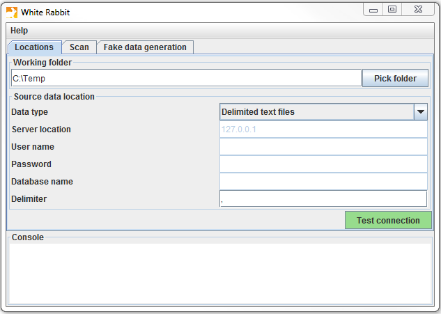
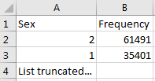
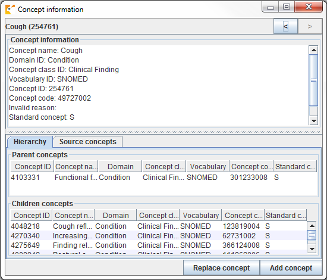
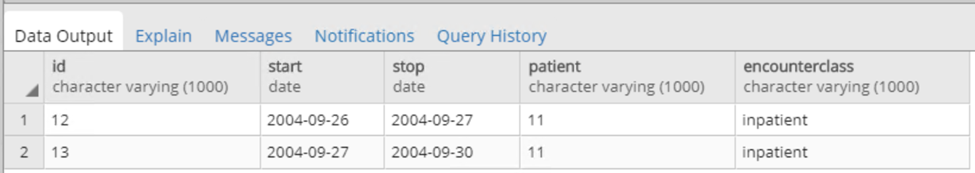

# Extraction, Transformation et Chargement {#ExtractTransformLoad}

*Responsables de chapitre : Clair Blacketer & Erica Voss*


## Introduction

Pour convertir les données natives/brutes au Modèle de Données Commun OMOP (CDM), nous devons créer un processus d'extraction, transformation et chargement (ETL). Ce processus doit restructurer les données selon le CDM, ajouter des correspondances aux Vocabularies Standardisés, et il est généralement implémenté sous forme de scripts automatisés, par exemple des scripts SQL. Il est important que ce processus ETL soit répétable, afin qu'il puisse être relancé à chaque fois que les données sources sont actualisées. \index{ETL|see {extraction, transformation et chargement (ETL)}} \index{données brutes} \index{données natives|see {données brutes}} \index{données sources|see{données brutes}}

La création d'un ETL est généralement une entreprise de grande envergure. Au fil des années, nous avons développé des meilleures pratiques, consistant en quatre étapes principales :

1. Des experts en données et des experts en CDM conçoivent ensemble l'ETL.
2. Des personnes ayant des connaissances médicales créent les correspondances de code.
3. Une personne technique met en œuvre l'ETL.
4. Tous sont impliqués dans le contrôle de qualité.

Dans ce chapitre, nous discuterons en détail de chacune de ces étapes. Plusieurs outils ont été développés par la communauté OHDSI pour soutenir certaines de ces étapes, et ceux-ci seront également abordés. Nous terminerons ce chapitre par une discussion sur la maintenance du CDM et de l'ETL.
## Étape 1 : Concevoir l'ETL

Il est important de bien distinguer la conception de l'ETL de sa mise en œuvre. La conception de l'ETL nécessite une connaissance approfondie à la fois des données sources et du CDM. La mise en œuvre de l'ETL, en revanche, repose principalement sur une expertise technique pour rendre l'ETL efficace en termes de calcul. Si nous essayons de faire les deux en même temps, nous risquons de nous enliser dans des détails insignifiants, alors que nous devrions nous concentrer sur l'ensemble du tableau.

Deux outils étroitement intégrés ont été développés pour soutenir le processus de conception de l'ETL : White Rabbit et Rabbit-in-a-Hat.

### White Rabbit

Pour initier un processus ETL sur une base de données, vous devez comprendre vos données, y compris les tables, les champs et le contenu. C'est là que l'outil [White Rabbit](https://github.com/OHDSI/WhiteRabbit) entre en jeu. White Rabbit est un logiciel destiné à aider à préparer les ETL des bases de données longitudinales de soins de santé pour les transformer en [OMOP CDM](https://github.com/OHDSI/CommonDataModel). White Rabbit scanne vos données et crée un rapport contenant toutes les informations nécessaires pour commencer à concevoir l'ETL. Tout le code source et les instructions d'installation, ainsi qu'un lien vers le manuel, sont disponibles sur GitHub.[^whiteRabbitGithubUrl] \index{White Rabbit} \index{profilage de données|see {White Rabbit}}

[^whiteRabbitGithubUrl]: https://github.com/OHDSI/WhiteRabbit.

#### Portée et objectif  {-}

La fonction principale de White Rabbit est d'effectuer un scan des données sources, fournissant des informations détaillées sur les tables, les champs et les valeurs présentes dans un champ. Les données sources peuvent être dans des fichiers texte séparés par des virgules, ou dans une base de données (MySQL, SQL Server, Oracle, PostgreSQL, Microsoft APS, Microsoft Access, Amazon Redshift). Le scan générera un rapport utilisable comme référence lors de la conception de l'ETL, par exemple en l'utilisant conjointement avec l'outil Rabbit-In-a-Hat. White Rabbit se distingue des outils de profilage de données standard en tentant d'empêcher l'affichage de données personnellement identifiables (PII) dans le fichier de sortie généré.

#### Vue d'ensemble du processus {-}

La séquence typique pour utiliser le logiciel afin de scanner les données sources :

1. Définir le dossier de travail, l'emplacement sur l'ordinateur de bureau local où les résultats seront exportés.
2. Connecter à la base de données source ou au fichier texte CSV et tester la connexion.
3. Sélectionner les tables d'intérêt pour le scan et scanner les tables.
4. White Rabbit crée une exportation des informations sur les données sources.

#### Définir un dossier de travail {-}

Après avoir téléchargé et installé l'application White Rabbit, la première chose à faire est de définir un dossier de travail. Tous les fichiers créés par White Rabbit seront exportés dans ce dossier local. Utilisez le bouton "Pick Folder" illustré à la Figure \@ref(fig:WhiteRabbitLocation) pour naviguer dans votre environnement local là où vous souhaitez que le document de scan soit enregistré.

```{r WhiteRabbitLocation, fig.cap="Le bouton \"Pick Folder\" permet de spécifier un dossier de travail pour l'application White Rabbit.",echo=FALSE, out.width='100%', fig.align='center'}

```

#### Connexion à une base de données {-}

White Rabbit prend en charge les fichiers texte délimités et diverses plates-formes de base de données. Survolez les différents champs avec la souris pour obtenir une description de ce qui est requis. Des informations plus détaillées se trouvent dans le manuel.

#### Scanner les tables dans une base de données {-}

Après connexion à une base de données, vous pouvez scanner les tables qu'elle contient. Un scan génère un rapport contenant des informations sur les données sources utilisables pour aider à concevoir l'ETL. En utilisant l'onglet Scan illustré à la Figure \@ref(fig:WhiteRabbitAddTables), vous pouvez soit sélectionner des tables individuelles dans la base de données source sélectionnée en cliquant sur “Add” (Ctrl + clic de souris), ou sélectionner automatiquement toutes les tables de la base de données en cliquant sur “Add all in DB”.

```{r WhiteRabbitAddTables, fig.cap="Onglet de scan de White Rabbit.", echo=FALSE, out.width='100%', fig.align='center'}
knitr::include_graphics("images/ExtractTransformLoad/WhiteRabbitAddTables.png")
```

Il y a également quelques options de paramétrage avec le scan :

* Cocher “Scan field values” indique à White Rabbit que vous souhaitez examiner les valeurs apparaissant dans les colonnes.
* “Min cell count” est une option lors du scan des valeurs de champ. Par défaut, elle est définie à 5, ce qui signifie que les valeurs des données sources apparaissant moins de 5 fois n'apparaîtront pas dans le rapport. Les ensembles de données individuels peuvent avoir leurs propres règles concernant ce nombre minimal de cellules.
* “Rows per table” est une option lors du scan des valeurs de champ. Par défaut, White Rabbit scannera 100,000 lignes sélectionnées au hasard dans la table.

Une fois tous les paramètres complétés, appuyez sur le bouton “Scan tables”. Après la fin du scan, le rapport sera écrit dans le dossier de travail.

#### Interpréter le rapport de scan {-}

Une fois le scan terminé, un fichier Excel est généré dans le dossier sélectionné, avec un onglet pour chaque table scannée ainsi qu'un onglet récapitulatif. L'onglet récapitulatif liste toutes les tables scannées, chaque champ dans chaque table, le type de données de chaque champ, la longueur maximale du champ, le nombre de lignes dans la table, le nombre de lignes scannées, et la fréquence à laquelle chaque champ a été trouvé vide. La Figure \@ref(fig:ScanOverviewTab). montre un exemple d'onglet récapitulatif.

```{r ScanOverviewTab, fig.cap="Exemple d'onglet récapitulatif d'un rapport de scan.", echo=FALSE, out.width='100%', fig.align='center'}
knitr::include_graphics("images/ExtractTransformLoad/ScanOverviewTab.png")
```

Les onglets pour chaque table montrent chaque champ, les valeurs dans chaque champ et la fréquence de chaque valeur. Chaque colonne de la table source générera deux colonnes dans le fichier Excel. Une colonne listera toutes les valeurs distinctes ayant un nombre supérieur au “Min cell count” défini au moment du scan. Si une liste de valeurs uniques était tronquée, la dernière valeur dans la liste sera “List truncated”; cela indique qu'il y a une ou plusieurs valeurs uniques additionnelles apparaissant moins souvent que le nombre saisi dans le “Min cell count”. À côté de chaque valeur distincte se trouve une deuxième colonne contenant la fréquence (le nombre de fois que cette valeur apparaît dans l'échantillon). Ces deux colonnes (valeurs distinctes et fréquence) se répètent pour toutes les colonnes sources de la table profilée dans le classeur.

```{r scanSex, fig.cap="Exemple de valeurs pour une seule colonne.", echo=FALSE, out.width='30%', fig.align='center'}

```

Le rapport est puissant pour comprendre vos données sources en mettant en évidence ce qui existe. Par exemple, si les résultats illustrés à la Figure \@ref(fig:scanSex) étaient retournés pour la colonne “Sex” dans une des tables scannées, nous pouvons voir qu'il y avait deux valeurs communes (1 et 2) apparaissant 61,491 et 35,401 fois respectivement. White Rabbit ne définira pas 1 comme masculin et 2 comme féminin; le détenteur des données devront généralement définir les codes sources uniques au système source. Cependant, ces deux valeurs (1 & 2) ne sont pas les seules présentes dans les données car nous voyons que cette liste a été tronquée. Ces autres valeurs apparaissent très peu fréquemment (défini par le “Min cell count”) et représentent souvent des valeurs incorrectes ou très suspectes. Lors de la génération d'un ETL, nous devons non seulement planifier pour les concepts de genre haute fréquence 1 et 2 mais aussi pour les autres valeurs basse fréquence existant dans cette colonne. Par exemple, si ces genres basse fréquence étaient “NULL”, nous devons nous assurer que l'ETL peut traiter ces données et sait quoi faire dans cette situation.

### Rabbit-In-a-Hat

Avec le scan de White Rabbit en main, nous avons une image claire des données sources. Nous connaissons également la spécification complète du CDM. Maintenant, nous devons définir la logique pour passer de l'un à l'autre. Cette activité de conception nécessite une connaissance approfondie à la fois des données sources et du CDM. Les outils Rabbit-in-a-Hat qui accompagnent le logiciel White Rabbit sont spécialement conçus pour soutenir une équipe d'experts dans ces domaines. Dans un cadre typique, l'équipe de conception de l'ETL se réunit dans une salle, tandis que Rabbit-in-a-Hat est projeté sur un écran. Lors d'un premier tour, les mappages tables-à-tables peuvent être décidés collaborativement, après quoi les mappages de champ-à-champ peuvent être conçus, tout en définissant la logique par laquelle les valeurs seront transformées. \index{Rabbit-In-A-Hat} \index{conception d'ETL|see {Rabbit-In-A-Hat}}

#### Portée et objectif {-}

Rabbit-In-a-Hat est conçu pour lire et afficher un document de scan de White Rabbit. White Rabbit génère des informations sur les données sources tandis que Rabbit-In-a-Hat utilise ces informations et grâce à une interface graphique permet à un utilisateur de connecter les données sources aux tables et colonnes du CDM. Rabbit-In-a-Hat génère de la documentation pour le processus ETL, il ne génère pas de code pour créer un ETL.

#### Vue d'ensemble du processus {-}

La séquence typique pour utiliser ce logiciel afin de générer la documentation d'un ETL :

1. Résultats scannés de WhiteRabbit terminés.
2. Ouvrir les résultats scannés; l'interface affiche les tables sources et les tables CDM.
3. Connecter les tables sources aux tables CDM où la table source fournit des informations pour cette table CDM correspondante.
4. Pour chaque connexion table source à table CDM, définir davantage la connexion avec les détails colonne source à colonne CDM.
5. Enregistrer le travail de Rabbit-In-a-Hat et l'exporter vers un document MS Word.

#### Rédaction de la logique ETL {-}

Une fois que vous avez ouvert votre rapport de scan White Rabbit dans Rabbit-In-a-Hat, vous êtes prêt à commencer à concevoir et à rédiger la logique pour convertir les données sources en OMOP CDM. À titre d'exemple, les sections suivantes illustreront comment certaines des tables de la base de données Synthea[^syntheaWiki] pourraient apparaître lors de la conversion.

[^syntheaWiki]: Synthea^TM^ est un générateur de patients visant à modéliser de vrais patients. Les données sont créées en fonction des paramètres passés à l'application. La structure des données se trouve ici : https://github.com/synthetichealth/synthea/wiki.

#### Flux général d'un ETL {-}

Étant donné que le CDM est un modèle centré sur la personne, il est toujours judicieux de commencer par mapper la table PERSON. Chaque table d'événement clinique (CONDITION_OCCURRENCE, DRUG_EXPOSURE, PROCEDURE_OCCURRENCE, etc.) se réfère à la table PERSON via le person_id ; élaborer la logique pour la table PERSON en premier rend la tâche plus facile par la suite. Après la table PERSON, une bonne règle de base est de convertir la table OBSERVATION_PERIOD ensuite. Chaque personne dans une base de données CDM doit avoir au moins une OBSERVATION_PERIOD et, en général, la plupart des événements pour une personne se produisent dans ce laps de temps. Une fois les tables PERSON et OBSERVATION_PERIOD terminées, les tables dimensionnelles comme PROVIDER, CARE_SITE et LOCATION sont généralement les suivantes. La logique des tables finale à travailler avant les tables cliniques est VISIT_OCCURRENCE. Cela est souvent la logique la plus compliquée dans tout l'ETL et elle est parmi les plus cruciales car la plupart des événements se produisant au cours du parcours du patient se produiront pendant les visites. Une fois ces tables terminées, il est de votre choix de mapper les tables CDM et dans l'ordre que vous préférez.

```{r etlFlow, fig.cap="Flux général d'un ETL et quelles tables mapper en premier.", echo=FALSE, out.width='100%', fig.align='center'}
knitr::include_graphics("images/ExtractTransformLoad/flowOfEtl.png")
```

Il est souvent nécessaire, lors de la conversion au CDM, de prévoir des tables intermédiaires. Cela pourrait être pour attribuer les bons VISIT_OCCURRENCE_IDs aux événements, ou pour mapper les codes sources aux concepts standard (faire cette étape dynamique est souvent très lent). Les tables intermédiaires sont 100 % autorisées et encouragées. Ce qui est découragé, c'est la persistance et la dépendance à l'égard de ces tables intermédiaires une fois la conversion terminée.

#### Exemple de mappage : Table Person  {-}

La structure des données Synthea contient 20 colonnes dans la table patients, mais toutes n'étaient pas nécessaires pour peupler la table PERSON, comme illustré à la Figure \@ref(fig:syntheaPerson). Cela est très courant et ne devrait pas être alarmant. Dans cet exemple, de nombreux points de données de la table patients de Synthea qui n'ont pas été utilisés dans la table PERSON du CDM étaient des identifiants supplémentaires tels que le nom du patient, le numéro de permis de conduire et le numéro de passeport.

```{r syntheaPerson, fig.cap="Mise en correspondance de la table Patients de Synthea avec la table PERSON du CDM.",echo=FALSE, out.width='100%', fig.align='center'}
knitr::include_graphics("images/ExtractTransformLoad/syntheaPersonTable.png")
```

Le tableau \@ref(tab:syntheaEtlPerson) ci-dessous montre la logique qui a été imposée à la table patients de Synthea pour la convertir en table PERSON du CDM. La colonne ‘Destination Field’ discute où dans le CDM les données sont mappées. La colonne ‘Source field’ met en évidence la colonne de la table source (dans ce cas patients) qui sera utilisée pour peupler la colonne CDM. Enfin, la colonne ‘Logic & comments’ donne des explications pour la logique.

Table : (\#tab:syntheaEtlPerson) Logique ETL pour convertir la table Patients de Synthea en table PERSON du CDM.

| Destination Field | Source field | Logic & comments |
| :---------------------- | :--------- | :---------------------------------------- |
| PERSON_ID                   |             |  Généré automatiquement. Le PERSON_ID sera généré au moment de l'implémentation. Cela est dû au fait que la valeur de l'identifiant source est une valeur varchar tandis que le PERSON_ID est un entier. Le champ id de la source est défini comme PERSON_SOURCE_VALUE pour préserver cette valeur et permettre la vérification des erreurs si nécessaire. |
| GENDER_CONCEPT_ID           | gender      | Lorsque gender = ‘M’, définir GENDER_CONCEPT_ID à 8507, lorsque gender = ‘F’, définir à 8532. Supprimer toutes les lignes avec un sexe manquant/inconnu. Ces deux concepts ont été choisis car ce sont les seuls concepts standard dans le domaine du sexe. Le choix de supprimer les patients avec des sexes inconnus tend à être basé sur le site, bien qu'il soit recommandé de les supprimer car les personnes sans sexe sont exclues des analyses.|
| YEAR_OF_BIRTH               | birthdate   | Extraire l'année de la date de naissance |
| MONTH_OF_BIRTH              | birthdate   | Extraire le mois de la date de naissance |
| DAY_OF_BIRTH                | birthdate   | Extraire le jour de la date de naissance |
| BIRTH_DATETIME              | birthdate   | À minuit, heure 00:00:00. Ici, la source n'a pas fourni d'heure de naissance, donc l'option choisie a été de la fixer à minuit.  |
| RACE_CONCEPT_ID             | race        | Lorsque race = 'WHITE', définir à 8527, lorsque race = 'BLACK', définir à 8516, lorsque race = 'ASIAN', définir à 8515, sinon définir à 0. Ces concepts ont été choisis car ce sont des concepts standard appartenant au domaine de la race qui correspondent le plus étroitement aux catégories raciales dans la source.  |
| ETHNICITY_ CONCEPT_ID        | race  ethnicity | Lorsque race = ‘HISPANIC’, ou lorsque ethnicity est dans (‘CENTRAL_AMERICAN’, ‘DOMINICAN’, ‘MEXICAN’, ‘PUERTO_RICAN’, ‘SOUTH_AMERICAN’), définir à 38003563, sinon définir à 0. Ceci est un bon exemple de la manière dont plusieurs colonnes sources peuvent contribuer à une colonne CDM. Dans le CDM, l'ethnicité est représentée comme soit hispanique soit non hispanique, donc les valeurs des colonnes sources race et ethnicity détermineront cette valeur. |
| LOCATION_ID                 |             |   |
| PROVIDER_ID                 |             |   |
| CARE_SITE_ID                |             |   |
| PERSON_SOURCE_ VALUE         | id          |   |
| GENDER_SOURCE_ VALUE         | gender      |   |
| GENDER_SOURCE_ CONCEPT_ID    |             |   |
| RACE_SOURCE_ VALUE           | race        |   |
| RACE_SOURCE_ CONCEPT_ID      |             |   |
| ETHNICITY_ SOURCE_VALUE      | ethnicity   |  Dans ce cas, l'ETHNICITY_SOURCE_VALUE aura plus de granularité que l'ETHNICITY_CONCEPT_ID.  |
| ETHNICITY_ SOURCE_CONCEPT_ID |             |   |

Pour plus d'exemples sur la manière dont l'ensemble de données Synthea a été mappé au CDM, veuillez consulter le document de spécification complète.[^syntheaEtlUrl]

[^syntheaEtlUrl]: https://ohdsi.github.io/ETL-Synthea/
## Étape 2 : Créer les Mappings de Codes

De plus en plus de codes source sont ajoutés au Vocabulaire OMOP tout le temps. Cela signifie que les systèmes de codage dans les données transformées en CDM peuvent déjà être inclus et mappés. Vérifiez la table VOCABULARY dans le Vocabulaire OMOP pour voir quels vocabulaires sont inclus. Pour extraire le mapping des codes source non standards (par exemple les codes ICD-10CM) vers les concepts standards (par exemple les codes SNOMED), nous pouvons utiliser les enregistrements de la table CONCEPT_RELATIONSHIP ayant relationship_id = "Maps to". Par exemple, pour trouver l'ID de concept standard pour le code ICD-10CM 'I21' ("Infarctus du myocarde aigu"), nous pouvons utiliser la requête SQL suivante :

```sql
SELECT concept_id_2 standard_concept_id
FROM concept_relationship
INNER JOIN concept source_concept
  ON concept_id = concept_id_1
WHERE concept_code = 'I21'
  AND vocabulary_id = 'ICD10CM'
  AND relationship_id = 'Maps to';
```
| STANDARD_CONCEPT_ID |
| -------------------:|
| 312327              |

Malheureusement, parfois, les données source utilisent des systèmes de codage qui ne sont pas dans le Vocabulaire. Dans ce cas, un mapping doit être créé entre le système de codage source et les Concepts Standards. La cartographie de codes peut être une tâche intimidante, surtout lorsqu'il y a de nombreux codes dans le système de codage source. Il y a plusieurs choses qui peuvent être faites pour faciliter cette tâche :

- Concentrez-vous sur les codes les plus fréquemment utilisés. Un code qui n'est jamais ou rarement utilisé ne vaut pas l'effort de la cartographie, puisqu'il ne sera jamais utilisé dans une étude réelle.
- Utilisez les informations existantes chaque fois que possible. Par exemple, de nombreux systèmes nationaux de codage des médicaments ont été mappés à l'ATC. Bien que l'ATC ne soit pas suffisamment détaillé pour de nombreux usages, les relations de concepts entre l'ATC et RxNorm peuvent être utilisées pour faire de bonnes suppositions sur les bons codes RxNorm.
- Utilisez Usagi.

### Usagi

Usagi est un outil pour aider au processus manuel de création d'un mapping de codes. Il peut faire des suggestions de mappings basées sur la similarité textuelle des descriptions de codes. Si les codes source ne sont disponibles que dans une langue étrangère, nous avons constaté que Google Translate[^GoogleTranslateUrl] fournit souvent une traduction étonnamment bonne des termes en anglais. Usagi permet à l'utilisateur de rechercher les concepts cibles appropriés si la suggestion automatisée n'est pas correcte. Enfin, l'utilisateur peut indiquer quels mappings sont approuvés pour être utilisés dans l'ETL. Usagi est disponible sur GitHub.[^UsagiUrl] \index{Usagi} \index{cartographie de code source|see {Usagi}}

[^GoogleTranslateUrl]: https://translate.google.com/
[^UsagiUrl]: https://github.com/OHDSI/Usagi

#### Portée et But {-}

Les codes source nécessitant un mapping sont chargés dans Usagi (si les codes ne sont pas en anglais, des colonnes supplémentaires de traductions sont nécessaires). Une approche de similarité de termes est utilisée pour connecter les codes source aux concepts du Vocabulaire. Cependant, ces connexions de codes doivent être revues manuellement et Usagi fournit une interface pour faciliter cela. Usagi ne proposera que des concepts marqués comme Concepts Standards dans le Vocabulaire.

#### Vue d'ensemble du processus {-}

La séquence typique pour utiliser ce logiciel est :

1. Chargez les codes de votre système source ("codes source") que vous souhaitez mapper aux concepts du Vocabulaire.
2. Usagi exécutera une approche de similarité de termes pour mapper les codes source aux concepts du Vocabulaire.
3. Utilisez l'interface d'Usagi pour vérifier et, si nécessaire, améliorer les mappings suggérés. De préférence, une personne ayant de l'expérience avec le système de codage et la terminologie médicale doit être utilisée pour cette revue.
4. Exportez le mapping vers la table SOURCE_TO_CONCEPT_MAP du Vocabulaire.

#### Importer les Codes Source dans Usagi {-}

Exportez les codes source de votre système source dans un fichier CSV ou Excel (.xlsx). Ce fichier doit contenir au moins des colonnes comprenant le code source et une description du code source en anglais. Cependant, des informations supplémentaires sur les codes peuvent également être incluses (par exemple, unité de dose, ou la description dans la langue d'origine si traduite). En plus des informations sur les codes source, la fréquence du code devrait également être incluse, car cela peut aider à prioriser les codes qui nécessitent le plus d'effort pour le mapping (par exemple, vous pouvez avoir 1 000 codes source, mais seulement 100 sont réellement utilisés dans le système). Si des informations sur les codes source doivent être traduites en anglais, utilisez Google Translate.

Note : les extractions de codes source doivent être divisées par domaine (c'est-à-dire médicaments, procédures, conditions, observations) et non regroupées dans un fichier volumineux.

Les codes source sont chargés dans Usagi depuis le menu File –> Import codes. De là, un "Import codes ..." s'affichera comme montré dans la Figure \@ref(fig:usagiImport). Dans cette figure, les termes des codes source étaient en néerlandais et ont également été traduits en anglais. Usagi utilisera les traductions anglaises pour mapper au vocabulaire standard.

```{r usagiImport, fig.cap="Usagi source code input screen.", echo=FALSE, out.width='100%', fig.align='center'}
knitr::include_graphics("images/ExtractTransformLoad/usagiImport.png")
```

La section "Column mapping" (en bas à gauche) est l'endroit où vous définissez pour Usagi comment utiliser la table importée. Si vous passez la souris sur les menus déroulants, une fenêtre contextuelle apparaîtra définissant chaque colonne. Usagi n'utilisera pas la ou les colonnes "Additional info" comme informations pour associer les codes source aux codes de concept du Vocabulaire ; cependant, ces informations supplémentaires peuvent aider la personne qui révise le mapping des codes source et devraient être incluses.

Enfin, dans la section "Filters" (en bas à droite), vous pouvez définir certaines restrictions pour Usagi lors du mapping. Par exemple, dans la Figure \@ref(fig:usagiImport), l'utilisateur mappe les codes source uniquement aux concepts du domaine Condition. Par défaut, Usagi ne mappe que vers les Concepts Standards, mais si l'option "Filter standard concepts" est désactivée, Usagi considérera également les Concepts de Classification. Passez la souris sur les différents filtres pour plus d'informations sur le filtre.

Un filtre spécial est "Filter by automatically selected concepts / ATC code". Si vous disposez de certaines informations que vous pouvez utiliser pour restreindre la recherche, vous pouvez le faire en fournissant une liste de CONCEPT_ID ou un code ATC dans la colonne indiquée dans la colonne Auto concept ID (délimitée par un point-virgule). Par exemple, dans le cas des médicaments, il se peut que des codes ATC soient déjà assignés à chaque médicament. Même si un code ATC n'identifie pas de manière unique un seul code de médicament RxNorm, il aide à limiter l'espace de recherche à seulement ces concepts qui relèvent du code ATC dans le Vocabulaire. Pour utiliser le code ATC, suivez ces étapes :

1. Dans la section Column mapping, passez de "Auto concept ID column" à "ATC column".
2. Dans la section Column mapping, sélectionnez la colonne contenant le code ATC comme "ATC column".
3. Activez "Filter by user selected concepts / ATC code" dans la section Filters.

Vous pouvez également utiliser d'autres sources d'informations que le code ATC pour restreindre également. Dans l'exemple montré dans la figure ci-dessus, nous avons utilisé un mapping partiel dérivé d'UMLS pour restreindre la recherche Usagi. Dans ce cas, nous devrons utiliser "Auto concept ID column".

Une fois tous vos paramètres finalisés, cliquez sur le bouton "Import" pour importer le fichier. L'importation du fichier prendra quelques minutes car il exécute l'algorithme de similarité de termes pour mapper les codes source.

#### Revoir les Mappings de Code Source vers Concept du Vocabulaire {-}

Une fois que vous avez importé votre fichier d'entrée de codes source, le processus de mapping commence. Dans la Figure \@ref(fig:usagiOverview), vous voyez que l'écran d'Usagi est composé de 3 sections principales : un tableau d'aperçu, la section de mapping sélectionnée et un espace pour effectuer des recherches. Notez que dans n'importe lequel des tableaux, vous pouvez faire un clic droit pour sélectionner les colonnes à afficher ou à masquer afin de réduire la complexité visuelle.

```{r usagiOverview, fig.cap="Usagi source code input screen.", echo=FALSE, out.width='100%', fig.align='center'}
knitr::include_graphics("images/ExtractTransformLoad/usagiOverview.png")
```

#### Approuver un Mapping Suggéré {-}

Le "Tableau d'aperçu" montre le mapping actuel des codes source aux concepts. Juste après avoir importé les codes source, ce mapping contient les mappings suggérés automatiquement basés sur la similarité de termes et toute option de recherche. Dans l'exemple de la figure \@ref(fig:usagiOverview), les noms anglais des codes de condition néerlandais ont été mappés à des concepts standards dans le domaine Condition, car l'utilisateur a restreint la recherche à ce domaine. Usagi a comparé les descriptions des codes source aux noms et synonymes des concepts pour trouver la meilleure correspondance. Parce que l'utilisateur avait sélectionné "Include source terms", Usagi a également pris en compte les noms et synonymes de tous les concepts source dans le vocabulaire qui mappent à un concept particulier. Si Usagi est incapable de faire un mapping, il le mappera au CONCEPT_ID = 0.

Il est suggéré qu'une personne ayant de l'expérience avec les systèmes de codage aide à mapper les codes source à leur vocabulaire standard associé. Cette personne travaillera code par code dans le "Tableau d'aperçu" pour soit accepter le mapping suggéré par Usagi, soit choisir un nouveau mapping. Par exemple, dans la figure \@ref(fig:usagiOverview), nous voyons que le terme néerlandais “Hoesten” qui a été traduit par “Cough”. Usagi a utilisé “Cough” et l'a mappé au concept du Vocabulaire “4158493-C/O - cough”. Il y avait un score de correspondance de 0.58 associé à cette paire de correspondance (les scores de correspondance sont généralement de 0 à 1, 1 étant une correspondance confiante), un score de 0.58 signifie qu'Usagi n'est pas très certain de la qualité du mapping de ce code néerlandais à SNOMED. Supposons que dans ce cas, nous soyons d'accord avec ce mapping, nous pouvons l'approuver en cliquant sur le bouton vert "Approve" en bas à droite de l'écran.

#### Rechercher un Nouveau Mapping {-}

Il y aura des cas où Usagi suggère un mapping et l'utilisateur devra soit essayer de trouver un meilleur mapping soit définir le mapping à aucun concept (CONCEPT_ID = 0). Dans l'exemple donné dans la figure \@ref(fig:usagiOverview), nous voyons pour le terme néerlandais "Hoesten", qui a été traduit par "Cough". La suggestion d'Usagi était restreinte par le concept identifié dans notre mapping dérivé automatiquement d'UMLS, et le résultat peut ne pas être optimal. Dans l'outil de recherche, nous pourrions rechercher d'autres concepts en utilisant soit le terme lui-même, soit une requête de boîte de recherche.

Lors de l'utilisation de la boîte de recherche manuelle, il faut garder à l'esprit qu'Usagi utilise une recherche floue, et ne prend pas en charge les requêtes de recherche structurée, par exemple ne supportant pas les opérateurs booléens comme AND et OR.

Pour continuer notre exemple, supposons que nous avons utilisé le terme de recherche “Cough” pour voir si nous pouvions trouver un meilleur mapping. À droite de la section Query de l'outil de recherche, il y a une section Filters, cela fournit des options pour réduire les résultats du Vocabulaire lors de la recherche du terme recherché. Dans ce cas, nous savons que nous voulons seulement trouver des concepts standards, et nous permettons que des concepts soient trouvés en fonction des noms et synonymes des concepts source dans le vocabulaire qui mappent à ces concepts standards.

Lorsque nous appliquons ces critères de recherche, nous trouvons “254761-Cough” et estimons que cela peut être un concept de Vocabulaire approprié à mapper à notre code néerlandais. Pour ce faire, nous pouvons cliquer sur le bouton "Replace concept", qui se mettra à jour dans la section “Selected Source Code”, suivi du bouton "Approve". Il y a aussi un bouton "Add concept", qui permet de mapper plusieurs concepts de Vocabulaire standard à un seul code source (par exemple, certains codes source peuvent regrouper plusieurs maladies tandis que le vocabulaire standard peut ne pas le faire).

#### Informations sur le Concept {-}

Lors de la recherche de concepts appropriés à mapper, il est important de considérer la "vie sociale" d'un concept. La signification d'un concept pourrait dépendre en partie de sa place dans la hiérarchie, et parfois il y a des "concepts orphelins" dans le vocabulaire avec peu ou pas de relations hiérarchiques, qui seraient mal adaptés comme concepts cibles. Usagi rapportera souvent le nombre de parents et d'enfants qu'un concept a, et il est également possible de montrer plus d'informations en appuyant sur ALT + C ou en sélectionnant view –> Concept information dans la barre de menu supérieure.

```{r usagiConceptInfo, fig.cap="Usagi concept information panel.", echo=FALSE, out.width='100%', fig.align='center'}

```

La figure \@ref(fig:usagiConceptInfo) montre le panneau d'informations sur le concept. Il montre des informations générales sur un concept, ainsi que ses parents, enfants et autres codes source qui mappent à ce concept. Les utilisateurs peuvent utiliser ce panneau pour naviguer dans la hiérarchie et potentiellement choisir un autre concept cible.

Continuez à suivre ce processus, code par code, jusqu'à ce que tous les codes aient été vérifiés. Dans la liste des codes source en haut de l'écran, en sélectionnant l'en-tête de colonne, vous pouvez trier les codes. Souvent, nous suggérons de passer des codes les plus fréquents aux moins fréquents. En bas à gauche de l'écran, vous pouvez voir le nombre de codes avec des mappings approuvés, et combien d'occurrences de code cela représente.

Il est possible d'ajouter des commentaires aux mappings, ce qui pourrait être utilisé pour documenter pourquoi une décision de mapping a été prise.

#### Meilleures Pratiques {-}

* Utilisez quelqu'un qui a de l'expérience avec les schémas de codage.
* En cliquant sur un nom de colonne, vous pouvez trier les colonnes dans le "Tableau d'aperçu". Il peut être utile de trier sur “Match Score”; examiner les codes qu'Usagi est le plus confiant peut rapidement éliminer une partie importante des codes. Le tri sur "Frequency" est également précieux, consacrer plus d'efforts aux codes fréquents par rapport aux codes non fréquents est important.
* Il est acceptable de mapper certains codes à CONCEPT_ID = 0, certains codes peuvent ne pas valoir la peine de trouver un bon mapping et d'autres peuvent simplement manquer d'un mapping approprié.
* Il est important de considérer le contexte d'un concept, notamment ses parents et enfants.

#### Exporter le Mapping Créé par Usagi {-}

Une fois que vous avez créé votre mapping dans USAGI, la meilleure façon de l'utiliser à l'avenir est de l'exporter et de l'ajouter à la table SOURCE_TO_CONCEPT_MAP du Vocabulaire.

Pour exporter vos mappings, allez à File –> Export source_to_concept_map. Une fenêtre contextuelle apparaîtra vous demandant quel SOURCE_VOCABULARY_ID vous souhaitez utiliser, tapez un identifiant court. Usagi utilisera cet identifiant comme SOURCE_VOCABULARY_ID qui vous permettra d'identifier votre mapping spécifique dans la table SOURCE_TO_CONCEPT_MAP.

Après avoir sélectionné le SOURCE_VOCABULARY_ID, donnez un nom à votre CSV exporté et enregistrez-le à l'emplacement souhaité. La structure du CSV exporté est celle de la table SOURCE_TO_CONCEPT_MAP. Ce mapping pourrait être ajouté à la table SOURCE_TO_CONCEPT_MAP du Vocabulaire. Il serait également logique d'ajouter une seule ligne à la table VOCABULARY définissant le SOURCE_VOCABULARY_ID que vous avez défini ci-dessus. Enfin, il est important de noter que seuls les mappings avec le statut "Approved" seront exportés dans le fichier CSV ; le mapping doit être terminé dans USAGI pour être exporté.

#### Mettre à Jour un Mapping Usagi {-}

Souvent, un mapping n'est pas un effort unique. Les données étant mises à jour, de nouveaux codes source sont peut-être ajoutés, et le vocabulaire est mis à jour régulièrement, nécessitant peut-être une mise à jour du mapping.

Lorsque l'ensemble des codes source est mis à jour, les étapes suivantes peuvent supporter la mise à jour :

1. Importez le nouveau fichier de codes source.
2. Sélectionnez File –> Apply previous mapping, et sélectionnez l'ancien fichier de mapping Usagi.
3. Identifiez les codes qui n'ont pas hérité des mappings approuvés de l'ancien mapping, et mappez-les comme d'habitude.

Lorsque le vocabulaire est mis à jour, suivez ces étapes :

1. Téléchargez les nouveaux fichiers de vocabulaire depuis Athena.
2. Reconstruisez l'index Usagi (Help –> Rebuild index).
3. Ouvrez le fichier de mapping.
4. Identifiez les codes qui se mappent à des concepts qui, dans la nouvelle version du vocabulaire, ne sont plus des Concepts Standards, et trouvez des cibles de concepts plus appropriées.
## Étape 3 : Mettre en œuvre l'ETL

Une fois que les mappings de conception et de code sont complétés, le processus ETL peut être mis en œuvre dans un logiciel. Lors de la conception de l'ETL, nous avons recommandé que des personnes connaissant bien la source et le CDM travaillent ensemble sur la tâche. De même, lors de la mise en œuvre de l'ETL, il est préférable d'utiliser des personnes ayant de l'expérience avec le travail sur des données (en particulier de grandes données) et avec la mise en œuvre d'ETL. Cela peut signifier travailler avec des personnes en dehors de votre groupe immédiat ou embaucher des consultants techniques pour exécuter la mise en œuvre. Il est également important de noter que ce n'est pas une dépense ponctuelle. À l'avenir, il serait bon d'avoir une personne ou une équipe qui consacre au moins une partie de son temps à la maintenance et à l'exécution de l'ETL (cela deviendra plus clair dans la section \@ref(CDMandETLMaintenance)).

La mise en œuvre varie généralement d'un site à l'autre et dépend largement de nombreux facteurs, notamment l'infrastructure, la taille de la base de données, la complexité de l'ETL, et l'expertise technique disponible. Parce que cela dépend de nombreux facteurs, la communauté OHDSI ne fait pas de recommandation formelle sur la meilleure manière de mettre en œuvre un ETL. Certains groupes utilisent des constructeurs SQL simples, SAS, C#, Java et Kettle. Tous ont leurs avantages et inconvénients, et aucun n'est utilisable s'il n'y a personne sur le site qui connaît la technologie.

Quelques exemples de différents ETL (classés par ordre de complexité) :\index{ETL!implémentations}

* ETL-Synthea - Un constructeur SQL écrit pour convertir la base de données Synthea
  + [https://github.com/OHDSI/etl-synthea](https://github.com/OHDSI/etl-synthea)
* ETL-CDMBuilder - Une application .NET conçue pour transformer plusieurs bases de données
  + [https://github.com/OHDSI/etl-cdmbuilder](https://github.com/OHDSI/etl-cdmbuilder)
* ETL-LambdaBuilder - Un constructeur utilisant la fonctionnalité AWS lambda
  + [https://github.com/OHDSI/etl-lambdabuilder](https://github.com/OHDSI/etl-lambdabuilder)

Il convient de noter qu'après plusieurs tentatives indépendantes, nous avons abandonné le développement de l'outil ETL 'ultime' convivial. Il est toujours vrai que des outils comme celui-ci fonctionnent bien pour 80% de l'ETL, mais pour les 20% restants de l'ETL, un code de bas niveau doit être écrit spécifiquement pour une base de données source.

Une fois que les personnes techniques sont prêtes à commencer la mise en œuvre, le document de conception ETL doit leur être partagé. Il devrait y avoir suffisamment d'informations dans la documentation pour qu'ils puissent commencer, mais il est à prévoir que les développeurs aient accès aux concepteurs ETL pour poser des questions pendant leur processus de développement. La logique qui peut être claire pour les concepteurs peut être moins claire pour un implémenteur qui pourrait ne pas être familier avec les données et le CDM. La phase de mise en œuvre doit rester un effort d'équipe. Il est considéré comme une pratique acceptable de passer par le processus de création et de test du CDM entre les implémenteurs et les concepteurs, respectivement, jusqu'à ce que les deux groupes soient d'accord pour dire que toute la logique a été exécutée correctement.

## Étape 4 : Contrôle de Qualité

Pour le processus extract, transform, load, le contrôle de qualité est itératif. Le schéma typique est de rédiger la logique -> implémenter la logique -> tester la logique -> corriger/rédiger la logique. Il existe de nombreuses façons de tester un CDM, mais ci-dessous se trouvent des étapes recommandées qui ont été développées à travers la communauté au fil des années de mise en œuvre d'ETL. \index{ETL!contrôle de qualité}

* Examiner le document de conception ETL, le code informatique et les mappings de code. Toute personne peut faire des erreurs, donc au moins une autre personne doit toujours examiner ce qui a été fait.
  + Les plus gros problèmes dans le code informatique proviennent généralement de la manière dont les codes source dans les données natives sont mappés aux Concepts Standard. Le mapping peut devenir délicat, notamment lorsqu'il s'agit de codes spécifiques à une date comme les NDC. Assurez-vous de vérifier deux fois toute zone où des mappings sont effectués pour garantir que les vocabulaires sources corrects sont traduits en concept_id approprié.
* Comparer manuellement toutes les informations sur un échantillon de personnes dans les données sources et cibles.
  + Il peut être utile de passer en revue les données d'une personne, idéalement une personne avec un grand nombre d'enregistrements uniques. Suivre les données d'une seule personne peut mettre en lumière des problèmes si les données dans le CDM ne sont pas telles que vous vous attendiez à les voir en fonction de la logique convenue.
* Comparer les décomptes globaux dans les données sources et cibles.
  + Il peut y avoir certaines différences attendues dans les décomptes selon la manière dont vous avez choisi de traiter certains problèmes. Par exemple, certains collaborateurs choisissent de supprimer toute personne ayant un sexe NULL, car ces personnes ne seront de toute façon pas incluses dans les analyses. Il peut également être le cas que les visites dans le CDM soient construites différemment des visites ou rencontres dans les données natives. Par conséquent, lors de la comparaison des décomptes globaux entre les données sources et le CDM, assurez-vous de tenir compte de ces différences et de les attendre.
* Reproduire une étude qui a déjà été réalisée sur les données sources dans la version CDM.
  + C'est un bon moyen de comprendre toute différence majeure entre les données sources et la version CDM, bien que cela soit un peu plus chronophage.
* Créer des tests unitaires destinés à reproduire un schéma dans les données sources qui doit être pris en compte dans l'ETL. Par exemple, si votre ETL spécifie que les patients sans information sur le sexe doivent être supprimés, créez un test unitaire d'une personne sans sexe et évaluez la manière dont le constructeur le gère.
  + Les tests unitaires sont très pratiques pour évaluer la qualité et l'exactitude d'une conversion ETL. Ils impliquent généralement de créer un ensemble de données beaucoup plus petit qui imite la structure des données sources que vous êtes en train de convertir. Chaque personne ou enregistrement de l'ensemble de données doit tester un élément spécifique de la logique tel qu'écrit dans le document ETL. En utilisant cette méthode, il est facile de retracer les problèmes et d'identifier la logique défaillante. La petite taille permet également au code informatique de s'exécuter très rapidement, ce qui permet des itérations et une identification des erreurs plus rapides.

Ce sont des moyens de haut niveau pour aborder le contrôle de la qualité du point de vue d'un ETL. Pour plus de détails sur les efforts de qualité des données en cours au sein de l'OHDSI, veuillez consulter le chapitre \@ref(DataQuality).

## Conventions ETL et THEMIS

Au fur et à mesure que de nombreux groupes convertissaient des données au CDM, il est apparu clairement que des conventions devaient être spécifiées. Par exemple, que doit faire l'ETL dans une situation où un enregistrement de personne manque d'année de naissance ? L'objectif du CDM est de standardiser les données de santé ; cependant, si chaque groupe traite les scénarios de données spécifiques différemment, il devient plus difficile d'utiliser systématiquement les données à travers le réseau.

La communauté OHDSI a commencé à documenter des conventions pour améliorer la cohérence entre les CDM. Ces conventions définies, sur lesquelles la communauté OHDSI s'est mise d'accord, peuvent être trouvées sur le Wiki CDM.[^cdmWikiUrl2] Chaque table du CDM a son propre ensemble de conventions auxquelles se référer lors de la conception d'un ETL. Par exemple, les personnes peuvent manquer de mois ou de jour de naissance, mais si elles manquent d'année de naissance, la personne doit être supprimée. En concevant un ETL, référez-vous aux conventions pour vous aider à prendre certaines décisions de conception qui seront compatibles avec la communauté.

Bien qu'il ne soit jamais possible de documenter tous les scénarios de données possibles qui existent et quoi faire lorsqu'ils se produisent, il existe un groupe de travail OHDSI qui essaie de documenter les scénarios communs. THEMIS[^themisUrl] est composé de personnes de la communauté qui rassemblent des conventions, les clarifient, les partagent avec la communauté pour commentaires, puis documentent les conventions finalisées dans le Wiki CDM. THEMIS est une ancienne Titanide grecque de l'ordre divin, de l'équité, de la loi, de la loi naturelle et de la coutume, ce qui semblait bien correspondre à la mission de ce groupe. Lors de la réalisation d'un ETL, si un scénario vous met dans l'incertitude de la manière de le gérer, THEMIS recommande de poser une question à ce sujet sur les forums OHDSI.[^ohdsiForum] Il est très probable que si vous avez une question, d'autres membres de la communauté l'ont probablement aussi. THEMIS utilise ces discussions, ainsi que les réunions de groupe de travail et les discussions en face à face, pour aider à informer des autres conventions qui doivent être documentées.

[^cdmWikiUrl2]: https://github.com/OHDSI/CommonDataModel/wiki].
[^themisUrl]: https://github.com/OHDSI/Themis
[^ohdsiForum]: http://forums.ohdsi.org/

## Maintenance du CDM et de l'ETL {#CDMandETLMaintenance}

Concevoir l'ETL, créer les mappings, implémenter l'ETL et mettre en place des mesures de contrôle de qualité demande un effort considérable. Malheureusement, l'effort ne s'arrête pas là. Il existe un cycle de maintenance de l'ETL qui est un processus continu après la construction du premier CDM. Certains déclencheurs courants nécessitant une maintenance sont : des changements dans les données sources, un bogue dans l'ETL, une nouvelle version des vocabulaires OMOP, ou des modifications ou mises à jour du CDM lui-même. Si l'un de ces déclencheurs se produit, les éléments suivants pourraient nécessiter une mise à jour : la documentation de l'ETL, le logiciel exécutant l'ETL, les cas de test et les contrôles de qualité.

Souvent, une source de données de santé change constamment. De nouvelles données peuvent être disponibles (par exemple, une nouvelle colonne dans les données peut exister). Des scénarios de patients qui n'existaient pas auparavant peuvent soudainement apparaître (par exemple, un nouveau patient qui a un acte de décès avant sa naissance). Votre compréhension des données peut s'améliorer (par exemple, certains dossiers d’accouchement hospitalier peuvent être classés en tant qu'ambulatoires en raison de la manière dont les réclamations sont traitées). Toutes les modifications des données sources ne déclenchent pas nécessairement un changement dans le traitement ETL, cependant au minimum, les modifications qui cassent le traitement ETL devront être abordées.

Si des bogues sont découverts, ils doivent être corrigés. Cependant, il est important de garder à l'esprit que tous les bogues ne sont pas créés égaux. Par exemple, disons que dans la table COST, la colonne coût était arrondie à un chiffre entier (par exemple, les données sources avaient 3,82 \$ et cela devenait 4,00 \$ dans le CDM). Si les principaux chercheurs utilisant les données faisaient principalement des caractérisations des expositions médicamenteuses et des conditions des patients, un bogue tel que celui-ci a peu d'importance et peut être corrigé à l'avenir. Si les principaux chercheurs utilisant les données incluaient également des économistes de la santé, cela serait un bogue critique qui devrait être corrigé immédiatement.

Le Vocabulaire OMOP change également en permanence tout comme nos données sources peuvent le faire. En fait, le vocabulaire peut avoir plusieurs versions dans un même mois à mesure que les vocabulaires sont mis à jour. Chaque CDM est exécuté sur une version spécifique d'un vocabulaire et l'exécution sur un vocabulaire plus récent et amélioré pourrait entraîner des changements dans la façon dont les codes sources sont mappés aux vocabulaires standardisés. Souvent, les différences entre les vocabulaires sont mineures, donc construire un nouveau CDM chaque fois qu'une nouvelle version du vocabulaire est publiée n'est pas nécessaire. Cependant, il est bon de pratiquer l'adoption d'un nouveau vocabulaire une ou deux fois par an, ce qui nécessiterait de traiter à nouveau le CDM. Il est rare que des changements dans une nouvelle version d'un vocabulaire nécessitent que le code ETL soit lui-même mis à jour.

Le dernier déclencheur pouvant nécessiter une maintenance du CDM ou de l'ETL est lorsque le modèle de données commun lui-même est mis à jour. À mesure que la communauté grandit et que de nouveaux besoins en données sont trouvés, cela peut conduire à l'ajout de nouvelles données dans le CDM. Cela peut signifier que des données que vous ne stockiez pas auparavant dans le CDM pourraient trouver un emplacement dans une nouvelle version du CDM. Les changements de structure existante du CDM sont moins fréquents, mais c'est une possibilité. Par exemple, le CDM a adopté des champs DATETIME au lieu des champs DATE originaux, ce qui pourrait causer une erreur dans le traitement ETL. Les versions du CDM ne sont pas publiées fréquemment et les sites peuvent choisir quand migrer.


## Réflexions finales sur l'ETL

Le processus ETL est difficile pour de nombreuses raisons, dont la moindre n'est pas le fait que nous traitons tous des données sources uniques, rendant difficile la création d'une solution "taille unique". Cependant, au fil des années, nous avons appris les leçons suivantes durement acquises.

- La règle des 80/20. Si vous pouvez l'éviter, ne passez pas trop de temps à mapper manuellement les codes sources aux ensembles de concepts. Idéalement, mappez les codes sources qui couvrent la majorité de vos données. Cela devrait suffire pour vous lancer et vous pourrez traiter les codes restants à l'avenir en fonction des cas d'utilisation.
- Il est acceptable de perdre des données qui ne sont pas de qualité pour la recherche. Souvent, ce sont les dossiers qui seraient écartés avant de commencer une analyse de toute façon, nous les supprimons simplement pendant le processus ETL à la place.
- Un CDM nécessite une maintenance. Ce n'est pas parce que vous terminez une ETL que vous n'avez plus jamais besoin d'y toucher. Vos données brutes peuvent changer, il peut y avoir un bogue dans le code, il peut y avoir un nouveau vocabulaire ou une mise à jour du CDM. Prévoyez d'allouer des ressources pour ces changements afin que votre ETL soit toujours à jour.
- Pour obtenir de l'aide pour démarrer le CDM OHDSI, effectuer votre conversion de base de données ou exécuter les outils d'analyses, veuillez visiter notre Forum des Implémenteurs.[^implementersForum]

[^implementersForum]: https://forums.ohdsi.org/c/implementers


## Résumé

```{block2, type='rmdsummary'}
- Il existe un processus généralement accepté pour aborder un ETL, incluant
  - Les experts en données et les experts en CDM conçoivent ensemble l'ETL
  - Les personnes ayant des connaissances médicales créent les mappings de codes
  - Une personne technique met en œuvre l'ETL
  - Tous sont impliqués dans le contrôle de qualité

- Des outils ont été développés par la communauté OHDSI pour faciliter ces étapes et sont disponibles gratuitement

- Il existe de nombreux exemples d'ETL et des conventions acceptées que vous pouvez utiliser comme guide


```


## Exercices

```{exercise, exerciseEtl1}
Mettez les étapes du processus ETL dans le bon ordre :

A) Les experts en données et les experts en CDM conçoivent ensemble l'ETL
B) Une personne technique met en œuvre l'ETL
C) Les personnes ayant des connaissances médicales créent les mappings de codes
D) Tous sont impliqués dans le contrôle de qualité

```

```{exercise, exerciseEtl2}
En utilisant les ressources OHDSI de votre choix, repérez quatre problèmes avec l'enregistrement PERSON montré dans le tableau \@ref(tab:exercisePersonTable) (tableau abrégé pour l'espace) :

Table: (\#tab:exercisePersonTable) Une table PERSON.

Colonne | Valeur
:---------------- |:-----------
PERSON_ID | A123B456
GENDER_CONCEPT_ID | 8532
YEAR_OF_BIRTH | NULL
MONTH_OF_BIRTH | NULL
DAY_OF_BIRTH | NULL
RACE_CONCEPT_ID | 0
ETHNICITY_CONCEPT_ID | 8527
PERSON_SOURCE_VALUE | A123B456
GENDER_SOURCE_VALUE | F
RACE_SOURCE_VALUE | WHITE
ETHNICITY_SOURCE_VALUE | NONE PROVIDED

```

```{exercise, exerciseEtl3}
Essayons de générer des enregistrements VISIT_OCCURRENCE. Voici une logique d'exemple écrite pour Synthea :
Triez les données par ordre croissant par PATIENT, START, END. Puis par PERSON_ID, fusionnez les lignes de réclamation tant que le délai entre la FIN d'une ligne et le DÉBUT de la suivante est <=1 jour. Chaque réclamation hospitalière consolidée est alors considérée comme une seule visite hospitalière, définissez :

- MIN(START) comme VISIT_START_DATE
- MAX(END) comme VISIT_END_DATE
- "IP" comme PLACE_OF_SERVICE_SOURCE_VALUE

Si vous voyez un ensemble de visites comme montré dans la Figure \@ref(fig:exerciseSourceData) dans vos données sources, comment vous attendez-vous à ce que l’enregistrement VISIT_OCCURRENCE résultant se présente dans le CDM ?

```

```{r exerciseSourceData, fig.cap="Example source data.",echo=FALSE, out.width='100%', fig.align='center'}

```

Les réponses suggérées se trouvent dans l'Appendice \@ref(Etlanswers).
