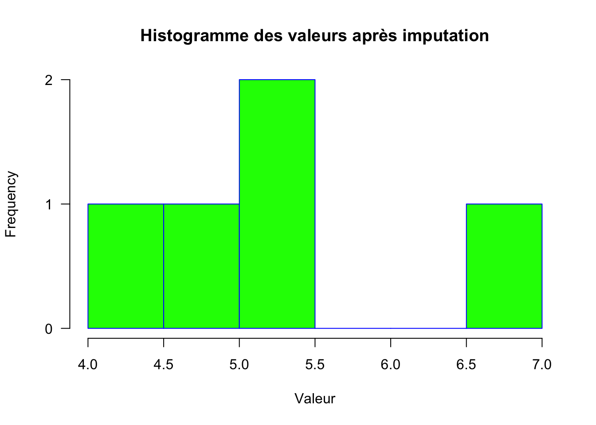

Sure, please provide the chapter you'd like me to translate.
## # (APPENDICE) Appendice {-}

# Glossaire {#Glossary}

ACHILLES
: Un rapport de caractérisation à l’échelle de la base de données.

ARACHNE
: La plateforme OHDSI en cours de développement pour permettre l'orchestration et l'exécution d'études en réseau fédéré.

ATLAS
: Une application web installée sur les sites participants pour soutenir la conception et l'exécution d'analyses observationnelles permettant de générer des preuves du monde réel à partir de données cliniques de niveau patient.

Biais
: La valeur attendue de l'erreur (la différence entre la valeur réelle et la valeur estimée).

Booléen
: Variable qui n’a que deux valeurs (vrai ou faux).

Site de soins
: Une unité institutionnelle (physique ou organisationnelle) identifiée de manière unique où la prestation de soins de santé est pratiquée (bureau, salle, hôpital, clinique, etc.).

Cas-témoins
: Un type de conception d’étude rétrospective pour l'estimation des effets au niveau de la population. Les études cas-témoins associent des "cas" avec le résultat cible à des "témoins" sans le résultat cible. Ensuite, elles regardent en arrière dans le temps et comparent les chances d'exposition chez les cas et les témoins.

Effet causal
: Ce à quoi l'estimation au niveau de la population s'intéresse. Une définition assimile un "effet causal" à la moyenne des "effets causaux à l'unité" dans une population cible. L'effet causal à l'unité est le contraste entre le résultat si un individu avait été exposé et le résultat si cet individu n'avait pas été exposé (ou avait été exposé à A contre B).

Caractérisation
: Étude descriptive d'une cohorte ou de l'ensemble de la base de données. Voir le Chapitre \@ref(Characterization).

Données de réclamations
: Données générées dans le but de facturer une compagnie d'assurance maladie.

Essai clinique
: Étude clinique interventionnelle.

Cohorte
: Un ensemble de personnes qui satisfont à un ou plusieurs critères d'inclusion pendant une durée de temps. Voir le Chapitre \@ref(Cohorts).

Concept
: Un terme (avec un code) défini dans une terminologie médicale (par exemple, SNOMED CT). Voir le Chapitre \@ref(StandardizedVocabularies).

Ensemble de concepts
: Un ensemble de concepts est une expression représentant une liste de concepts qui peut être utilisée comme un composant réutilisable dans diverses analyses. Voir le Chapitre \@ref(Cohorts).

Modèle de Données Commun (CDM)
: Une convention pour représenter des données de soins de santé qui permet la portabilité de l'analyse (la même analyse non modifiée peut être exécutée sur plusieurs ensembles de données). Voir le Chapitre \@ref(CommonDataModel).

Efficacité comparative
: Une comparaison des effets de deux expositions différentes sur un résultat d'intérêt. Voir le Chapitre \@ref(PopulationLevelEstimation).

Condition
: Un diagnostic, un signe ou un symptôme, soit observé par un prestataire soit signalé par le patient.

Facteur de confusion
: Distorsion (inexactitude) de la mesure d'association estimée qui survient lorsque l'exposition principale d'intérêt est mélangée avec un autre facteur associé au résultat.

Covariable
: Élément de données (par exemple, poids) utilisé dans un modèle statistique comme variable indépendante.

Qualité des données
: L'état de complétude, validité, cohérence, actualité et exactitude qui rend les données appropriées pour une utilisation spécifique.

Dispositif
: Un objet physique étranger ou un instrument utilisé à des fins diagnostiques ou thérapeutiques au-delà de l'action chimique. Les dispositifs incluent des objets implantables (par exemple, des stimulateurs cardiaques, des stents, des articulations artificielles), des équipements et fournitures médicaux (par exemple, des bandages, des béquilles, des seringues), d'autres instruments utilisés dans des procédures médicales (par exemple, des sutures, des défibrillateurs) et des matériaux utilisés dans les soins cliniques (par exemple, des adhésifs, des matériaux corporels, des matériaux dentaires, des matériaux chirurgicaux).

Médicament
: Une substance biochimique formulée de manière à avoir, lorsqu'elle est administrée à une personne, un certain effet physiologique. Les médicaments incluent les médicaments sur ordonnance et en vente libre, les vaccins et les thérapies biologiques à grande échelle. Les dispositifs radiologiques ingérés ou appliqués localement ne comptent pas comme des médicaments.

Domaine
: Un domaine définit l'ensemble des concepts autorisés pour les champs standardisés dans les tables CDM. Par exemple, le domaine "Condition" contient des concepts décrivant une condition d'un patient, et ces concepts ne peuvent être stockés que dans le champ condition_concept_id des tables CONDITION_OCCURRENCE et CONDITION_ERA.

Dossier de santé électronique (EHR)
: Données générées au cours des soins et enregistrées dans un système électronique.

Épidémiologie
: L'étude de la distribution, des motifs et des déterminants des conditions de santé et des maladies dans des populations définies.

Médecine fondée sur les preuves
: L'utilisation de preuves empiriques et scientifiques pour prendre des décisions concernant les soins des patients individuels.

ETL (Extract-Transform-Load)
: Le processus de conversion de données d'un format à un autre, par exemple d'un format source au CDM. Voir le Chapitre \@ref(ExtractTransformLoad).

Appariement
: De nombreuses approches d'estimation des effets au niveau de la population tentent d'identifier les effets causaux des expositions en comparant les résultats chez les patients exposés à ces mêmes résultats chez les patients non exposés (ou exposés à A versus B). Puisque ces deux groupes de patients peuvent différer de manière autre que l'exposition, "l'appariement" tente de créer des groupes de patients exposés et non exposés qui soient aussi semblables que possible au moins en ce qui concerne les caractéristiques des patients mesurées.

Mesure
: Une valeur structurée (numérique ou catégorielle) obtenue par un examen ou des tests systématiques et standardisés d'une personne ou de l'échantillon d'une personne.

Erreur de mesure
: Se produit lorsqu'une mesure enregistrée (par exemple, pression artérielle, âge du patient, durée du traitement) diffère de la mesure véritable correspondante.

Métadonnées
: Un ensemble de données qui décrit et donne des informations sur d'autres données et inclut des métadonnées descriptives, des métadonnées structurelles, des métadonnées administratives, des métadonnées de référence et des métadonnées statistiques.

Bibliothèque de méthodes
: Un ensemble de packages R développés par la communauté OHDSI pour réaliser des études observationnelles.

Mauvaise spécification du modèle
: De nombreuses méthodes OHDSI emploient des modèles statistiques tels que la régression des hasards proportionnels ou les forêts aléatoires. Dans la mesure où le mécanisme qui a généré les données dévie du modèle supposé, le modèle est "mal spécifié".

Contrôle négatif
: Un couple exposition-résultat où l'on croit que l'exposition ne cause pas ou ne prévient pas le résultat. Peut être utilisé pour évaluer si les méthodes d'estimation des effets produisent des résultats conformes à la vérité. Voir le Chapitre \@ref(MethodValidity).

Observation
: Un fait clinique concernant une personne obtenu dans le contexte d'un examen, d'un questionnement ou d'une procédure.

Période d'observation
: La période pendant laquelle une personne est à risque d'avoir des événements cliniques enregistrés dans les systèmes sources, même si aucun événement n'est effectivement enregistré (patient en bonne santé sans interactions avec les soins de santé).

Étude observationnelle
: Une étude où le chercheur n'a pas de contrôle sur l'intervention.

OHDSI SQL
: Un dialecte SQL pouvant être automatiquement traduit en divers autres dialectes SQL à l'aide du package R SqlRender. OHDSI SQL est principalement un sous-ensemble de SQL Server SQL, mais permet une paramétrisation supplémentaire. Voir le Chapitre \@ref(SqlAndR).

Science ouverte
: Le mouvement visant à rendre la recherche scientifique (y compris les publications, les données, les échantillons physiques et les logiciels) et sa diffusion accessibles à tous les niveaux d'une société en quête de connaissances, amateur ou professionnel. Voir le Chapitre \@ref(OpenScience).

Résultat
: Une observation qui constitue un point focal pour une analyse. Par exemple, un modèle prédictif de niveau patient pourrait prédire le résultat "AVC". Ou une estimation de niveau population pourrait estimer l'effet causal d'un médicament sur le résultat "mal de tête".

Prédiction de niveau patient
: Développement et application de modèles prédictifs pour produire des probabilités spécifiques aux patients concernant la survenue de certains résultats futurs en fonction des caractéristiques initiales.

Phénotype
: Une description des caractéristiques physiques. Ceci inclut les caractéristiques visibles comme votre poids et la couleur de vos cheveux, mais aussi votre état de santé global, vos antécédents médicaux et votre comportement.

Estimation de niveau population
: Une étude des effets causaux. Estime une taille d'effet moyenne (au niveau population).

Contrôle positif
: Un couple exposition-résultat où l'on croit que l'exposition cause ou prévient le résultat. Peut être utilisé pour évaluer si les méthodes d'estimation des effets produisent des résultats conformes à la vérité. Voir le Chapitre \@ref(MethodValidity).

Procédure
: Activité ou processus ordonné par, ou effectué par, un prestataire de soins de santé sur le patient à des fins diagnostiques ou thérapeutiques.

Score de propension (PS)
: une métrique unique utilisée dans l'estimation des effets au niveau de la population pour équilibrer les populations afin de mimer la randomisation entre deux groupes de traitement dans une étude observationnelle. Le PS représente la probabilité qu'un patient reçoive un traitement d'intérêt en fonction d'un ensemble de covariables de base observées. Il est le plus souvent calculé à l'aide d'un modèle de régression logistique où le résultat binaire est réglé sur un pour le groupe recevant le traitement cible d'intérêt et sur zéro pour le traitement comparateur. Voir le Chapitre \@ref(PopulationLevelEstimation).

Protocole
: Un document lisible par l'homme qui spécifie complètement la conception d'une étude.

Rabbit-in-a-Hat
: Un outil logiciel interactif pour aider à définir l’ETL du format source au CDM. Utilise le profil de la base de données généré par White Rabbit comme entrée. Voir le chapitre 7.

Biais de sélection
: Un biais qui survient lorsque l'ensemble des patients dans vos données dévie des patients de la population de manière à fausser les analyses statistiques.

Conceptions autocontrôlées
: Conceptions d'études qui comparent les résultats pendant différentes expositions au sein du même patient.

Analyse de sensibilité
: Une variante de l'analyse principale utilisée dans une étude pour évaluer l'impact d'un choix d'analyse sur lequel existe une incertitude.

SNOMED
: Une collection systématiquement organisée et traitable par ordinateur de termes médicaux fournissant des codes, des termes, des synonymes et des définitions utilisés dans la documentation clinique et les rapports.

Diagnostics d'étude
: Ensemble d'étapes analytiques dont l'objectif est de déterminer si une approche analytique donnée peut être utilisée (est valide) pour répondre à une question de recherche donnée. Voir le Chapitre \@ref(MethodValidity).

Paquet d'étude
: Un programme exécutable par ordinateur qui exécute entièrement l'étude. Voir le Chapitre \@ref(SoftwareValidity).

Code source
: Un code utilisé dans une base de données source. Par exemple, un code ICD-10.

Concept standard
: Un concept désigné comme un concept valide et autorisé à apparaître dans le CDM.

THEMIS
: Groupe de travail OHDSI qui aborde le format cible des données qui est d'une granulosité et d'un détail plus élevés par rapport aux spécifications du modèle CDM.

Visite
: La période pendant laquelle une personne reçoit continuellement des services médicaux d'un ou plusieurs prestataires dans un site de soins dans un cadre donné au sein du système de soins de santé.

Vocabulaire
: Une liste de mots et souvent de phrases, généralement classés par ordre alphabétique et définis ou traduits. Voir le Chapitre \@ref(StandardizedVocabularies).

White Rabbit
: Un outil logiciel pour profiler une base de données avant de définir l’ETL vers le CDM. Voir le Chapitre \@ref(ExtractTransformLoad).
## Valeurs manquantes

Les données manquantes (souvent représentées par `NA` dans R) sont omniprésentes dans les jeux de données d'analyse observationnelle en médecine (comme la température d'un patient non mesurée, ou l'indication de la dose d'un médicament manquant dans les prescriptions). Les valeurs manquantes peuvent biaiser les résultats d'analyses si elles ne sont pas traitées correctement. R vous offre plusieurs outils pour gérer les données manquantes. Cet insert sur les données manquantes présente certains de ces outils et les principes généraux relatifs à la manipulation de telles données.

### Détection des valeurs manquantes

Il est crucial de savoir si votre jeu de données contient des valeurs manquantes avant de commencer à les traiter. 

En R, la fonction `is.na()` peut être utilisée pour détecter les `NA`.


``` r
# Créer un vecteur avec des valeurs manquantes
x <- c(2, 3, NA, 5, NA, 8)

# Utiliser is.na pour détecter les NA
is.na(x)
```

```
## [1] FALSE FALSE  TRUE FALSE  TRUE FALSE
```

### Gestion des valeurs manquantes

Une fois que vous avez identifié des valeurs manquantes, vous devez décider comment les traiter. Voici quelques méthodes courantes pour gérer les valeurs manquantes :

1. **Suppression des valeurs manquantes**: Parfois, il est plus simple de supprimer les observations qui contiennent des valeurs manquantes.


``` r
# Supprimer les valeurs manquantes avec na.omit
x_clean <- na.omit(x)
x_clean
```

```
## [1] 2 3 5 8
## attr(,"na.action")
## [1] 3 5
## attr(,"class")
## [1] "omit"
```

2. **Imputation des valeurs manquantes**: Imputation signifie remplacer les valeurs manquantes par des valeurs estimées. Une méthode courante est d'utiliser la moyenne des autres valeurs.


``` r
# Imputer les valeurs manquantes par la moyenne
x[is.na(x)] <- mean(x, na.rm = TRUE)
x
```

```
## [1] 2.0 3.0 4.5 5.0 4.5 8.0
```

3. **Utilisation de modèles avancés**: Il existe des techniques plus sophistiquées pour imputer les valeurs manquantes, comme l'imputation multiple par équations en chaîne (MICE).

### Cas pratique

Examinons un petit exemple de jeu de données pour illustrer la détection et la gestion des valeurs manquantes.


``` r
# Jeu de données exemple
data <- data.frame(id = 1:5,
                   value = c(4, NA, 7, NA, 5))

# Détecter les valeurs manquantes
is.na(data$value)
```

```
## [1] FALSE  TRUE FALSE  TRUE FALSE
```

``` r
# Supprimer les valeurs manquantes
data_clean <- na.omit(data)
data_clean
```

```
##   id value
## 1  1     4
## 3  3     7
## 5  5     5
```

``` r
# Imputer les valeurs manquantes
data$value[is.na(data$value)] <- mean(data$value, na.rm = TRUE)
data
```

```
##   id    value
## 1  1 4.000000
## 2  2 5.333333
## 3  3 7.000000
## 4  4 5.333333
## 5  5 5.000000
```

### Conclusion 

La gestion des valeurs manquantes est une étape importante de l'analyse de données. Il est crucial d'examiner les valeurs manquantes et de considérer des stratégies appropriées pour les traiter.


``` r
# Histogramme après imputation
hist(data$value,
     main="Histogramme des valeurs après imputation",
     xlab="Valeur",
     border="blue",
     col="green",
     las=1,
     breaks=5)
```

<div class="figure">

<p class="caption">(\#fig:unnamed-chunk-5)Histogramme après imputation des valeurs manquantes</p>
</div>
