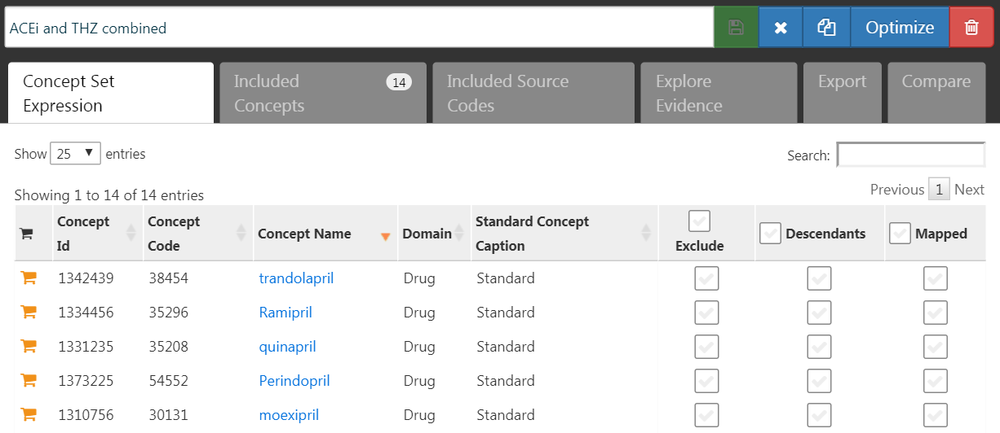

# Validité de la Méthode {#MethodValidity}

\index{validité de la méthode}

*Responsable du chapitre : Martijn Schuemie*

Lorsque nous considérons la validité de la méthode, nous visons à répondre à la question

> Cette méthode est-elle valide pour répondre à cette question ?

La "méthode" inclut non seulement le plan d'étude, mais également les données et la mise en œuvre du plan. La validité de la méthode est donc une sorte de fourre-tout ; il n'est souvent pas possible d'observer une bonne validité de la méthode sans une bonne qualité des données, une validité clinique et une validité logicielle. Ces aspects de la qualité des preuves devraient déjà avoir été traités séparément avant que nous ne considérions la validité de la méthode.

L'activité principale lors de l'établissement de la validité de la méthode est d'évaluer si les hypothèses importantes de l'analyse ont été respectées. Par exemple, nous supposons que l'appariement par score de propension rend deux populations comparables, mais nous devons évaluer si c'est le cas. Lorsque cela est possible, des tests empiriques doivent être effectués pour vérifier ces hypothèses. Nous pouvons par exemple générer des diagnostics pour montrer que nos deux populations sont effectivement comparables sur un large éventail de caractéristiques après appariement. Au sein d'OHDSI, nous avons développé de nombreux diagnostics standardisés qui doivent être générés et évalués chaque fois qu'une analyse est effectuée.

Dans ce chapitre, nous nous concentrerons sur la validité des méthodes utilisées dans les estimations au niveau de la population. Nous commencerons par souligner brièvement certains diagnostics spécifiques aux plans d'étude, puis discuterons des diagnostics applicables à la plupart, sinon à toutes, les études d'estimation au niveau de la population. Ensuite, une description étape par étape de l'exécution de ces diagnostics à l'aide des outils OHDSI sera fournie. Nous clôturerons ce chapitre par un sujet avancé, en examinant le Benchmark des Méthodes OHDSI et son application à la Bibliothèque des Méthodes OHDSI.

## Diagnostics Spécifiques au Plan d'Étude

\index{diagnostics d'études}

Pour chaque plan d'étude, il existe des diagnostics spécifiques à ce plan. Beaucoup de ces diagnostics sont implémentés et facilement accessibles dans les packages R de la [Bibliothèque des Méthodes OHDSI](https://ohdsi.github.io/MethodsLibrary/). Par exemple, la Section \@ref(studyOutputs) répertorie une large gamme de diagnostics générés par le package [CohortMethod](https://ohdsi.github.io/CohortMethod/), incluant :

- **Distribution des scores de propension** pour évaluer la comparabilité initiale des cohortes.
- **Modèle de propension** pour identifier les variables potentielles qui devraient être exclues du modèle.
- **Équilibre des covariables** pour évaluer si l'ajustement par score de propension a rendu les cohortes comparables (comme mesuré à travers les covariables de base).
- **Attrition** pour observer combien de sujets ont été exclus à différentes étapes de l'analyse, ce qui peut informer sur la généralisabilité des résultats aux cohortes initiales d'intérêt.
- **Puissance** pour évaluer si suffisamment de données sont disponibles pour répondre à la question.
- **Courbe de Kaplan-Meier** pour évaluer le temps typique avant l'apparition, et si l'hypothèse de proportionnalité sous-jacente aux modèles de Cox est respectée.

D'autres plans d'étude nécessitent des diagnostics différents pour tester les différentes hypothèses de ces plans. Par exemple, pour le plan d'étude des séries de cas auto-contrôlés (SCCS), nous pouvons vérifier l'hypothèse nécessaire que la fin de l'observation est indépendante du résultat. Cette hypothèse est souvent violée dans le cas d'événements graves, potentiellement mortels, tels que l'infarctus du myocarde. Nous pouvons évaluer si l'hypothèse tient en générant le graphique montré à la Figure \@ref(fig:timeToObsEnd), qui montre des histogrammes du temps jusqu'à la fin de la période d'observation pour ceux qui sont censurés et ceux qui ne le sont pas. Dans nos données, nous considérons que ceux dont la période d'observation se termine à la date de fin de capture des données (la date à laquelle l'observation s'est arrêtée pour l'ensemble de la base de données, par exemple la date d'extraction ou la date de fin de l'étude) ne sont pas censurés, et tous les autres sont censurés. Dans la Figure \@ref(fig:timeToObsEnd), nous ne voyons que des différences mineures entre les deux distributions, ce qui suggère que notre hypothèse tient.

```{r timeToObsEnd, fig.cap="Time to observation end for those that are censored, and those that are uncensored.", echo=FALSE, out.width='100%', fig.align='center'}
knitr::include_graphics("images/MethodValidity/timeToObsEnd.png")
```

## Diagnostics for All Estimation

En plus des diagnostics spécifiques à la conception, il existe également plusieurs diagnostics applicables à toutes les méthodes d’estimation des effets causals. Beaucoup de ces diagnostics reposent sur l’utilisation d’hypothèses de contrôle, des questions de recherche dont la réponse est déjà connue. En utilisant des hypothèses de contrôle, nous pouvons alors évaluer si notre conception produit des résultats conformes à la vérité. Les contrôles peuvent être divisés en contrôles négatifs et en contrôles positifs.

### Contrôles Négatifs {#NegativeControls}

\index{contrôles négatifs}

Les contrôles négatifs sont des paires d’exposition-résultat où l’on pense qu’aucun effet causal n’existe, y compris les contrôles négatifs ou « points de terminaison de falsification » [@prased_2013] qui ont été recommandés comme moyen de détecter la confusion, [@lipsitch_2010] le biais de sélection et l’erreur de mesure. [@arnold_2016] Par exemple, dans une étude [@zaadstra_2008] enquêtant sur la relation entre les maladies infantiles et la sclérose en plaques (SEP) à un stade ultérieur, les auteurs incluent trois contrôles négatifs qui ne sont pas censés causer la SEP : fracture du bras, commotion cérébrale et amygdalectomie. Deux de ces trois contrôles produisent des associations statistiquement significatives avec la SEP, suggérant que l’étude peut être biaisée.

Nous devrions sélectionner des contrôles négatifs comparables à notre hypothèse d'intérêt, ce qui signifie que nous choisissons généralement des paires exposition-résultat ayant soit la même exposition que l’hypothèse d’intérêt (les « contrôles de résultat »), soit le même résultat (« contrôles d'exposition »). Nos contrôles négatifs devraient en outre répondre aux critères suivants :

- L'exposition **ne doit pas causer** le résultat. Une manière de penser la causalité est de penser au contrefactuel : le résultat pourrait-il être causé (ou empêché) si un patient n’était pas exposé, comparé à s’il avait été exposé ? Parfois, c'est clair, par exemple, les inhibiteurs de l'ECA sont connus pour causer l'angio-œdème. D’autres fois, c'est beaucoup moins évident. Par exemple, un médicament qui peut causer l’hypertension peut donc indirectement provoquer des maladies cardiovasculaires qui en découlent.
- L'exposition ne doit également **pas prévenir ou traiter** le résultat. C'est simplement une autre relation causale qui devrait être absente si nous voulons croire que la taille de l'effet vrai (par exemple, le rapport de risques) est de 1.
- Le contrôle négatif doit **exister dans les données**, idéalement en nombre suffisant. Nous essayons de réaliser cela en priorisant les contrôles négatifs candidats en fonction de leur prévalence.
- Les contrôles négatifs devraient idéalement être **indépendants**. Par exemple, nous devrions éviter d’avoir des contrôles négatifs qui sont soit des ancêtres les uns des autres (par ex. « ongle incarné » et « ongle incarné du pied »), soit des frères et sœurs (par ex., « fracture du fémur gauche » et « fracture du fémur droit »).
- Les contrôles négatifs devraient idéalement avoir **un certain potentiel de biais**. Par exemple, le dernier chiffre du numéro de sécurité sociale de quelqu'un est en gros un nombre aléatoire et il est peu probable qu'il montre de la confusion. Il ne devrait donc pas être utilisé comme contrôle négatif.

Certaines personnes soutiennent que les contrôles négatifs devraient également avoir la même structure de confusion que la paire exposition-résultat d’intérêt. [@lipsitch_2010] Cependant, nous pensons que cette structure de confusion est inconnue ; les relations entre les variables trouvées dans la réalité sont souvent bien plus complexes que ce que les gens imaginent. Aussi, même si la structure du facteur de confusion était connue, il est peu probable qu’il existe un contrôle négatif ayant cette même structure de confusion tout en manquant de l’effet causal direct. Pour cette raison, dans OHDSI, nous nous reposons sur un grand nombre de contrôles négatifs, en supposant qu’un tel ensemble représente de nombreux types de biais différents, y compris ceux présents dans l’hypothèse d’intérêt.

L'absence de relation causale entre une exposition et un résultat est rarement documentée. Au lieu de cela, nous faisons souvent l’hypothèse qu’un manque de preuves d’une relation implique l’absence de relation. Cette hypothèse est plus susceptible de tenir si l’exposition et le résultat ont tous deux été étudiés de manière extensive, de sorte qu’une relation aurait pu être détectée. Par exemple, l’absence de preuves pour un médicament complètement nouveau implique probablement un manque de connaissances, et non pas l’absence de relation. Avec ce principe en tête, nous avons développé une procédure semi-automatisée de sélection des contrôles négatifs. [@voss_2016] En résumé, des informations provenant de la littérature, des étiquettes de produits et de rapports spontanés sont automatiquement extraites et synthétisées pour produire une liste de candidats contrôles négatifs. Cette liste doit ensuite faire l’objet d’un examen manuel, non seulement pour vérifier que l’extraction automatique était précise, mais aussi pour imposer des critères supplémentaires tels que la plausibilité biologique.

### Contrôles Positifs {#PositiveControls}

\index{contrôles positifs}

Pour comprendre le comportement d'une méthode lorsque le risque relatif vrai est inférieur ou supérieur à un, il est nécessaire d'utiliser des contrôles positifs où l’on croit que le nul n'est pas vrai. Malheureusement, les contrôles positifs réels pour la recherche observationnelle tendent à poser problème pour trois raisons. Premièrement, dans la plupart des contextes de recherche, par exemple lorsqu’on compare l’effet de deux traitements, il y a une rareté de contrôles positifs pertinents pour ce contexte spécifique. Deuxièmement, même si des contrôles positifs sont disponibles, la magnitude de la taille de l’effet peut ne pas être connue avec une grande précision et dépend souvent de la population dans laquelle on la mesure. Troisièmement, lorsque les traitements sont largement connus pour causer un résultat particulier, cela façonne le comportement des médecins prescrivant le traitement, par exemple en prenant des mesures pour atténuer le risque de résultats indésirables, rendant ainsi les contrôles positifs inutiles comme moyen d’évaluation. [@noren_2014]

\index{contrôles positifs!synthèse}

Dans OHDSI, nous utilisons donc des contrôles positifs synthétiques, [@schuemie_2018] créés en modifiant un contrôle négatif par injection d’occurrences supplémentaires simulées du résultat pendant le temps à risque de l’exposition. Par exemple, supposons que, pendant l’exposition aux inhibiteurs de l’ECA, n occurrences de notre résultat de contrôle négatif « ongle incarné » aient été observées. Si nous ajoutons maintenant n occurrences supplémentaires simulées pendant l’exposition, nous avons doublé le risque. Étant donné qu’il s’agissait d’un contrôle négatif, le risque relatif par rapport au contrefactuel était de un, mais après injection, il devient de deux.

Un point important est la préservation de la confusion. Les contrôles négatifs peuvent montrer une forte confusion, mais si nous injectons des résultats supplémentaires au hasard, ces nouveaux résultats ne seront pas confondus, et nous risquons donc d'être optimistes dans notre évaluation de notre capacité à gérer la confusion pour les contrôles positifs. Pour préserver la confusion, nous voulons que les nouveaux résultats montrent des associations similaires aux covariables spécifiques aux sujets de base comme les résultats originaux. Pour ce faire, pour chaque résultat, nous entraînons un modèle pour prédire le taux de survie par rapport au résultat pendant l'exposition en utilisant des covariables capturées avant l'exposition. Ces covariables incluent les données démographiques ainsi que tous les diagnostics enregistrés, les expositions aux médicaments, les mesures et les procédures médicales. Une régression de Poisson régularisée L1 [@suchard_2013] utilisant une validation croisée à 10 volets pour sélectionner l'hyperparamètre de régularisation ajuste le modèle de prédiction. Nous utilisons ensuite les taux prédits pour échantillonner des résultats simulés pendant l'exposition afin d'augmenter la taille de l’effet vrai à l’amplitude désirée. Le contrôle positif résultant contient donc des résultats réels et simulés.

La Figure \@ref(fig:posControlSynth) illustre ce processus. Notez que bien que cette procédure simule plusieurs sources importantes de biais, elle ne capture pas toutes. Par exemple, certains effets de l’erreur de mesure ne sont pas présents. Les contrôles positifs synthétiques impliquent une valeur prédictive positive et une sensibilité constantes, ce qui peut ne pas être vrai dans la réalité.

```{r posControlSynth, fig.cap="Synthèse de contrôles positifs à partir de contrôles négatifs.", echo=FALSE, out.width='90%', fig.align='center'}
knitr::include_graphics("images/MethodValidity/posControlSynth.png")
```

Bien que nous fassions référence à une seule « taille de l’effet » vraie pour chaque contrôle, différentes méthodes estiment des statistiques différentes de l’effet du traitement. Pour les contrôles négatifs, où nous croyons qu’aucun effet causal n’existe, toutes ces statistiques, y compris le risque relatif, le rapport de hasard, le rapport des cotes, le rapport de taux d’incidence, à la fois conditionnel et marginal, ainsi que l’effet moyen du traitement chez les traités (ATT) et l’effet moyen général du traitement (ATE) seront identiques à 1. Notre processus de création de contrôles positifs synthétise des résultats avec un rapport de taux d’incidence constant au fil du temps et entre les patients, utilisant un modèle conditionné sur le patient où ce ratio est maintenu constant, jusqu’à ce que l’effet marginal soit atteint. La taille de l'effet vrai est donc garantie comme le rapport marginal de taux d'incidence chez les traités. Sous l'hypothèse que notre modèle de résultat utilisé pendant la synthèse est correct, cela vaut également pour la taille de l’effet conditionnel et l’ATE. Comme tous les résultats sont rares, les rapports de cotes sont identiques au risque relatif.

### Évaluation Empirique {#metrics}

\index{évaluation empirique}

En nous basant sur les estimations d’une méthode particulière pour les contrôles négatifs et positifs, nous pouvons ensuite comprendre les caractéristiques opérationnelles en calculant une série de métriques, par exemple :

*	**Area Under the receiver operator Curve (AUC)** : la capacité de discrimination entre les contrôles positifs et négatifs.
*	**Couverture** : la fréquence à laquelle la taille de l’effet vrai se situe dans l’intervalle de confiance à 95%.
*	**Précision moyenne** : la précision est calculée comme $1/(erreur\ standard)^2$, une précision plus élevée signifie des intervalles de confiance plus étroits. Nous utilisons la moyenne géométrique pour tenir compte de la distribution asymétrique de la précision.
*	**Erreur quadratique moyenne (MSE)** : Erreur quadratique moyenne entre le logarithme de l'estimation ponctuelle de la taille de l’effet et le logarithme de la taille de l’effet vrai.
*	**Erreur de type 1** : Pour les contrôles négatifs, à quelle fréquence le nul a été rejeté (à $\alpha = 0.05$). Cela équivaut au taux de faux positifs et à $1 - la spécificité$.
*	**Erreur de type 2** : Pour les contrôles positifs, à quelle fréquence le nul n’a pas été rejeté (à $\alpha = 0.05$). Cela équivaut au taux de faux négatifs et à $1 - la sensibilité$.
*	**Non-estimable** : Pour combien de contrôles la méthode n'a-t-elle pas pu produire une estimation ? Il peut y avoir diverses raisons pour lesquelles une estimation ne peut pas être produite, par exemple, parce qu’il n’y avait plus de sujets restants après appariement des scores de propension, ou parce qu’il ne restait plus de sujets ayant le résultat.

En fonction de notre cas d’utilisation, nous pouvons évaluer si ces caractéristiques opérationnelles conviennent à notre objectif. Par exemple, si nous souhaitons effectuer une détection de signal, nous pouvons nous intéresser aux erreurs de type 1 et de type 2, ou si nous sommes disposés à modifier notre seuil de $\alpha$, nous pouvons plutôt examiner l’AUC.

### Calibration des valeurs de p

\index{calibration des valeurs de p} \index{calibration empirique}

Souvent, l'erreur de type 1 (à $\alpha = 0.05$) est supérieure à 5%. En d’autres termes, il nous arrive souvent de rejeter l’hypothèse nulle plus de 5 % du temps alors que l’hypothèse nulle est en fait vraie. La raison en est que la valeur de p ne reflète que l’erreur aléatoire, l’erreur due à une taille d’échantillon limitée. Elle ne reflète pas l’erreur systématique, par exemple l’erreur due à la confondant. OHDSI a développé un processus de calibration des valeurs de p pour restaurer l’erreur de type 1 à nominal. [@schuemie_2014] Nous dérivons une distribution nulle empirique des estimations d’effets réels pour les contrôles négatifs. Ces estimations de contrôle négatif nous donnent une indication de ce à quoi nous pouvons nous attendre lorsque l’hypothèse nulle est vraie, et nous les utilisons pour estimer une distribution nulle empirique.

Formellement, nous ajustons une distribution de probabilité gaussienne aux estimations, en tenant compte de l’erreur d’échantillonnage de chaque estimation. Soit $\hat{\theta}_i$ l’estimation de l’effet logarithmique estimé (risque relatif, rapport des cotes ou rapport de taux d’incidence) de la i-ième paire contrôle négative de médicament-résultat, et soit $\hat{\tau}_i$ l’erreur standard estimée correspondante, $i=1,\ldots,n$. Soit $\theta_i$ la taille de l’effet vraie logarithmique (supposée 0 pour les contrôles négatifs), et soit $\beta_i$ le biais vrai (mais inconnu) associé à la paire $i$, c'est-à-dire la différence entre le logarithme de la taille de l’effet vrai et le logarithme de l’estimation que l’étude aurait retournée pour le contrôle $i$ si elle avait été infiniment grande. Comme dans le calcul classique de la valeur de p, nous supposons que $\hat{\theta}_i$ est distribué normalement avec une moyenne de $\theta_i + \beta_i$ et un écart-type $\hat{\tau}_i^2$. Notez que dans le calcul traditionnel de la valeur de p, $\beta_i$ est toujours supposé égal à zéro, mais que nous supposons que les $\beta_i$ proviennent d’une distribution normale de moyenne $\mu$ et de variance $\sigma^2$. Cela représente la distribution nulle (biaisée). Nous estimons $\mu$ et $\sigma^2$ par maximum de vraisemblance. En résumé, nous supposons ce qui suit :

$$\beta_i \sim N(\mu,\sigma^2) \text{  et  } \hat{\theta}_i \sim N(\theta_i + \beta_i, \tau_i^2)$$

où $N(a,b)$ désigne une distribution gaussienne avec moyenne $a$ et variance $b$, et nous estimons $\mu$ et $\sigma^2$ en maximisant la vraisemblance suivante :

$$L(\mu, \sigma | \theta, \tau) \propto \prod_{i=1}^{n}\int p(\hat{\theta}_i|\beta_i, \theta_i, \hat{\tau}_i)p(\beta_i|\mu, \sigma) \text{d}\beta_i$$

donnant les estimations de maximum de vraisemblance $\hat{\mu}$ et $\hat{\sigma}$. Nous calculons une valeur de p calibrée utilisant la distribution nulle empirique. Soit $\hat{\theta}_{n+1}$ le logarithme de l’estimation de l’effet d’une nouvelle paire de médicament-résultat, et soit $\hat{\tau}_{n+1}$ l’erreur standard estimée correspondante. D'après les hypothèses ci-dessus et en supposant que $\beta_{n+1}$ provient de la même distribution nulle, nous avons ce qui suit :

$$\hat{\theta}_{n+1} \sim N(\hat{\mu}, \hat{\sigma} + \hat{\tau}_{n+1})$$

Lorsque $\hat{\theta}_{n+1}$ est inférieure à $\hat{\mu}$, la valeur de p calibrée unilatérale pour la nouvelle paire est alors

$$\phi\left(\frac{\theta_{n+1} - \hat{\mu}}{\sqrt{\hat{\sigma}^2 +\hat{\tau}_{n+1}^2}}\right)$$

où $\phi(\cdot)$ désigne la fonction de répartition cumulative de la distribution normale standard. Lorsque $\hat{\theta}_{n+1}$ est supérieure à $\hat{\mu}$, la valeur de p calibrée unilatérale est alors

$$1-\phi\left(\frac{\theta_{n+1} - \hat{\mu}}{\sqrt{\hat{\sigma}^2 + \hat{\tau}_{n+1}^2}}\right)$$

### Calibration des Intervalles de Confiance {#ConfidenceIntervalCalibration}

\index{calibration des intervalles de confiance}

De même, nous observons généralement que la couverture de l’intervalle de confiance à 95% est inférieure à 95% : la taille de l’effet vraie est à l’intérieur de l’intervalle de confiance à 95% moins de 95% du temps. Pour la calibration des intervalles de confiance [@schuemie_2018] nous étendons le cadre de calibration des valeurs de p en utilisant également nos contrôles positifs. Typiquement, mais pas nécessairement, l’intervalle de confiance calibré est plus large que l’intervalle de confiance nominal, reflétant les problèmes non pris en compte dans la procédure standard (tels que les biais de confusion non mesurés, de sélection et d'erreur de mesure) mais pris en compte dans la calibration.

Formellement, nous supposons que $\beta_i$, le biais associé à la paire $i$, provient à nouveau d’une distribution gaussienne, mais cette fois
## Validation des méthodes en pratique

Ici, nous nous appuyons sur l'exemple du chapitre \@ref(PopulationLevelEstimation), où nous examinons l'effet des inhibiteurs de l'ECA (ACEi) sur le risque d'angio-œdème et d'infarctus aigu du myocarde (IAM), comparé aux diurétiques de type thiazides et diurétiques de type thiazide (THZ). Dans ce chapitre, nous explorons déjà de nombreux diagnostics spécifiques à la conception que nous avons utilisée, la méthode de cohorte. Ici, nous appliquons des diagnostics supplémentaires qui pourraient également avoir été appliqués si d'autres conceptions avaient été utilisées. Si l'étude est mise en œuvre en utilisant ATLAS comme décrit dans la section \@ref(PleAtlas), ces diagnostics sont disponibles dans l'application Shiny incluse dans le package R généré par ATLAS. Si l'étude est mise en œuvre en utilisant R, comme décrit dans la section \@ref(pleR), alors les fonctions R disponibles dans les différents packages doivent être utilisées, comme décrit dans les sections suivantes.

### Sélection des contrôles négatifs

Nous devons sélectionner des contrôles négatifs, des paires exposition-résultat pour lesquelles aucun effet causal n'est supposé exister. Pour une estimation comparative des effets comme notre étude d'exemple, nous sélectionnons des résultats de contrôle négatif qui ne sont censés être causés ni par l'exposition cible ni par l'exposition comparateur. Nous voulons suffisamment de contrôles négatifs pour nous assurer que nous avons un mélange diversifié de biais représenté dans les contrôles et également pour permettre une calibration empirique. En règle générale, nous cherchons généralement à avoir 50-100 de ces contrôles négatifs. Nous pourrions trouver ces contrôles entièrement manuellement, mais heureusement ATLAS fournit des fonctionnalités pour aider à la sélection des contrôles négatifs en utilisant des données de la littérature, des étiquettes de produits et des rapports spontanés.

Pour générer une liste de candidats de contrôles négatifs, nous devons d'abord créer un ensemble de concepts contenant toutes les expositions d'intérêt. Dans ce cas, nous sélectionnons tous les ingrédients dans les classes ACEi et THZ, comme indiqué dans la Figure \@ref(fig:exposuresConceptSet).

```{r exposuresConceptSet, fig.cap="A concept set containing the concepts defining the target and comparator exposures.",echo=FALSE, out.width='100%', fig.align='center'}

```

Ensuite, nous allons à l'onglet "Explore Evidence" et cliquons sur le bouton . La génération de l'aperçu des preuves prendra quelques minutes, après quoi vous pouvez cliquer sur le bouton . Cela ouvrira la liste des résultats comme montré dans la Figure \@ref(fig:candidateNcs).

```{r candidateNcs, fig.cap="Candidate control outcomes with an overview of the evidence found in literature, product labels, and spontaneous reports.",echo=FALSE, out.width='100%', fig.align='center'}
knitr::include_graphics("images/MethodValidity/candidateNcs.png")
```

Cette liste montre les concepts de condition, ainsi qu'un aperçu des preuves liant la condition à l'une des expositions que nous avons définies. Par exemple, nous voyons le nombre de publications qui lient les expositions aux résultats trouvés dans PubMed en utilisant diverses stratégies, le nombre d'étiquettes de produits de nos expositions d'intérêt qui listent la condition comme un effet indésirable possible, et le nombre de rapports spontanés. Par défaut, la liste est triée pour afficher d'abord les contrôles négatifs candidats. Elle est ensuite triée par l'“Ordre de tri”, qui représente la prévalence de la condition dans une collection de bases de données observationnelles. Plus l'Ordre de tri est élevé, plus la prévalence est élevée. Bien que la prévalence dans ces bases de données ne corresponde pas nécessairement à la prévalence dans la base de données où nous souhaitons exécuter l'étude, il est probable que cela constitue une bonne approximation.

L'étape suivante consiste à revoir manuellement la liste des candidats, généralement en commençant par le haut, donc avec la condition la plus courante, et en descendant jusqu'à ce que nous soyons satisfaits du nombre obtenu. Une façon typique de le faire est d'exporter la liste vers un fichier CSV (valeurs séparées par des virgules) et de faire examiner ces contrôles par des cliniciens, en tenant compte des critères mentionnés dans la section \@ref(NegativeControls).

Pour notre étude d'exemple, nous sélectionnons les 76 contrôles négatifs listés en annexe \@ref(AceiThzNsc).

### Inclusion des contrôles

Une fois que nous avons défini notre ensemble de contrôles négatifs, nous devons les inclure dans notre étude. Nous devons d'abord définir une logique pour transformer nos concepts de condition de contrôle négatif en cohortes de résultats. La section \@ref(evaluationSettings) explique comment ATLAS permet la création de telles cohortes en fonction de quelques choix que l'utilisateur doit faire. Souvent, nous choisissons simplement de créer une cohorte basée sur toute occurrence d'un concept de contrôle négatif ou de ses descendants. Si l'étude est mise en œuvre en R, alors le SQL (Structured Query Language) peut être utilisé pour construire les cohortes de contrôle négatif. Le chapitre \@ref(SqlAndR) décrit comment les cohortes peuvent être créées à l'aide de SQL et R. Nous laissons cela comme un exercice pour le lecteur afin d'écrire le SQL et R appropriés.

Les outils OHDSI fournissent également des fonctionnalités pour générer et inclure automatiquement des contrôles positifs dérivés des contrôles négatifs. Cette fonctionnalité se trouve dans la section Evaluation Settings de ATLAS décrite dans la section \@ref(evaluationSettings), et est implémentée dans la fonction `synthesizePositiveControls` du package [MethodEvaluation](https://ohdsi.github.io/MethodEvaluation/). Ici, nous générons trois contrôles positifs pour chaque contrôle négatif, avec des tailles d'effet réelles de 1.5, 2 et 4, en utilisant un modèle de survie :

```{r tidy=FALSE,eval=FALSE}
library(MethodEvaluation)
# Create a data frame with all negative control exposure-
# outcome pairs, using only the target exposure (ACEi = 1).
eoPairs <- data.frame(exposureId = 1,
                      outcomeId = ncs)

pcs <- synthesizePositiveControls(
  connectionDetails = connectionDetails,
  cdmDatabaseSchema = cdmDbSchema,
  exposureDatabaseSchema = cohortDbSchema,
  exposureTable = cohortTable,
  outcomeDatabaseSchema = cohortDbSchema,
  outcomeTable = cohortTable,
  outputDatabaseSchema = cohortDbSchema,
  outputTable = cohortTable,
  createOutputTable = FALSE,
  modelType = "survival",
  firstExposureOnly = TRUE,
  firstOutcomeOnly = TRUE,
  removePeopleWithPriorOutcomes = TRUE,
  washoutPeriod = 365,
  riskWindowStart = 1,
  riskWindowEnd = 0,
  endAnchor = "cohort end",
  exposureOutcomePairs = eoPairs,
  effectSizes = c(1.5, 2, 4),
  cdmVersion = cdmVersion,
  workFolder = file.path(outputFolder, "pcSynthesis"))

```

Notez que nous devons imiter les paramètres de la période à risque utilisés dans la conception de notre étude d'estimation. La fonction `synthesizePositiveControls` extraira des informations sur les expositions et les résultats de contrôle négatif, ajustera des modèles de résultats par paire exposition-résultat et synthétisera des résultats. Les cohortes de résultats de contrôle positif seront ajoutées à la table de cohortes spécifiée par `cohortDbSchema` et `cohortTable`. Le cadre de données résultant `pcs` contient les informations sur les contrôles positifs synthétisés.

Ensuite, nous devons exécuter la même étude utilisée pour estimer l'effet d'intérêt afin d'estimer également les effets pour les contrôles négatifs et positifs. Définir l'ensemble des contrôles négatifs dans la boîte de dialogue des comparaisons dans ATLAS indique à ATLAS de calculer les estimations pour ces contrôles. De même, spécifier que des contrôles positifs soient générés dans les paramètres d'évaluation les inclut dans notre analyse. En R, les contrôles négatifs et positifs doivent être traités comme n'importe quel autre résultat. Tous les packages d'estimation dans la [OHDSI Methods Library](https://ohdsi.github.io/MethodsLibrary/) permettent aisément l'estimation de nombreux effets de manière efficace.

### Performance empirique

La Figure \@ref(fig:controls) montre les tailles d'effet estimées pour les contrôles négatifs et positifs inclus dans notre étude d'exemple, stratifiées par taille d'effet réelle. Ce graphique est inclus dans l'application Shiny qui accompagne le package R de l'étude généré par ATLAS, et peut être généré en utilisant la fonction `plotControls` du package [MethodEvaluation](https://ohdsi.github.io/MethodEvaluation/). Notez que le nombre de contrôles est souvent inférieur à celui qui a été défini car il n'y avait pas assez de données pour soit produire une estimation soit créer un contrôle positif.

```{r controls, fig.cap="Estimates for the negative (true hazard ratio = 1) and positive controls (true hazard ratio > 1). Each dot represents a control. Estimates below the dashed line have a confidence interval that doesn't include the true effect size.",echo=FALSE, out.width='100%', fig.align='center'}
knitr::include_graphics("images/MethodValidity/controls.png")
```

Sur la base de ces estimations, nous pouvons calculer les métriques montrées dans le Tableau \@ref(tab:exampleMetrics) en utilisant la fonction `computeMetrics` du package [MethodEvaluation](https://ohdsi.github.io/MethodEvaluation/).

Table: (\#tab:exampleMetrics) Métriques de performance des méthodes dérivées des estimations des contrôles négatifs et positifs.

| Métrique       | Valeur |
|:-------------- | -----:|
| AUC            |  0.96 |
| Couverture     |  0.97 |
| Précision moyenne | 19.33 |
| MSE            |  2.08 |
| Erreur de type 1  |  0.00 |
| Erreur de type 2  |  0.18 |
| Non-estimable  |  0.08 |

Nous voyons que la couverture et l'erreur de type 1 sont très proches de leurs valeurs nominales de 95% et 5%, respectivement, et que l'AUC est très élevée. Ce n'est certainement pas toujours le cas.

Notez que bien que dans la Figure \@ref(fig:controls) tous les intervalles de confiance n'incluent pas un lorsque le ratio de risque réel est un, l'erreur de type 1 dans le Tableau \@ref(tab:exampleMetrics) est de 0%. Il s'agit d'une situation exceptionnelle, causée par le fait que les intervalles de confidence dans le package [Cyclops](https://ohdsi.github.io/Cyclops/) sont estimés en utilisant le profilage de la vraisemblance, ce qui est plus précis que les méthodes traditionnelles mais peut entraîner des intervalles de confiance asymétriques. La valeur p, en revanche, est calculée en supposant des intervalles de confiance symétriques, et c'est ce qui a été utilisé pour calculer l'erreur de type 1.

### Calibration de la valeur P

Nous pouvons utiliser les estimations pour nos contrôles négatifs pour calibrer nos valeurs p. Cela se fait automatiquement dans l'application Shiny et peut être fait manuellement en R. En supposant que nous avons créé l'objet résumé `summ` comme décrit dans la section \@ref(MultipleAnalyses), nous pouvons tracer le graphique d'effet de calibration empirique :

```{r tidy=FALSE,eval=FALSE}
# Estimates for negative controls (ncs) and outcomes of interest (ois):
ncEstimates <- summ[summ$outcomeId %in% ncs, ]
oiEstimates <- summ[summ$outcomeId %in% ois, ]

library(EmpiricalCalibration)
plotCalibrationEffect(logRrNegatives = ncEstimates$logRr,
                      seLogRrNegatives = ncEstimates$seLogRr,
                      logRrPositives = oiEstimates$logRr,
                      seLogRrPositives = oiEstimates$seLogRr,
                      showCis = TRUE)
```
```{r pValueCal, fig.cap="P-value calibration: estimates below the dashed line have a conventional p < 0.05. Estimates in the shaded area have calibrated p < 0.05. The narrow band around the edge of the shaded area denotes the 95% credible interval. Dots indicate negative controls. Diamonds indicate outcomes of interest.",echo=FALSE, out.width='70%', fig.align='center'}
knitr::include_graphics("images/MethodValidity/pValueCal.png")
```

Dans la Figure \@ref(fig:pValueCal), nous voyons que la zone ombrée se chevauche presque exactement avec la zone délimitée par les lignes pointillées, indiquant que peu ou pas de biais a été observé pour les contrôles négatifs. L'un des résultats d'intérêt (IAM) se trouve au-dessus de la ligne pointillée et de la zone ombrée, indiquant que nous ne pouvons pas rejeter l'hypothèse nulle selon les valeurs p non calibrées et calibrées. L'autre résultat (angio-œdème) se démarque clairement du contrôle négatif et se situe bien dans la zone où les valeurs p non calibrées et calibrées sont inférieures à 0.05.

Nous pouvons calculer les valeurs p calibrées :

```{r tidy=FALSE,eval=FALSE}
null <- fitNull(logRr = ncEstimates$logRr,
                seLogRr = ncEstimates$seLogRr)
calibrateP(null,
           logRr= oiEstimates$logRr,
           seLogRr = oiEstimates$seLogRr)
```
```{r echo=FALSE,message=FALSE,eval=TRUE}
cat("[1] 1.604351e-06 7.159506e-01")
```

Et contraster celles-ci avec les valeurs p non calibrées :

```{r tidy=FALSE,eval=FALSE}
oiEstimates$p
```
```{r echo=FALSE,message=FALSE,eval=TRUE}
cat("[1] [1] 1.483652e-06 7.052822e-01")
```

Comme prévu, car peu ou pas de biais a été observé, les valeurs p non calibrées et calibrées sont très similaires.

### Calibration des intervalles de confiance

De même, nous pouvons utiliser les estimations pour nos contrôles négatifs et positifs pour calibrer les intervalles de confiance. L'application Shiny rapporte automatiquement les intervalles de confiance calibrés. En R, nous pouvons calibrer les intervalles en utilisant les fonctions `fitSystematicErrorModel` et `calibrateConfidenceInterval` dans le package [EmpiricalCalibration](https://ohdsi.github.io/EmpiricalCalibration/), comme décrit en détail dans le [vignette](https://ohdsi.github.io/EmpiricalCalibration/articles/EmpiricalCiCalibrationVignette.html) "Calibration empirique des intervalles de confiance".

Avant la calibration, les ratios de risque estimés (intervalle de confiance à 95%) sont 4.32 (2.45 - 8.08) et 1.13 (0.59 - 2.18), pour l'angio-œdème et l'IAM respectivement. Les ratios de risque calibrés sont 4.75 (2.52 - 9.04) et 1.15 (0.58 - 2.30).

### Hétérogénéité entre les bases de données

Tout comme nous avons exécuté notre analyse sur une base de données, dans ce cas la base de données IBM MarketScan Medicaid (MDCD), nous pouvons également exécuter le même code d'analyse sur d'autres bases de données conformes au modèle de données commun (CDM). La Figure \@ref(fig:forest) montre le diagramme en forêt et les estimations méta-analytiques (en supposant des effets aléatoires) [@dersimonian_1986] sur un total de cinq bases de données pour le résultat de l'angio-œdème. Cette figure a été générée à l'aide de la fonction `plotMetaAnalysisForest` du package [EvidenceSynthesis](https://ohdsi.github.io/EvidenceSynthesis/).

```{r forest, fig.cap="Effect size estimates and 95% confidence intervals (CI) from five different databases and a meta-analytic estimate when comparing ACE inhibitors to thiazides and thiazide-like diuretics for the risk of angioedema.",echo=FALSE, out.width='90%', fig.align='center'}

```

Bien que tous les intervalles de confiance soient au-dessus de un, suggérant un accord sur le fait qu'il y a un effet, le $I^2$ suggère une hétérogénéité entre les bases de données. Cependant, si nous calculons le $I^2$ en utilisant les intervalles de confiance calibrés comme montré dans la Figure \@ref(fig:forestCal), nous voyons que cette hétérogénéité peut être expliquée par le biais mesuré dans chaque base de données à travers les contrôles négatifs et positifs. La calibration empirique semble correctement prendre en compte ce biais.

```{r forestCal, fig.cap="Calibrated Effect size estimates and 95% confidence intervals (CI) from five different databases and a meta-analytic estimate for the hazard ratio of angioedema when comparing ACE inhibitors to thiazides and thiazide-like diuretics.",echo=FALSE, out.width='90%', fig.align='center'}
knitr::include_graphics("images/MethodValidity/forestCal.png")
```

### Analyses de sensibilité

L'un des choix de conception dans notre analyse était d'utiliser un appariement à ratio variable sur le score de propension. Cependant, nous aurions aussi pu utiliser une stratification sur le score de propension. Parce que nous sommes incertains à propos de ce choix, nous pouvons décider d'utiliser les deux. Le tableau \@ref(tab:sensAnalysis) montre les estimations de taille d'effet pour l'IAM et l'angio-œdème, à la fois calibrées et non calibrées, en utilisant l'appariement à ratio variable et la stratification (avec 10 strates
## Évaluation des Méthodes OHDSI

\index{Évaluation des Méthodes OHDSI}

Bien qu'il soit recommandé d'évaluer empiriquement la performance d'une méthode dans le contexte où elle est appliquée, en utilisant des contrôles négatifs et positifs similaires aux paires expositions-résultats d'intérêt (par exemple en utilisant la même exposition ou le même résultat) et sur la base de données utilisée dans l'étude, il est également utile d'évaluer en général la performance d'une méthode. C'est pourquoi le Référentiel d'Évaluation des Méthodes OHDSI a été développé. Ce référentiel évalue la performance en utilisant une large gamme de questions de contrôle, y compris celles avec des résultats chroniques ou aigus, et des expositions à long terme ou à court terme. Les résultats de ce référentiel peuvent aider à démontrer l'utilité globale d'une méthode, et peuvent être utilisés pour former une croyance a priori sur la performance d'une méthode lorsqu'une évaluation empirique contextuelle n'est pas (encore) disponible. Le référentiel se compose de 200 contrôles négatifs soigneusement sélectionnés qui peuvent être stratifiés en huit catégories, avec les contrôles de chaque catégorie partageant soit la même exposition, soit le même résultat. À partir de ces 200 contrôles négatifs, 600 contrôles positifs synthétiques sont dérivés comme décrit dans la Section \@ref(PositiveControls). Pour évaluer une méthode, elle doit être utilisée pour produire des estimations de la taille de l'effet pour tous les contrôles, après quoi les mesures décrites dans la Section \@ref(metrics) peuvent être calculées. Le référentiel est disponible publiquement et peut être déployé comme décrit dans le [vignette Running the OHDSI Methods Benchmark](https://ohdsi.github.io/MethodEvaluation/articles/OhdsiMethodsBenchmark.html) dans le package [MethodEvaluation](https://ohdsi.github.io/MethodEvaluation/).

Nous avons testé toutes les méthodes de la bibliothèque des méthodes OHDSI avec ce référentiel, avec divers choix d'analyse par méthode. Par exemple, la méthode de cohorte a été évaluée en utilisant la mise en correspondance par score de propension, la stratification et la pondération. Cette expérience a été exécutée sur quatre grandes bases de données de soins de santé observationnels. Les résultats, consultables dans une application Shiny en ligne[^methodEvalViewerUrl], montrent que bien que plusieurs méthodes montrent une AUC élevée (la capacité à distinguer les contrôles positifs des contrôles négatifs), la plupart des méthodes dans la plupart des contextes démontrent un taux d'erreur de type 1 élevé et une couverture faible de l'intervalle de confiance à 95%, comme le montre la Figure \@ref(fig:methodEval).

[^methodEvalViewerUrl]: http://data.ohdsi.org/MethodEvalViewer/

```{r methodEval, fig.cap="Couverture de l'intervalle de confiance à 95\\% pour les méthodes de la bibliothèque des méthodes. Chaque point représente la performance d'un ensemble spécifique de choix d'analyse. La ligne en pointillés indique la performance nominale (couverture de 95\\%). SCCS = Séries de Cas Auto-Contrôlées, GI = Gastrointestinal, IBD = maladie inflammatoire de l'intestin.", echo=FALSE, out.width='100%', fig.align='center', fig.pos='h'}
knitr::include_graphics("images/MethodValidity/methodEval.png")
```

Cela souligne la nécessité d'une évaluation et d'une calibration empiriques : si aucune évaluation empirique n'est réalisée, ce qui est vrai pour presque toutes les études observationnelles publiées, nous devons supposer une croyance a priori informée par les résultats de la Figure \@ref(fig:methodEval), et conclure qu'il est probable que la taille réelle de l'effet ne soit pas contenue dans l'intervalle de confiance à 95% !

Notre évaluation des conceptions dans la bibliothèque des méthodes montre également que la calibration empirique rétablit l'erreur de type 1 et la couverture à leurs valeurs nominales, bien que souvent au prix d'une augmentation de l'erreur de type 2 et d'une diminution de la précision.


## Résumé

```{block2, type='rmdsummary'}
- La validité d'une méthode dépend de la satisfaction des hypothèses sous-jacentes de la méthode.

- Dans la mesure du possible, ces hypothèses devraient être testées empiriquement à l'aide de diagnostics d'étude.

- Des hypothèses de contrôle, des questions dont la réponse est connue, devraient être utilisées pour évaluer si un design d'étude spécifique produit des réponses conformes à la vérité.

- Souvent, les p-values et les intervalles de confiance ne démontrent pas des caractéristiques nominales, mesurées à l'aide d'hypothèses de contrôle.

- Ces caractéristiques peuvent souvent être rétablies à des valeurs nominales en utilisant la calibration empirique.

- Les diagnostics d'étude peuvent être utilisés pour guider les choix de conception analytique et adapter le protocole, tant que le chercheur reste aveugle à l'effet d'intérêt pour éviter le p-hacking.

```
