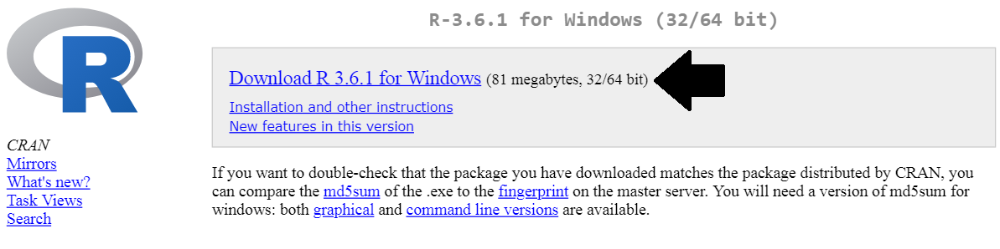
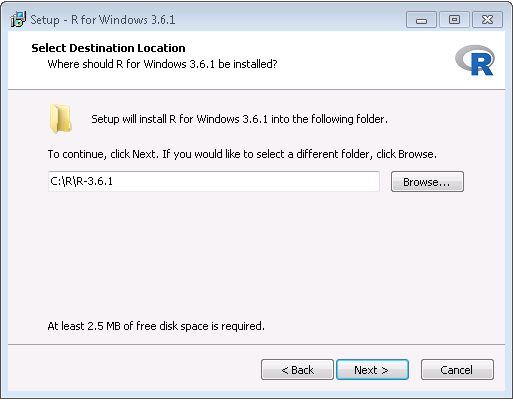
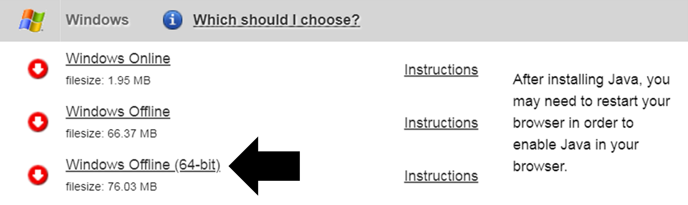
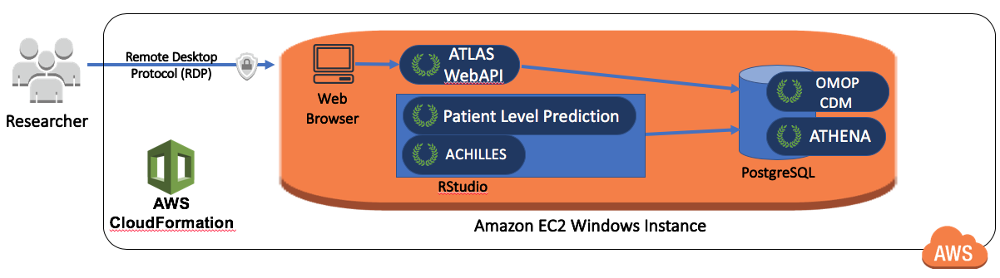
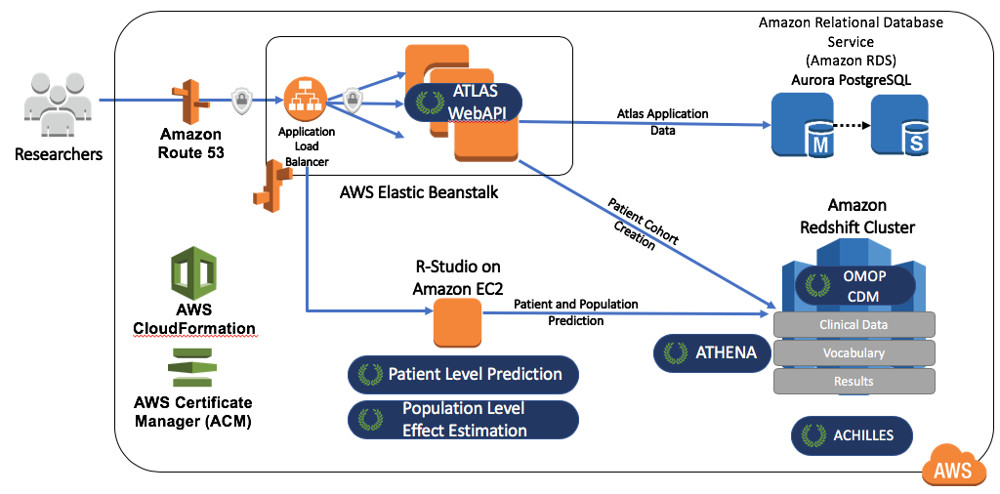

# Outils d'analyse d'OHDSI {#OhdsiAnalyticsTools}

*Chefs de chapitre : Martijn Schuemie & Frank DeFalco*

OHDSI offre une large gamme d'outils open source pour soutenir divers cas d'utilisation analytiques sur des données observationnelles au niveau des patients. Ce que ces outils ont en commun, c'est qu'ils peuvent tous interagir avec une ou plusieurs bases de données utilisant le Modèle de Données Commun (CDM). De plus, ces outils standardisent l'analyse pour divers cas d'utilisation ; plutôt que de repartir de zéro, une analyse peut être mise en œuvre en remplissant des modèles standard. Cela rend l'analyse plus facile et améliore également la reproductibilité et la transparence. Par exemple, il semble y avoir un nombre quasi infini de façons de calculer un taux d'incidence, mais ceux-ci peuvent être spécifiés dans les outils d'OHDSI avec quelques choix, et toute personne faisant ces mêmes choix calculera les taux d'incidence de la même manière.

Dans ce chapitre, nous décrivons d'abord les différentes manières dont nous pouvons choisir de mettre en œuvre une analyse, et les stratégies que l'analyse peut employer. Nous passons ensuite en revue les différents outils d'OHDSI et leur correspondance aux divers cas d'utilisation.


## Implémentation de l'analyse {#analysisImplementation}

La figure \@ref(fig:implementations) montre les différentes manières dont nous pouvons choisir de mettre en œuvre une étude sur une base de données utilisant le CDM. \index{implémentation de l'analyse}

```{r implementations, fig.cap="Différentes manières d'implémenter une analyse sur les données du CDM.",echo=FALSE, out.width='90%', fig.align='center'}
knitr::include_graphics("images/OhdsiAnalyticsTools/implementations.png")
```

Il y a principalement trois approches pour mettre en œuvre une étude. La première est d'écrire du code personnalisé qui n'utilise aucun des outils proposés par OHDSI. On pourrait écrire une analyse de novo en R, SAS, ou tout autre langage. Cela offre une flexibilité maximale et peut en fait être la seule option si l'analyse spécifique n'est prise en charge par aucun de nos outils. Cependant, cette voie nécessite beaucoup de compétences techniques, de temps et d'efforts, et à mesure que l'analyse devient plus complexe, il devient plus difficile d'éviter les erreurs dans le code.

La deuxième approche consiste à développer l'analyse en R, en utilisant les packages de la [Bibliothèque de Méthodes d'OHDSI](https://ohdsi.github.io/MethodsLibrary/). Au minimum, on pourrait utiliser les packages [SqlRender](https://ohdsi.github.io/SqlRender/) et [DatabaseConnector](https://ohdsi.github.io/DatabaseConnector/) décrits de manière plus détaillée dans le chapitre \@ref(SqlAndR) qui permettent d'exécuter le même code sur différentes plateformes de bases de données, telles que PostgreSQL, SQL Server et Oracle. D'autres packages comme [CohortMethod](https://ohdsi.github.io/CohortMethod/) et [PatientLevelPrediction](https://ohdsi.github.io/PatientLevelPrediction/) offrent des fonctions R pour des analyses avancées contre le CDM qui peuvent être appelées dans son propre code. Cela nécessite toujours beaucoup d'expertise technique, mais en réutilisant les composants validés de la Bibliothèque de Méthodes, nous pouvons être plus efficaces et moins enclins à l'erreur qu'en utilisant un code totalement personnalisé.

La troisième approche repose sur notre plateforme d'analyse interactive [ATLAS](https://github.com/OHDSI/Atlas/wiki), un outil web qui permet aux non-programmeurs d'effectuer une large gamme d'analyses de manière efficace. ATLAS utilise les Bibliothèques de Méthodes mais fournit une interface graphique simple pour concevoir des analyses et, dans de nombreux cas, générer le code R nécessaire pour exécuter l'analyse. Cependant, ATLAS ne prend pas en charge toutes les options disponibles dans la Bibliothèque de Méthodes. Bien qu'il soit attendu que la majorité des études puissent être réalisées grâce à ATLAS, certaines études peuvent nécessiter la flexibilité offerte par la deuxième approche.

ATLAS et la Bibliothèque de Méthodes ne sont pas indépendants. Certaines des analyses plus complexes pouvant être invoquées dans ATLAS sont exécutées via des appels aux packages de la Bibliothèque de Méthodes. De même, les cohortes utilisées dans la Bibliothèque de Méthodes sont souvent conçues dans ATLAS.


## Stratégies d'analyse

Outre la stratégie utilisée pour mettre en œuvre notre analyse contre le CDM, par exemple via du codage personnalisé ou l'utilisation de code analytique standard dans la Bibliothèque de Méthodes, il existe également plusieurs stratégies pour utiliser ces techniques analytiques afin de générer des preuves. La figure \@ref(fig:strategies) met en évidence trois stratégies employées chez OHDSI.

```{r strategies, fig.cap='Stratégies pour générer des preuves pour des questions (cliniques).',echo=FALSE, out.width='90%', fig.align='center'}
knitr::include_graphics("images/OhdsiAnalyticsTools/strategies.png")
```

La première stratégie considère chaque analyse comme une étude individuelle unique. L'analyse doit être pré-spécifiée dans un protocole, mise en œuvre sous forme de code, exécutée sur les données, après quoi le résultat peut être compilé et interprété. Pour chaque question, toutes les étapes doivent être répétées. Un exemple de cette analyse est l'étude d'OHDSI sur le risque d'angioedème associé au lévétiracétam par rapport à la phénytoïne. [@duke_2017] Ici, un protocole a d'abord été rédigé, le code d'analyse utilisant la Bibliothèque de Méthodes d'OHDSI a été développé et exécuté à travers le réseau OHDSI, et les résultats ont été compilés et disséminés dans une publication de journal.

La deuxième stratégie consiste à développer une application permettant aux utilisateurs de répondre à une classe spécifique de questions en temps réel ou quasi réel. Une fois l'application développée, les utilisateurs peuvent définir des requêtes de manière interactive, les soumettre et visualiser les résultats. Un exemple de cette stratégie est l'outil de définition et de génération de cohortes dans ATLAS. Cet outil permet aux utilisateurs de spécifier des définitions de cohortes de complexité variable et d'exécuter la définition contre une base de données pour voir combien de personnes répondent aux divers critères d'inclusion et d'exclusion.

La troisième stratégie se concentre de manière similaire sur une classe de questions, mais tente ensuite de générer de manière exhaustive toutes les preuves pour les questions de cette classe. Les utilisateurs peuvent ensuite explorer les preuves selon leurs besoins via une variété d'interfaces. Un exemple est l'étude d'OHDSI sur les effets des traitements contre la dépression. [@schuemie_2018b] Dans cette étude, tous les traitements contre la dépression sont comparés pour un large ensemble de résultats d'intérêt sur quatre grandes bases de données observationnelles. L'ensemble complet des résultats, incluant 17 718 rapports de risque calibrés empiriquement ainsi que des diagnostics d'études étendus, est disponible dans une application web interactive.[^systematicEvidenceUrl]

[^systematicEvidenceUrl]: http://data.ohdsi.org/SystematicEvidence/

## ATLAS

ATLAS est un outil web gratuit et accessible au public, développé par la communauté OHDSI, qui facilite la conception et l'exécution d'analyses sur des données d'observation standardisées au niveau des patients au format CDM. ATLAS est déployé en tant qu'application web en combinaison avec l'OHDSI WebAPI et est généralement hébergé sur Apache Tomcat. La réalisation d'analyses en temps réel nécessite l'accès aux données patient au format CDM et est donc généralement installée derrière le pare-feu d'une organisation. Cependant, il existe également un ATLAS public[^atlasUrl], et bien que cette instance d'ATLAS n'ait accès qu'à quelques petits jeux de données simulés, elle peut encore être utilisée à de nombreuses fins, y compris les tests et la formation. Il est même possible de définir entièrement une étude d'estimation d'effet ou de prédiction à l'aide de l'instance publique d'ATLAS, et de générer automatiquement le code R pour exécuter l'étude. Ce code peut ensuite être exécuté dans n'importe quel environnement disposant d'un CDM disponible sans avoir besoin d'installer ATLAS et l'API Web. \index{ATLAS}

[^atlasUrl]: http://www.ohdsi.org/web/atlas


```{r atlas, fig.cap="ATLAS user interface.",echo=FALSE, out.width='100%', fig.align='center'}
knitr::include_graphics("images/OhdsiAnalyticsTools/atlas.png")
```

Une capture d'écran d'ATLAS est fournie à la Figure \@ref(fig:atlas). À gauche se trouve une barre de navigation montrant les différentes fonctions fournies par ATLAS :

Sources de données \index{ATLAS!Sources de données} \index{Achilles|see {ATLAS!data sources}}
: Les sources de données offrent la possibilité de passer en revue les comptes-rendus descriptifs et standardisés pour chacune des sources de données que vous avez configurées dans votre plateforme Atlas. Cette fonctionnalité utilise la stratégie d'analyse en grande échelle : tous les descriptifs ont été pré-calculés. Les sources de données sont discutées dans le Chapitre \@ref(Characterization).

Recherche de vocabulaire \index{ATLAS!recherche de vocabulaire}
: Atlas permet de rechercher et d'explorer le vocabulaire standardisé OMOP pour comprendre quels concepts existent dans ces vocabulaires et comment appliquer ces concepts dans votre analyse standardisée de vos sources de données. Cette fonctionnalité est discutée dans le Chapitre \@ref(StandardizedVocabularies).

Ensembles de concepts \index{ATLAS!ensembles de concepts}
: Les ensembles de concepts fournissent la capacité de créer des collections d'expressions logiques pouvant être utilisées pour identifier un ensemble de concepts à utiliser tout au long de vos analyses standardisées. Les ensembles de concepts offrent plus de sophistication qu'une simple liste de codes ou de valeurs. Un ensemble de concepts est composé de plusieurs concepts du vocabulaire standardisé en combinaison avec des indicateurs logiques permettant à un utilisateur de préciser qu'il souhaite inclure ou exclure des concepts liés à la hiérarchie du vocabulaire. La recherche dans le vocabulaire, l'identification de l'ensemble des concepts et la spécification de la logique à utiliser pour résoudre un ensemble de concepts offrent un mécanisme puissant pour définir le langage médical souvent obscur utilisé dans les plans d'analyse. Ces ensembles de concepts peuvent être enregistrés dans ATLAS et être ensuite utilisés tout au long de votre analyse comme partie des définitions de cohortes ou des spécifications d'analyse.

Définitions de cohortes \index{ATLAS!définitions de cohortes}
: Les définitions de cohortes permettent de construire un ensemble de personnes qui satisfont un ou plusieurs critères pendant une durée de temps et ces cohortes peuvent ensuite servir de base aux saisies pour l'ensemble de vos analyses ultérieures. Cette fonctionnalité est discutée dans le Chapitre \@ref(Cohorts).

Caractérisations \index{ATLAS!caractérisations des cohortes}
: Les caractérisations sont une capacité analytique qui vous permet d'examiner une ou plusieurs cohortes que vous avez définies et de résumer les caractéristiques de ces populations de patients. Cette fonctionnalité utilise la stratégie de requête en temps réel et est discutée dans le Chapitre \@ref(Characterization).

Trajectoires de cohortes \index{ATLAS!trajectoires de cohortes}
: Les trajectoires de cohortes sont un outil analytique qui vous permet d'examiner la séquence des événements cliniques qui se produisent au sein d'une ou plusieurs populations. Cette fonctionnalité utilise la stratégie de requête en temps réel et est discutée dans le Chapitre \@ref(Characterization).

Taux d'incidence \index{ATLAS!taux d'incidence}
: Les taux d'incidence sont un outil qui vous permet d'estimer l'incidence de résultats au sein des populations cibles d'intérêt. Cette fonctionnalité utilise la stratégie de requête en temps réel et est discutée dans le Chapitre \@ref(Characterization).

Profils \index{ATLAS!profils}
: Les profils sont un outil qui vous permet d'explorer les données d'observation longitudinales d'un patient individuel pour résumer ce qui se passe chez un individu donné. Cette fonctionnalité utilise la stratégie de requête en temps réel.

Estimation au niveau de la population \index{ATLAS!estimation au niveau de la population}
: L'estimation est une capacité qui vous permet de définir une étude d'estimation des effets au niveau de la population en utilisant un modèle de cohortes comparatives dans lequel des comparaisons entre une ou plusieurs cohortes cibles et comparateurs peuvent être explorées pour une série de résultats. Cette fonctionnalité peut être dite pour implémenter la stratégie de requête en temps réel, puisque aucune programmation n'est requise, et est discutée dans le Chapitre \@ref(PopulationLevelEstimation).

Prédiction au niveau des patients \index{ATLAS!prédiction au niveau des patients}
: La prédiction est une capacité qui vous permet d'appliquer des algorithmes d'apprentissage automatique pour mener des analyses de prédiction au niveau des patients dans lesquelles vous pouvez prédire un résultat dans n'importe quelle exposition cible donnée. Cette fonctionnalité peut être dite pour implémenter la stratégie de requête en temps réel, puisque aucune programmation n'est requise, et est discutée dans le Chapitre \@ref(PatientLevelPrediction).

Tâches \index{ATLAS!tâches}
: Sélectionnez l'élément de menu Tâches pour explorer l'état des processus en cours d'exécution via le WebAPI. Les tâches sont souvent des processus de longue durée tels que la génération d'une cohorte ou le calcul des rapports de caractérisation de cohorte.

Configuration \index{ATLAS!configuration}
: Sélectionnez l'élément de menu Configuration pour consulter les sources de données qui ont été configurées dans la section de configuration de source.

Retour d'information \index{ATLAS!retour d'information}
: Le lien Retour d'information vous mènera au journal des problèmes d'Atlas afin que vous puissiez enregistrer un nouveau problème ou rechercher parmi les problèmes existants. Si vous avez des idées pour de nouvelles fonctionnalités ou améliorations, c'est également un endroit pour les noter pour la communauté de développement.

### Sécurité

ATLAS et le WebAPI fournissent un modèle de sécurité granulaire pour contrôler l'accès aux fonctionnalités ou aux sources de données au sein de la plateforme globale. Le système de sécurité est construit en utilisant la bibliothèque Apache Shiro. Des informations supplémentaires sur le système de sécurité peuvent être trouvées dans le wiki en ligne sur la sécurité de WebAPI.[^webApiSecurityWikiUrl] \index{ATLAS!sécurité}

[^webApiSecurityWikiUrl]: https://github.com/OHDSI/WebAPI/wiki/Security-Configuration

### Documentation

La documentation pour ATLAS peut être trouvée en ligne dans le wiki du dépôt GitHub d'ATLAS.[^atlasRepoWikiUrl] Ce wiki comprend des informations sur les différentes fonctionnalités de l'application ainsi que des liens vers des tutoriels vidéo en ligne. \index{ATLAS!documentation}

[^atlasRepoWikiUrl]: https://github.com/OHDSI/ATLAS/wiki

### Comment installer

L'installation d'ATLAS se fait en combinaison avec le WebAPI d'OHDSI. Les guides d'installation pour chaque composant sont disponibles en ligne dans le Guide de configuration du dépôt GitHub d'ATLAS[^atlasSetupGuideUrl] et le Guide d'installation du dépôt GitHub de WebAPI.[^webApiInstallationGuideUrl] \index{ATLAS!installation}

[^atlasSetupGuideUrl]: https://github.com/OHDSI/Atlas/wiki/Atlas-Setup-Guide
[^webApiInstallationGuideUrl]: https://github.com/OHDSI/WebAPI/wiki/WebAPI-Installation-Guide

## Bibliothèque de Méthodes

La [Bibliothèque de Méthodes OHDSI](https://ohdsi.github.io/MethodsLibrary/) est la collection de packages R open source présentés dans la Figure \@ref(fig:methodsLibrary). \index{bibliothèque de méthodes}

```{r methodsLibrary, fig.cap="Packages in the OHDSI Methods Library.",echo=FALSE, out.width='100%', fig.align='center'}
knitr::include_graphics("images/OhdsiAnalyticsTools/methodsLibrary.png")
```

Les packages offrent des fonctions R qui, ensemble, peuvent être utilisées pour réaliser une étude observationnelle complète, à partir des données dans le CDM, et aboutissant à des estimations et des statistiques, figures et tableaux de soutien. Les packages interagissent directement avec les données observationnelles dans le CDM, et peuvent être utilisés simplement pour fournir une compatibilité multiplateforme pour des analyses complètement personnalisées comme décrit au Chapitre \@ref(SqlAndR), ou peuvent fournir des analyses standardisées avancées pour la caractérisation de la population (Chapitre \@ref(Characterization)), l'estimation de l'effet au niveau de la population (Chapitre \@ref(PopulationLevelEstimation)), et la prédiction au niveau des patients (Chapitre \@ref(PatientLevelPrediction)). La Bibliothèque de Méthodes soutient les meilleures pratiques pour l'utilisation des données observationnelles et la conception des études observationnelles telles qu'enseignées par des recherches passées et en cours, telles que la transparence, la reproductibilité, ainsi que la mesure des caractéristiques de fonctionnement des méthodes dans un contexte particulier et l'étalonnage empirique des estimations produites par les méthodes.

La Bibliothèque de Méthodes a déjà été utilisée dans de nombreuses études cliniques publiées [@boland_2017; @duke_2017; @ramcharran_2017; @weinstein_2017; @wang_2017; @ryan_2017; @ryan_2018; @vashisht_2018; @yuan_2018; @johnston_2019], ainsi que des études méthodologiques. [@schuemie_2014; @schuemie_2016; @reps2018; @tian_2018; @schuemie_2018; @schuemie_2018b; @reps_2019] La validité des implémentations des méthodes dans la bibliothèque de méthodes est décrite dans le Chapitre \@ref(SoftwareValidity).

### Support pour les Analyses à Grande Échelle

Une caractéristique clé incorporée dans tous les packages est la capacité de réaliser efficacement de nombreuses analyses. Par exemple, lors de la réalisation d'une estimation au niveau de la population, le package CohortMethod permet de calculer des estimations de la taille de l'effet pour de nombreuses expositions et résultats, en utilisant divers paramètres d'analyse, et le package choisira automatiquement le meilleur moyen de calculer tous les ensembles de données intermédiaires et finaux nécessaires. Les étapes qui peuvent être réutilisées, telles que l'extraction des covariables ou l'ajustement d'un modèle de propension utilisé pour une paire cible-comparateur mais de multiples résultats, ne seront exécutées qu'une fois. Lorsque cela est possible, les calculs se feront en parallèle pour maximiser l'utilisation des ressources informatiques.

Cette efficacité informatique permet des analyses à grande échelle, répondant à de nombreuses questions à la fois, et est également essentielle pour inclure des hypothèses de contrôle (par exemple, des contrôles négatifs) pour mesurer les caractéristiques de fonctionnement de nos méthodes et effectuer un étalonnage empirique comme décrit au Chapitre \@ref(MethodValidity). \index{hypothèses de contrôle}

### Support pour les Big Data {#BigDataSupport}

La Bibliothèque de Méthodes est également conçue pour fonctionner sur des bases de données très volumineuses et être capable d'effectuer des calculs impliquant de grandes quantités de données. Cela est réalisé de trois manières :

1. La plupart des manipulations de données sont effectuées sur le serveur de base de données. Une analyse ne nécessite généralement qu'une petite fraction de l'ensemble des données dans la base de données, et la Bibliothèque de Méthodes, via les packages SqlRender et DatabaseConnector, permet d'effectuer des opérations avancées sur le serveur pour prétraiter et extraire les données pertinentes.
2. Les grands objets de données locaux sont stockés de manière économe en mémoire. Pour les données téléchargées sur la machine locale, la Bibliothèque de Méthodes utilise le package [ff](https://cran.r-project.org/web/packages/ff) pour stocker et travailler avec de grands objets de données. Cela nous permet de travailler avec des données bien plus importantes que ce qui tiendrait en mémoire.
3. L'informatique haute performance est appliquée là où c'est nécessaire. Par exemple, le package [Cyclops](https://ohdsi.github.io/Cyclops/) implémente un moteur de régression extrêmement efficace qui est utilisé dans toute la Bibliothèque de Méthodes pour effectuer des régressions à grande échelle (grand nombre de variables, grand nombre d'observations) qui seraient autrement impossibles à ajuster.

### Documentation

R fournit une manière standard de documenter les packages. Chaque package possède un *manuel de package* qui documente chaque fonction et ensemble de données contenu dans le package. Tous les manuels de package sont disponibles en ligne via le site de la Bibliothèque de Méthodes[^methodsLibraryUrl], via les dépôts GitHub des packages, et pour les packages disponibles via CRAN, ils peuvent être trouvés sur CRAN. De plus, depuis R, le manuel de package peut être consulté en utilisant le point d'interrogation. Par exemple, après avoir chargé le package DatabaseConnector, taper la commande `?connect` permet d'accéder à la documentation de la fonction "connect".

[^methodsLibraryUrl]: https://ohdsi.github.io/MethodsLibrary

En plus du manuel de package, de nombreux packages fournissent des *vignettes*. Les vignettes sont des documentations détaillées qui décrivent comment un package peut être utilisé pour réaliser certaines tâches. Par exemple, une vignette[^vignetteUrl] décrit comment réaliser plusieurs analyses de manière efficace en utilisant le package CohortMethod. Les vignettes peuvent également être trouvées via le site de la Bibliothèque de Méthodes, via les dépôts GitHub des packages, et pour les packages disponibles via CRAN, elles peuvent être trouvées sur CRAN. \index{vignette}

[^vignetteUrl]: https://ohdsi.github.io/CohortMethod/articles/MultipleAnalyses.html

### Exigences Systémiques

Deux environnements informatiques sont pertinents lorsqu'on discute des exigences systémiques : Le serveur de base de données et la station de travail analytique. \index{exigences systémiques}

Le serveur de base de données doit contenir les données observationnelles de santé au format CDM. La Bibliothèque de Méthodes prend en charge une large gamme de systèmes de gestion de base de données, y compris les systèmes de base de données traditionnels (PostgreSQL, Microsoft SQL Server et Oracle), les entrepôts de données parallèles (Microsoft APS, IBM Netezza et Amazon Redshift), ainsi que les plateformes de Big Data (Hadoop via Impala et Google BigQuery).

La station de travail analytique est l'endroit où la Bibliothèque de Méthodes est installée et exécutée. Cela peut être une machine locale, comme l'ordinateur portable de quelqu'un, ou un serveur distant exécutant RStudio Server. Dans tous les cas, les exigences sont que R soit installé, de préférence avec RStudio. La Bibliothèque de Méthodes nécessite également que Java soit installé. La station de travail analytique doit également pouvoir se connecter au serveur de base de données, en particulier, tout pare-feu entre eux doit avoir les ports d'accès au serveur de base de données ouverts sur la station de travail. Certaines analyses peuvent être intensives en calcul, donc avoir plusieurs cœurs de traitement et une mémoire ample peut aider à accélérer les analyses. Nous recommandons d'avoir au moins quatre cœurs et 16 gigaoctets de mémoire.

### Comment Installer {#installR}

Voici les étapes pour installer l'environnement requis pour exécuter les packages R d'OHDSI. Quatre éléments doivent être installés : \index{R!installation}

1. **R** est un environnement de calcul statistique. Il est livré avec une interface utilisateur de base qui est principalement une interface en ligne de commande.
2. **Rtools** est un ensemble de programmes requis sous Windows pour construire des packages R à partir du code source.
3. **RStudio** est un IDE (environnement de développement intégré) qui facilite l'utilisation de R. Il inclut un éditeur de code, des outils de débogage et de visualisation. Veuillez l'utiliser pour obtenir une expérience R agréable.
4. **Java** est un environnement de calcul nécessaire pour exécuter certains composants dans les packages R OHDSI, par exemple ceux nécessaires pour se connecter à une base de données.

Ci-dessous, nous décrivons comment installer chacun de ces éléments dans un environnement Windows.

```{block2, type='rmdimportant'}
Sous Windows, R et Java existent en versions 32 bits et 64 bits. Si vous installez R dans les deux architectures, vous **devez** également installer Java dans les deux architectures. Il est recommandé de n'installer que la version 64 bits de R.
```

#### Installer R {-}

1. Aller sur [https://cran.r-project.org/](https://cran.r-project.org/), cliquez sur "Download R for Windows", puis "base", puis cliquez sur le lien de téléchargement indiqué dans la Figure \@ref(fig:downloadR).

```{r downloadR, fig.cap="Downloading R from CRAN.",echo=FALSE, out.width='100%', fig.align='center'}

```

2. Après avoir terminé le téléchargement, exécutez le programme d'installation. Utilisez les options par défaut partout, à deux exceptions près : Premièrement, il est préférable de ne pas installer dans les fichiers de programme. Au lieu de cela, faites simplement de R un sous-dossier de votre lecteur C comme montré dans la Figure \@ref(fig:rDestination). Deuxièmement, pour éviter les problèmes dus aux différences d'architectures entre R et Java, désactivez l'architecture 32 bits comme montré dans la Figure \@ref(fig:no32Bits).

```{r rDestination, fig.cap="Settings the destination folder for R.",echo=FALSE, out.width='80%', fig.align='center'}

```

```{r no32Bits, fig.cap="Disabling the 32-bit version of R.",echo=FALSE, out.width='80%', fig.align='center'}
knitr::include_graphics("images/OhdsiAnalyticsTools/no32Bits.png")
```

Une fois terminé, vous devriez pouvoir sélectionner R depuis votre menu Démarrer.

#### Installer Rtools {-}

1. Aller sur [https://cran.r-project.org/](https://cran.r-project.org/), cliquez sur "Download R for Windows", puis "Rtools", et sélectionnez la toute dernière version de Rtools à télécharger.

2. Après avoir terminé le téléchargement, exécutez le programme d'installation. Sélectionnez les options par défaut partout.

#### Installer RStudio {-}

1. Aller sur [https://www.rstudio.com/](https://www.rstudio.com/), sélectionnez "Download RStudio" (ou le bouton "Download" sous "RStudio"), optez pour la version gratuite, et téléchargez le programme d'installation pour Windows comme montré dans la Figure \@ref(fig:downloadRStudio).

```{r downloadRStudio, fig.cap="Downloading RStudio.",echo=FALSE, out.width='100%', fig.align='center'}
knitr::include_graphics("images/OhdsiAnalyticsTools/downloadRStudio.png")
```

2. Après avoir téléchargé, démarrer le programme d'installation, et utilisez les options par défaut partout.

#### Installer Java {-}

1. Aller sur [https://java.com/en/download/manual.jsp](https://java.com/en/download/manual.jsp), et sélectionnez le programme d'installation Windows 64 bits comme montré dans la Figure \@ref(fig:downloadJava). Si vous avez également installé la version 32 bits de R, vous *devez* également installer l'autre version (32 bits) de Java.

```{r downloadJava, fig.cap="Downloading Java.",echo=FALSE, out.width='100%', fig.align='center'}

```

2. Après avoir téléchargé, exécutez simplement le programme d'installation.

#### Vérifier l'Installation {-}

Vous devriez maintenant être prêt à partir, mais nous devrions vérifier. Démarrez RStudio et tapez

```{r eval=FALSE}
install.packages("SqlRender")
library(SqlRender)
translate("SELECT TOP 10 * FROM person;", "postgresql")
```
```{r echo=FALSE}
library(SqlRender)
translate("SELECT TOP 10 * FROM person;", "postgresql")
```

Cette fonction utilise Java, donc si tout se passe bien, nous savons que R et Java ont été installés correctement !

Un autre test consiste à voir si les packages source peuvent être construits. Exécutez le code R suivant pour installer le package `CohortMethod` à partir du dépôt GitHub d'OHDSI :
```{r eval=FALSE}
install.packages("drat")
drat::addRepo("OHDSI")
install.packages("CohortMethod")
```
## Stratégies de déploiement

Déployer l'ensemble de la pile d'outils OHDSI, y compris ATLAS et la Méthode Bibliothèque, dans une organisation est une tâche ardue. Il y a de nombreux composants avec des dépendances qui doivent être considérées, et des configurations à définir. Pour cette raison, deux initiatives ont développé des stratégies de déploiement intégrées qui permettent d'installer l'ensemble de la pile comme un seul package, en utilisant certaines formes de virtualisation : Broadsea et Amazon Web Services (AWS). \index{tools deployment}

### Broadsea

Broadsea[^broadseaUrl] utilise la technologie des conteneurs Docker.[^dockerUrl] Les outils OHDSI sont emballés avec des dépendances dans un seul fichier binaire portable appelé une Image Docker. Cette image peut ensuite être exécutée sur un service de moteur Docker, créant une machine virtuelle avec tout le logiciel installé et prêt à fonctionner. Les moteurs Docker sont disponibles pour la plupart des systèmes d'exploitation, y compris Microsoft Windows, MacOS et Linux. L'image Docker Broadsea contient les principaux outils OHDSI, y compris la Méthode Bibliothèque et ATLAS. \index{tools deployment!Broadsea}

[^broadseaUrl]: https://github.com/OHDSI/Broadsea
[^dockerUrl]: https://www.docker.com/

### Amazon AWS

Amazon a préparé deux environnements qui peuvent être instanciés dans l'environnement de cloud computing AWS d'un simple clic : OHDSI-in-a-Box[^ohdsiInaBoxUrl] et OHDSIonAWS.[^ohdsiOnAwsUrl] \index{tools deployment!Amazon AWS}

OHDSI-in-a-Box est spécifiquement créé comme un environnement d'apprentissage, et est utilisé dans la plupart des tutoriels fournis par la communauté OHDSI. Il comprend de nombreux outils OHDSI, ensembles de données échantillons, RStudio et d'autres logiciels de support dans une seule machine virtuelle Windows à faible coût. Une base de données PostgreSQL est utilisée pour stocker le CDM et également pour stocker les résultats intermédiaires d'ATLAS. Les outils de mappage des données CDM OMOP et ETL sont également inclus dans OHDSI-in-a-Box. L'architecture de OHDSI-in-a-Box est décrite dans la Figure \@ref(fig:ohdsiinaboxDiagram).

[^ohdsiInaBoxUrl]: https://github.com/OHDSI/OHDSI-in-a-Box

```{r ohdsiinaboxDiagram, fig.cap="The Amazon Web Services architecture for OHDSI-in-a-Box.",echo=FALSE, out.width='100%', fig.align='center'}

```

OHDSIonAWS est une architecture de référence pour des environnements OHDSI de classe entreprise, multi-utilisateurs, évolutifs et tolérants aux pannes qui peuvent être utilisés par les organisations pour effectuer leurs analyses de données. Il comprend plusieurs ensembles de données échantillons et peut également charger automatiquement les données de santé réelles de votre organisation. Les données sont placées sur la plateforme de base de données Amazon Redshift, qui est supportée par les outils OHDSI. Les résultats intermédiaires d'ATLAS sont stockés dans une base de données PostgreSQL. Du côté frontal, les utilisateurs ont accès à ATLAS et à RStudio via une interface web (utilisant RStudio Server). Dans RStudio, la Méthode Bibliothèque OHDSI est déjà installée et peut être utilisée pour se connecter aux bases de données. L'automatisation pour déployer OHDSIonAWS est open-source et peut être personnalisée pour inclure les outils de gestion et les meilleures pratiques de votre organisation. L'architecture de OHDSIonAWS est décrite dans la Figure \@ref(fig:ohdsionawsDiagram).

[^ohdsiOnAwsUrl]: https://github.com/OHDSI/OHDSIonAWS

```{r ohdsionawsDiagram, fig.cap="The Amazon Web Services architecture for OHDSIonAWS.",echo=FALSE, out.width='100%', fig.align='center'}

```

## Résumé

```{block2, type='rmdsummary'}
- Nous pouvons effectuer des analyses sur les données du CDM en
    - écrivant du code personnalisé
    - écrivant du code qui utilise les packages R dans la Méthode Bibliothèque OHDSI
    - utilisant la plateforme d'analyse interactive ATLAS

- Les outils OHDSI utilisent différentes stratégies d'analyse
    - Études uniques
    - Requêtes en temps réel
    - Analytique à grande échelle

- La majorité des outils analytiques OHDSI sont intégrés dans
    - La plateforme d'analyse interactive ATLAS
    - Les packages R de la Méthode Bibliothèque OHDSI

- Plusieurs stratégies existent pour faciliter le déploiement des outils OHDSI.

```
