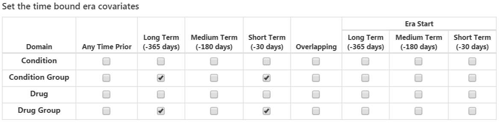
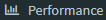
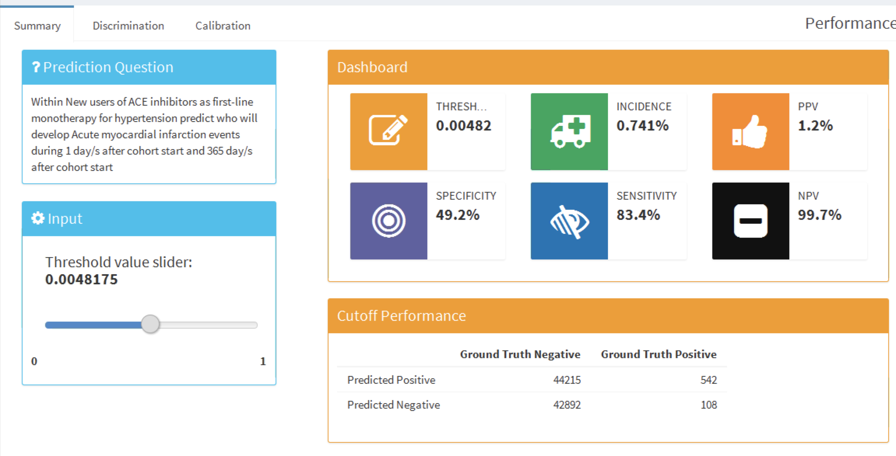
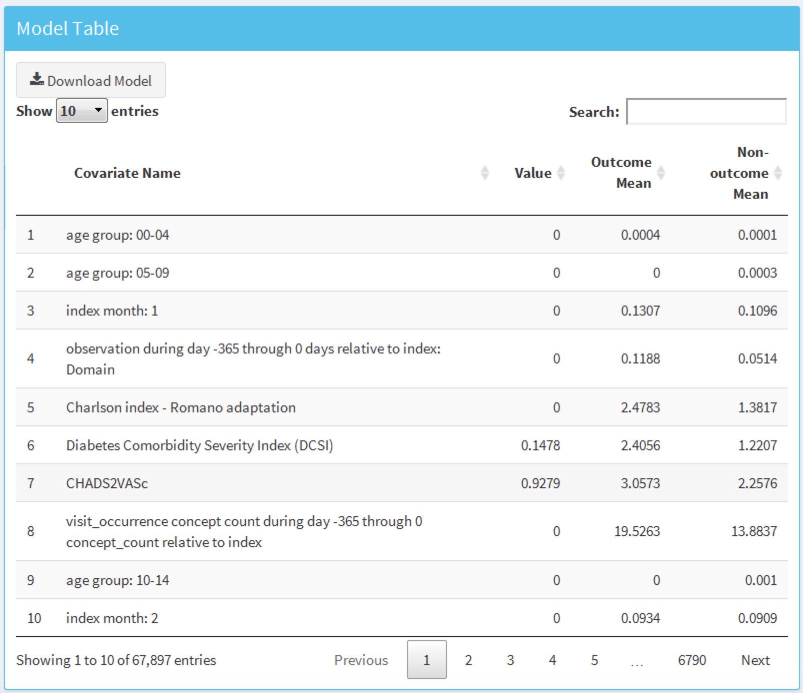

# Prédiction au Niveau du Patient {#PatientLevelPrediction}

*Leads du chapitre : Peter Rijnbeek & Jenna Reps*

\index{prédiction au niveau du patient}

La prise de décision clinique est une tâche compliquée au cours de laquelle le clinicien doit déduire un diagnostic ou un plan de traitement en se basant sur l'historique médical disponible du patient et les directives cliniques actuelles. Des modèles de prédiction clinique ont été développés pour soutenir ce processus de prise de décision et sont utilisés en pratique clinique dans un large éventail de spécialités. Ces modèles prédisent un résultat diagnostique ou pronostique en fonction d'une combinaison de caractéristiques des patients, par exemple des informations démographiques, l'historique des maladies et l'historique des traitements. \index{prise de décision clinique} \index{résultat diagnostique} \index{résultat pronostique}

Le nombre de publications décrivant des modèles de prédiction clinique a fortement augmenté au cours des 10 dernières années. La plupart des modèles actuellement utilisés sont estimés en utilisant de petits ensembles de données et ne considèrent qu'un petit ensemble de caractéristiques des patients. Cette faible taille d'échantillon, et donc faible puissance statistique, force l'analyste de données à faire de fortes hypothèses de modélisation. La sélection de l'ensemble limité de caractéristiques des patients est fortement guidée par les connaissances expertes disponibles. Cela contraste fortement avec la réalité de la médecine moderne dans laquelle les patients génèrent une piste numérique riche, bien au-delà des capacités de tout praticien médical à entièrement assimiler. Actuellement, les soins de santé génèrent une énorme quantité d'informations spécifiques aux patients stockées dans les Dossiers Médicaux Électroniques (DME). Cela inclut des données structurées sous forme de diagnostics, de médicaments, de résultats de tests de laboratoire, et des données non structurées contenues dans les récits cliniques. On ne sait pas combien de précision prédictive peut être gagnée en tirant parti de la grande quantité de données provenant du DME complet d'un patient. \index{modèle de prédiction}

Les avancées en apprentissage automatique pour l'analyse de grandes bases de données ont conduit à un intérêt accru pour l'application de la prédiction au niveau du patient sur ce type de données. Cependant, de nombreux efforts publiés dans la prédiction au niveau du patient ne suivent pas les lignes directrices de développement de modèles, ne réalisent pas une validation externe approfondie, ou fournissent des détails insuffisants sur les modèles, ce qui limite la capacité des chercheurs indépendants à reproduire les modèles et à effectuer une validation externe. Cela rend difficile l'évaluation équitable de la performance prédictive des modèles et réduit la probabilité que le modèle soit utilisé correctement en pratique clinique. Pour améliorer les normes, plusieurs articles ont été écrits détaillant les lignes directrices pour les meilleures pratiques de développement et de reporting des modèles de prédiction. Par exemple, la déclaration "Transparent Reporting of a multivariable prediction model for Individual Prognosis Or Diagnosis" (TRIPOD) [^tripodUrl] fournit des recommandations claires pour le reporting du développement et de la validation des modèles de prédiction et traite de certaines des préoccupations liées à la transparence. \index{apprentissage automatique} \index{TRIPOD}

[^tripodUrl]: https://www.equator-network.org/reporting-guidelines/tripod-statement/

La modélisation prédictive spécifique au patient à une échelle massive est devenue une réalité grâce à OHDSI, où le Modèle de Données Commun (CDM) permet une analyse uniforme et transparente à une échelle sans précédent. Le réseau croissant de bases de données standardisées selon le CDM permet la validation externe de modèles dans différents contextes de soins de santé à l'échelle mondiale. Nous croyons que cela offre une opportunité immédiate de servir de grandes communautés de patients qui ont le plus besoin d'une amélioration de la qualité des soins. De tels modèles peuvent informer des soins médicaux véritablement personnalisés, espérant ainsi aboutir à une nette amélioration des résultats des patients.

Dans ce chapitre, nous décrivons le cadre standardisé d'OHDSI pour la prédiction au niveau du patient [@reps2018] et discutons du package R [PatientLevelPrediction](https://ohdsi.github.io/PatientLevelPrediction/) qui implémente les meilleures pratiques établies pour le développement et la validation. Nous commençons par fournir la théorie nécessaire derrière le développement et l'évaluation de la prédiction au niveau du patient et donnons un aperçu général des algorithmes d'apprentissage automatique mis en œuvre. Ensuite, nous discutons d'un problème de prédiction exemplaire et offrons des conseils pas à pas sur sa définition et son implémentation en utilisant ATLAS ou du code R personnalisé. Enfin, nous discutons de l'utilisation d'applications Shiny pour la diffusion des résultats de l'étude.


## Le Problème de Prédiction

La Figure \@ref(fig:figure1) illustre le problème de prédiction que nous abordons. Parmi une population à risque, nous visons à prédire quels patients à un moment défini dans le temps (t = 0) connaîtront un certain résultat durant une période de temps à risque. La prédiction se fait en utilisant uniquement les informations sur les patients dans une fenêtre d'observation avant ce moment donné.

```{r figure1, fig.cap="The prediction problem.",echo=FALSE, out.width='100%'}
knitr::include_graphics("images/PatientLevelPrediction/Figure1.png")
```

Comme indiqué dans le Tableau \@ref(tab:plpDesign), pour définir un problème de prédiction, nous devons définir t=0 par une cohorte cible, le résultat que nous souhaitons prédire par une cohorte de résultat et le temps à risque. Nous définissons la question standard de prédiction comme suit : \index{cohorte cible} \index{cohorte de résultat} \index{temps à risque}

> Parmi *[définition de cohorte cible]*, qui ira avoir *[définition de cohorte de résultat]* dans *[période de temps à risque]*?

De plus, nous devons faire des choix de conception pour le modèle que nous souhaitons développer et déterminer les ensembles de données d'observation pour effectuer une validation interne et externe.

Tableau : (\#tab:plpDesign) Principaux choix de conception dans une conception de prédiction.

| Choix            | Description                                              |
|:----------------- |:-------------------------------------------------------- |
| Cohorte cible     | Comment définissons-nous la cohorte de personnes pour lesquelles nous souhaitons prédire ?                    |
| Cohorte de résultat    | Comment définissons-nous le résultat que nous voulons prédire ?|
| Temps à risque      | Dans quelle fenêtre de temps par rapport à t=0 voulons-nous faire la prédiction ? |
| Modèle             | Quels algorithmes voulons-nous utiliser et quelles variables prédictives potentielles incluons-nous ? |


Ce cadre conceptuel fonctionne pour tous les types de problèmes de prédiction, par exemple :

- Début et progression de la maladie
  - **Structure** : Parmi les patients nouvellement diagnostiqués avec *[une maladie]*, qui ira avoir *[une autre maladie ou complication]* dans *[horizon temporel à partir du diagnostic]*?
  - **Exemple** : Parmi les patients nouvellement diagnostiqués de fibrillation auriculaire, qui ira avoir un accident vasculaire cérébral ischémique dans les trois prochaines années ?
- Choix de traitement
  - **Structure** : Parmi les patients atteints de *[maladie indiquée]* qui sont traités avec *[traitement 1]* ou *[traitement 2]*, quels patients ont été traités avec *[traitement 1]*?
  - **Exemple** : Parmi les patients atteints de fibrillation auriculaire ayant pris soit de la warfarine soit du rivaroxaban, quels patients reçoivent de la warfarine ? (par exemple pour un modèle de propension)
- Réponse au traitement
  - **Structure** : Parmi les nouveaux utilisateurs de *[un traitement]*, qui connaîtra *[un certain effet]* dans *[fenêtre temporelle]* ?
  - **Exemple** : Quels patients diabétiques qui débutent un traitement par metformine restent sous metformine pendant trois ans ?
- Sécurité du traitement
  - **Structure** : Parmi les nouveaux utilisateurs de *[un traitement]*, qui connaîtra *[un événement indésirable]* dans *[fenêtre temporelle]*?
  - **Exemple** : Parmi les nouveaux utilisateurs de warfarine, qui aura une hémorragie gastro-intestinale dans un an ?
- Adhésion au traitement
  - **Structure** : Parmi les nouveaux utilisateurs de *[un traitement]*, qui atteindra *[une mesure d'adhésion]* à *[fenêtre temporelle]*?
  - **Exemple** : Quels patients diabétiques qui commencent un traitement par metformine atteignent >=80% de proportion de jours couverts en un an ?
## Extraction des données

Lors de la création d'un modèle prédictif, nous utilisons un processus connu sous le nom d'apprentissage supervisé --- une forme d'apprentissage automatique --- qui déduit la relation entre les covariables et l'état de l'issue basé sur un ensemble d'exemples étiquetés\index{apprentissage supervisé}. Par conséquent, nous avons besoin de méthodes pour extraire les covariables du CDM pour les personnes de la cohorte cible et nous devons obtenir leurs étiquettes d'issue.

Les **covariables** (également appelées "prédicteurs", "caractéristiques" ou "variables indépendantes") décrivent les caractéristiques des patients.\index{covariables} Les covariables peuvent inclure l'âge, le sexe, la présence de conditions spécifiques et les codes d'exposition dans le dossier d'un patient, etc. Les covariables sont généralement construites en utilisant le package [FeatureExtraction](https://ohdsi.github.io/FeatureExtraction/), décrit plus en détail dans le Chapitre \@ref(Characterization). Pour la prédiction, nous ne pouvons utiliser que les données antérieures (et à la date) où la personne entre dans la cohorte cible. Cette date nous l'appellerons la date d'index.\index{date d'index}

Nous devons également obtenir l'**état de l'issue** (également appelé "étiquettes" ou "classes") de tous les patients pendant la période de risque. Si l'issue survient pendant la période de risque, l'état de l'issue est défini comme "positif". \index{état de l'issue} \index{étiquettes} \index{classes}

### Exemple d'extraction de données

Le tableau \@ref(tab:plpExampleCohorts) montre un exemple de tableau COHORT avec deux cohortes. La cohorte avec l'ID de définition de cohorte 1 est la cohorte cible (par exemple "personnes récemment diagnostiquées avec une fibrillation auriculaire"). L'ID de définition de cohorte 2 définit la cohorte d'issue (par exemple "AVC").

Tableau: (\#tab:plpExampleCohorts) Exemple de tableau COHORT. Pour des raisons de simplicité, la COHORT_END_DATE a été omise.

| COHORT_DEFINITION_ID | SUBJECT_ID | COHORT_START_DATE |
|:--------------------:|:----------:|:-----------------:|
| 1                    |   1        | 2000-06-01        |
| 1                    |   2        | 2001-06-01        |
| 2                    |   2        | 2001-07-01        |

Le tableau \@ref(tab:plpExampleConditions) fournit un exemple de tableau CONDITION_OCCURRENCE. L'ID conceptuel [320128](http://athena.ohdsi.org/search-terms/terms/320128) fait référence à "Hypertension essentielle."

Tableau: (\#tab:plpExampleConditions) Exemple de tableau CONDITION_OCCURRENCE. Pour des raisons de simplicité, seules trois colonnes sont montrées.

| PERSON_ID | CONDITION_CONCEPT_ID | CONDITION_START_DATE |
|:---------:|:--------------------:|:--------------------:|
| 1         | 320128               | 2000-10-01           |
| 2         | 320128               | 2001-05-01           |

Sur la base de ces données d'exemple et en supposant que la période de risque est l'année suivant la date d'index (la date de début de la cohorte cible), nous pouvons construire les covariables et l'état de l'issue. Une covariable indiquant "Hypertension essentielle dans l'année précédente" aura la valeur 0 (non présente) pour l'ID de personne 1 (la condition est survenue *après* la date d'index), et la valeur 1 (présente) pour l'ID de personne 2. De même, l'état de l'issue sera 0 pour l'ID de personne 1 (cette personne n'avait aucune entrée dans la cohorte d'issue), et 1 pour l'ID de personne 2 (l'issue est survenue dans l'année suivant la date d'index).

### Négatif vs Manquant

Les données de santé observationnelles reflètent rarement si une valeur est négative ou manquante. Dans l'exemple précédent, nous avons simplement observé que la personne avec l'ID 1 n'avait aucune occurrence d'hypertension essentielle avant la date d'index. Cela pourrait être parce que la condition n'était pas présente (négative) à ce moment-là, ou parce qu'elle n'était pas enregistrée (manquante). Il est important de réaliser que l'algorithme d'apprentissage automatique ne peut pas faire la distinction entre le négatif et le manquant et évaluera simplement la valeur prédictive dans les données disponibles. \index{données manquantes}

## Ajuster le modèle {#modelFitting}

Lors de l'ajustement d'un modèle de prédiction, nous essayons d'apprendre la relation entre les covariables et l'état de l'issue observée à partir d'exemples étiquetés. Supposons que nous n'ayons que deux covariables, la pression artérielle systolique et diastolique ; alors nous pouvons représenter chaque patient comme un point dans un espace à deux dimensions, comme montré dans la Figure \@ref(fig:decisionBoundary). Dans cette figure, la forme du point de données correspond à l'état de l'issue du patient (par exemple, un accident vasculaire cérébral).

Un modèle d'apprentissage supervisé tentera de trouver une frontière de décision qui sépare de manière optimale les deux classes d'issues. Différentes techniques d'apprentissage supervisé produisent différentes frontières de décision, et il existe souvent des hyper-paramètres qui peuvent influencer la complexité de la frontière de décision. \index{frontière de décision}

```{r decisionBoundary, fig.cap="Decision boundary.", echo=FALSE, out.width='80%', fig.align='center'}
knitr::include_graphics("images/PatientLevelPrediction/decisionBoundary.png")
```

Dans la Figure \@ref(fig:decisionBoundary), nous pouvons voir trois frontières de décision différentes. Les frontières sont utilisées pour inférer l'état de l'issue pour tout nouveau point de données. Si un nouveau point de données tombe dans la zone ombrée, alors le modèle prédira "a l'issue", sinon il prédira "pas d'issue". Idéalement, une frontière de décision devrait parfaitement partitionner les deux classes. Cependant, il existe un risque que des modèles trop complexes "surajustent" les données. Cela peut nuire à la généralisation du modèle pour des données non vues. Par exemple, si les données contiennent du bruit, avec des points de données mal étiquetés ou incorrectement positionnés, nous ne voudrions pas ajuster notre modèle à ce bruit. Nous préférons donc définir une frontière de décision qui ne discrimine pas parfaitement dans nos données d'entraînement, mais qui capture la complexité "réelle". Des techniques comme la régularisation visent à maximiser la performance du modèle tout en minimisant la complexité.

Chaque algorithme d'apprentissage supervisé a une manière différente d'apprendre la frontière de décision, et il n'est pas évident de savoir quel algorithme fonctionnera le mieux sur vos données. Comme le théorème du No Free Lunch le stipule, aucun algorithme ne sera toujours supérieur aux autres pour tous les problèmes de prédiction. \index{no free lunch} Nous recommandons donc d'essayer plusieurs algorithmes d'apprentissage supervisé avec divers réglages d'hyper-paramètres lors du développement de modèles de prédiction au niveau des patients.

Les algorithmes suivants sont disponibles dans le package [PatientLevelPrediction](https://ohdsi.github.io/PatientLevelPrediction/) :

### Régression Logistique Régularisée

La régression logistique LASSO (least absolute shrinkage and selection operator) appartient à la famille des modèles linéaires généralisés, où une combinaison linéaire des variables est apprise et finalement une fonction logarithmique mappe la combinaison linéaire à une valeur entre 0 et 1. La régularisation LASSO ajoute un coût basé sur la complexité du modèle à la fonction objective lors de l'entraînement du modèle. Ce coût est la somme des valeurs absolues de la combinaison linéaire des coefficients. Le modèle effectue automatiquement la sélection des fonctionnalités en minimisant ce coût. Nous utilisons le package [Cyclops](https://ohdsi.github.io/Cyclops/) (descente de coordonnées cyclique pour l'analyse logistique, de Poisson et de survie) pour effectuer une régression logistique régularisée à grande échelle. \index{LASSO} \index{régression logistique} \index{régularisation} \index{Cyclops}

Table: (\#tab:lassoParameters) Hyper-paramètres pour la régression logistique régularisée.

| Paramètre | Description | Valeurs typiques |
|:----------|:------------|:-----------------|
| Variance de départ | La variance de départ de la distribution a priori. | 0.1 |

Notez que la variance est optimisée en maximisant la vraisemblance hors-échantillon dans une validation croisée, donc la variance de départ a peu d'impact sur la performance du modèle résultant. Cependant, choisir une variance de départ trop éloignée de la valeur optimale peut entraîner un temps d'ajustement long. \index{variance} \index{hyper-paramètre} \index{validation croisée}

### Machines à Gradient Boosting

Les machines à gradient boosting sont une technique d'ensemble de boosting et dans notre cadre, elles combinent plusieurs arbres de décision. Le boosting fonctionne en ajoutant itérativement des arbres de décision mais en ajoutant plus de poids aux points de données mal classifiés par les arbres de décision précédents dans la fonction de coût lors de l'entraînement du prochain arbre. Nous utilisons Extreme Gradient Boosting, qui est une implémentation efficace du cadre de boosting de gradient implémenté dans le package xgboost en R disponible sur CRAN. \index{gradient boosting} \index{xgboost}

Table: (\#tab:gbmParameters) Hyper-paramètres pour les machines à gradient boosting.

| Parameter| Description | Typical values |
|:-------- |:----------- |:-------------- |
| earlyStopRound | Arrêt après des tours sans amélioration | 25 |
| learningRate| Le taux d'apprentissage du boosting | 0.005,0.01,0.1|
| maxDepth | Nombre maximum de niveaux dans un arbre | 4,6,17 |
| minRows | Nombre minimum de points de données dans un nœud | 2 |
| ntrees | Nombre d'arbres |100,1000|

### Forêt Aléatoire

La forêt aléatoire est une technique d'ensemble basée sur le bagging qui combine plusieurs arbres de décision. L'idée du bagging est de réduire la probabilité de sur-ajustement en utilisant des classificateurs faibles et en les combinant en un classificateur fort. La forêt aléatoire y parvient en entraînant plusieurs arbres de décision mais en utilisant seulement un sous-ensemble des variables dans chaque arbre, et le sous-ensemble de variables diffère entre les arbres. Notre package utilise l'implémentation sklearn de Random Forest en Python. \index{forêt aléatoire} \index{python} \index{sklearn}

Table: (\#tab:randomForestParameters) Hyper-paramètres pour les forêts aléatoires.

| Parameter| Description | Typical values |
|:-------- |:----------- |:-------------- |
| maxDepth | Nombre maximum de niveaux dans un arbre | 4,10,17 |
| mtries | Nombre de fonctionnalités dans chaque arbre | -1 = racine carrée des fonctionnalités totales, 5, 20 |
| ntrees | Nombre d'arbres | 500 |

### K-Nearest Neighbors

K-nearest neighbors (KNN) est un algorithme qui utilise une métrique de distance pour trouver les K points de données étiquetés les plus proches d'un nouveau point de données non étiqueté. La prédiction pour le nouveau point de données est alors la classe la plus fréquente des K points de données étiquetés les plus proches. Il y a une limitation de partage pour KNN, car le modèle nécessite des données étiquetées pour effectuer la prédiction sur de nouvelles données, et il n'est souvent pas possible de partager ces données entre sites de données. Nous avons inclus le package [BigKnn](https://github.com/OHDSI/BigKnn) développé dans OHDSI, qui est un classificateur KNN à grande échelle. \index{k-nearest neighbors} \index{bigknn}

Table: (\#tab:knnParameters) Hyper-paramètres pour K-nearest neighbors.

| Paramètre | Description | Valeurs typiques |
|:----------|:------------|:-----------------|
| k          | Nombre de voisins | 1000 |

### Naive Bayes

L'algorithme Naive Bayes applique le théorème de Bayes avec l'hypothèse naïve d'indépendance conditionnelle entre chaque paire de caractéristiques étant donné la valeur de la variable de classe. En se basant sur la vraisemblance que les données appartiennent à une classe et la distribution a priori de la classe, une distribution a posteriori est obtenue. Naive Bayes n'a pas d'hyper-paramètres. \index{naive bayes}

### AdaBoost

AdaBoost est une technique d'ensemble de boosting. Le boosting fonctionne en ajoutant itérativement des classificateurs mais en ajoutant plus de poids aux points de données mal classifiés par les classificateurs précédents dans la fonction de coût lors de l'entraînement du prochain classificateur. Nous utilisons l'implémentation AdaboostClassifier de sklearn en Python. \index{adaboost} \index{python}

Table: (\#tab:adaBoostParameters) Hyper-paramètres pour AdaBoost.

| Paramètre | Description | Valeurs typiques |
|:----------|:------------|:-----------------|
| nEstimators | Le nombre maximum d'estimateurs à 

atteindre avant l'arrêt du boosting | 4 |
| learningRate | Le taux d'apprentissage réduit la contribution de chaque classificateur par learning_rate. Il existe un compromis entre learningRate et nEstimators | 1 |

### Arbre de Décision

Un arbre de décision est un classificateur qui partitionne l'espace des variables en utilisant des tests individuels sélectionnés en utilisant une approche gloutonne. Il vise à trouver des partitions qui ont le gain d'information le plus élevé pour séparer les classes. L'arbre de décision peut facilement surajuster en permettant un grand nombre de partitions (profondeur de l'arbre) et nécessite souvent une régularisation (par exemple, l'élagage ou la spécification d'hyper-paramètres qui limitent la complexité du modèle). Nous utilisons l'implémentation DecisionTreeClassifier de sklearn en Python. \index{arbre de décision} \index{python}

Table: (\#tab:decisionTreeParameters) Hyper-paramètres pour les arbres de décision.

| Paramètre | Description | Valeurs typiques |
|:----------|:------------|:-----------------|
| classWeight | "Balance" ou "None" | None |
| maxDepth | La profondeur maximale de l'arbre | 10 |
| minImpuritySplit | Seuil pour un arrêt précoce dans la croissance de l'arbre. Un nœud se scinde si son impureté est supérieure au seuil, sinon c'est une feuille | 10^-7 |
| minSamplesLeaf | Le nombre minimum d'échantillons par feuille | 10 |
| minSamplesSplit | Le nombre minimum d'échantillons par scission | 2 |

### Perceptron Multi-couches

Les perceptrons multi-couches sont des réseaux neuronaux contenant plusieurs couches de nœuds qui pondèrent leurs entrées en utilisant une fonction non linéaire. La première couche est la couche d'entrée, la dernière couche est la couche de sortie, et entre les deux se trouvent les couches cachées. Les réseaux neuronaux sont généralement entraînés en utilisant la rétropropagation, ce qui signifie que l'entrée d'entraînement est propagée vers l'avant à travers le réseau pour produire une sortie, l'erreur entre la sortie et l'état de l'issue est calculée, et cette erreur est propagée en arrière à travers le réseau pour mettre à jour les poids de la fonction linéaire. \index{réseau neuronal} \index{perceptron} \index{rétropropagation}

Table: (\#tab:mpParameters) Hyper-paramètres pour les perceptrons multi-couches.

| Paramètre | Description | Valeurs typiques |
|:----------|:------------|:-----------------|
| alpha | La régularisation l2 | 0.00001 |
| size  | Le nombre de nœuds cachés | 4 |

### Apprentissage profond

L'apprentissage profond tel que les réseaux de neurones profonds, les réseaux de neurones convolutionnels ou les réseaux de neurones récurrents sont similaires aux perceptrons multi-couches mais ont plusieurs couches cachées qui visent à apprendre des représentations latentes utiles pour la prédiction. Dans un [vignette](https://ohdsi.github.io/PatientLevelPrediction/articles/BuildingDeepLearningModels.html) séparé dans le package [PatientLevelPrediction](https://ohdsi.github.io/PatientLevelPrediction/), nous décrivons ces modèles et les hyper-paramètres en plus de détail. \index{apprentissage profond} \index{réseau de neurones convolutionnel} \index{réseaux de neurones récurrents}

### Autres Algorithmes

D'autres algorithmes peuvent être ajoutés au cadre de prédiction au niveau des patients. Cela est hors-sujet pour ce chapitre. Les détails peuvent être trouvés dans le vignette ["Adding Custom Patient-Level Prediction Algorithms"](https://ohdsi.github.io/PatientLevelPrediction/articles/AddingCustomAlgorithms.html) dans le package [PatientLevelPrediction](https://ohdsi.github.io/PatientLevelPrediction/).
## Évaluation des Modèles de Prédiction

### Types d'Évaluation

Nous pouvons évaluer un modèle de prédiction en mesurant l'accord entre la prédiction du modèle et le statut observé de l'issue, ce qui signifie que nous avons besoin de données où le statut de l'issue est connu. \index{evaluating prediction models}

```{block2, type='rmdimportant'}
Pour l'évaluation, nous devons utiliser un ensemble de données différent de celui utilisé pour développer le modèle, sinon nous risquons de favoriser les modèles qui sont surajustés (voir Section \@ref(modelFitting)) et peuvent mal fonctionner pour de nouveaux patients.
```

Nous distinguons entre

- **Validation interne** : Utiliser différents ensembles de données extraites de la même base de données pour développer et évaluer le modèle.
- **Validation externe** : Développer le modèle dans une base de données et l'évaluer dans une autre base de données. \index{validation!internal validation} \index{validation!external validation}

Il existe deux façons de réaliser une validation interne :

- Une approche par **ensemble de validation** divise les données étiquetées en deux ensembles indépendants : un ensemble d'entraînement et un ensemble de test (l'ensemble de validation). L'ensemble d'entraînement est utilisé pour apprendre le modèle et l'ensemble de test est utilisé pour l'évaluer. Nous pouvons simplement diviser nos patients au hasard en un ensemble d'entraînement et un ensemble de test, ou nous pouvons choisir de :
    - Diviser les données en fonction du temps (validation temporelle), par exemple en s'entraînant sur des données avant une date spécifique et en évaluant sur des données après cette date. Cela peut nous indiquer si notre modèle se généralise à différentes périodes de temps.
    - Diviser les données en fonction de la localisation géographique (validation spatiale). \index{validation!temporal validation} \index{validation!spatial validation}
- La **validation croisée** est utile lorsque les données sont limitées. Les données sont divisées en $n$ ensembles de taille égale, où $n$ doit être préspecifié (par exemple $n=10$). Pour chacun de ces ensembles, un modèle est entraîné sur toutes les données sauf celles de cet ensemble et utilisé pour générer des prédictions pour l'ensemble de validation. De cette manière, toutes les données sont utilisées une fois pour évaluer l'algorithme de construction du modèle. Dans le cadre de prédiction au niveau des patients, nous utilisons la validation croisée pour choisir les hyper-paramètres optimaux. \index{cross-validation}

La validation externe vise à évaluer les performances du modèle sur des données provenant d'une autre base de données, c'est-à-dire en dehors des paramètres dans lesquels il a été développé. Cette mesure de la transportabilité du modèle est importante car nous voulons appliquer nos modèles non seulement sur la base de données sur laquelle il a été formé. Différentes bases de données peuvent représenter différentes populations de patients, différents systèmes de soins de santé et différents processus de capture des données. Nous pensons que la validation externe des modèles de prédiction sur un large ensemble de bases de données est une étape cruciale pour l'acceptation et la mise en œuvre des modèles en pratique clinique.

### Mesures de Performance {#performance}

#### Mesures Basées sur le Seuil {-}

Un modèle de prédiction attribue une valeur entre 0 et 1 pour chaque patient correspondant au risque qu'un patient ait l'issue pendant la période de risque. Une valeur de 0 signifie un risque de 0%, une valeur de 0,5 signifie un risque de 50% et une valeur de 1 signifie un risque de 100%. Des métriques courantes telles que l'exactitude, la sensibilité, la spécificité, la valeur prédictive positive peuvent être calculées en spécifiant d'abord un seuil qui est utilisé pour classer les patients comme ayant l'issue ou non pendant la période de risque. Par exemple, étant donné le Tableau \@ref(tab:tabletheorytab), si nous définissons le seuil à 0,5, les patients 1, 3, 7 et 10 ont un risque prédit supérieur ou égal au seuil de 0,5 donc ils seraient prédits comme ayant l'issue. Tous les autres patients avaient un risque prédit inférieur à 0,5, donc ils seraient prédits comme n'ayant pas l'issue. \index{performance metrics} \index{accuracy} \index{sensitivity} \index{specificity} \index{positive predictive value}

Table: (\#tab:tabletheorytab) Exemple d'utilisation d'un seuil sur la probabilité prédite.

| ID du Patient    | Risque prédit  | Classe prédite au seuil de 0.5 | A l'issue pendant la période de risque | Type |
|:-------:|:---------:|:---------:|:---------:|:------:|
| 1   | 0.8 | 1| 1 | TP |
| 2   | 0.1   | 0 | 0 | TN |
| 3 | 0.7   | 1 | 0 | FP |
| 4   | 0 | 0 | 0 | TN |
| 5   | 0.05   |  0 | 0 | TN |
| 6 | 0.1   | 0 | 0 | TN |
| 7   | 0.9 | 1 | 1 | TP |
| 8   | 0.2   |  0 | 1 | FN |
| 9 | 0.3   | 0 | 0 | TN |
| 10 | 0.5   | 1 | 0 | FP |

Si un patient est prédit comme ayant l'issue et a l'issue (pendant la période de risque), cela s'appelle un vrai positif (TP). Si un patient est prédit comme ayant l'issue mais n'a pas l'issue, cela s'appelle un faux positif (FP). Si un patient est prédit comme n'ayant pas l'issue et n'a pas l'issue, cela s'appelle un vrai négatif (TN). Enfin, si un patient est prédit comme n'ayant pas l'issue mais a l'issue, cela s'appelle un faux négatif (FN). \index{true positive} \index{false positive} \index{true negative} \index{false negative}

Les métriques suivantes basées sur le seuil peuvent être calculées :

-	exactitude : $(TP+TN)/(TP+TN+FP+FN)$
-	sensibilité : $TP/(TP+FN)$
-	spécificité : $TN/(TN+FP)$
-	valeur prédictive positive : $TP/(TP+FP)$

Notez que ces valeurs peuvent diminuer ou augmenter si le seuil est abaissé. Abaisser le seuil d'un classificateur peut augmenter le dénominateur en augmentant le nombre de résultats retournés. Si le seuil était précédemment fixé trop haut, les nouveaux résultats peuvent tous être des vrais positifs, ce qui augmentera la valeur prédictive positive. Si le seuil précédent était correct ou trop bas, abaisser davantage le seuil introduira des faux positifs, ce qui diminuera la valeur prédictive positive. Pour la sensibilité, le dénominateur ne dépend pas du seuil du classificateur ($TP+FN$ est une constante). Cela signifie qu'abaisser le seuil du classificateur peut augmenter la sensibilité en augmentant le nombre de vrais positifs. Il est aussi possible que l'abaissement du seuil laisse la sensibilité inchangée, tandis que la valeur prédictive positive fluctue.

#### Discrimination {-}

La discrimination est la capacité d'attribuer un risque plus élevé aux patients qui subiront l'issue pendant la période de risque. La courbe des caractéristiques de fonctionnement du récepteur (ROC) est créée en traçant 1 - spécificité sur l'axe des x et la sensibilité sur l'axe des y à tous les seuils possibles. Un exemple de graphique ROC est présenté plus loin dans ce chapitre à la Figure \@ref(fig:shinyROC). La surface sous la courbe ROC (AUC) donne une mesure globale de discrimination où une valeur de 0,5 correspond à l'affectation aléatoire du risque et une valeur de 1 signifie une discrimination parfaite. La plupart des modèles de prédiction publiés obtiennent des AUC entre 0.6-0.8. \index{AUC} \index{ROC} \index{discrimination}

L'AUC fournit un moyen de déterminer dans quelle mesure les distributions de risques prédites diffèrent entre les patients qui subissent l'issue pendant la période de risque et ceux qui ne le font pas. Si l'AUC est élevée, les distributions seront principalement disjointes, tandis que lorsqu'il y a beaucoup de chevauchement, l'AUC sera plus proche de 0.5, comme montré à la Figure \@ref(fig:figuretheoryroctheory).

```{r figuretheoryroctheory, fig.cap="Comment les tracés ROC sont liés à la discrimination. Si les deux classes ont des distributions similaires de risque prédit, le ROC sera proche de la diagonale, avec une AUC proche de 0.5.",echo=FALSE, out.width='100%'}
knitr::include_graphics("images/PatientLevelPrediction/theory/roctheory.png")
```

Pour des issues rares, même un modèle avec une AUC élevée peut ne pas être pratique, car pour chaque positif au-dessus d'un seuil donné, il peut également y avoir de nombreux négatifs (c'est-à-dire que la valeur prédictive positive sera faible). En fonction de la gravité de l'issue et du coût (risque pour la santé et/ou monétaire) de certaines interventions, un taux élevé de faux positifs peut être indésirable. Lorsqu'une issue est rare, une autre mesure connue sous le nom de surface sous la courbe précision-rappel (AUPRC) est donc recommandée. L'AUPRC est la surface sous la ligne générée en traçant la sensibilité sur l'axe des x (également connue sous le nom de rappel) et la valeur prédictive positive (également connue sous le nom de précision) sur l'axe des y. \index{area under the precision-recall curve}

#### Calibration {-}

La calibration est la capacité du modèle à attribuer le risque correct. Par exemple, si le modèle attribue un risque de 10% à cent patients, dix de ces patients devraient subir l'issue pendant la période de risque. Si le modèle attribue un risque de 80% à 100 patients, quatre-vingt de ces patients devraient subir l'issue pendant la période de risque. La calibration est généralement calculée en partitionnant les patients en déciles basés sur le risque prédit et dans chaque groupe en calculant le risque moyen prédit et la fraction des patients qui ont subi l'issue pendant la période de risque. Nous traçons ensuite ces dix points (risque prédit sur l'axe des y et risque observé sur l'axe des x) et nous voyons s'ils tombent sur la ligne x = y, indiquant que le modèle est bien calibré. Un exemple de graphique de calibration est présenté plus loin dans ce chapitre à la Figure \@ref(fig:shinyCal). Nous ajustons également un modèle linéaire en utilisant les points pour calculer l'intercept (qui devrait être proche de zéro) et le gradient (qui devrait être proche de un). Si le gradient est supérieur à un, alors le modèle attribue un risque plus élevé que le risque réel et si le gradient est inférieur à un, le modèle attribue un risque plus faible que le risque réel. Notez que nous avons également implémenté des Courbes de Calibration Lissées dans notre paquet R pour mieux capturer la relation non linéaire entre le risque prédit et observé. \index{calibration}
## Concevoir une étude de prédiction au niveau du patient

Dans cette section, nous allons démontrer comment concevoir une étude de prédiction. La première étape consiste à définir clairement le problème de prédiction. Fait intéressant, dans de nombreux articles publiés, le problème de prédiction est mal défini ; par exemple, il n'est pas clair comment la date d'index (le début de la cohorte cible) est définie. Un problème de prédiction mal défini ne permet pas une validation externe par d'autres, encore moins une mise en œuvre dans la pratique clinique. Dans le cadre de la prédiction au niveau du patient, nous imposons une spécification correcte du problème de prédiction en exigeant que les choix clés définis dans le Tableau \@ref(tab:plpDesign) soient explicitement définis. Ici, nous allons parcourir ce processus en utilisant un problème de prédiction de type "sécurité du traitement" comme exemple. \index{date d'index}

### Définition du problème

L'angio-œdème est un effet secondaire bien connu des inhibiteurs de l'ECA, et l'incidence de l'angio-œdème signalée dans l'étiquetage des inhibiteurs de l'ECA se situe entre 0,1 % et 0,7 %. [@byrd_2006] La surveillance des patients pour cet effet indésirable est importante, car bien que l'angio-œdème soit rare, il peut être potentiellement mortel, menant à un arrêt respiratoire et à la mort. [@norman_2013] De plus, si l'angio-œdème n'est pas initialement reconnu, il peut conduire à des examens approfondis et coûteux avant qu'il ne soit identifié comme étant la cause. [@norman_2013; @thompson_1993] À l'exception du risque plus élevé chez les patients afro-américains, il n'y a pas de facteurs prédisposants connus pour le développement de l'angio-œdème lié aux inhibiteurs de l'ECA. [@byrd_2006] La plupart des réactions surviennent au cours de la première semaine ou du premier mois de la thérapie initiale et souvent quelques heures après la première dose. [@circardi_2004] Cependant, certains cas peuvent survenir des années après le début du traitement. [@mara_1996] Aucun test diagnostique n'est disponible pour identifier spécifiquement les personnes à risque. Si nous pouvions identifier les personnes à risque, les médecins pourraient agir, par exemple en arrêtant l'inhibiteur de l'ECA en faveur d'un autre médicament contre l'hypertension. \index{angio-œdème} \index{inhibiteurs de l'ECA}

Nous allons appliquer le cadre de prédiction au niveau du patient aux données de santé observationnelles pour répondre à la question de prédiction suivante au niveau du patient :

> Parmi les patients qui viennent de commencer un inhibiteur de l'ECA pour la première fois, qui va éprouver un angio-œdème dans l'année suivante ?

### Définition de la population de l'étude

La population finale dans laquelle nous allons développer notre modèle est souvent un sous-ensemble de la cohorte cible, car nous pouvons par exemple appliquer des critères dépendants du résultat, ou nous voulons effectuer des analyses de sensibilité avec des sous-populations de la cohorte cible. Pour cela, nous devons répondre aux questions suivantes :

- *Quelle est la durée minimale d'observation requise avant le début de la cohorte cible ?* Ce choix pourrait dépendre du temps des patients disponibles dans les données d'entraînement, mais aussi du temps que nous prévoyons d'être disponible dans les sources de données sur lesquelles nous souhaitons appliquer le modèle à l'avenir. Plus la durée minimale d'observation est longue, plus le temps d'historique de base est disponible pour chaque personne pour l'extraction des caractéristiques, mais moins de patients seront qualifiés pour l'analyse. De plus, il pourrait y avoir des raisons cliniques de choisir une période de rétrospective plus courte ou plus longue. Pour notre exemple, nous utiliserons une période d'historique antérieure de 365 jours comme période de rétrospective (période de lavage).

- *Les patients peuvent-ils entrer plusieurs fois dans la cohorte cible ?* Dans la définition de la cohorte cible, une personne peut se qualifier pour la cohorte plusieurs fois au cours de différentes périodes, par exemple, si elle a eu différents épisodes d'une maladie ou des périodes distinctes d'exposition à un produit médical. La définition de la cohorte n'applique pas nécessairement une restriction pour n'autoriser les patients à entrer qu'une seule fois, mais dans le cadre d'un problème particulier de prédiction au niveau du patient, nous pouvons vouloir restreindre la cohorte au premier épisode qualifié. Dans notre exemple, une personne ne peut entrer dans la cohorte cible qu'une fois puisque nos critères étaient basés sur la première utilisation d'un inhibiteur de l'ECA.

- *Autorisons-nous les personnes ayant déjà vécu l'événement à entrer dans la cohorte ?* Permettons-nous aux personnes ayant déjà vécu l'événement d'entrer dans la cohorte cible ? Selon le problème particulier de prédiction au niveau du patient, il peut y avoir une volonté de prédire la première occurrence incidente d'un événement, auquel cas les patients ayant déjà vécu l'événement ne sont pas à risque d'avoir une première occurrence et doivent donc être exclus de la cohorte cible. Dans d'autres circonstances, il peut y avoir une volonté de prédire des épisodes prévalents, où les patients ayant des issues antérieures peuvent être inclus dans l'analyse et l'événement antérieur lui-même peut être un prédicteur des événements futurs. Pour notre exemple de prédiction, nous choisirons de ne pas inclure ceux ayant eu un angio-œdème antérieur.

- *Comment définissons-nous la période pendant laquelle nous allons prédire notre événement par rapport au début de la cohorte cible ?* Nous devons prendre deux décisions pour répondre à cette question. Premièrement, la fenêtre de temps à risque commence-t-elle à la date de début de la cohorte cible ou plus tard ? Les arguments pour un commencement plus tardif pourraient être que nous voulons éviter des événements enregistrés tardivement dans le dossier qui se sont en fait produits avant le début de la cohorte cible ou que nous voulons laisser un intervalle où des interventions pour prévenir l'événement pourraient théoriquement être mises en œuvre. Deuxièmement, nous devons définir le temps à risque en fixant la fin de la fenêtre de risque, comme une certaine spécification de jours à décaler par rapport aux dates de début ou de fin de la cohorte cible. Pour notre problème, nous prédirons dans une fenêtre de temps à risque commençant 1 jour après le début de la cohorte cible et allant jusqu'à 365 jours plus tard.

- *Exigeons-nous une durée minimale de temps à risque ?* Nous devons décider si nous voulons inclure des patients qui n'ont pas vécu l'événement mais ont quitté la base de données avant la fin de notre période de temps à risque. Ces patients peuvent vivre l'événement quand nous ne les observons plus. Pour notre problème de prédiction, nous décidons de répondre à cette question par "oui", nécessitant un temps à risque minimal pour cette raison. De plus, nous devons décider si cette contrainte s'applique également aux personnes ayant connu l'événement ou si nous inclurons toutes les personnes ayant l'événement indépendamment de la durée totale du temps à risque. Par exemple, si l'événement est la mort, alors les personnes ayant l'événement sont probablement censurées avant la fin de la période de temps à risque complète.

### Paramètres de développement du modèle

Pour développer le modèle de prédiction, nous devons décider quel(le)(s) algorithme(s) nous souhaitons entraîner. Nous considérons le choix du meilleur algorithme pour un certain problème de prédiction comme une question empirique, c'est-à-dire que nous préférons laisser les données parler d'elles-mêmes et essayer différentes approches pour trouver la meilleure. Dans notre cadre, nous avons donc implémenté de nombreux algorithmes comme décrit dans la Section \@ref(modelFitting), et permettons l'ajout d'autres algorithmes. Dans cet exemple, pour simplifier, nous sélectionnons juste un algorithme : les Machines à Gradient Boosting.

De plus, nous devons décider des covariables que nous utiliserons pour entraîner notre modèle. Dans notre exemple, nous souhaitons ajouter le sexe, l'âge, toutes les conditions, les médicaments et les groupes de médicaments, et les comptes de visites. Nous rechercherons ces événements cliniques au cours de l'année précédant et à tout moment avant la date d'index.

### Évaluation du modèle

Enfin, nous devons définir comment nous allons évaluer notre modèle. Pour simplifier, nous choisissons ici une validation interne. Nous devons décider comment nous divisons notre ensemble de données en un ensemble d'entraînement et un ensemble de test et comment nous assignons les patients à ces deux ensembles. Ici, nous utiliserons une division typique de 75 % - 25 %. Notez que pour des ensembles de données très volumineux, nous pourrions utiliser plus de données pour l'entraînement.

### Résumé de l'étude

Nous avons maintenant entièrement défini notre étude comme indiqué dans le Tableau \@ref(tab:plpSummary).

Table : (\#tab:plpSummary) Principaux choix de conception pour notre étude.

| Choix     | Valeur                          |
|:----------------- |:-------------------------------------------------------- |
| Cohorte cible | Patients qui ont juste commencé un inhibiteur de l'ECA pour la première fois. Les patients sont exclus s'ils ont moins de 365 jours de temps d'observation précédent ou ont eu un angio-œdème antérieur.|
| Cohorte de résultat | Angio-œdème.                       |
| Temps à risque  | 1 jour jusqu'à 365 jours après le début de la cohorte. Nous exigerons au moins 364 jours à risque. |
| Modèle      | Machine à Gradient Boosting avec des hyper-paramètres ntree : 5000, profondeur maximale : 4 ou 7 ou 10 et taux d'apprentissage : 0,001 ou 0,01 ou 0,1 ou 0,9. Les covariables incluront le sexe, l'âge, les conditions, les médicaments, les groupes de médicaments et le nombre de visites. Division des données : 75 % pour l'entraînement - 25 % pour le test, assignée aléatoirement par personne. |

## Mise en œuvre de l'étude dans ATLAS

L'interface pour concevoir une étude de prédiction peut être ouverte en cliquant sur le bouton  dans le menu de gauche d'ATLAS. Créez une nouvelle étude de prédiction. Assurez-vous de donner à l'étude un nom facile à reconnaître. Le design de l'étude peut être sauvegardé à tout moment en cliquant sur le bouton . \index{ATLAS}

Dans la fonction de design de prédiction, il y a quatre sections : Paramètres du problème de prédiction, Paramètres d'analyse, Paramètres d'exécution et Paramètres d'entraînement. Nous discutons ici de chaque section :

### Paramètres du problème de prédiction

Ici, nous sélectionnons les cohortes de la population cible et les cohortes de résultats pour l'analyse. Un modèle de prédiction sera développé pour toutes les combinaisons des cohortes de la population cible et des cohortes de résultats. Par exemple, si nous spécifions deux populations cibles et deux résultats, nous avons spécifié quatre problèmes de prédiction.

Pour sélectionner une cohorte de la population cible, nous devons l'avoir définie préalablement dans ATLAS. L'instanciation des cohortes est décrite au Chapitre \@ref(Cohorts). L'Annexe fournit les définitions complètes des cohortes cibles (Annexe \@ref(AceInhibitors)) et des cohortes de résultats (Annexe \@ref(Angioedema)) utilisées dans cet exemple. Pour ajouter une cohorte de population cible, cliquez sur le bouton "Ajouter une cohorte cible". L'ajout de cohortes de résultats fonctionne de manière similaire en cliquant sur le bouton "Ajouter une cohorte de résultats". Une fois terminé, le dialogue devrait ressembler à la Figure \@ref(fig:problemSettings).

```{r problemSettings, fig.cap="Paramètres du problème de prédiction.",echo=FALSE, out.width='100%', fig.align='center'}
knitr::include_graphics("images/PatientLevelPrediction/problemSettings.png")
```

### Paramètres d'analyse

Les paramètres d'analyse permettent de sélectionner l'algorithme d'apprentissage supervisé, les covariables et les paramètres de la population.

#### Paramètres du modèle {-}

Nous pouvons choisir un ou plusieurs algorithmes d'apprentissage supervisé pour le développement du modèle. Pour ajouter un algorithme d'apprentissage supervisé, cliquez sur le bouton "Ajouter les paramètres du modèle". Un menu déroulant contenant tous les modèles actuellement supportés dans l'interface ATLAS apparaîtra. Nous pouvons sélectionner le modèle d'apprentissage supervisé que nous voulons inclure dans l'étude en cliquant sur le nom dans le menu déroulant. Cela affichera alors une vue pour ce modèle spécifique, permettant la sélection des valeurs des hyperparamètres. Si plusieurs valeurs sont fournies, une recherche par grille est effectuée sur toutes les combinaisons possibles de valeurs pour sélectionner la combinaison optimale en utilisant la validation croisée.

Pour notre exemple, nous sélectionnons les gradient boosting machines et définissons les hyperparamètres comme spécifié dans la Figure \@ref(fig:gbmSettings).

```{r gbmSettings, fig.cap="Paramètres des gradient boosting machines.",echo=FALSE, out.width='100%', fig.align='center'}
knitr::include_graphics("images/PatientLevelPrediction/gbmSettings.png")
```

#### Paramètres des covariables {-}

Nous avons défini un ensemble de covariables standard qui peuvent être extraites des données observationnelles dans le format CDM. Dans la vue des paramètres des covariables, il est possible de sélectionner lesquelles des covariables standard inclure. Nous pouvons définir différents types de paramètres des covariables, et chaque modèle sera créé séparément avec chaque paramètre de covariable spécifié.

Pour ajouter un paramètre de covariable à l'étude, cliquez sur le bouton "Ajouter les paramètres des covariables". Cela ouvrira la vue des paramètres des covariables.

La première partie de la vue des paramètres des covariables est l'option d'exclusion/inclusion. Les covariables sont généralement construites pour tout concept. Cependant, nous pouvons vouloir inclure ou exclure des concepts spécifiques, par exemple si un concept est lié à la définition de la cohorte cible. Pour n'inclure que certains concepts, créez un ensemble de concepts dans ATLAS puis, sous la question "**Quels concepts voulez-vous inclure dans les covariables de base du modèle de prédiction au niveau des patients ? (Laissez vide si vous voulez inclure tout)**", sélectionnez l'ensemble de concepts en cliquant sur . Nous pouvons automatiquement ajouter tous les concepts descendants aux concepts dans l'ensemble de concepts en répondant "oui" à la question "**Les concepts descendants doivent-ils être ajoutés à la liste des concepts inclus ?**" Le même processus peut être répété pour la question "**Quels concepts voulez-vous exclure dans les covariables de base du modèle de prédiction au niveau des patients ? (Laissez vide si vous voulez tout inclure)**", ce qui permet de supprimer les covariables correspondant aux concepts sélectionnés. L'option finale "**Une liste de covariables séparées par des virgules qui devraient être restreintes à**" nous permet d'ajouter un ensemble d'ID de covariable (plutôt que des ID de concepts) séparés par des virgules qui seront uniquement incluses dans le modèle. Cette option est destinée aux utilisateurs avancés. Une fois terminé, les paramètres d'inclusion et d'exclusion devraient ressembler à la Figure \@ref(fig:covariateSettings1).

```{r covariateSettings1, fig.cap="Paramètres d'inclusion et d'exclusion des covariables.",echo=FALSE, out.width='100%', fig.align='center'}
knitr::include_graphics("images/PatientLevelPrediction/covariateSettings1.png")
```

La section suivante permet la sélection de variables non temporelles.

- Sexe : une variable binaire indiquant le sexe masculin ou féminin
- Âge : une variable continue correspondant à l'âge en années
- Groupe d'âge : variables binaires pour chaque tranche de 5 ans (0-4, 5-9, 10-14, ..., 95+)
- Race : une variable binaire pour chaque race, 1 signifie que le patient a cette race enregistrée, 0 sinon
- Ethnicité : une variable binaire pour chaque ethnicité, 1 signifie que le patient a cette ethnicité enregistrée, 0 sinon
- Année d'indexation : une variable binaire pour chaque année de date de début de cohorte, 1 signifie que c'était l'année de la date de début de cohorte du patient, 0 sinon. **Il n'a souvent pas de sens d'inclure l'année d'indexation, car nous aimerions appliquer notre modèle à l'avenir**.
- Mois d'indexation : une variable binaire pour chaque mois de date de début de cohorte, 1 signifie que c'était le mois de la date de début de cohorte du patient, 0 sinon
- Temps d'observation préalable : [Non recommandé pour la prédiction] une variable continue correspondant à la durée en jours pendant laquelle le patient était dans la base de données avant la date de début de cohorte
- Temps d'observation postérieur : [Non recommandé pour la prédiction] une variable continue correspondant à la durée en jours pendant laquelle le patient était dans la base de données après la date de début de cohorte
- Durée dans la cohorte : une variable continue correspondant à la durée en jours pendant laquelle le patient était dans la cohorte (date de fin de cohorte moins date de début de cohorte)
- Année et mois d'indexation : [Non recommandé pour la prédiction] une variable binaire pour chaque combinaison d'année et de mois de date de début de cohorte, 1 signifie que c'était l'année et le mois de la date de début de cohorte du patient, 0 sinon.

Une fois terminé, cette section devrait ressembler à la Figure \@ref(fig:covariateSettings2).

```{r covariateSettings2, fig.cap="Sélectionner les covariables.",echo=FALSE, out.width='100%', fig.align='center'}
knitr::include_graphics("images/PatientLevelPrediction/covariateSettings2.png")
```

Les covariables standard permettent trois intervalles de temps flexibles pour les covariables :

- jours de fin : quand terminer les intervalles de temps par rapport à la date de début de cohorte [par défaut à 0]
- long terme [par défaut -365 jours à jours de fin avant la date de début de cohorte]
- moyen terme [par défaut -180 jours à jours de fin avant la date de début de cohorte]
- court terme [par défaut -30 jours à jours de fin avant la date de début de cohorte]

Une fois terminé, cette section devrait ressembler à la Figure \@ref(fig:covariateSettings3).

```{r covariateSettings3, fig.cap="Covariables liées au temps.",echo=FALSE, out.width='100%', fig.align='center'}
knitr::include_graphics("images/PatientLevelPrediction/covariateSettings3.png")
```

L'option suivante est les covariables extraites des tables d'ère :

- Condition : construire des covariables pour chaque ID de concept de condition et intervalle de temps sélectionné et si un patient a l'ID de concept avec une ère (c'est-à-dire que la condition commence ou se termine pendant l'intervalle de temps ou commence avant et se termine après l'intervalle de temps) pendant l'intervalle de temps spécifié avant la date de début de cohorte dans la table d'ère de condition, la valeur de la covariable est 1, sinon 0.
- Groupe de conditions : construire des covariables pour chaque ID de concept de condition et intervalle de temps sélectionné et si un patient a l'ID de concept **ou tout ID de concept descendant** avec une ère pendant l'intervalle de temps spécifié avant la date de début de cohorte dans la table d'ère de condition, la valeur de la covariable est 1, sinon 0.
- Médicament : construire des covariables pour chaque ID de concept de médicament et intervalle de temps sélectionné et si un patient a l'ID de concept avec une ère pendant l'intervalle de temps spécifié avant la date de début de cohorte dans la table d'ère de médicament, la valeur de la covariable est 1, sinon 0.
- Groupe de médicaments : construire des covariables pour chaque ID de concept de médicament et intervalle de temps sélectionné et si un patient a l'ID de concept **ou tout ID de concept descendant** avec une ère pendant l'intervalle de temps spécifié avant la date de début de cohorte dans la table d'ère de médicament, la valeur de la covariable est 1, sinon 0.

La définition de l'intervalle de temps chevauchant signifie que l'ère du médicament ou de la condition doit commencer avant la date de début de cohorte et se terminer après la date de début de cohorte, donc elle chevauche la date de début de cohorte. L'option **début de l'ère** restreint à trouver des ères de condition ou de médicament qui commencent pendant l'intervalle de temps sélectionné.

Une fois terminé, cette section devrait ressembler à la Figure \@ref(fig:covariateSettings4).

```{r covariateSettings4, fig.cap="Covariables liées aux ères de temps.",echo=FALSE, out.width='100%', fig.align='center'}

```

L'option suivante sélectionne les covariables correspondant aux ID de concept dans chaque domaine pour les différents intervalles de temps :

- Condition : construire des covariables pour chaque ID de concept de condition et intervalle de temps sélectionné et si un patient a l'ID de concept enregistré pendant l'intervalle de temps spécifié avant la date de début de cohorte dans la table condition occurrence, la valeur de la covariable est 1, sinon 0.
- Condition Inpatient Principal : une covariable binaire par condition observée comme diagnostic principal dans un contexte hospitalier dans la table condition_occurrence.
- Médicament : construire des covariables pour chaque ID de concept de médicament et intervalle de temps sélectionné et si un patient a l'ID de concept enregistré pendant l'intervalle de temps spécifié avant la date de début de cohorte dans la table drug exposure, la valeur de la covariable est 1, sinon 0.
- Procédure : construire des covariables pour chaque ID de concept de procédure et intervalle de temps sélectionné et si un patient a l'ID de concept enregistré pendant l'intervalle de temps spécifié avant la date de début de cohorte dans la table procedure occurrence, la valeur de la covariable est 1, sinon 0.
- Mesure : construire des covariables pour chaque ID de concept de mesure et intervalle de temps sélectionné et si un patient a l'ID de concept enregistré pendant l'intervalle de temps spécifié avant la date de début de cohorte dans la table measurement, la valeur de la covariable est 1, sinon 0.
- Valeur de mesure : construire des covariables pour chaque ID de concept de mesure avec une valeur et intervalle de temps sélectionnés et si un patient a l'ID de concept enregistré pendant l'intervalle de temps spécifié avant la date de début de cohorte dans la table measurement, la valeur de la covariable est la valeur de mesure, sinon 0.
- Groupe de valeurs de mesure : covariables binaires indiquant si les mesures sont inférieures, dans ou au-dessus de la plage normale.
- Observation : Construire des covariables pour chaque ID de concept d'observation et intervalle de temps sélectionné et si un patient a l'ID de concept enregistré pendant l'intervalle de temps spécifié avant la date de début de cohorte dans la table observation, la valeur de la covariable est 1, sinon 0.
- Dispositif : construire des covariables pour chaque ID de concept de dispositif et intervalle de temps sélectionné et si un patient a l'ID de concept enregistré pendant l'intervalle de temps spécifié avant la date de début de cohorte dans la table device, la valeur de la covariable est 1, sinon 0.
- Nombre de visites : construire des covariables pour chaque visite et intervalle de temps sélectionné et compter le nombre de visites enregistrées pendant l'intervalle de temps comme valeur de la covariable.
- Nombre de concepts de visite : construire des covariables pour chaque visite, domaine et intervalle de temps sélectionné et compter le nombre d'enregistrements par domaine enregistrés pendant le type de visite et l'intervalle de temps comme valeur de la covariable.

L'option de comptage distinct compte le nombre de concepts ID distincts par domaine et intervalle de temps.

Une fois terminé, cette section devrait ressembler à la Figure \@ref(fig:covariateSettings5).

```{r covariateSettings5, fig.cap="Covariables liées au temps.",echo=FALSE, out.width='100%', fig.align='center'}
knitr::include_graphics("images/PatientLevelPrediction/covariateSettings5.png")
```

L'option finale est de savoir si inclure des scores de risque couramment utilisés comme covariables. Une fois terminé, les paramètres de score de risque devraient ressembler à la Figure \@ref(fig:covariateSettings6).

```{r covariateSettings6, fig.cap="Paramètres de score de risque covariable.",echo=FALSE, out.width='100%', fig.align='center'}
knitr::include_graphics("images/PatientLevelPrediction/covariateSettings6.png")
```

#### Paramètres de population {-}

Les paramètres de population permettent d'appliquer des critères d'inclusion supplémentaires à la population cible et définissent également la durée de risque. Pour ajouter un paramètre de population à l'étude, cliquez sur le bouton "Ajouter des paramètres de population". Cela ouvrira la vue des paramètres de population.

Les premières options permettent à l'utilisateur de spécifier la période de risque. C'est l'intervalle de temps où nous vérifions si l'événement d'intérêt se produit. Si un patient a l'événement pendant la période de risque, alors nous le classerons comme "A l'événement", sinon il est classé comme "Pas d'événement". "**Définir le début de la fenêtre de temps de risque, relatif à l'entrée de la cohorte cible :**" définit le début de la période de risque, relative à la date de début ou de fin de la cohorte cible. De même, "**Définir la fin de la fenêtre de temps de risque :**" définit la fin de la période de risque.

"**Période minimale de suivi appliquée à la cohorte cible**" spécifie la période minimale de base, le nombre minimum de jours avant la date de début de la cohorte pendant lesquels un patient est continuellement observé. La valeur par défaut est 365 jours. Élargir la période minimale de suivi donnera une image plus complète d'un patient (car il doit avoir été observé plus longtemps) mais filtrera les patients qui n'ont pas le nombre minimum de jours d'observation préalable.

Si "**Les sujets sans période de risque doivent-ils être supprimés ?**" est réglé sur oui, alors une valeur pour "**Durée minimale de risque :**" est également requise. Cela permet de supprimer les personnes qui sont perdues de vue (c'est-à-dire qui ont quitté la base de données pendant la période de risque). Par exemple, si la période de risque était de 1 jour à partir de la date de début de cohorte jusqu'à 365 jours à partir de la date de début de cohorte, alors l'intervalle complet de la période de risque est de 364 jours (365-1). Si nous voulons uniquement inclure les patients qui sont observés pendant toute la période, alors nous réglons la durée minimale de risque sur 364. Si nous sommes satisfaits tant que les gens sont dans la période de risque pendant les 100 premiers jours, alors nous sélectionnons une durée minimale de risque de 100. Dans ce cas, comme le début de la période de risque est 1 jour après le début de la cohorte, un patient sera inclus s'il reste dans la base de données pendant au moins 101 jours à partir de la date de début de la cohorte. Si nous réglons "Les sujets sans période de risque doivent-ils être supprimés ?" sur 'Non', alors cela gardera tous les patients, même ceux qui quittent la base de données pendant la période de risque.

L'option "**Inclure les personnes avec des événements qui ne sont pas observées pendant toute la période de risque ?**" est liée à l'option précédente. Si réglé sur "oui", alors les personnes qui ont l'événement pendant la période
## Implémentation de l'étude en R

Une alternative à la mise en œuvre de notre design d'étude en utilisant ATLAS est d'écrire nous-mêmes le code de l'étude en R. Nous pouvons utiliser les fonctions fournies dans le package [PatientLevelPrediction](https://ohdsi.github.io/PatientLevelPrediction/). Le package permet l'extraction de données, la construction de modèles et l'évaluation de modèles en utilisant des données provenant de bases de données traduites en OMOP CDM.

### Instanciation de la Cohorte

Nous devons d'abord instancier les cohortes cible et résultat. L'instanciation des cohortes est décrite au Chapitre \@ref(Cohorts). L'Appendice fournit les définitions complètes des cohortes cible (Appendice \@ref(AceInhibitors)) et de résultat (Appendice \@ref(Angioedema)). Dans cet exemple, nous supposons que la cohorte des inhibiteurs de l'ECA a l'ID 1, et la cohorte d'angioedème a l'ID 2.

### Extraction de Données

Nous devons d'abord indiquer à R comment se connecter au serveur. [`PatientLevelPrediction`](https://ohdsi.github.io/PatientLevelPrediction/) utilise le package [`DatabaseConnector`](https://ohdsi.github.io/DatabaseConnector/), qui fournit une fonction appelée `createConnectionDetails`. Tapez `?createConnectionDetails` pour obtenir les paramètres spécifiques nécessaires pour les différents systèmes de gestion de bases de données (SGBD). Par exemple, on peut se connecter à une base de données PostgreSQL en utilisant ce code :

```{r tidy=FALSE,eval=FALSE}
library(PatientLevelPrediction)
connDetails <- createConnectionDetails(dbms = "postgresql",
                                       server = "localhost/ohdsi",
                                       user = "joe",
                                       password = "supersecret")

cdmDbSchema <- "my_cdm_data"
cohortsDbSchema <- "scratch"
cohortsDbTable <- "my_cohorts"
cdmVersion <- "5"
```

Les quatre dernières lignes définissent les variables `cdmDbSchema`, `cohortsDbSchema` et `cohortsDbTable`, ainsi que la version CDM. Nous les utiliserons plus tard pour indiquer à R où résident les données au format CDM, où les cohortes d'intérêt ont été créées, et quelle version de CDM est utilisée. Notez que pour Microsoft SQL Server, les schémas de base de données doivent spécifier à la fois la base de données et le schéma, donc par exemple `cdmDbSchema <- "my_cdm_data.dbo"`.

Il est logique de vérifier d'abord que la création de la cohorte a réussi en comptant le nombre d'entrées de la cohorte :

```{r tidy=FALSE,eval=FALSE}
sql <- paste("SELECT cohort_definition_id, COUNT(*) AS count",
"FROM @cohortsDbSchema.cohortsDbTable",
"GROUP BY cohort_definition_id")
conn <- connect(connDetails)
renderTranslateQuerySql(connection = conn,
                        sql = sql,
                        cohortsDbSchema = cohortsDbSchema,
                        cohortsDbTable = cohortsDbTable)
```
```{r echo=FALSE,message=FALSE}
data.frame(cohort_definition_id = c(1, 2),count = c(527616, 3201))
```

Nous pouvons maintenant dire à [PatientLevelPrediction](https://ohdsi.github.io/PatientLevelPrediction/) d'extraire toutes les données nécessaires pour notre analyse. Les covariables sont extraites en utilisant le package [`FeatureExtraction`](https://ohdsi.github.io/FeatureExtraction/). Pour des informations plus détaillées sur le package FeatureExtraction, consultez ses vignettes. Pour notre étude exemple, nous avons décidé d'utiliser ces paramètres :

```{r tidy=FALSE,eval=FALSE}
covariateSettings <- createCovariateSettings(
useDemographicsGender = TRUE,
                          useDemographicsAge = TRUE,
                          useConditionGroupEraLongTerm = TRUE,
                          useConditionGroupEraAnyTimePrior = TRUE,
                          useDrugGroupEraLongTerm = TRUE,
                          useDrugGroupEraAnyTimePrior = TRUE,
                          useVisitConceptCountLongTerm = TRUE,
                          longTermStartDays = -365,
                          endDays = -1)
```

La dernière étape pour l'extraction des données est d'exécuter la fonction `getPlpData` et d'entrer les détails de la connexion, le schéma de base de données où les cohortes sont stockées, les IDs de définition des cohortes pour la cohorte et le résultat, et la période de washout qui est le nombre minimum de jours avant la date d'index de la cohorte que la personne doit avoir été observée pour être incluse dans les données, et enfin entrer les paramètres de covariable préalablement construits.

```{r tidy=FALSE,eval=FALSE}
plpData <- getPlpData(connectionDetails = connDetails,
                      cdmDatabaseSchema = cdmDbSchema,
                      cohortDatabaseSchema = cohortsDbSchema,
                      cohortTable = cohortsDbSchema,
                      cohortId = 1,
                      covariateSettings = covariateSettings,
                      outcomeDatabaseSchema = cohortsDbSchema,
                      outcomeTable = cohortsDbSchema,
                      outcomeIds = 2,
                      sampleSize = 10000
)
```

Il existe de nombreux paramètres supplémentaires pour la fonction `getPlpData` qui sont tous documentés dans le manuel [PatientLevelPrediction](https://ohdsi.github.io/PatientLevelPrediction/). L'objet `plpData` résultant utilise le package `ff` pour stocker les informations d'une manière qui garantit que R ne manque pas de mémoire, même lorsque les données sont volumineuses.

La création de l'objet `plpData` peut prendre un temps de calcul considérable, et il est probablement judicieux de l'enregistrer pour de futures sessions. Étant donné que `plpData` utilise `ff`, nous ne pouvons pas utiliser la fonction de sauvegarde régulière de R. Au lieu de cela, nous devrons utiliser la fonction `savePlpData` :

```{r tidy=FALSE,eval=FALSE}
savePlpData(plpData, "angio_in_ace_data")
```

Nous pouvons utiliser la fonction `loadPlpData()` pour charger les données lors d'une future session.

### Critères d'Inclusion Supplémentaires

La population finale de l'étude est obtenue en appliquant des contraintes supplémentaires sur les deux cohortes définies précédemment, par exemple, une durée minimale de risque peut être appliquée (`requireTimeAtRisk, minTimeAtRisk`) et nous pouvons spécifier si cela s'applique également aux patients avec le résultat (`includeAllOutcomes`). Ici, nous spécifions également le début et la fin de la fenêtre de risque par rapport au début de la cohorte cible. Par exemple, si nous voulons que la fenêtre de risque commence 30 jours après le début de la cohorte à risque et se termine un an plus tard, nous pouvons définir `riskWindowStart = 30` et `riskWindowEnd = 365`. Dans certains cas, la fenêtre de risque doit commencer à la date de fin de la cohorte. Cela peut être réalisé en définissant `addExposureToStart = TRUE`, ce qui ajoute le temps de cohorte (exposition) à la date de début.

Dans l'exemple ci-dessous, tous les paramètres que nous avons définis pour notre étude sont imposés :

```{r tidy=FALSE,eval=FALSE}
population <- createStudyPopulation(plpData = plpData,
                                    outcomeId = 2,
                                    washoutPeriod = 364,
                                    firstExposureOnly = FALSE,
                                    removeSubjectsWithPriorOutcome = TRUE,
                                    priorOutcomeLookback = 9999,
                                    riskWindowStart = 1,
                                    riskWindowEnd = 365,
                                    addExposureDaysToStart = FALSE,
                                    addExposureDaysToEnd = FALSE,
                                    minTimeAtRisk = 364,
                                    requireTimeAtRisk = TRUE,
                                    includeAllOutcomes = TRUE,
                                    verbosity = "DEBUG"
)
```

### Développement du Modèle

Dans la fonction de définition d'un algorithme, l'utilisateur peut spécifier une liste de valeurs éligibles pour chaque hyperparamètre. Toutes les combinaisons possibles des hyperparamètres sont incluses dans une recherche en grille dite grid search en utilisant la validation croisée sur l'ensemble d'entraînement. Si un utilisateur ne spécifie pas de valeur, la valeur par défaut est utilisée à la place.

Par exemple, si nous utilisons les paramètres suivants pour le machine à gradient boosting : `ntrees = c(100,200), maxDepth = 4`, la recherche en grille appliquera l'algorithme de machine à gradient boosting avec `ntrees = 100` et `maxDepth = 4` plus les paramètres par défaut pour d'autres hyperparamètres et `ntrees = 200` et `maxDepth = 4` plus les paramètres par défaut pour d'autres hyperparamètres. Les hyperparamètres qui conduisent à la meilleure performance de validation croisée seront alors choisis pour le modèle final. Pour notre problème, nous choisissons de construire une machine à gradient boosting avec plusieurs valeurs d'hyperparamètres :

```{r tidy=FALSE,eval=FALSE}
gbmModel <- setGradientBoostingMachine(ntrees = 5000,
                                       maxDepth = c(4,7,10),
                                       learnRate = c(0.001,0.01,0.1,0.9))
```

La fonction `runPlP` utilise la population, les données `plpData` et les paramètres du modèle pour entraîner et évaluer le modèle. Nous pouvons utiliser les paramètres `testSplit` (personne/temps) et `testFraction` pour diviser les données en une division 75%-25% et exécuter le pipeline de prédiction au niveau du patient :

```{r tidy=FALSE,eval=FALSE}
gbmResults <- runPlp(population = population,
                     plpData = plpData,
                     modelSettings = gbmModel,
                     testSplit = 'person',
                     testFraction = 0.25,
                     nfold = 2,
                     splitSeed = 1234)
```
En coulisse, le package utilisera maintenant le package R xgboost pour ajuster un modèle de machine à gradient boosting en utilisant 75% des données et évaluera le modèle sur les 25% restants. Une structure de données de résultats est renvoyée contenant des informations sur le modèle, ses performances, etc.

Dans la fonction `runPlp`, il existe plusieurs paramètres pour enregistrer les objets `plpData`, `plpResults`, `plpPlots`, `evaluation`, etc., qui sont tous définis sur `TRUE` par défaut.

Nous pouvons enregistrer le modèle en utilisant :

```{r tidy=FALSE,eval=FALSE}
savePlpModel(gbmResults$model, dirPath = "model")
```

Nous pouvons charger le modèle en utilisant :

```{r tidy=FALSE,eval=FALSE}
plpModel <- loadPlpModel("model")
```

Vous pouvez également enregistrer la structure complète des résultats en utilisant :

```{r tidy=FALSE,eval=FALSE}
savePlpResult(gbmResults, location = "gbmResults")
```

Pour charger la structure complète des résultats, utilisez :

```{r tidy=FALSE,eval=FALSE}
gbmResults <- loadPlpResult("gbmResults")
```

### Validation Interne

Une fois que nous exécutons l'étude, la fonction `runPlp` renvoie le modèle entraîné et l'évaluation du modèle sur les ensembles d'entraînement/test. Vous pouvez visualiser les résultats de manière interactive en exécutant : `viewPlp(runPlp = gbmResults)`. Cela ouvrira une application Shiny dans laquelle nous pouvons visualiser toutes les mesures de performance créées par le framework, y compris des graphiques interactifs (voir Figure \@ref(fig:shinySummary) dans la section sur l'application Shiny).

Pour générer et enregistrer tous les graphiques d'évaluation dans un dossier, exécutez le code suivant :

```{r tidy=FALSE,eval=FALSE}
plotPlp(gbmResults, "plots")
```

Les graphiques sont décrits plus en détail dans la Section \@ref(performance).

### Validation Externe

Nous recommandons de toujours effectuer une validation externe, c'est-à-dire d'appliquer le modèle final sur autant de nouveaux jeux de données que possible et d'évaluer ses performances. Ici, nous supposons que l'extraction des données a déjà été effectuée sur une deuxième base de données et stockée dans le dossier `newData`. Nous chargeons le modèle que nous avons précédemment ajusté depuis le dossier `model` :

```{r tidy=FALSE,eval=FALSE}
# charger le modèle entraîné
plpModel <- loadPlpModel("model")

# charger les nouvelles données plpData et créer la population
plpData <- loadPlpData("newData")

population <- createStudyPopulation(plpData = plpData,
                                    outcomeId = 2,
                                    washoutPeriod = 364,
                                    firstExposureOnly = FALSE,
                                    removeSubjectsWithPriorOutcome = TRUE,
                                    priorOutcomeLookback = 9999,
                                    riskWindowStart = 1,
                                    riskWindowEnd = 365,
                                    addExposureDaysToStart = FALSE,
                                    addExposureDaysToEnd = FALSE,
                                    minTimeAtRisk = 364,
                                    requireTimeAtRisk = TRUE,
                                    includeAllOutcomes = TRUE
)

# appliquer le modèle entraîné sur les nouvelles données
validationResults <- applyModel(population, plpData, plpModel)
```

Pour simplifier les choses, nous fournissons également la fonction `externalValidatePlp` pour effectuer une validation externe qui extrait également les données requises. Supposons que nous avons exécuté `result <- runPlp(...)`, nous pouvons alors extraire les données nécessaires pour le modèle et l'évaluer sur de nouvelles données. Supposons que les cohortes de validation se trouvent dans la table `mainschema.dob.cohort` avec les IDs 1 et 2 et que les données CDM se trouvent dans le schéma `cdmschema.dob` :

```{r tidy=FALSE,eval=FALSE}
valResult <- externalValidatePlp(
	plpResult = result,
	connectionDetails = connectionDetails,
	validationSchemaTarget = 'mainschema.dob',
	validationSchemaOutcome = 'mainschema.dob',
	validationSchemaCdm = 'cdmschema.dbo',
	databaseNames = 'new database',
	validationTableTarget = 'cohort',
	validationTableOutcome = 'cohort',
	validationIdTarget = 1,
	validationIdOutcome = 2
)
```

Si nous avons plusieurs bases de données pour valider le modèle, nous pouvons exécuter :

```{r tidy=FALSE,eval=FALSE}
valResults <- externalValidatePlp(
	plpResult = result,
	connectionDetails = connectionDetails,
	validationSchemaTarget = list('mainschema.dob',
								'difschema.dob',
								'anotherschema.dob'),
	validationSchemaOutcome = list('mainschema.dob',
								 'difschema.dob',
								 'anotherschema.dob'),
	validationSchemaCdm = list('cdms1chema.dbo',
							 'cdm2schema.dbo',
							 'cdm3schema.dbo'),
	databaseNames = list('new database 1',
					   'new database 2',
					   'new database 3'),
	validationTableTarget = list('cohort1',
							   'cohort2',
							   'cohort3'),
	validationTableOutcome = list('cohort1',
								'cohort2',
								'cohort3'),
	validationIdTarget = list(1,3,5),
	validationIdOutcome = list(2,4,6)
)
```

## Diffusion des Résultats

### Performance du Modèle

Explorer la performance d'un modèle de prédiction est plus simple avec la fonction `viewPlp`. Cela nécessite un objet de résultats en entrée. Si nous développons des modèles en R, nous pouvons utiliser le résultat de `runPLp` comme entrée. Si nous utilisons le package d'étude généré par ATLAS, nous devons alors charger l'un des modèles (dans cet exemple, nous chargerons Analysis_1) : \index{modèle visionnage app}

```{r tidy=FALSE,eval=FALSE}
plpResult <- loadPlpResult(file.path(outputFolder,
                                     'Analysis_1',
                                     'plpResult'))
```

Ici, "Analysis_1" correspond à l'analyse spécifiée précédemment.

Nous pouvons ensuite lancer l'application Shiny en exécutant :

```{r tidy=FALSE,eval=FALSE}
viewPlp(plpResult)
```

L'application Shiny s'ouvre avec un résumé des métriques de performance sur les ensembles de test et d'entraînement (voir Figure \@ref(fig:shinySummary)). Les résultats montrent que l'AUC sur l'ensemble d'entraînement était de 0.78 et cela est tombé à 0.74 sur l'ensemble de test. L'AUC de l'ensemble de test est la mesure la plus précise. Globalement, le modèle semble pouvoir discriminer ceux qui développeront l'issue parmi les nouveaux utilisateurs d'inhibiteurs de l'enzyme de conversion de l'angiotensine (IEC) mais il a légèrement surajusté car la performance sur l'ensemble d'entraînement est plus élevée que sur l'ensemble de test. Le graphique ROC est présenté en Figure \@ref(fig:shinyROC).

```{r shinySummary, fig.cap="Summary evaluation statistics in the Shiny app.", echo=FALSE, out.width='100%'}
 knitr::include_graphics("images/PatientLevelPrediction/shinysummary.png")
```

```{r shinyROC, fig.cap="The ROC plot.",echo=FALSE, out.width='100%', fig.align='center'}
 knitr::include_graphics("images/PatientLevelPrediction/shiny/singleShiny/singleShinyRoc.png")
```

Le graphique de calibration en Figure \@ref(fig:shinyCal) montre que généralement le risque observé correspond au risque prédit puisque les points sont autour de la ligne diagonale. Le graphique de calibration démographique en Figure \@ref(fig:shinyDemo) montre cependant que le modèle n'est pas bien calibré pour les patients plus jeunes, car la ligne bleue (le risque prédit) diffère de la ligne rouge (le risque observé) pour ceux âgés de moins de 40 ans. Cela peut indiquer que nous devons retirer les moins de 40 ans de la population cible (car le risque observé pour les patients plus jeunes est presque nul).

```{r shinyCal, fig.cap="The calibration of the model",echo=FALSE, out.width='100%', fig.align='center'}
 knitr::include_graphics("images/PatientLevelPrediction/shiny/singleShiny/singleShinyCal.png")
```

```{r shinyDemo, fig.cap="The demographic calibration of the model",echo=FALSE, out.width='100%', fig.align='center'}
 knitr::include_graphics("images/PatientLevelPrediction/shiny/singleShiny/singleShinyDemo.png")
```

Enfin, le graphique d'attrition montre la perte de patients des données étiquetées en fonction des critères d'inclusion/exclusion (voir Figure \@ref(fig:shinyAtt)). Le graphique montre que nous avons perdu une grande partie de la population cible en raison de leur observation incomplète pendant toute la période de risque (1 an de suivi). Fait intéressant, pas autant de patients avec l'issue manquaient de temps de risque complet.

```{r shinyAtt, fig.cap="The attrition plot for the prediction problem",echo=FALSE, out.width='100%', fig.align='center'}
 knitr::include_graphics("images/PatientLevelPrediction/shiny/singleShiny/singleShinyAtt.png")
```


### Comparaison des Modèles

Le package d'étude généré par ATLAS permet de générer et d'évaluer de nombreux modèles de prédiction différents pour différents problèmes de prédiction. Par conséquent, spécifiquement pour la sortie générée par le package d'étude, une application Shiny supplémentaire a été développée pour visualiser plusieurs modèles. Pour démarrer cette application, exécutez `viewMultiplePlp(outputFolder)` où `outputFolder` est le chemin contenant les résultats de l'analyse comme spécifié lors de l'exécution de la commande `execute` (et devrait par exemple contenir un sous-dossier nommé "Analysis_1").

#### Visualisation du Résumé et des Paramètres du Modèle {-}

L'application Shiny interactive démarrera sur la page de résumé comme montrée en Figure \@ref(fig:multiShinySummary).

```{r multiShinySummary, fig.cap="The shiny summary page containing key hold out set performance metrics for each model trained",echo=FALSE, out.width='100%', fig.align='center'}
 knitr::include_graphics("images/PatientLevelPrediction/shiny/shinyFilter.png")
```

Cette table de la page de résumé contient :

- des informations de base sur le modèle (par exemple, informations sur la base de données, type de classificateur, paramètres de la période de risque, noms de la population cible et de l'issue)
- le nombre de la population cible retenue et l'incidence de l'issue
- des métriques de discrimination : AUC, AUPRC

À gauche de la table se trouve l'option de filtrage, où nous pouvons spécifier les bases de données de développement/validation à cibler, le type de modèle, les paramètres de la période de risque d'intérêt et/ou les cohortes d'intérêt. Par exemple, pour choisir les modèles correspondant à la population cible "Nouveaux utilisateurs d'IEC comme monothérapie de première ligne pour l'hypertension", sélectionnez cela dans l'option *Target Cohort*.

Pour explorer un modèle, cliquez sur la ligne correspondante, une ligne sélectionnée sera surlignée. Avec une ligne sélectionnée, nous pouvons maintenant explorer les paramètres du modèle utilisés lors du développement en cliquant sur l'onglet *Model Settings* :

```{r shinyModel, fig.cap="To view the model settings used when developing the model.",echo=FALSE, out.width='100%', fig.align='center'}
 knitr::include_graphics("images/PatientLevelPrediction/shiny/shinyModel.png")
```

De même, nous pouvons explorer les paramètres de la population et des covariables utilisés pour générer le modèle dans les autres onglets.

#### Visualisation de la Performance du Modèle {-}

Une fois une ligne de modèle sélectionnée, nous pouvons également visualiser la performance du modèle. Cliquez sur  pour ouvrir le résumé de performance de seuil montré en Figure \@ref(fig:shinyPerformanceSum).

```{r shinyPerformanceSum, fig.cap="The summary performance measures at a set threshold.",echo=FALSE, out.width='100%', fig.align='center'}
 
```

Cette vue de résumé montre la question de prédiction sélectionnée dans le format standard, un sélecteur de seuil et un tableau de bord contenant des métriques clés basées sur le seuil comme la valeur prédictive positive (PPV), la valeur prédictive négative (NPV), la sensibilité et la spécificité (voir Section \@ref(performance)). En Figure \@ref(fig:shinyPerformanceSum) nous voyons qu'à un seuil de 0.00482, la sensibilité est de 83.4% (83.4% des patients avec l'issue dans l'année suivante ont un risque supérieur ou égal à 0.00482) et la PPV est de 1.2% (1.2% des patients avec un risque supérieur ou égal à 0.00482 ont l'issue dans l'année suivante). Comme l'incidence de l'issue dans l'année est de 0.741%, identifier les patients avec un risque supérieur ou égal à 0.00482 trouverait un sous-groupe de patients présentant presque le double du risque du risque moyen de la population. Nous pouvons ajuster le seuil à l'aide du curseur pour voir la performance à d'autres valeurs.

Pour examiner la discrimination globale du modèle, cliquez sur l'onglet "Discrimination" pour visualiser le graphique ROC, le graphique de précision-rappel et les graphiques de distribution. La ligne sur les graphiques correspond au point de seuil sélectionné. La Figure \@ref(fig:shinyPerformanceDisc) montre les graphiques ROC et de précision-rappel. Le graphique ROC montre que le modèle pouvait discriminer entre ceux qui auront l'issue dans l'année et ceux qui ne l'auront pas. Cependant, la performance semble moins impressionnante lorsqu'on voit le graphique de précision-rappel, car la faible incidence de l'issue signifie qu'il y a un taux élevé de faux positifs.

```{r shinyPerformanceDisc, fig.cap="The ROC and precision-recall plots used to access the overall discrimination ability of the model.",echo=FALSE, out.width='100%', fig.align='center'}
 knitr::include_graphics("images/PatientLevelPrediction/shiny/shinyPerformanceDisc.png")
```

La Figure \@ref(fig:shinyPerformanceDist) montre les distributions des scores de prédiction et de préférence.

```{r shinyPerformanceDist, fig.cap="The predicted risk distribution for those with and without the outcome. The more these overlap the worse the discrimination",echo=FALSE, out.width='100%', fig.align='center'}
 knitr::include_graphics("images/PatientLevelPrediction/shiny/shinyPerformanceDist.png")
```

Enfin, nous pouvons également inspecter la calibration du modèle en cliquant sur l'onglet "Calibration". Cela affiche le graphique de calibration et la calibration démographique illustrés en Figure \@ref(fig:shinyPerformanceCal).

```{r shinyPerformanceCal, fig.cap="The risk stratified calibration and demographic calibration",echo=FALSE, out.width='100%', fig.align='center'}
 knitr::include_graphics("images/PatientLevelPrediction/shiny/shinyPerformanceCal.png")
```

Nous voyons que le risque prédit moyen semble correspondre à la fraction observée qui a connu l'issue dans l'année, donc le modèle est bien calibré. Fait intéressant, la calibration démographique montre que les jeunes patients ont une ligne attendue plus élevée que la ligne observée, donc nous prévoyons un risque plus élevé pour les jeunes groupes d'âge. Inversement, pour les patients de plus de 80 ans, le modèle prévoit un risque inférieur au risque observé. Cela peut nous inciter à développer des modèles séparés pour les patients plus jeunes ou plus âgés.


#### Visualisation du Modèle {-}

Pour inspecter le modèle final, sélectionnez l'option  dans le menu de gauche. Cela ouvrira une vue contenant des graphiques pour chaque variable du modèle, montré en Figure \@ref(fig:shinyModelPlots), et une table résumant toutes les covariables candidates, montrée en Figure \@ref(fig:shinyModelTable). Les graphiques des variables sont séparés en variables binaires et continues. L'axe des x est la prévalence/moyenne chez les patients sans l'issue et l'axe des y est la prévalence/moyenne chez les patients avec l'issue. Par conséquent, tout point de variable au-dessus de la diagonale est plus courant chez les patients avec l'issue et tout point de variable en dessous de la diagonale est moins courant chez les patients avec l'issue.

```{r shinyModelPlots, fig.cap="Model summary plots. Each dot corresponds to a variable included in the model.",echo=FALSE, out.width='100%', fig.align='center'}
 knitr::include_graphics("images/PatientLevelPrediction/shiny/shinyModelPlots.png")
```

La table en Figure \@ref(fig:shinyModelTable) affiche le nom, la valeur (coefficient si utilisant un modèle linéaire général, ou importance de la variable sinon) pour toutes les covariables candidates, la moyenne de l'issue (la valeur moyenne pour ceux qui ont l'issue) et la moyenne des non-issus (la valeur moyenne pour ceux qui n'ont pas l'issue).

```{r shinyModelTable, fig.cap="Model details table.",echo=FALSE, out.width='100%', fig.align='center'}
 
```

```{block2, type='rmdimportant'}
Les modèles prédictifs ne sont pas des modèles causaux, et les prédicteurs ne doivent pas être confondus avec les causes. Il n'y a aucune garantie que la modification de l'une des variables de la Figure \@ref(fig:shinyModelTable) aura un effet sur le risque de l'issue.
```
## Fonctionnalités Additionnelles de Prédiction au Niveau du Patient

### Génération d'Article de Journal

Nous avons ajouté une fonctionnalité permettant de générer automatiquement un document Word que nous pouvons utiliser comme base d'un article de journal. Il contient de nombreux détails et résultats d'étude générés. Si nous avons effectué une validation externe, ces résultats peuvent également être ajoutés. En option, nous pouvons ajouter une "Table 1" contenant des données sur de nombreuses covariables pour la population cible. Nous pouvons créer le brouillon de l'article de journal en exécutant cette fonction :

```{r tidy=FALSE,eval=FALSE}

 createPlpJournalDocument(plpResult = <your plp results>,
             plpValidation = <your validation results>,
             plpData = <your plp data>,
             targetName = "<target population>",
             outcomeName = "<outcome>",
             table1 = F,
             connectionDetails = NULL,
             includeTrain = FALSE,
             includeTest = TRUE,
             includePredictionPicture = TRUE,
             includeAttritionPlot = TRUE,
             outputLocation = "<your location>")
```

Pour plus de détails, consultez la page d'aide de la fonction.


## Résumé

```{block2, type='rmdsummary'}
- La prédiction au niveau du patient vise à développer un modèle qui prédit les événements futurs en utilisant les données passées.

- La sélection du meilleur algorithme de machine learning pour le développement du modèle est une question empirique, c'est-à-dire qu'elle doit être guidée par le problème et les données disponibles.

- Le package PatientLevelPrediction implémente les meilleures pratiques pour le développement et la validation de modèles de prédiction utilisant des données stockées dans l'OMOP-CDM.

- La diffusion du modèle et de ses mesures de performance est mise en œuvre à travers des tableaux de bord interactifs.

- Le cadre de prédiction de l'OHDSI permet une validation externe à grande échelle des modèles de prédiction, ce qui est une condition préalable à l'adoption clinique.

```


## Exercices

#### Prérequis {-}

Pour ces exercices, nous supposons que R, R-Studio et Java ont été installés comme décrit dans la Section \@ref(installR). Les packages [SqlRender](https://ohdsi.github.io/SqlRender/), [DatabaseConnector](https://ohdsi.github.io/DatabaseConnector/), [Eunomia](https://ohdsi.github.io/Eunomia/) et [PatientLevelPrediction](https://ohdsi.github.io/PatientLevelPrediction/) sont également requis, et peuvent être installés avec :

```{r eval=FALSE}
install.packages(c("SqlRender", "DatabaseConnector", "remotes"))
remotes::install_github("ohdsi/Eunomia", ref = "v1.0.0")
remotes::install_github("ohdsi/PatientLevelPrediction")
```

Le package Eunomia fournit un ensemble de données simulé dans le CDM qui s'exécute dans votre session R locale. Les détails de la connexion peuvent être obtenus avec :

```{r eval=FALSE}
connectionDetails <- Eunomia::getEunomiaConnectionDetails()
```

Le schéma de la base de données CDM est "main". Ces exercices utilisent également plusieurs cohortes. La fonction `createCohorts` du package Eunomia créera ces cohortes dans la table COHORT :

```{r eval=FALSE}
Eunomia::createCohorts(connectionDetails)
```

#### Définition du Problème {-}

> Chez les patients qui ont commencé à utiliser des AINS pour la première fois, prédire qui développera une hémorragie gastro-intestinale (GI) dans l'année suivante.

La cohorte des nouveaux utilisateurs d'AINS a COHORT_DEFINITION_ID = 4. La cohorte d'hémorragie GI a COHORT_DEFINITION_ID = 3.

```{exercise, exercisePlp1}
En utilisant le package PatientLevelPrediction dans R, définissez les covariables que vous souhaitez utiliser pour la prédiction et extrayez les données PLP du CDM. Créez le résumé des données PLP.

```

```{exercise, exercisePlp2}
Réexaminez les choix de conception que vous devez faire pour définir la population cible finale et spécifiez-les en utilisant la fonction `createStudyPopulation`. Quel sera l'effet de vos choix sur la taille finale de la population cible ?

```

```{exercise, exercisePlp3}
Construisez un modèle de prédiction en utilisant LASSO et évaluez sa performance avec l'application Shiny. Quelle est la performance de votre modèle ?

```

Des réponses suggérées peuvent être trouvées dans l'Appendice \@ref(Plpanswers).
