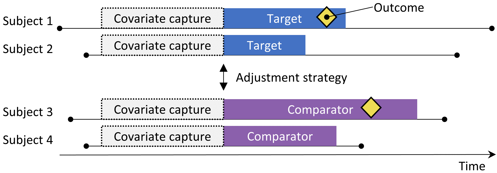
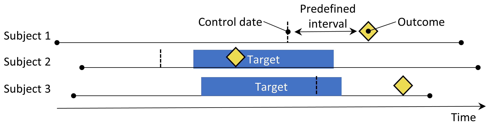
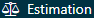
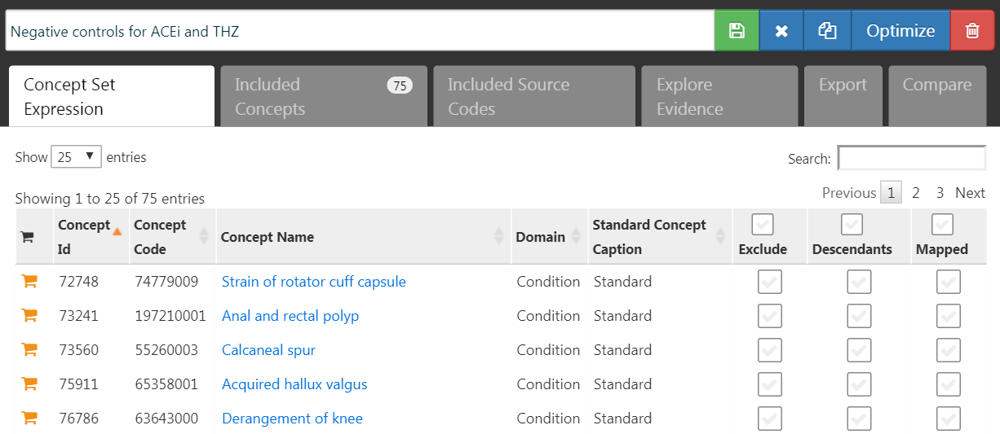
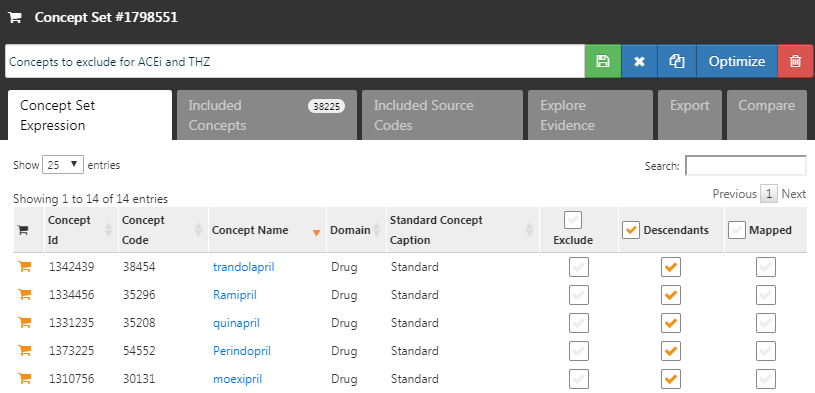
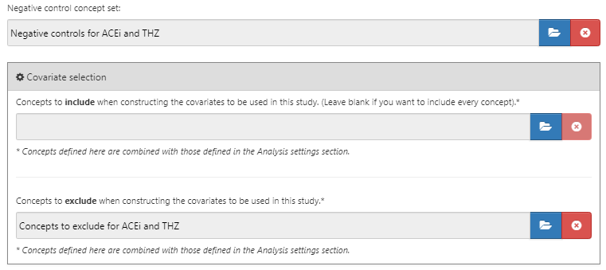
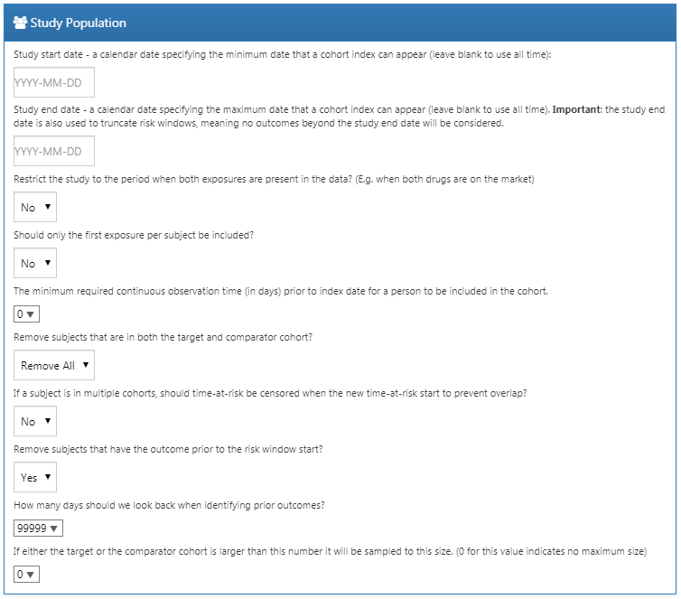
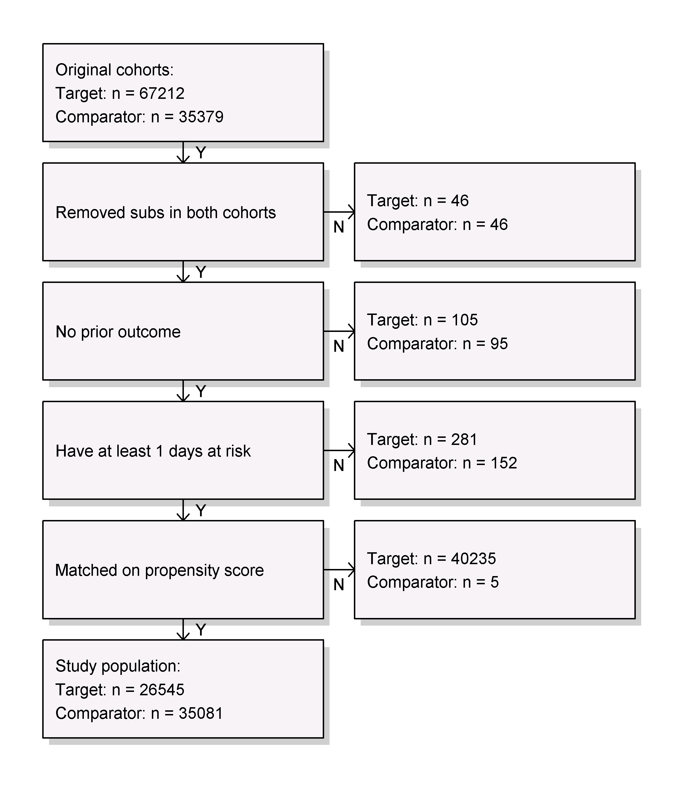
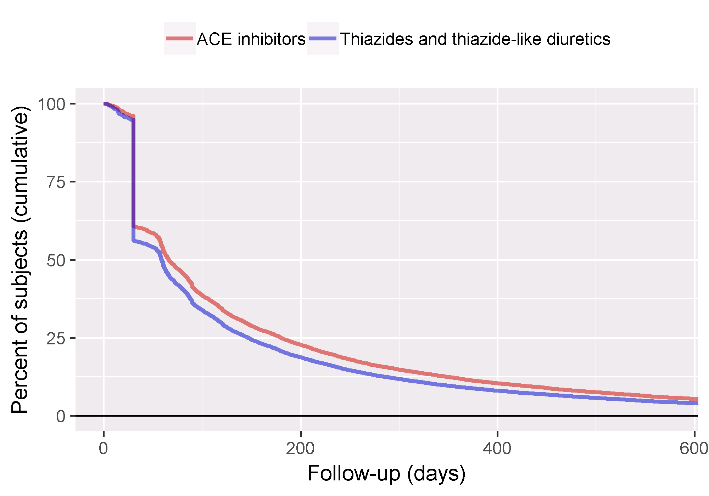

# Estimation au Niveau de la Population {#PopulationLevelEstimation}

*Responsables du chapitre : Martijn Schuemie, David Madigan, Marc Suchard & Patrick Ryan*

\index{estimation au niveau de la population}

Les données de santé observationnelles, telles que les réclamations administratives et les dossiers de santé électroniques, offrent des opportunités pour générer des preuves réelles sur l'effet des traitements qui peuvent améliorer significativement la vie des patients. Dans ce chapitre, nous nous concentrons sur l'estimation de l'effet au niveau de la population, qui se réfère à l'estimation des effets causals moyens des expositions (par exemple, des interventions médicales telles que des expositions médicamenteuses ou des procédures) sur des résultats de santé spécifiques. Nous considérons deux tâches différentes d'estimation :

- **Estimation de l'effet direct** : estimer l'effet d'une exposition sur le risque d'un résultat, par rapport à l'absence d'exposition. \index{estimation de l'effet direct}
- **Estimation comparative de l'effet** : estimer l'effet d'une exposition (l'exposition cible) sur le risque d'un résultat, par rapport à une autre exposition (l'exposition comparatrice). \index{estimation comparative de l'effet}

Dans les deux cas, l'effet causal au niveau du patient contraste un résultat factuel, c'est-à-dire ce qui est arrivé au patient exposé, avec un résultat contrefactuel, c'est-à-dire ce qui se serait produit si l'exposition n'avait pas eu lieu (direct) ou si une exposition différente avait eu lieu (comparatif). Étant donné qu'un patient ne révèle qu'un seul résultat factuel (le problème fondamental de l'inférence causale), les divers designs d'estimation d'effet emploient différents dispositifs analytiques pour éclairer les résultats contrefactuels. \index{contrefactuel}

Les cas d'utilisation pour l'estimation de l'effet au niveau de la population incluent la sélection des traitements, la surveillance de la sécurité et l'efficacité comparative. Les méthodes peuvent tester des hypothèses spécifiques une par une (par exemple, "évaluation du signal") ou explorer plusieurs hypothèses à la fois (par exemple, "détection du signal"). Dans tous les cas, l'objectif reste le même : produire une estimation de haute qualité de l'effet causal. \index{surveillance de la sécurité} \index{efficacité comparative|voir {estimation comparative de l'effet}}

Dans ce chapitre, nous décrivons d'abord divers designs d'études d'estimation au niveau de la population, qui sont tous implémentés en tant que packages R dans la [Bibliothèque de Méthodes OHDSI](https://ohdsi.github.io/MethodsLibrary/). Ensuite, nous détaillons le design d'une étude d'estimation exemple, suivie de guides pas à pas sur la manière de mettre en œuvre le design en utilisant ATLAS et R. Enfin, nous passons en revue les différentes sorties générées par l'étude, y compris les diagnostics de l'étude et les estimations de la taille de l'effet.

## La Méthode Cohorte {#CohortMethod}

\index{méthode cohorte}

```{r cohortMethod, fig.cap="Le design de la cohorte de nouveaux utilisateurs. Les sujets observés pour initier le traitement cible sont comparés à ceux initiant le traitement comparateur. Pour ajuster les différences entre les deux groupes de traitement, plusieurs stratégies d'ajustement peuvent être utilisées, telles que la stratification, l'appairage ou la pondération par le score de propension, ou en ajoutant des caractéristiques initiales au modèle de résultat. Les caractéristiques incluses dans le modèle de propension ou le modèle de résultat sont capturées avant l'initiation du traitement.",echo=FALSE, out.width='90%', fig.align='center'}

```

La méthode de cohorte tente d'émuler un essai clinique randomisé. [@hernan_2016] Les sujets observés pour initier un traitement (le cible) sont comparés aux sujets initiant un autre traitement (le comparateur) et sont suivis pendant une période spécifique après l'initiation du traitement, par exemple le temps qu'ils restent sous traitement. Nous pouvons spécifier les questions auxquelles nous souhaitons répondre dans une étude de cohorte en faisant les cinq choix mis en évidence dans le Tableau \@ref(tab:cmChoices). \index{cohorte cible!méthode cohorte} \index{cohorte comparatrice} \index{cohorte résultat!méthode cohorte}

Tableau: (\#tab:cmChoices) Principaux choix de conception dans un design de cohorte comparatif.

| Choix             | Description                                               |
|:----------------- |:--------------------------------------------------------- |
| Cohorte cible     | Une cohorte représentant le traitement cible              |
| Cohorte comparatrice | Une cohorte représentant le traitement comparateur       |
| Cohorte de résultat | Une cohorte représentant le résultat d'intérêt           |
| Temps à risque    | À quel moment (souvent par rapport aux dates de début et de fin des cohortes cible et comparatrice) considérons-nous le risque de résultat ?  |
| Modèle            | Le modèle utilisé pour estimer l'effet en ajustant les différences entre la cible et le comparateur  |

Le choix du modèle spécifie, entre autres, le type de modèle de résultat. Par exemple, nous pourrions utiliser une régression logistique, qui évalue si le résultat s'est produit ou non, et produit un odds ratio. Une régression logistique suppose que le temps à risque est de la même durée pour les deux groupes cible et comparateur, ou est sans importance. Alternativement, nous pourrions choisir une régression de Poisson qui estime le ratio de taux d'incidence, en supposant un taux d'incidence constant. Souvent, une régression de Cox est utilisée, qui considère le temps jusqu'au premier résultat pour estimer le rapport de risques, en supposant des risques proportionnels entre le groupe cible et le comparateur. \index{régression logistique} \index{régression de Poisson} \index{régression de Cox} \index{modèle des risques proportionnels de Cox|voir {régression de Cox}}

```{block2, type='rmdimportant'}
La méthode de cohorte de nouveaux utilisateurs est intrinsèquement une méthode d'estimation de l'effet comparatif, comparant un traitement à un autre. Il est difficile d'utiliser cette méthode pour comparer un traitement à l'absence de traitement, car il est difficile de définir un groupe de personnes non exposées comparable au groupe exposé. Si l'on veut utiliser ce design pour une estimation directe de l'effet, la manière préférée est de sélectionner un traitement comparateur pour la même indication que l'exposition d'intérêt, où le traitement comparateur est censé n'avoir aucun effet sur le résultat. Malheureusement, un tel comparateur peut ne pas toujours être disponible.
```

Une préoccupation majeure est que les patients recevant le traitement cible peuvent systématiquement différer de ceux recevant le traitement comparateur. Par exemple, supposons que la cohorte cible ait en moyenne 60 ans, tandis que la cohorte comparatrice ait en moyenne 40 ans. Comparer la cohorte cible à la cohorte comparatrice par rapport à tout résultat de santé lié à l'âge (par exemple, un AVC) pourrait alors montrer des différences substantielles entre les cohortes. Un enquêteur non informé pourrait conclure qu'il existe une association causale entre le traitement cible et l'AVC par rapport au comparateur. Plus prosaïquement ou couramment, l'enquêteur pourrait conclure qu'il existe des patients cibles ayant subi un AVC qui ne l'auraient pas fait s'ils avaient reçu le comparateur. Cette conclusion pourrait bien être entièrement incorrecte ! Peut-être que ces patients cibles ont disproportionnellement subi un AVC simplement parce qu'ils sont plus âgés ; peut-être que les patients cibles qui ont subi un AVC l'auraient bien fait même s'ils avaient reçu le comparateur. Dans ce contexte, l'âge est un "facteur de confusion". Un mécanisme pour gérer les facteurs de confusion dans les études observationnelles est à travers les scores de propension. \index{facteur de confusion}

### Scores de Propension

\index{score de propension}

Dans un essai randomisé, un tirage à pile ou face (virtuel) assigne les patients à leurs groupes respectifs. Ainsi, par conception, la probabilité qu'un patient reçoive le traitement cible par rapport au traitement comparateur n'a aucun rapport avec les caractéristiques des patients telles que l'âge. La pièce de monnaie ne connait pas le patient, et, qui plus est, nous connaissons avec certitude la probabilité exacte qu'un patient reçoive l'exposition cible. En conséquence, et avec une confiance croissante à mesure que le nombre de patients dans l'essai augmente, les deux groupes de patients ne peuvent essentiellement pas différer systématiquement en ce qui concerne n'importe quelle caractéristique des patients. Cet équilibre garanti est vrai pour les caractéristiques que l'essai a mesurées (comme l'âge) ainsi que pour les caractéristiques que l'essai n'a pas mesurées, telles que les facteurs génétiques des patients. \index{essai randomisé}

Pour un patient donné, le *score de propension* (PS) est la probabilité que ce patient ait reçu le traitement cible par rapport au comparateur. [@rosenbaum_1983] Dans un essai randomisé équilibré à deux bras, le score de propension est de 0,5 pour chaque patient. Dans une étude observationnelle ajustée par score de propension, nous estimons la probabilité qu'un patient reçoive le traitement cible en fonction de ce que nous pouvons observer dans les données avant et au moment de l'initiation du traitement (indépendamment du traitement qu'ils ont effectivement reçu).  Il s'agit d'une application de modélisation prédictive simple ; nous ajustons un modèle (par exemple, une régression logistique) qui prédit si un sujet reçoit le traitement cible, et utilisons ce modèle pour générer des probabilités prédites (le PS) pour chaque sujet. Contrairement à un essai randomisé standard, différents patients auront différentes probabilités de recevoir le traitement cible. Le PS peut être utilisé de plusieurs façons, y compris en appariant des sujets cibles à des sujets comparateurs ayant un PS similaire, en stratifiant la population étudiée en fonction du PS, ou en pondérant les sujets en utilisant la pondération par probabilité inverse de traitement (IPTW) dérivée du PS. Lors de l'appariement, nous pouvons sélectionner un seul sujet comparateur pour chaque sujet cible, ou nous pouvons permettre plus d'un sujet comparateur par sujet cible, une technique connue sous le nom d'appariement à ratio variable. [@rassen_2012] \index{modèle de propension} \index{score de propension!appariement} \index{score de propension!stratification} \index{score de propension!pondération} \index{pondération par probabilité inverse de traitement (IPTW)|voir {score de propension!pondération}} \index{appariement à ratio variable}

Par exemple, supposons que nous utilisions un appariement PS un à un, et que Jan ait une probabilité a priori de 0,4 de recevoir le traitement cible et reçoive en fait le traitement cible. Si nous pouvons trouver un patient (nommé Jun) qui avait également une probabilité a priori de 0,4 de recevoir le traitement cible mais a en fait reçu le comparateur, la comparaison des résultats de Jan et Jun ressemble à un mini-essai randomisé, du moins en ce qui concerne les facteurs de confusion mesurés. Cette comparaison permettra d'estimer le contraste causal Jan-Jun aussi bien que la randomisation l'aurait fait. L'estimation se fait alors comme suit : pour chaque patient ayant reçu le traitement cible, trouver un ou plusieurs patients appariés ayant reçu le comparateur mais avec la même probabilité préalable de recevoir le traitement cible. Comparer le résultat pour le patient cible avec les résultats pour les patients comparateurs au sein de chacun de ces groupes appariés.

Le scoring par propension contrôle les facteurs de confusion mesurés. En fait, si l'affectation au traitement est « fortement ignorable » étant donné les caractéristiques mesurées, le scoring par propension fournira une estimation non biaisée de l'effet causal. « Fortement ignorable » signifie essentiellement qu'il n'existe pas de facteurs de confusion non mesurés, et que les facteurs de confusion mesurés sont correctement ajustés. Malheureusement, cette hypothèse n'est pas testable. Voir le Chapitre \@ref(MethodValidity) pour une discussion plus poussée de cette question. \index{fortement ignorable}

### Sélection des Variables {#VariableSelection}

Dans le passé, les PS étaient calculés sur la base de caractéristiques sélectionnées manuellement, et bien que les outils OHDSI puissent prendre en charge de telles pratiques, nous préférons utiliser de nombreuses caractéristiques génériques (c'est-à-dire des caractéristiques qui ne sont pas sélectionnées en fonction des expositions et résultats spécifiques de l'étude). [@tian_2018] Ces caractéristiques incluent les données démographiques, ainsi que tous les diagnostics, expositions aux médicaments, mesures et procédures médicales observées avant et le jour de l'initiation du traitement. Un modèle implique généralement de 10 000 à 100 000 caractéristiques uniques, que nous ajustons à l'aide de la régression régularisée à grande échelle [@suchard_2013] implémentée dans le package [Cyclops](https://ohdsi.github.io/Cyclops/). Essentiellement, nous laissons les données décider quelles caractéristiques sont prédictives de l'affectation au traitement et doivent être incluses dans le modèle.

```{block2, type='rmdimportant'}
Nous incluons généralement le jour de l'initiation du traitement dans la fenêtre de capture des covariables, car de nombreux points de données pertinents, tels que le diagnostic conduisant au traitement, sont enregistrés à cette date. Ce jour-là, les traitements cible et comparateur eux-mêmes sont également enregistrés, mais ceux-ci ne doivent *pas* être inclus dans le modèle de propension, car ils sont précisément ce que nous essayons de prédire. Nous devons donc explicitement exclure les traitements cible et comparateur de l'ensemble des covariables
```

Certains ont soutenu qu'une approche de sélection des covariables fondée sur les données, qui ne dépend pas de l'expertise clinique pour spécifier la "bonne" structure causale, court le risque d'inclure par erreur des variables instrumentales et des colliders, augmentant ainsi la variance et potentiellement introduisant un biais. [@hernan_2002] Cependant, ces préoccupations sont peu susceptibles d'avoir un impact important dans des scénarios du monde réel. [@schneeweiss_2018] De plus, en médecine, la véritable structure causale est rarement connue, et lorsqu'on demande à différents chercheurs d'identifier les « bonnes » covariables à inclure pour une question de recherche spécifique, chaque chercheur viendra invariablement avec une liste différente, rendant ainsi le processus irréprochable. Plus important encore, nos diagnostics tels que l'inspection du modèle de propension, l'évaluation de l'équilibre sur toutes les covariables, et l'inclusion de contrôles négatifs identifieraient la plupart des problèmes liés aux colliders et aux variables instrumentales. \index{variables instrumentales} \index{colliders}

### Caliper

\index{caliper}

Étant donné que les scores de propension se situent sur un continuum de 0 à 1, l'appariement exact est rarement possible. Au lieu de cela, le processus d'appariement trouve des patients qui correspondent au score de propension d'un ou de plusieurs patients cibles dans une certaine tolérance connue sous le nom de “caliper”. Suivant @austin_2011, nous utilisons un caliper par défaut de 0,2 écarts types sur l'échelle logique.

### Chevauchement : Scores de Préférence

\index{score de préférence}

La méthode de propension nécessite que des patients appariés existent ! En tant que tel, un diagnostic clé montre la distribution des scores de propension dans les deux groupes. Pour faciliter l'interprétation, les outils OHDSI tracent une transformation du score de propension appelée le "score de préférence". [@walker_2013] Le score de préférence ajuste pour la "part de marché" des deux traitements. Par exemple, si 10 % des patients reçoivent le traitement cible (et 90 % reçoivent le traitement comparateur), alors les patients avec un score de préférence de 0,5 ont une probabilité de 10 % de recevoir le traitement cible. Mathématiquement, le score de préférence est

$$\ln\left(\frac{F}{1-F}\right)=\ln\left(\frac{S}{1-S}\right)-\ln\left(\frac{P}{1-P}\right)$$

Où $F$ est le score de préférence, $S$ est le score de propension, et $P$ est la proportion de patients recevant le traitement cible.

@walker_2013 discutent du concept d' "équipoise empirique." Ils acceptent les paires d'exposition comme émergeant de l'équipoise empirique si au moins la moitié des expositions sont pour des patients avec un score de préférence entre 0,3 et 0,7. \index{équipoise clinique}

### Équilibre

\index{équilibre des covariables} \index{équilibre|voir {équilibre des covariables}}

Une bonne pratique vérifie toujours que l'ajustement du PS réussit à créer des groupes équilibrés de patients. La Figure \@ref(fig:balance) montre la sortie standard OHDSI pour vérifier l'équilibre. Pour chaque caractéristique du patient, cela trace la différence standardisée entre les moyennes des deux groupes d'exposition avant et après l'ajustement du PS. Certaines lignes directrices recommandent une limite supérieure de différence standardisée après ajustement de 0,1. [@rubin_2001]
## Le Design de Cohorte Auto-Contrôlée

\index{self-controlled cohort design}

```{r scc, fig.cap="Le design de cohorte auto-contrôlée. Le taux d'événements pendant l'exposition à l'élément cible est comparé au taux d'événements dans le temps précédent l'exposition.", echo=FALSE, out.width='90%', fig.align='center', fig.pos='h'}
knitr::include_graphics("images/PopulationLevelEstimation/selfControlledCohort.png")
```

Le design de cohorte auto-contrôlée (SCC) [@ryan_2013] compare le taux d'événements pendant l'exposition au taux d'événements dans le temps juste avant l'exposition. Les quatre choix montrés dans le Tableau \@ref(tab:sccChoices) définissent une question de cohorte auto-contrôlée. \index{target cohort!self-controlled cohort design} \index{outcome cohort!self-controlled cohort design}

```{r sccChoices, echo=FALSE}
table <- read.table(header = TRUE, sep = "|", stringsAsFactors = FALSE, strip.white = TRUE, text = "
| Choix            | Description                                              |
|:----------------- |:-------------------------------------------------------- |
| Cohorte cible     | Une cohorte représentant le traitement                      |
| Cohorte de résultats    | Une cohorte représentant le résultat d'intérêt            |
| Temps à risque      | À quel moment (souvent par rapport aux dates de début et de fin de la cohorte cible) considérons-nous le risque de l'événement ?  |
| Temps de contrôle      | La période utilisée comme temps de contrôle                 |
")
table <- table[-1, 2:(ncol(table) - 1), -1]
table <- knitr::kable(table, caption = "Principaux choix de conception dans un design de cohorte auto-contrôlée.", booktabs = TRUE, row.names = FALSE)
if ( knitr:::is_latex_output()) {
  table <- kableExtra::kable_styling(table, full_width = FALSE)
  table <- kableExtra::column_spec(table, 2, width = "9cm")
}
table
```

Parce que les mêmes sujets qui composent le groupe exposé sont également utilisés comme groupe de contrôle, aucun ajustement des différences entre les personnes n'est nécessaire. Cependant, la méthode est vulnérable à d'autres différences, telles que les différences dans le risque de base de l'événement entre différentes périodes.


## Le Design Cas-Témoin

\index{case-control design}

```{r caseControl, fig.cap="Le design cas-témoin. Les sujets avec l'événement (‘cas’) sont comparés aux sujets sans l'événement (‘témoins’) en termes de leur statut d'exposition. Souvent, les cas et les témoins sont appariés sur diverses caractéristiques telles que l'âge et le sexe.", echo=FALSE, out.width='90%', fig.align='center', fig.pos='h'}
knitr::include_graphics("images/PopulationLevelEstimation/caseControl.png")
```

Les études cas-témoins [@vandenbroucke_2012] considèrent la question "les personnes ayant un résultat spécifique de maladie sont-elles exposées plus fréquemment à un agent spécifique que celles sans la maladie?" Ainsi, l'idée centrale est de comparer les "cas", c'est-à-dire les sujets qui éprouvent le résultat d'intérêt, avec les "témoins", c'est-à-dire les sujets qui n'ont pas éprouvé le résultat d'intérêt. Les choix dans le Tableau \@ref(tab:ccChoices) définissent une question de cas-témoin. \index{outcome cohort!case-control design} \index{target cohort!case-control design} \index{nesting cohort!case-control design}

```{r ccChoices, echo=FALSE}
table <- read.table(header = TRUE, sep = "|", stringsAsFactors = FALSE, strip.white = TRUE, text = "
| Choix            | Description                                               |
|:----------------- |:--------------------------------------------------------- |
| Cohorte de résultats    | Une cohorte représentant les cas (le résultat d'intérêt) |
| Cohorte de témoins    | Une cohorte représentant les témoins. Typiquement, la cohorte de témoins est dérivée automatiquement de la cohorte de résultats en utilisant une certaine logique de sélection |
| Cohorte cible     | Une cohorte représentant le traitement                       |
| Cohorte de nidification  | Optionnellement, une cohorte définissant la sous-population d'où sont tirés les cas et les témoins  |
| Temps à risque      | À quel moment (souvent par rapport à la date d'indexation) considérons-nous le statut d'exposition ?  |
")
table <- table[-1, 2:(ncol(table) - 1), -1]
table <- knitr::kable(table, caption = "Principaux choix de conception dans un design cas-témoin.", booktabs = TRUE, row.names = FALSE)
if ( knitr:::is_latex_output()) {
  table <- kableExtra::kable_styling(table, full_width = FALSE)
  table <- kableExtra::column_spec(table, 2, width = "9cm")
}
table
```

Souvent, on choisit des témoins pour correspondre aux cas en fonction de caractéristiques telles que l'âge et le sexe afin de les rendre plus comparables. Une autre pratique courante est de nicher l'analyse dans un sous-groupe spécifique de personnes, par exemple des personnes ayant toutes été diagnostiquées avec une des indications de l'exposition d'intérêt.


## Le Design de Cas-Croisés

\index{case-crossover design}

```{r caseCrossover, fig.cap="Le design de cas-croisés. Le temps autour de l'événement est comparé à une date de contrôle fixée à un intervalle prédéfini avant la date de l'événement.", echo=FALSE, out.width='90%', fig.align='center', fig.pos='h'}

```

Le design de cas-croisés [@maclure_1991] évalue si le taux d'exposition est différent au moment de l'événement qu'à un certain nombre de jours prédéfinis avant l'événement. Il cherche à déterminer s'il y a quelque chose de spécial à propos du jour où l'événement s'est produit. Le Tableau \@ref(tab:ccrChoices) montre les choix qui définissent une question de cas-croisés. \index{outcome cohort!case-crossover design} \index{target cohort!case-crossover design}

```{r ccrChoices, echo=FALSE}
table <- read.table(header = TRUE, sep = "|", quote = "\"", stringsAsFactors = FALSE, strip.white = TRUE, text = "
| Choix            | Description                                              |
|:----------------- |:-------------------------------------------------------- |
| Cohorte de résultats    | Une cohorte représentant les cas (le résultat d'intérêt)  |
| Cohorte cible     | Une cohorte représentant le traitement  |
| Temps à risque      | À quel moment (souvent par rapport à la date d'indexation) considérons-nous le statut d'exposition ?  |
| Temps de contrôle      | La période utilisée comme temps de contrôle                 |
")
table <- table[-1, 2:(ncol(table) - 1), -1]
table <- knitr::kable(table, caption = "Principaux choix de conception dans un design de cas-croisés.", booktabs = TRUE, row.names = FALSE)
if ( knitr:::is_latex_output()) {
  table <- kableExtra::kable_styling(table, full_width = FALSE)
  table <- kableExtra::column_spec(table, 2, width = "9cm")
}
table
```

Les cas servent de leurs propres témoins. En tant que designs auto-contrôlés, ils devraient être robustes pour les biais dus aux différences entre les personnes. Une préoccupation est que, parce que la date de l'événement est toujours postérieure à la date de contrôle, la méthode sera biaisée positivement si la fréquence globale de l'exposition augmente avec le temps (ou biaisée négativement s'il y a une diminution). Pour y remédier, le design de contrôle du temps des cas [@suissa_1995] a été développé, qui ajoute des témoins, appariés par exemple sur l'âge et le sexe, au design de cas-croisés pour ajuster les tendances d'exposition. \index{case-time-control design}
## Le Design des Séries de Cas Auto-Contrôlées

\index{self-controlled case series (SCCS) design}

```{r selfControlledCaseSeries, fig.cap="The Self-Controlled Case Series design. The rate of outcomes during exposure is compared to the rate of outcomes when not exposed.",echo=FALSE, out.width='90%', fig.align='center', fig.pos='h'}
knitr::include_graphics("images/PopulationLevelEstimation/selfControlledCaseSeries.png")
```

Le design des séries de cas auto-contrôlées (SCCS) [@farrington_1995; @whitaker_2006] compare le taux de résultats pendant l'exposition au taux de résultats pendant tout le temps non exposé, y compris avant, entre et après les expositions. Il s'agit d'une régression de Poisson conditionnée sur la personne. Ainsi, il cherche à répondre à la question : « Étant donné qu'un patient a le résultat, est-il plus probable que le résultat se produise pendant le temps exposé par rapport au temps non exposé ? ». Les choix dans le Tableau \@ref(tab:sccsChoices) définissent une question SCCS. \index{outcome cohort!SCCS design} \index{target cohort!SCCS design}

```{r sccsChoices, echo=FALSE}
table <- read.table(header = TRUE, sep = "|", stringsAsFactors = FALSE, strip.white = TRUE, text = "
| Choice            | Description                                              |
|:----------------- |:-------------------------------------------------------- |
| Target cohort     | Un cohort représentant le traitement                      |
| Outcome cohort    | Un cohort représentant le résultat d'intérêt            |
| Time-at-risk      | À quel moment (souvent par rapport aux dates de début et de fin du cohort cible) considérons-nous le risque de résultat ?  |
| Model             | Le modèle pour estimer l'effet, y compris les ajustements pour les facteurs de confusion variables dans le temps |
")
table <- table[-1, 2:(ncol(table) - 1), -1]
table <- knitr::kable(table, caption = "Principaux choix de conception dans un design de séries de cas auto-contrôlées.", booktabs = TRUE, row.names = FALSE)
if ( knitr:::is_latex_output()) {
  table <- kableExtra::kable_styling(table, full_width = FALSE)
  table <- kableExtra::column_spec(table, 2, width = "9cm")
}
table
```

Comme d'autres designs auto-contrôlés, le SCCS est robuste aux biais de confusion dus aux différences entre les personnes, mais vulnérable aux biais de confusion dus aux effets variables dans le temps. Plusieurs ajustements sont possibles pour tenter de les prendre en compte, par exemple en incluant l'âge et la saison. Une variante spéciale du SCCS inclut non seulement l'exposition d'intérêt, mais aussi toutes les autres expositions aux médicaments enregistrés dans la base de données [@simpson_2013], ajoutant potentiellement des milliers de variables supplémentaires au modèle. La régularisation L1 avec sélection du paramètre d'hyper-régularisation par validation croisée est appliquée aux coefficients de toutes les expositions sauf l'exposition d'intérêt.

Une hypothèse importante sous-jacente au SCCS est que la fin de la période d'observation est indépendante de la date du résultat. Pour certains résultats, en particulier ceux qui peuvent être fatals comme un AVC, cette hypothèse peut être violée. Une extension du SCCS a été développée pour corriger toute dépendance de ce type [@farrington_2011].

## Concevoir une Étude sur l'Hypertension

### Définition du Problème

Les inhibiteurs de l'enzyme de conversion de l'angiotensine (IEC) sont largement utilisés chez les patients souffrant d'hypertension ou de cardiopathie ischémique, en particulier ceux ayant d'autres comorbidités telles que l'insuffisance cardiaque congestive, le diabète sucré ou la maladie rénale chronique [@zaman_2002]. L'angio-œdème, un effet indésirable grave et parfois mortel qui se manifeste généralement par un gonflement des lèvres, de la langue, de la bouche, du larynx, du pharynx ou de la région périorbitaire, a été lié à l'utilisation de ces médicaments [@sabroe_1997]. Cependant, les informations disponibles sur les risques absolus et relatifs pour l'angio-œdème associés à l'utilisation de ces médicaments sont limitées. Les preuves existantes sont principalement basées sur des investigations de cohortes spécifiques (par exemple, des anciens combattants essentiellement masculins ou des bénéficiaires de Medicaid) dont les résultats peuvent ne pas être généralisables à d'autres populations, ou basées sur des enquêtes avec peu d'événements, ce qui fournit des estimations de risque instables [@powers_2012]. Plusieurs études observationnelles comparent les IEC aux bêta-bloquants pour le risque d'angio-œdème, [@magid_2010; @toh_2012] mais les bêta-bloquants ne sont plus recommandés comme traitement de première ligne de l'hypertension [@whelton_2018]. Un traitement alternatif viable pourrait être les thiazides ou les diurétiques de type thiazidique (THZ), qui pourraient être tout aussi efficaces dans la gestion de l'hypertension et de ses risques associés tels que l'infarctus aigu du myocarde (IAM), sans augmenter le risque d'angio-œdème.

Ce qui suit démontrera comment appliquer notre cadre d'estimation au niveau de la population aux données de soins de santé observationnelles pour répondre aux questions d'estimation comparative suivantes :

> Quel est le risque d'angio-œdème chez les nouveaux utilisateurs d'inhibiteurs de l'enzyme de conversion de l'angiotensine par rapport aux nouveaux utilisateurs de thiazides et de diurétiques de type thiazidique ?

> Quel est le risque d'infarctus aigu du myocarde chez les nouveaux utilisateurs d'inhibiteurs de l'enzyme de conversion de l'angiotensine par rapport aux nouveaux utilisateurs de thiazides et de diurétiques de type thiazidique ?

Étant donné que ces questions concernent l'estimation comparative des effets, nous appliquerons la méthode de cohortes comme décrit dans la section \@ref(CohortMethod).

### Cible et Comparateur

Nous considérons les patients comme nouveaux utilisateurs si leur premier traitement observé pour l'hypertension était une monothérapie avec un ingrédient actif de la classe des IEC ou des THZ. Nous définissons la monothérapie comme l'absence de début d'un autre médicament antihypertenseur dans les sept jours suivant le début du traitement. Nous exigeons que les patients aient au moins un an d'observation continue dans la base de données avant la première exposition et un diagnostic d'hypertension enregistré à ou dans l'année précédant le début du traitement.

### Résultat

Nous définissons l'angio-œdème comme toute occurrence d'un concept de condition d'angio-œdème lors d'une visite en hospitalisation ou aux urgences, et exigeons qu'il n'y ait pas de diagnostic d'angio-œdème enregistré dans les sept jours précédents. Nous définissons l'IAM comme toute occurrence d'un concept de condition de l'IAM lors d'une visite en hospitalisation ou aux urgences, et exigeons qu'il n'y ait pas de diagnostic d'IAM enregistré dans les 180 jours précédents.

### Temps à Risque

Nous définissons le temps à risque comme commençant le jour suivant le début du traitement et se terminant lorsque l'exposition cesse, en permettant un intervalle de 30 jours entre les expositions successives aux médicaments.

### Modèle

Nous ajustons un modèle PS en utilisant l'ensemble par défaut de covariables, y compris les données démographiques, les conditions, les médicaments, les procédures, les mesures, les observations et plusieurs scores de comorbidité. Nous excluons les IEC et les THZ des covariables. Nous effectuons un appariement à ratio variable et conditionnons la régression de Cox sur les ensembles appariés.

### Résumé de l'Étude

Tableau: (\#tab:aceChoices) Principaux choix de conception pour notre étude de cohortes comparative.

| Choix            | Valeur                                                    |
|:----------------- |:-------------------------------------------------------- |
| Cohorte cible     | Nouveaux utilisateurs d'inhibiteurs de l'enzyme de conversion de l'angiotensine en monothérapie de première ligne pour l'hypertension. |
| Cohorte comparateur | Nouveaux utilisateurs de thiazides ou de diurétiques de type thiazidique en monothérapie de première ligne pour l'hypertension. |
| Cohorte de résultats    | Angio-œdème ou infarctus aigu du myocarde. |
| Temps à risque      | Commence le jour suivant le début du traitement, se termine lorsque l'exposition cesse. |
| Modèle             | Modèle à risques proportionnels de Cox en utilisant un appariement à ratio variable. |

### Questions de Contrôle

Pour évaluer si notre conception d'étude produit des estimations conformes à la réalité, nous incluons également un ensemble de questions de contrôle où la taille de l'effet réel est connue. Les questions de contrôle peuvent être divisées en contrôles négatifs, ayant un ratio de risques de 1, et contrôles positifs, ayant un ratio de risques connu supérieur à 1. Pour plusieurs raisons, nous utilisons des contrôles négatifs réels et synthétisons des contrôles positifs basés sur ces contrôles négatifs. Comment définir et utiliser les questions de contrôle est discuté en détail dans le chapitre \@ref(MethodValidity).
## Implementation de l'étude à l'aide d'ATLAS {#PleAtlas}

Nous démontrons ici comment cette étude peut être mise en œuvre en utilisant la fonction Estimation dans ATLAS. Cliquez sur  dans la barre de gauche d'ATLAS et créez une nouvelle étude d'estimation. Assurez-vous de donner à l'étude un nom facile à reconnaître. Le design de l'étude peut être sauvegardé à tout moment en cliquant sur le bouton .

Dans la fonction de design d'Estimation, il y a trois sections : Comparaisons, Paramètres d'analyse et Paramètres d'évaluation. Nous pouvons spécifier plusieurs comparaisons et plusieurs paramètres d'analyse, et ATLAS exécutera toutes les combinaisons de ceux-ci comme des analyses séparées. Nous discutons ici de chaque section :

### Paramètres de cohorte comparative {#ComparisonSettings}

Une étude peut comporter une ou plusieurs comparaisons. Cliquez sur "Ajouter une comparaison", ce qui ouvrira une nouvelle boîte de dialogue. Cliquez sur  pour sélectionner les cohortes cibles et comparatives. En cliquant sur "Ajouter un résultat", nous pouvons ajouter nos deux cohortes de résultats. Nous supposons que les cohortes ont déjà été créées dans ATLAS comme décrit dans le Chapitre \@ref(Cohorts). L'Annexe fournit les définitions complètes des cohortes cibles (Annexe \@ref(AceInhibitorsMono)), comparateurs (Annexe \@ref(ThiazidesMono)), et de résultats (Annexe \@ref(Angioedema) et Annexe \@ref(Ami)). Une fois terminé, la boîte de dialogue devrait ressembler à la Figure \@ref(fig:comparisons).

```{r comparisons, fig.cap="The comparison dialog", echo=FALSE, out.width='100%', fig.align='center'}
knitr::include_graphics("images/PopulationLevelEstimation/comparisons.png")
```

Notez que nous pouvons sélectionner plusieurs résultats pour une paire cible-comparateur. Chaque résultat sera traité indépendamment et donnera lieu à une analyse séparée.

#### Résultats de contrôle négatif {-}

Les résultats de contrôle négatif sont des résultats qui ne sont pas censés être causés par la cible ou le comparateur, de sorte que le vrai ratio de risque est de 1. Idéalement, nous aurions des définitions de cohorte appropriées pour chaque cohorte de résultat. Cependant, en général, nous avons seulement un ensemble de concepts, avec un concept par résultat de contrôle négatif, et une certaine logique standard pour les convertir en cohortes de résultats. Ici, nous supposons que l'ensemble de concepts a déjà été créé comme décrit dans le Chapitre \@ref(MethodValidity), et peut simplement être sélectionné. L'ensemble de concepts de contrôle négatif devrait contenir un concept par contrôle négatif, et ne pas inclure les descendants. La Figure \@ref(fig:ncConceptSet) montre l'ensemble de concepts de contrôle négatif utilisé pour cette étude.

```{r ncConceptSet, fig.cap="Negative Control concept set.", echo=FALSE, out.width='100%', fig.align='center'}

```

#### Concepts à inclure {-}

Lors de la sélection des concepts à inclure, nous pouvons spécifier quelles covariables nous souhaitons générer, par exemple pour les utiliser dans un modèle de propension. Lorsque nous spécifions des covariables ici, toutes les autres covariables (en dehors de celles que vous avez spécifiées) sont exclues. Nous voulons généralement inclure toutes les covariables de base, laissant la régression régularisée construire un modèle qui équilibre toutes les covariables. La seule raison pour laquelle nous pourrions vouloir spécifier des covariables particulières est de reproduire une étude existante qui a sélectionné manuellement des covariables. Ces inclusions peuvent être spécifiées dans cette section de comparaison ou dans la section d'analyse, car parfois elles concernent une comparaison spécifique (par exemple, des confondants connus dans une comparaison), ou parfois elles concernent une analyse (par exemple, lors de l'évaluation d'une stratégie spécifique de sélection des covariables).

#### Concepts à exclure {-}

Plutôt que de spécifier quels concepts inclure, nous pouvons spécifier les concepts à *exclure*. Lorsque nous soumettons un ensemble de concepts dans ce champ, nous utilisons toutes les covariables sauf celles que nous avons soumises. Lors de l'utilisation de l'ensemble par défaut de covariables, qui inclut tous les médicaments et procédures survenant le jour de l'initiation du traitement, nous devons exclure le traitement cible et comparateur ainsi que tous les concepts directement liés à ceux-ci. Par exemple, si l'exposition cible est une injection, nous devrions non seulement exclure le médicament, mais aussi la procédure d'injection du modèle de propension. Dans cet exemple, les covariables que nous voulons exclure sont ACEi et THZ. La Figure \@ref(fig:covsToExclude) montre que nous sélectionnons un ensemble de concepts incluant tous ces concepts, y compris leurs descendants.

```{r covsToExclude, fig.cap="The concept set defining the concepts to exclude.", echo=FALSE, out.width='100%', fig.align='center'}

```

Après avoir sélectionné les contrôles négatifs et les covariables à exclure, la moitié inférieure de la boîte de dialogue des comparaisons devrait ressembler à la Figure \@ref(fig:comparisons2).

```{r comparisons2, fig.cap="The comparison window showing concept sets for negative controls and concepts to exclude.", echo=FALSE, out.width='100%', fig.align='center'}

```

### Paramètres d'analyse de l'estimation des effets

Après avoir fermé la boîte de dialogue des comparaisons, nous pouvons cliquer sur "Ajouter des paramètres d'analyse". Dans la boîte intitulée "Nom de l'analyse", nous pouvons donner à l'analyse un nom unique facile à mémoriser et à localiser ultérieurement. Par exemple, nous pourrions nommer l'analyse "Appariement sur le score de propension".

#### Population de l'étude {-}

Il existe une large gamme d'options pour spécifier la population de l'étude, qui est l'ensemble des sujets qui entreront dans l'analyse. Beaucoup de ces options chevauchent les options disponibles lors de la conception des cohortes cibles et comparatives dans l'outil de définition de cohorte. Une raison d'utiliser les options d'Estimation au lieu de la définition de cohorte est la réutilisabilité ; nous pouvons définir les cohortes cibles, comparateurs et de résultats de manière totalement indépendante, et ajouter des dépendances entre elles à un moment ultérieur. Par exemple, si nous souhaitons supprimer les personnes ayant eu le résultat avant l'initiation du traitement, nous pourrions le faire dans les définitions des cohortes cibles et comparateurs, mais alors nous aurions besoin de créer des cohortes séparées pour chaque résultat ! Au lieu de cela, nous pouvons choisir de supprimer les personnes ayant des résultats antérieurs dans les paramètres d'analyse, et maintenant nous pouvons réutiliser nos cohortes cibles et comparateurs pour nos deux résultats d'intérêt (ainsi que pour nos résultats de contrôle négatif).

Les **dates de début et de fin de l'étude** peuvent être utilisées pour limiter les analyses à une période spécifique. La date de fin de l'étude tronque également les fenêtres de risque, ce qui signifie qu'aucun résultat au-delà de la date de fin de l'étude ne sera pris en compte. Une raison de sélectionner une date de début d'étude pourrait être que l'un des médicaments étudiés est nouveau et n'existait pas auparavant. Ajuster automatiquement cela peut être fait en répondant "oui" à la question "**Restreindre l'analyse à la période où les deux expositions sont présentes dans les données ?**". Une autre raison d'ajuster les dates de début et de fin de l'étude pourrait être que la pratique médicale a changé au fil du temps (par exemple, en raison d'un avertissement sur un médicament) et nous n'intéressons qu'à la période où la médecine était pratiquée d'une certaine manière.

L'option "**Ne faut-il inclure que la première exposition par sujet ?**" peut être utilisée pour restreindre à la première exposition par patient. Souvent cela est déjà fait dans la définition de la cohorte, comme c'est le cas dans cet exemple. De même, l'option "**Le temps minimum d'observation continue requis avant la date d'index pour qu'une personne soit incluse dans la cohorte**" est souvent déjà définie dans la définition de la cohorte et peut donc être laissée à 0 ici. Avoir une période d'observation (telle que définie dans la table OBSERVATION_PERIOD) avant la date d’index assure qu'il y a suffisamment d'informations sur le patient pour calculer un score de propension, et est également souvent utilisé pour garantir que le patient est vraiment un nouvel utilisateur, et n'a donc pas été exposé auparavant.

"**Supprimer les sujets qui sont dans les cohortes target et comparator ?**" définit, avec l'option "**Si un sujet est dans plusieurs cohortes, faut-il censurer le temps-à-risque lorsque le nouveau temps-à-risque commence pour éviter le chevauchement ?**" ce qui se passe lorsqu'un sujet est dans les cohortes cibles et comparateurs. Le premier paramètre a trois choix :

- "**Garder tout**" indiquant de conserver les sujets dans les deux cohortes. Avec cette option, il pourrait être possible de compter deux fois les sujets et les résultats.
- "**Garder le premier**" indiquant de conserver le sujet dans la première cohorte qui s'est produite.
- "**Supprimer tout**" indiquant de supprimer le sujet des deux cohortes.

Si les options "tout garder" ou "garder le premier" sont sélectionnées, nous pourrions vouloir censurer le temps quand une personne est dans les deux cohortes. Cela est illustré à la Figure \@ref(fig:tar). Par défaut, le temps-à-risque est défini par rapport à la date de début et de fin de la cohorte. Dans cet exemple, le temps-à-risque commence un jour après l'entrée dans la cohorte et se termine à la fin de la cohorte. Sans censurer le temps-à-risque, les temps-à-risque des deux cohortes pourraient se chevaucher. Cela est particulièrement problématique si nous choisissons de tout garder, car tout résultat qui se produit pendant ce chevauchement (comme indiqué) sera compté deux fois. Si nous choisissons de censurer, le temps-à-risque de la première cohorte se termine lorsque le temps-à-risque de la deuxième cohorte commence.

```{r tar, fig.cap="Time-at-risk (TAR) for subjects who are in both cohorts, assuming time-at-risk starts the day after treatment initiation, and stops at exposure end.", echo=FALSE, out.width='90%', fig.align='center'}
knitr::include_graphics("images/PopulationLevelEstimation/tar.png")
```

Nous pouvons choisir de **supprimer les sujets ayant eu le résultat avant le début de la fenêtre de risque**, parce que souvent une deuxième occurrence d'un résultat est la continuation de la première. Par exemple, lorsque quelqu'un développe une insuffisance cardiaque, une deuxième occurrence est probable, ce qui signifie que l'insuffisance cardiaque n'a probablement jamais complètement régressé entre-temps. D'un autre côté, certains résultats sont épisodiques et nous nous attendons à ce que les patients aient plus d'une occurrence indépendante, comme une infection des voies respiratoires supérieures. Si nous choisissons de supprimer les personnes ayant déjà eu le résultat, nous pouvons sélectionner **le nombre de jours à regarder en arrière lors de l'identification des résultats antérieurs**.

Nos choix pour notre étude d'exemple sont montrés dans la Figure \@ref(fig:studyPopulation). Parce que nos définitions de cohortes cibles et comparateurs restreignent déjà à la première exposition et nécessitent une période d'observation avant le début du traitement, nous n'appliquons pas ces critères ici.

```{r studyPopulation, fig.cap="Study population settings.", echo=FALSE, out.width='100%', fig.align='center'}

```

#### Paramètres des covariables {-}

Ici, nous spécifions les covariables à construire. Ces covariables sont généralement utilisées dans le modèle de propension, mais peuvent également être incluses dans le modèle de résultat (le modèle des risques proportionnels de Cox dans ce cas). Si nous **cliquons pour voir les détails** de nos paramètres de covariables, nous pouvons sélectionner quels ensembles de covariables construire. Cependant, la recommandation est d'utiliser l'ensemble par défaut, qui construit des covariables pour la démographie, toutes les conditions, médicaments, procédures, mesures, etc.

Nous pouvons modifier l'ensemble des covariables en spécifiant des concepts à **inclure** et/ou à **exclure**. Ces paramètres sont les mêmes que ceux trouvés dans la Section \@ref(ComparisonSettings) sur les paramètres de comparaison. La raison pour laquelle ils peuvent se trouver à deux endroits est que parfois ces paramètres sont liés à une comparaison spécifique, comme c'est le cas ici parce que nous souhaitons exclure les médicaments que nous comparons, et parfois les paramètres sont liés à une analyse spécifique. Lors de l'exécution d'une analyse pour une comparaison spécifique utilisant des paramètres d'analyse spécifiques, les outils OHDSI prendront l'union de ces ensembles.

La Figure \@ref(fig:covariateSettings) montre nos choix pour cette étude. Notez que nous avons choisi d'ajouter les descendants au concept à exclure, que nous avons défini dans les paramètres de comparaison de la Figure \@ref(fig:comparisons2).

```{r covariateSettings, fig.cap="Covariate settings.", echo=FALSE, out.width='100%', fig.align='center'}
knitr::include_graphics("images/PopulationLevelEstimation/covariateSettings.png")
```

#### Temps à risque {-}

Le temps-à-risque est défini par rapport aux dates de début et de fin de nos cohortes cibles et comparateurs. Dans notre exemple, nous avions défini la date de début de la cohorte au début du traitement et la date de fin de la cohorte lorsque l'exposition cesse (pendant au moins 30 jours). Nous fixons le début du temps-à-risque à un jour après le début de la cohorte, donc un jour après le début du traitement. Une raison de fixer le début du temps-à-risque après la date de début de la cohorte est que nous pouvons vouloir exclure les événements de résultat qui se produisent le jour de l'initiation du traitement si nous ne croyons pas biologiquement plausible qu'ils peuvent être causés par le médicament.

Nous fixons la fin du temps-à-risque à la fin de la cohorte, donc lorsque l'exposition cesse. Nous pourrions choisir de fixer la date de fin plus tard si, par exemple, nous croyons que des événements survenant juste après la fin du traitement peuvent encore être attribuables à l'exposition. À l'extrême, nous pourrions fixer la fin du temps-à-risque à un grand nombre de jours (par exemple 99999) après la date de fin de la cohorte, ce qui signifie que nous suivrons effectivement les sujets jusqu'à la fin de l'observation. Un tel design est parfois appelé un design *intention de traiter*.

Un patient avec zéro jours de risque n'ajoute aucune information, donc les **jours minimums de risque** sont normalement fixés à un jour. S'il y a une latence connue pour l'effet secondaire, cela peut être augmenté pour obtenir une proportion plus informative. Cela peut également être utilisé pour créer une cohorte plus similaire à celle d'un essai randomisé à laquelle elle est comparée (par exemple, tous les patients dans l'essai randomisé ont été observés pendant au moins N jours).

```{block2, type='rmdimportant'}
Une règle d'or dans la conception d'une étude de cohorte est de ne jamais utiliser des informations qui tombent après la date de début de la cohorte pour définir la population de l'étude, car cela pourrait introduire des biais. Par exemple, si nous exigeons que tout le monde ait au moins un an de temps-à-risque, nous aurons probablement limité nos analyses à ceux qui tolèrent bien le traitement. Ce paramètre devrait donc être utilisé avec une extrême prudence.
```

```{r timeAtRisk, fig.cap="Time-at-risk settings.", echo=FALSE, out.width='100%', fig.align='center'}
knitr::include_graphics("images/PopulationLevelEstimation/timeAtRisk.png")
```

#### Ajustement du score de propension {-}

Nous pouvons choisir de **réduire** la population de l'étude, en supprimant les personnes ayant des valeurs PS extrêmes. Nous pouvons choisir de supprimer le pourcentage supérieur et inférieur, ou nous pouvons supprimer les sujets dont le score de préférence se situe en dehors de la plage que nous spécifions. La réduction des cohortes n'est généralement pas recommandée car elle nécessite de rejeter des observations, ce qui réduit la puissance statistique. Il peut être souhaitable de réduire dans certains cas, par exemple lors de l'utilisation d'IPTW. \index{propensity score!trimming}

En plus, ou au lieu de réduire, nous pouvons choisir de **stratifier** ou **apparier** sur le score de propension. Lors de la stratification, nous devons spécifier le **nombre de strates** et si nous devons sélectionner les strates en fonction de la population cible, comparatrice ou de l'ensemble de l'étude. Lors de l'appariement, nous devons spécifier le **nombre maximum de personnes du groupe comparateur à apparier à chaque personne du groupe cible**. Les valeurs typiques sont 1 pour un appariement un à un, ou un grand nombre (par exemple 100) pour un appariement à ratio variable. Nous devons également spécifier le **calibre** : la différence maximale autorisée entre les scores de propension pour permettre un appariement. Le calibre peut être défini sur différentes **échelles de calibre** : \index{caliper!scale}

* **L'échelle du score de propension** : le PS lui-même
* **L'échelle standardisée** : en écarts-types des distributions PS
* **L'échelle logit standardisée** : en écarts-types des distributions PS après la transformation logit pour rendre le PS plus normalement distribué.

En cas de doute, nous suggérons d'utiliser les valeurs par défaut ou de consulter l'article à ce sujet de @austin_2011.

Adapter des modèles de propension à grande échelle peut être coûteux en termes informatiques, nous pouvons donc vouloir
## Implémentation de l'étude en utilisant R {#pleR}

Au lieu d'utiliser ATLAS pour écrire le code R qui exécute l'étude, nous pouvons aussi écrire le code R nous-mêmes. Une raison pour laquelle nous pourrions souhaiter faire cela est que R offre une flexibilité bien plus grande que ce qui est exposé dans ATLAS. Par exemple, si nous souhaitons utiliser des covariables personnalisées ou un modèle linéaire pour les résultats, nous devrons écrire du code R personnalisé et le combiner avec les fonctionnalités fournies par les packages R de l'OHDSI.

Pour notre étude d'exemple, nous utiliserons le package [CohortMethod](https://ohdsi.github.io/CohortMethod/) pour exécuter notre étude. CohortMethod extrait les données nécessaires d'une base de données dans le CDM et peut utiliser un large ensemble de covariables pour le modèle de propension. Dans l'exemple suivant, nous ne considérons d'abord que l'angio-œdème comme résultat. Dans la Section \@ref(MultipleAnalyses), nous décrivons ensuite comment cela peut être étendu pour inclure l'AMI et les résultats de contrôle négatif.

### Instanciation de la Cohorte

Nous devons d'abord instancier les cohortes cible et de résultat. L'instanciation des cohortes est décrite au Chapitre \@ref(Cohorts). L'Annexe fournit les définitions complètes des cohortes cible (Annexe \@ref(AceInhibitorsMono)), comparateur (Annexe \@ref(ThiazidesMono)), et résultat (Annexe \@ref(Angioedema)). Nous supposerons que les cohortes d'ACEi, de thiazides et d'angio-œdème ont été instanciées dans une table appelée `scratch.my_cohorts` avec des ID de définition de cohorte 1, 2 et 3 respectivement.

### Extraction des Données

Nous devons d'abord indiquer à R comment se connecter au serveur. [CohortMethod](https://ohdsi.github.io/CohortMethod/) utilise le package [DatabaseConnector](https://ohdsi.github.io/DatabaseConnector/), qui fournit une fonction appelée `createConnectionDetails`. Tapez `?createConnectionDetails` pour les paramètres spécifiques requis pour les différents systèmes de gestion de bases de données (SGBD). Par exemple, on pourrait se connecter à une base de données PostgreSQL en utilisant ce code :

```{r tidy=FALSE,eval=FALSE}
library(CohortMethod)
connDetails <- createConnectionDetails(dbms = "postgresql",
                                       server = "localhost/ohdsi",
                                       user = "joe",
                                       password = "supersecret")

cdmDbSchema <- "my_cdm_data"
cohortDbSchema <- "scratch"
cohortTable <- "my_cohorts"
cdmVersion <- "5"
```

Les quatre dernières lignes définissent les variables `cdmDbSchema`, `cohortDbSchema` et `cohortTable`, ainsi que la version du CDM. Nous les utiliserons plus tard pour indiquer à R où se trouvent les données au format CDM, où les cohortes d'intérêt ont été créées, et quelle version du CDM est utilisée. Notez que pour Microsoft SQL Server, les schémas de base de données doivent spécifier à la fois la base de données et le schéma, par exemple `cdmDbSchema <- "my_cdm_data.dbo"`.

Nous pouvons maintenant indiquer à CohortMethod d'extraire les cohortes, de construire des covariables et d'extraire toutes les données nécessaires pour notre analyse :

```{r tidy=FALSE,eval=FALSE}
# concepts d'ingrédients cible et comparateur :
aceI <- c(1335471,1340128,1341927,1363749,1308216,1310756,1373225,
          1331235,1334456,1342439)
thz <- c(1395058,974166,978555,907013)

# Définir quels types de covariables doivent être construits :
cs <- createDefaultCovariateSettings(excludedCovariateConceptIds = c(aceI,
                                                                     thz),
                                     addDescendantsToExclude = TRUE)

# Charger les données :
cmData <- getDbCohortMethodData(connectionDetails = connectionDetails,
                                cdmDatabaseSchema = cdmDatabaseSchema,
                                oracleTempSchema = NULL,
                                targetId = 1,
                                comparatorId = 2,
                                outcomeIds = 3,
                                studyStartDate = "",
                                studyEndDate = "",
                                exposureDatabaseSchema = cohortDbSchema,
                                exposureTable = cohortTable,
                                outcomeDatabaseSchema = cohortDbSchema,
                                outcomeTable = cohortTable,
                                cdmVersion = cdmVersion,
                                firstExposureOnly = FALSE,
                                removeDuplicateSubjects = FALSE,
                                restrictToCommonPeriod = FALSE,
                                washoutPeriod = 0,
                                covariateSettings = cs)
cmData
```
```{r echo=FALSE,message=FALSE,eval=TRUE}
cat("CohortMethodData object

Treatment concept ID: 1
Comparator concept ID: 2
Outcome concept ID(s): 3
")
```

Il y a de nombreux paramètres, mais ils sont tous documentés dans le [manuel de CohortMethod](https://ohdsi.github.io/CohortMethod/reference/). La fonction `createDefaultCovariateSettings` est décrite dans le package [FeatureExtraction](https://ohdsi.github.io/FeatureExtraction/). En bref, nous pointons la fonction vers la table contenant nos cohortes et spécifions quels ID de définition de cohorte dans cette table identifient la cible, le comparateur et le résultat. Nous demandons à ce que l'ensemble par défaut de covariables soit construit, y compris les covariables pour toutes les conditions, expositions médicamenteuses et procédures trouvées à la date de l'index ou avant celle-ci. Comme mentionné dans la Section \@ref(CohortMethod), nous devons exclure les traitements cible et comparateur de l'ensemble des covariables, et ici nous y parvenons en listant tous les ingrédients dans les deux classes, et en demandant à FeatureExtraction d'exclure également tous les descendants, excluant ainsi tous les médicaments contenant ces ingrédients.

Toutes les données concernant les cohortes, les résultats et les covariables sont extraites du serveur et stockées dans l'objet `cohortMethodData`. Cet objet utilise le package `ff` pour stocker les informations d'une manière qui garantit que R ne manque pas de mémoire, même lorsque les données sont volumineuses, comme mentionné dans la Section \@ref(BigDataSupport).

Nous pouvons utiliser la fonction générique `summary()` pour voir plus d'informations sur les données que nous avons extraites :

```{r tidy=TRUE,eval=FALSE}
summary(cmData)
```
```{r echo=FALSE,message=FALSE}
cat("CohortMethodData object summary

Treatment concept ID: 1
Comparator concept ID: 2
Outcome concept ID(s): 3

Treated persons: 67166
Comparator persons: 35333

Outcome counts:
         Event count Person count
3               980          891

Covariates:
Number of covariates: 58349
Number of non-zero covariate values: 24484665
")
```

Créer le fichier `cohortMethodData` peut prendre considérablement de temps de calcul, et il est probablement judicieux de le sauvegarder pour de futures sessions. Parce que `cohortMethodData` utilise `ff`, nous ne pouvons pas utiliser la fonction de sauvegarde régulière de R. À la place, nous devrons utiliser la fonction `saveCohortMethodData()` :

```{r tidy=TRUE,eval=FALSE}
saveCohortMethodData(cmData, "AceiVsThzForAngioedema")
```

Nous pouvons utiliser la fonction `loadCohortMethodData()` pour charger les données dans une future session.

#### Définir de Nouveaux Utilisateurs {-}

En général, un nouvel utilisateur est défini comme étant le premier usage d'un médicament (soit cible ou comparateur), et en général une période d'exclusion (un nombre minimum de jours avant le premier usage) est utilisée pour augmenter la probabilité que ce soit vraiment un premier usage. Lors de l'utilisation du package CohortMethod, vous pouvez imposer les exigences nécessaires pour un nouvel usage de trois façons :

1. Lors de la définition des cohortes.
2. Lors du chargement des cohortes en utilisant la fonction `getDbCohortMethodData`, vous pouvez utiliser les arguments `firstExposureOnly`, `removeDuplicateSubjects`, `restrictToCommonPeriod`, et `washoutPeriod`.
3. Lors de la définition de la population de l'étude en utilisant la fonction `createStudyPopulation` (voir ci-dessous).

L'avantage de l'option 1 est que les cohortes d'entrée sont déjà entièrement définies en dehors du package CohortMethod, et des outils de caractérisation de cohortes externes peuvent être utilisés sur les mêmes cohortes utilisées dans cette analyse. L'avantage des options 2 et 3 est qu'elles vous épargnent la peine de vous limiter vous-même au premier usage, par exemple en vous permettant d'utiliser directement la table DRUG_ERA dans le CDM. L'option 2 est plus efficace que la 3, car seules les données pour le premier usage seront récupérées, tandis que l'option 3 est moins efficace mais vous permet de comparer les cohortes originales à la population de l'étude.

###  Définir la Population de l'Étude

En général, les cohortes d'exposition et les cohortes de résultats seront définies indépendamment l'une de l'autre. Lorsque nous voulons produire une estimation de la taille de l'effet, nous devons restreindre davantage ces cohortes et les mettre ensemble, par exemple en enlevant les sujets exposés qui avaient le résultat avant l'exposition et en conservant uniquement les résultats qui se produisent dans une fenêtre de risque définie. Pour cela, nous pouvons utiliser la fonction `createStudyPopulation` :

```{r tidy=FALSE,eval=FALSE}
studyPop <- createStudyPopulation(cohortMethodData = cmData,
                                  outcomeId = 3,
                                  firstExposureOnly = FALSE,
                                  restrictToCommonPeriod = FALSE,
                                  washoutPeriod = 0,
                                  removeDuplicateSubjects = "remove all",
                                  removeSubjectsWithPriorOutcome = TRUE,
                                  minDaysAtRisk = 1,
                                  riskWindowStart = 1,
                                  startAnchor = "cohort start",
                                  riskWindowEnd = 0,
                                  endAnchor = "cohort end")
```

Notez que nous avons défini `firstExposureOnly` et `removeDuplicateSubjects` sur FALSE, et `washoutPeriod` sur 0 car nous avons déjà appliqué ces critères dans les définitions de la cohorte. Nous spécifions l'ID de résultat que nous utiliserons, et que les personnes avec des résultats avant la date de début de la fenêtre de risque seront supprimées. La fenêtre de risque est définie comme commençant le jour après la date de début de la cohorte (`riskWindowStart = 1` et `startAnchor = "cohort start"`), et la fenêtre de risque se termine lorsque l'exposition à la cohorte se termine (`riskWindowEnd = 0` et `endAnchor = "cohort end"`), ce qui a été défini comme la fin de l'exposition dans la définition de la cohorte. Notez que les fenêtres de risque sont automatiquement tronquées à la fin de l'observation ou à la date de fin de l'étude. Nous retirons également les sujets qui n'ont pas de temps de risque. Pour voir combien de personnes restent dans la population de l'étude, nous pouvons toujours utiliser la fonction `getAttritionTable` :

```{r tidy=TRUE,eval=FALSE}
getAttritionTable(studyPop)
```
```{r echo=FALSE,message=FALSE}
cat("                   description targetPersons comparatorPersons ...
1             Original cohorts         67212             35379 ...
2 Removed subs in both cohorts         67166             35333 ...
3             No prior outcome         67061             35238 ...
4 Have at least 1 days at risk         66780             35086 ...")
```

### Scores de Propension

Nous pouvons ajuster un modèle de propension en utilisant les covariables construites par `getDbcohortMethodData()`, et calculer un PS pour chaque personne :

```{r tidy=TRUE,eval=FALSE}
ps <- createPs(cohortMethodData = cmData, population = studyPop)
```

La fonction `createPs` utilise le package [Cyclops](https://ohdsi.github.io/Cyclops/) pour ajuster une régression logistique régularisée à grande échelle. Pour ajuster le modèle de propension, Cyclops doit connaître la valeur de l'hyperparamètre qui spécifie la variance du prior. Par défaut, Cyclops utilisera la validation croisée pour estimer l'hyperparamètre optimal. Cependant, soyez conscient que cela peut prendre beaucoup de temps. Vous pouvez utiliser les paramètres `prior` et `control` de la fonction `createPs` pour spécifier le comportement de Cyclops, y compris l'utilisation de plusieurs CPU pour accélérer la validation croisée.

Ici, nous utilisons le PS pour effectuer une mise en correspondance à ratio variable :

```{r tidy=FALSE,eval=FALSE}
matchedPop <- matchOnPs(population = ps, caliper = 0.2,
                        caliperScale = "standardized logit", maxRatio = 100)
```

Alternativement, nous pourrions avoir utilisé le PS dans les fonctions `trimByPs`, `trimByPsToEquipoise`, ou `stratifyByPs`.

###  Modèles de Résultats

Le modèle de résultat est un modèle décrivant quelles variables sont associées au résultat. Sous des hypothèses strictes, le coefficient pour la variable de traitement peut être interprété comme l'effet causal. Dans ce cas, nous ajustons un modèle de risques proportionnels de Cox, conditionné (stratifié) sur les ensembles appariés :

```{r tidy=FALSE,eval=FALSE}
outcomeModel <- fitOutcomeModel(population = matchedPop,
                                modelType = "cox",
                                stratified = TRUE)
outcomeModel
```
```{r echo=FALSE,message=FALSE,eval=TRUE}
cat("Model type: cox
Stratified: TRUE
Use covariates: FALSE
Use inverse probability of treatment weighting: FALSE
Status: OK

          Estimate lower .95 upper .95   logRr seLogRr
treatment   4.3203    2.4531    8.0771 1.4633   0.304")
```

### Exécuter des Analyses Multiples {#MultipleAnalyses}

Souvent, nous voulons effectuer plus d'une analyse, par exemple pour plusieurs résultats incluant des contrôles négatifs. Le [CohortMethod](https://ohdsi.github.io/CohortMethod/) offre des fonctions pour effectuer de telles études efficacement. Ceci est décrit en détail dans le [vignette du package sur l'exécution de plusieurs analyses](https://ohdsi.github.io/CohortMethod/articles/MultipleAnalyses.html). En bref, en supposant que la cohorte de résultats d'intérêt et les cohortes de contrôle négatif aient déjà été créées, nous pouvons spécifier toutes les combinaisons de cibles-comparateurs-résultats que nous souhaitons analyser :

```{r tidy=FALSE,eval=FALSE}
# Résultats d'intérêt :
ois <- c(3, 4) # Angio-œdème, AMI

# Contrôles négatifs :
ncs <- c(434165,436409,199192,4088290,4092879,44783954,75911,137951,77965,
         376707,4103640,73241,133655,73560,434327,4213540,140842,81378,
         432303,4201390,46269889,134438,78619,201606,76786,4115402,
         45757370,433111,433527,4170770,4092896,259995,40481632,4166231,
         433577,4231770,440329,4012570,4012934,441788,4201717,374375,
         4344500,139099,444132,196168,432593,434203,438329,195873,4083487,
         4103703,4209423,377572,40480893,136368,140648,438130,4091513,
         4202045,373478,46286594,439790,81634,380706,141932,36713918,
         443172,81151,72748,378427,437264,194083,140641,440193,4115367)

tcos <- createTargetComparatorOutcomes(targetId = 1,
                                       comparatorId = 2,
                                       outcomeIds = c(ois, ncs))

tcosList <- list(tcos)
```

Ensuite, nous spécifions quels arguments doivent être utilisés lors de l'appel des diverses fonctions décrites précédemment dans notre exemple avec un résultat :

```{r tidy=FALSE,eval=FALSE}
aceI <- c(1335471,1340128,1341927,1363749,1308216,1310756,1373225,
          1331235,1334456,1342439)
thz <- c(1395058,974166,978555,907013)

cs <- createDefaultCovariateSettings(excludedCovariateConceptIds = c(aceI,
                                                                     thz),
                                     addDescendantsToExclude = TRUE)

cmdArgs <- createGetDbCohortMethodDataArgs(
  studyStartDate = "",
  studyEndDate = "",
  firstExposureOnly = FALSE,
  removeDuplicateSubjects = FALSE,
  restrictToCommonPeriod = FALSE,
  washoutPeriod = 0,
  covariateSettings = cs)

spArgs <- createCreateStudyPopulationArgs(
  firstExposureOnly = FALSE,
  restrictToCommonPeriod = FALSE,
  washoutPeriod = 0,
  removeDuplicateSubjects = "remove all",
  removeSubjectsWithPriorOutcome = TRUE,
  minDaysAtRisk = 1,
  startAnchor = "cohort start",
  addExposureDaysToStart = FALSE,
  endAnchor = "cohort end",
  addExposureDaysToEnd = TRUE)

psArgs <- createCreatePsArgs()

matchArgs <- createMatchOnPsArgs(
  caliper = 0.2,
  caliperScale = "standardized logit",
  maxRatio = 100)

fomArgs <- createFitOutcomeModelArgs(
  modelType = "cox",
  stratified = TRUE)
```

Nous combinons ensuite ceux-ci en un objet d'analyse unique, auquel nous attribuons un identifiant unique d'analyse et une description. Nous pouvons comb
## Résultats de l'étude {#studyOutputs}

Nos estimations ne sont valides que si plusieurs hypothèses ont été respectées. Nous utilisons un large ensemble de diagnostics pour évaluer si tel est le cas. Ceux-ci sont disponibles dans les résultats produits par le package R généré par ATLAS, ou peuvent être générés à la volée en utilisant des fonctions R spécifiques.

### Scores de Propension et Modèle

Nous devons d'abord évaluer si la cohorte cible et la cohorte comparatrice sont dans une certaine mesure comparables. Pour cela, nous pouvons calculer la statistique de l'aire sous la courbe ROC (AUC) pour le modèle de propension. Une AUC de 1 indique que l'assignation du traitement était complètement prévisible en fonction des covariables de base, et que les deux groupes sont donc incomparables. Nous pouvons utiliser la fonction `computePsAuc` pour calculer l'AUC, qui dans notre exemple est de 0.79. En utilisant la fonction `plotPs`, nous pouvons également générer la distribution des scores de préférence comme montré dans la Figure \@ref(fig:ps). Ici, nous voyons que pour de nombreuses personnes, le traitement qu'elles ont reçu était prévisible, mais il y a également une grande quantité de chevauchement, indiquant que l'ajustement peut être utilisé pour sélectionner des groupes comparables. \index{score de préférence!exemple}

```{r ps, fig.cap="Distribution des scores de préférence.",echo=FALSE, out.width='80%', fig.align='center'}
knitr::include_graphics("images/PopulationLevelEstimation/ps.png")
```

En général, il est également judicieux d'inspecter le modèle de propension lui-même, et ceci est particulièrement vrai si le modèle est très prédictif. De cette façon, nous pouvons découvrir quelles variables sont les plus prédictives. Le Tableau \@ref(tab:psModel) montre les principaux prédicteurs dans notre modèle de propension. Notez que si une variable est trop prédictive, le package CohortMethod renverra une erreur informative plutôt que d'essayer de s'adapter à un modèle déjà connu pour être parfaitement prédictif. \index{modèle de propension!exemple}

Table : (\#tab:psModel) Les 10 principaux prédicteurs dans le modèle de propension pour les ACEi et les THZ. Les valeurs positives signifient que les sujets avec la covariable sont plus susceptibles de recevoir le traitement cible. "(Intercept)" indique l'interception de ce modèle de régression logistique.

| Beta | Covariable
| ----:|:----------------------------------------------------------------------------|
| -1.42 | condition_era group during day -30 through 0 days relative to index: Edema |
| -1.11 | drug_era group during day 0 through 0 days relative to index: Chlorure de potassium |
| 0.68 | groupe d'âge: 05-09 |
| 0.64 | mesure pendant les jours -365 à 0 jours par rapport à l'index: Rénine |
| 0.63 | condition_era group during day -30 through 0 days relative to index: Urticaire |
| 0.57 | condition_era group during day -30 through 0 days relative to index: Protéinurie |
| 0.55 | drug_era group during day -365 through 0 days relative to index: INSULINES ET ANALOGUES |
| -0.54 | race = Noir ou Afro-Américain |
| 0.52 | (Intercept) |
| 0.50 | genre = HOMME |

```{block2, type='rmdimportant'}
Si une variable est trouvée comme étant fortement prédictive, il y a deux conclusions possibles : soit nous trouvons que la variable fait clairement partie de l'exposition elle-même et doit être retirée avant de modéliser, soit nous devons conclure que les deux populations sont vraiment incomparables, et l'analyse doit être arrêtée.
```

### Équilibre des Covariables

Le but de l'utilisation des PS est de rendre les deux groupes comparables (ou au moins de sélectionner des groupes comparables). Nous devons vérifier si cela est atteint, par exemple en vérifiant si les covariables de base sont effectivement équilibrées après ajustement. Nous pouvons utiliser les fonctions `computeCovariateBalance` et `plotCovariateBalanceScatterPlot` pour générer la Figure \@ref(fig:balance). Une règle empirique à utiliser est qu'aucune covariable ne doit avoir une différence standardisée absolue de moyennes supérieure à 0.1 après ajustement par les scores de propension. Ici, nous voyons que bien qu'il y ait eu un déséquilibre substantiel avant l'appariement, après l'appariement nous respectons ce critère. \index{équilibre des covariables!exemple}

```{r balance, fig.cap="Équilibre des covariables, montrant la différence standardisée absolue des moyennes avant et après l'appariement des scores de propension. Chaque point représente une covariable.",echo=FALSE, out.width='70%', fig.align='center'}
knitr::include_graphics("images/PopulationLevelEstimation/balance.png")
```

### Suivi et Puissance

Avant de s'ajuster à un modèle de résultat, nous pourrions être intéressés à savoir si nous avons une puissance suffisante pour détecter une taille d'effet particulière. Il est logique d'effectuer ces calculs de puissance une fois que la population d'étude a été entièrement définie, en tenant compte de la perte due aux divers critères d'inclusion et d'exclusion (comme l'absence de résultats antérieurs), et de la perte due à l'appariement et / ou au rognage. Nous pouvons visualiser l'attrition des sujets dans notre étude en utilisant la fonction `drawAttritionDiagram` comme montré dans la Figure \@ref(fig:attrition). \index{diagramme d'attrition}

```{r attrition, fig.cap="Diagramme d'attrition. Les comptes montrés en haut sont ceux qui répondent à nos définitions de cohortes cible et comparatrice. Les comptes en bas sont ceux qui entrent dans notre modèle de résultat, dans ce cas une régression de Cox.",echo=FALSE, out.width='70%', fig.align='center'}

```

Puisque la taille de l'échantillon est fixe dans les études rétrospectives (les données ont déjà été collectées), et la véritable taille d'effet est inconnue, il est donc moins significatif de calculer la puissance en fonction d'une taille d'effet attendue. Au lieu de cela, le package CohortMethod fournit la fonction `computeMdrr` pour calculer le risque relatif minimum détectable (MDRR). Dans notre exemple d'étude, le MDRR est de 1.69. \index{risque relatif minimum détectable (MDRR)} \index{puissance}

Pour mieux comprendre la quantité de suivi disponible, nous pouvons également inspecter la distribution du temps de suivi. Nous avons défini le temps de suivi comme le temps à risque, donc non censurée par la survenue de l'événement. La fonction `getFollowUpDistribution` peut fournir un aperçu simple comme montré dans la Figure \@ref(fig:followUp), ce qui suggère que le temps de suivi pour les deux cohortes est comparable.

```{r followUp, fig.cap="Distribution du temps de suivi pour les cohortes cible et comparatrice.",echo=FALSE, out.width='80%', fig.align='center'}

```

### Kaplan-Meier

Une dernière vérification consiste à examiner le graphique de Kaplan-Meier, montrant la survie au fil du temps dans les deux cohortes. En utilisant la fonction `plotKaplanMeier`, nous pouvons créer la \@ref(fig:kmPlot), que nous pouvons vérifier par exemple si notre hypothèse de proportionnalité des risques est valide. Le graphique de Kaplan-Meier s'ajuste automatiquement pour la stratification ou la pondération par PS. Dans ce cas, parce que l'appariement à ratio variable est utilisé, la courbe de survie pour les groupes comparateurs est ajustée pour imiter ce à quoi la courbe aurait ressemblé pour le groupe cible s'il avait été exposé au comparateur à la place. \index{graphique de Kaplan-Meier} \index{graphique de survie|voir {graphique de Kaplan-Meier}}

```{r kmPlot, fig.cap="Graphique de Kaplan-Meier.",echo=FALSE, out.width='100%', fig.align='center'}
knitr::include_graphics("images/PopulationLevelEstimation/kmPlot.png")
```

### Estimation de la Taille de l'Effet

Nous observons un rapport des risques de 4.32 (intervalle de confiance à 95% : 2.45 - 8.08) pour l'angioedème, ce qui nous indique que les ACEi semblent augmenter le risque d'angioedème par rapport aux THZ. De même, nous observons un rapport des risques de 1.13 (intervalle de confiance à 95% : 0.59 - 2.18) pour l'AMI, suggérant peu ou pas d'effet pour l'AMI. Nos diagnostics, comme examinés plus tôt, ne donnent aucune raison de douter. Cependant, en fin de compte, la qualité de cette preuve, et si nous choisissons de lui faire confiance, dépend de nombreux facteurs qui ne sont pas couverts par les diagnostics d'étude comme décrit dans le Chapitre \@ref(EvidenceQuality).


## Résumé

```{block2, type='rmdsummary'}
- L'estimation au niveau de la population vise à déduire des effets causaux à partir de données observationnelles.

- Le **contrefactuel**, ce qui se serait passé si le sujet avait reçu une exposition alternative ou aucune exposition, ne peut pas être observé.

- Différentes conceptions visent à construire le contrefactuel de différentes manières.

- Les diverses conceptions telles qu'implémentées dans la Bibliothèque de méthodes OHDSI fournissent des diagnostics pour évaluer si les hypothèses pour créer un contrefactuel approprié ont été respectées.

```


## Exercices

#### Conditions préalables {-}

Pour ces exercices, nous supposons que R, R-Studio et Java ont été installés comme décrit dans la Section \@ref(installR). Les packages [SqlRender](https://ohdsi.github.io/SqlRender/), [DatabaseConnector](https://ohdsi.github.io/DatabaseConnector/), [Eunomia](https://ohdsi.github.io/Eunomia/) et [CohortMethod](https://ohdsi.github.io/CohortMethod/) sont également requis et peuvent être installés en utilisant :

```{r eval=FALSE}
install.packages(c("SqlRender", "DatabaseConnector", "remotes"))
remotes::install_github("ohdsi/Eunomia", ref = "v1.0.0")
remotes::install_github("ohdsi/CohortMethod")
```

Le package Eunomia fournit un jeu de données simulé dans le CDM qui s'exécute dans votre session R locale. Les détails de connexion peuvent être obtenus en utilisant :

```{r eval=FALSE}
connectionDetails <- Eunomia::getEunomiaConnectionDetails()
```

Le schéma de la base de données CDM est "main". Ces exercices utilisent également plusieurs cohortes. La fonction `createCohorts` dans le package Eunomia créera celles-ci dans la table COHORT :

```{r eval=FALSE}
Eunomia::createCohorts(connectionDetails)
```

#### Définition du problème {-}

> Quel est le risque de saignement gastro-intestinal (GI) chez les nouveaux utilisateurs de célécoxib par rapport aux nouveaux utilisateurs de diclofénac ?

La cohorte des nouveaux utilisateurs de célécoxib a COHORT_DEFINITION_ID = 1. La cohorte des nouveaux utilisateurs de diclofénac a COHORT_DEFINITION_ID = 2. La cohorte de saignement GI a COHORT_DEFINITION_ID = 3. Les IDs de concept d’ingrédient pour le célécoxib et le diclofénac sont respectivement 1118084 et 1124300. La période à risque commence le jour de l'initiation du traitement et se termine à la fin de l'observation (une analyse appelée "intention de traiter").

```{exercise, exercisePle1}
Utilisant le package CohortMethod R, utilisez l'ensemble par défaut des covariables et extrayez les données CohortMethodData du CDM. Créez le résumé des données CohortMethodData.

```

```{exercise, exercisePle2}
Créez une population d’étude à l'aide de la fonction `createStudyPopulation`, en exigeant une période d'exclusion de 180 jours, en excluant les personnes ayant eu un résultat antérieur et en supprimant les personnes apparaissant dans les deux cohortes. Avons-nous perdu des personnes ?

```

```{exercise, exercisePle3}
Ajustez un modèle de risques proportionnels de Cox sans utiliser d'ajustements. Qu'est-ce qui pourrait aller mal si vous faites cela ?

```

```{exercise, exercisePle4}
Ajustez un modèle de propension. Les deux groupes sont-ils comparables ?

```

```{exercise, exercisePle5}
Effectuez une stratification PS en utilisant 5 strates. L'équilibre des covariables est-il atteint ?

```

```{exercise, exercisePle6}
Ajustez un modèle de risques proportionnels de Cox en utilisant les strates de PS. Pourquoi le résultat est-il différent du modèle non ajusté ?

```

Les réponses suggérées peuvent être trouvées dans l'Appendice \@ref(Pleanswers).
