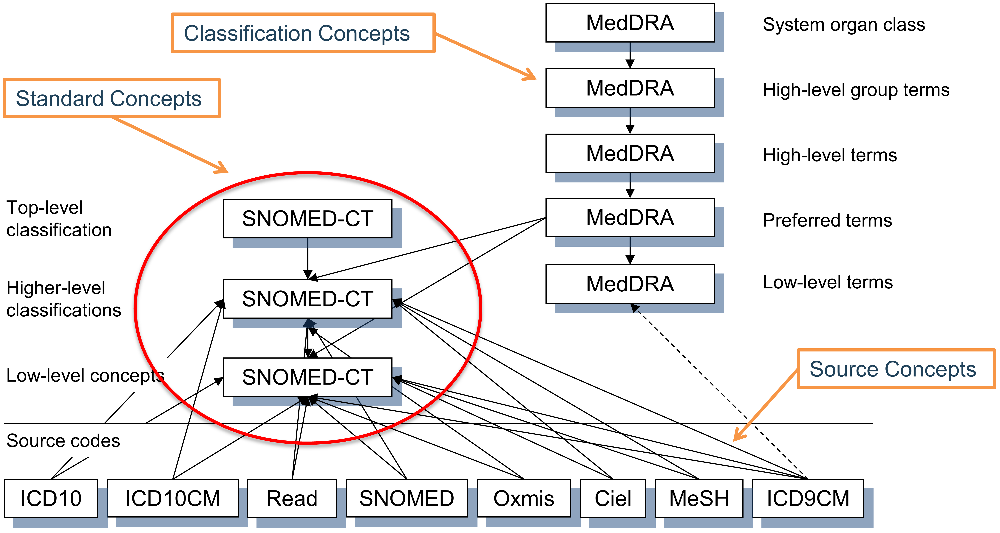

# Vocabulaire normalisé {#StandardizedVocabularies}

\index{vocabulaire normalisé}

*Chefs de chapitre : Christian Reich & Anna Ostropolets*

Les Vocabulaire normalisé OMOP, souvent désignés simplement sous le terme « le Vocabulaire », sont une partie fondamentale du réseau de recherche OHDSI, et une partie intégrante du Modèle de Données Commun (CDM). Ils permettent la standardisation des méthodes, des définitions et des résultats en définissant le contenu des données, ouvrant la voie à une véritable recherche et analyse en réseau à distance (derrière le pare-feu). Habituellement, trouver et interpréter le contenu des données de santé observationnelles, qu'il s'agisse de données structurées en utilisant des systèmes de codage ou consignées dans du texte libre, est complètement laissé aux chercheurs, qui doivent faire face à une myriade de façons différentes de décrire les événements cliniques. OHDSI nécessite une harmonisation non seulement à un format standardisé, mais aussi à un contenu standard rigoureux.

Dans ce chapitre, nous décrivons d'abord les principaux principes des Vocabulaire normalisé, leurs composantes, et les règles, conventions et quelques situations typiques, qui sont toutes nécessaires pour comprendre et utiliser cette ressource fondamentale. Nous pointons également les domaines où le support de la communauté est nécessaire pour l'améliorer continuellement.


## Pourquoi les vocabulaires, et pourquoi les normaliser

Les vocabulaires médicaux remontent aux Bills of Mortality dans le Londres médiéval pour gérer les épidémies de peste et d'autres maladies (voir Figure \@ref(fig:bill)). \index{Bill of Mortality}

```{r bill, fig.cap="1660 London Bill of Mortality, showing the cause of death for deceased inhabitants using a classification system of 62 diseases known at the time.", echo=FALSE, out.width='100%', fig.align='center'}
knitr::include_graphics("images/StandardizedVocabularies/bill.jpg")
```

Depuis lors, les classifications ont considérablement augmenté en taille et en complexité et se sont étendues à d'autres aspects des soins de santé, tels que les procédures et services, les médicaments, les dispositifs médicaux, etc. Les principes de base sont restés les mêmes : ce sont des vocabulaires contrôlés, des terminologies, des hiérarchies ou des ontologies qu'une certaine communauté de soins de santé accepte dans le but de capturer, de classer et d'analyser les données des patients. Bon nombre de ces vocabulaires sont maintenus par des agences publiques et gouvernementales ayant un mandat à long terme pour ce faire. Par exemple, l'Organisation mondiale de la Santé (OMS) produit la Classification Internationale des Maladies (ICD) avec l'ajout récent de sa 11e révision (ICD11). Les gouvernements locaux créent des versions spécifiques à chaque pays, telles que ICD10CM (États-Unis), ICD10GM (Allemagne), etc. Les gouvernements contrôlent également la commercialisation et la vente de médicaments et maintiennent des répertoires nationaux de ces médicaments certifiés. Les vocabulaires sont également utilisés dans le secteur privé, soit comme produits commerciaux, soit pour un usage interne, tels que les systèmes de dossiers de santé électroniques (EHR) ou pour les déclarations de sinistres d'assurance maladie.

En conséquence, chaque pays, région, système de soins de santé et institution tend à avoir ses propres classifications qui ne seraient probablement pertinentes que là où elles sont utilisées. Cette myriade de vocabulaires empêche l'interopérabilité des systèmes dans lesquels ils sont utilisés. La standardisation est la clé qui permet l'échange de données des patients, ouvre l'analyse des données de santé à un niveau mondial et permet une recherche systématique et standardisée, y compris la caractérisation des performances et l'évaluation de la qualité. Pour résoudre ce problème, des organisations multinationales ont vu le jour et ont commencé à créer des normes étendues, telles que l'OMS mentionnée ci-dessus et la Nomenclature standard de la médecine (SNOMED) ou les Identifiants et codes logiques d'observation (LOINC). Aux États-Unis, le Comité des normes informatiques de santé (HITAC) recommande l'utilisation de SNOMED, LOINC et du vocabulaire des médicaments RxNorm comme normes au Coordinateur national de l'informatique de santé (ONC) pour utilisation dans une plate-forme commune pour l'échange d'informations sanitaires à l'échelle nationale entre divers organismes.

OHDSI a développé le CDM OMOP, une norme mondiale pour la recherche observationnelle. Dans le cadre du CDM, les Vocabulaire normalisé OMOP sont disponibles à deux fins principales :

- Référentiel commun de tous les vocabulaires utilisés dans la communauté
- Standardisation et cartographie pour une utilisation en recherche

Les Vocabulaire normalisé sont disponibles pour la communauté gratuitement et **doivent être utilisés** pour l'instance CDM OMOP **comme sa table de référence obligatoire**.

### Construire les Vocabulaire normalisé

Tous les vocabulaires des Vocabulaire normalisé sont consolidés dans le même format commun. Cela soulage les chercheurs de la nécessité de comprendre et de manipuler plusieurs formats différents et des conventions de cycle de vie des vocabulaires d'origine. Tous les vocabulaires sont régulièrement rafraîchis et incorporés en utilisant le système Pallas.[^pallasUrl] Il est construit et géré par l'équipe des vocabulaires OHDSI, qui fait partie du groupe de travail général CDM OMOP. Si vous trouvez des erreurs, veuillez les signaler et aider à améliorer notre ressource en postant sur les forums OHDSI[^forums2Url] ou sur la page Github du CDM.[^cdmIssuesUrl] \index{Pallas system}

[^pallasUrl]: https://github.com/OHDSI/Vocabulary-v5.0
[^forums2Url]: https://forums.ohdsi.org
[^cdmIssuesUrl]: https://github.com/OHDSI/CommonDataModel/issues

### Accès aux Vocabulaire normalisé {#accessVocabularies}

Pour obtenir les Vocabulaire normalisé, vous n'avez pas besoin d'exécuter Pallas vous-même. Au lieu de cela, vous pouvez télécharger la dernière version d'ATHENA[^athenaUrl] et la charger dans votre base de données locale. ATHENA permet également une recherche facettée des Vocabulaires. \index{ATHENA} \index{vocabulaire normalisé!télécharger} \index{vocabulaire normalisé!recherche}

[^athenaUrl]: http://athena.ohdsi.org

Pour télécharger un fichier zip contenant toutes les tables des Vocabulaire normalisé, sélectionnez tous les vocabulaires dont vous avez besoin pour votre CDM OMOP. Les vocabulaires avec Concepts standard (voir Section \@ref(standardConcepts)) et utilisation très courante sont pré-sélectionnés. Ajoutez les vocabulaires utilisés dans vos données sources. Les vocabulaires propriétaires n'ont pas de bouton de sélection. Cliquez sur le bouton « Licence requise » pour incorporer un tel vocabulaire dans votre liste. L'équipe de vocabulaire vous contactera, vous demandera de démontrer votre licence ou vous aidera à prendre contact avec les bonnes personnes pour en obtenir une.

### Source des vocabulaires : Adopter ou Construire

OHDSI préfère généralement adopter des vocabulaires existants, plutôt que de les construire de novo, car (i) de nombreux vocabulaires ont déjà été utilisés dans des données observationnelles dans la communauté, et (ii) la construction et la maintenance de vocabulaires est complexe et nécessite l'apport de nombreuses parties prenantes sur de longues périodes pour arriver à maturité. Pour cette raison, des organisations dédiées fournissent des vocabulaires, qui sont soumis à un cycle de vie de génération, dépréciation, fusion et scission (voir Section \@ref(conceptLifeCycle)). Actuellement, OHDSI ne produit que des vocabulaires administratifs internes comme les Types de Concepts (par ex. concepts de type de condition). La seule exception est l'Extension RxNorm, un vocabulaire couvrant les médicaments qui ne sont utilisés qu'en dehors des États-Unis (voir Section \@ref(rxNormExtension)).
## Concepts

Tous les événements cliniques dans le CDM OMOP sont exprimés sous forme de concepts, qui représentent la notion sémantique de chaque événement. Ils constituent les éléments de base des enregistrements de données, rendant presque toutes les tables entièrement normalisées avec quelques exceptions. Les concepts sont stockés dans la table CONCEPT (voir Figure \@ref(fig:concept)). \index{concept}

```{r concept, fig.cap="Standard representation of vocabulary concepts in the OMOP CDM. The example provided is the CONCEPT table record for the SNOMED code for Atrial Fibrillation.",echo=FALSE, out.width='90%', fig.align='center'}
knitr::include_graphics("images/StandardizedVocabularies/concept.png")
```

Ce système se veut **complet**, c'est-à-dire qu'il existe suffisamment de concepts pour couvrir tout événement pertinent à l'expérience de soins de santé du patient (par exemple, conditions, procédures, expositions aux médicaments, etc.) ainsi que certaines informations administratives du système de santé (par exemple, visites, sites de soins, etc.).

### Identifiants de concepts

Chaque concept se voit attribuer un identifiant de concept à utiliser comme clé primaire. Cet identifiant entier sans signification, plutôt que le code original du vocabulaire, est utilisé pour enregistrer des données dans les tables d'événements du CDM.  \index{concept!identifier}

### Noms de concepts

Chaque concept a un nom. Les noms sont toujours en anglais. Ils sont importés de la source du vocabulaire. Si le vocabulaire source a plus d'un nom, le plus expressif est sélectionné et les autres sont stockés dans la table CONCEPT_SYNONYM sous la même clé CONCEPT_ID. Les noms non anglais sont également enregistrés dans CONCEPT_SYNONYM, avec l'identifiant de concept linguistique approprié dans le champ LANGUAGE_CONCEPT_ID. Le nom mesure 255 caractères de long, ce qui signifie que les noms très longs sont tronqués et la version complète est enregistrée comme un autre synonyme, pouvant contenir jusqu'à 1000 caractères.

### Domaines {#conceptDomains}

Chaque concept se voit attribuer un domaine dans le champ DOMAIN_ID, qui contrairement à l'identifiant numérique CONCEPT_ID, est un identifiant alphanumérique court, sensible à la casse et unique pour le domaine. Des exemples de ces identifiants de domaine sont "Condition", "Drug", "Procedure", "Visit", "Device", "Specimen", etc. Les concepts ambigus ou pré-coordonnés (combinaison) peuvent appartenir à un domaine combiné, mais les Concepts Standards (voir Section \@ref(standardConcepts)) sont toujours assignés à un domaine unique. Les domaines indiquent également dans quelle table et champ du CDM un événement clinique ou un attribut d'événement est enregistré. Les affectations de domaine sont une caractéristique spécifique à OMOP effectuée lors de l'ingestion de vocabulaire en utilisant une heuristique décrite dans [Pallas](https://github.com/ohDSI/vocabulary-v5.0). Les vocabulaires sources tendent à combiner des codes de domaines mixtes, mais à des degrés divers (voir Figure \@ref(fig:domains)). \index{domain!concept}

```{r domains, fig.cap="Domain assignment in procedure vocabularies CPT4 and HCPCS. By intuition, these vocabularies should contain codes and concepts of a single domain, but in reality they are mixed.",echo=FALSE, out.width='70%', fig.align='center'}
knitr::include_graphics("images/StandardizedVocabularies/domains.png")
```

L'heuristique de domaine suit les définitions des domaines. Ces définitions sont dérivées des définitions des tables et des champs dans le CDM (voir Chapitre \@ref(CommonDataModel)). L'heuristique n'est pas parfaite ; il y a des zones grises (voir Section \@ref(specialSituations) "Situations spéciales"). Si vous trouvez des domaines de concepts assignés incorrectement, veuillez le signaler et aider à améliorer le processus via un post sur le [Forums](https://forums.ohdsi.org) ou un [CDM issue](https://github.com/OHDSI/CommonDataModel/issues).

### Vocabulaires

Chaque vocabulaire a un identifiant alphanumérique court, sensible à la casse et unique, qui suit généralement le nom abrégé du vocabulaire, en omettant les tirets. Par exemple, ICD-9-CM a l'identifiant de vocabulaire "ICD9CM". Il y a actuellement 111 vocabulaires pris en charge par OHDSI, dont 78 sont adoptés de sources externes, tandis que le reste sont des vocabulaires internes OMOP. Ces vocabulaires sont généralement mis à jour selon un calendrier trimestriel. La source et la version des vocabulaires sont définies dans le fichier de référence VOCABULARY. \index{vocabulary}

### Classes de concepts

Certains vocabulaires classifient leurs codes ou concepts, indiqués par leurs identifiants alphanumériques uniques et sensibles à la casse. Par exemple, SNOMED a 33 de ces classes de concepts, que SNOMED appelle "balises sémantiques" : constatation clinique, contexte social, structure corporelle, etc. Ce sont des divisions verticales des concepts. D'autres, tels que MedDRA ou RxNorm, ont des classes de concepts classifiant les niveaux horizontaux dans leurs hiérarchies stratifiées. Les vocabulaires sans aucune classe de concepts, comme HCPCS, utilisent l'identifiant de vocabulaire comme identifiant de classe de concepts. \index{concept!class}

Table: (\#tab:sublassification) Vocabulaires avec ou sans principes de sous-classement horizontal et vertical dans la classe de concepts.

Principe de subdivision de la classe de concepts | Vocabulaire
:-------- |:----------------------------------
Horizontal | tous les vocabulaires de médicaments, ATC, CDT, épisode, HCPCS, HemOnc, ICDs, MedDRA, OSM, Recensement
Vertical | CIEL, HES Specialty, ICDO3, MeSH, NAACCR, NDFRT, OPCS4, PCORNET, Plan, PPI, Fournisseur, SNOMED, SPL, UCUM
Mixte | CPT4, ISBT, LOINC
Aucun | APC, tous les concepts de type, Ethnicity, OXMIS, Race, Revenue Code, Sponsor, Supplier, UB04s, Visit

Les classes de concepts horizontales vous permettent de déterminer un niveau hiérarchique spécifique. Par exemple, dans le vocabulaire des médicaments RxNorm, la classe de concepts "Ingrédient" définit le niveau supérieur de la hiérarchie. Dans le modèle vertical, les membres d'une classe de concepts peuvent être de n'importe quel niveau hiérarchique du haut vers le bas.

### Concepts standards {#standardConcepts}

Un concept représentant le sens de chaque événement clinique est désigné Standard. Par exemple, le code MESH D001281, le code CIEL 148203, le code SNOMED 49436004, le code ICD9CM 427.31 et le code Read G573000 définissent tous "fibrillation auriculaire" dans le domaine de la condition, mais uniquement le concept SNOMED est Standard et représente la condition dans les données. Les autres sont désignés concepts non standards ou sources et mappés aux concepts standards. Les concepts standards sont indiqués par un "S" dans le champ STANDARD_CONCEPT. Et seuls ces Concepts Standards sont utilisés pour enregistrer des données dans les champs CDM se terminant par "_CONCEPT_ID". \index{standard concept}

### Concepts non standards

Les concepts non standards ne sont pas utilisés pour représenter les événements cliniques, mais ils font toujours partie des vocabulaires standardisés, et se trouvent souvent dans les données sources. Pour cette raison, ils sont également appelés "concepts sources". La conversion des concepts sources en Concepts Standards est un processus appelé "mapping" (voir Section \@ref(conceptMapping)). Les concepts non standards n'ont aucune valeur (NULL) dans le champ STANDARD_CONCEPT.

### Concepts de classification

Ces concepts ne sont pas standards et ne peuvent donc pas être utilisés pour représenter les données. Mais ils participent à la hiérarchie avec les Concepts Standards, et peuvent donc être utilisés pour effectuer des requêtes hiérarchiques. Par exemple, interroger tous les descendants du code MedDRA 10037908 (non visible pour les utilisateurs qui n'ont pas obtenu une licence MedDRA, voir Section \@ref(accessVocabularies) pour les restrictions d'accès) récupérera le concept SNOMED standard pour la fibrillation auriculaire (voir Section \@ref(conceptAncestor) pour des requêtes hiérarchiques utilisant la table CONCEPT_ANCESTOR) - voir Figure \@ref(fig:hierarchy). \index{classification concept}

```{r hierarchy, fig.cap="Standard, non-standard source and classification concepts and their hierarchical relationships in the condition domain. SNOMED is used for most standard condition concepts (with some oncology-related concepts derived from ICDO3), MedDRA concepts are used for hierarchical classification concepts, and all other vocabularies contain non-standard or source concepts, which do not participate in the hierarchy.",echo=FALSE, out.width='100%', fig.align='center'}

```

Le choix de la désignation des concepts en tant que Standard, non standard et classification est généralement fait pour chaque domaine séparément au niveau du vocabulaire. Cela est basé sur la qualité des concepts, la hiérarchie intégrée et le but déclaré du vocabulaire. De plus, tous les concepts d'un vocabulaire ne sont pas utilisés comme Concepts Standards. La désignation est séparée pour chaque domaine, chaque concept doit être actif (voir Section \@ref(conceptLifeCycle)) et il peut y avoir un ordre de préséance si plus d'un concept de différents vocabulaires sont en concurrence pour le même sens. En d'autres termes, il n'existe pas de "vocabulaire standard". Voir Table \@ref(tab:vocabList) pour des exemples.

Table: (\#tab:vocabList) Liste des vocabulaires à utiliser pour les affectations de concepts standards/non standards/de classification.

Domaine | pour Concepts Standards | pour concepts sources | pour concepts de classification
:-------- |:--------------- |:--------------- |:-------------
Condition | SNOMED, ICDO3 | SNOMED Veterinary | MedDRA
Procédure | SNOMED, CPT4, HCPCS, ICD10PCS, ICD9Proc, OPCS4 | SNOMED Veterinary, HemOnc, NAACCR | Aucun pour le moment
Mesure | SNOMED, LOINC | SNOMED Veterinary, NAACCR, CPT4, HCPCS, OPCS4, PPI | Aucun pour le moment
Médicament | RxNorm, RxNorm Extension, CVX | HCPCS, CPT4, HemOnc, NAAACCR | ATC
Dispositif | SNOMED | Autres, actuellement non normalisés | Aucun pour le moment
Observation | SNOMED | Autres | Aucun pour le moment
Visite | CMS Place of Service, ABMT, NUCC | SNOMED, HCPCS, CPT4, UB04 | Aucun pour le moment

### Codes de concepts

Les codes de concepts sont les identifiants utilisés dans les vocabulaires sources. Par exemple, les codes ICD9CM ou NDC sont stockés dans ce champ, tandis que les tables OMOP utilisent l'identifiant de concept comme clé étrangère dans la table CONCEPT. La raison est que l'espace de noms chevauche les vocabulaires, c'est-à-dire que le même code peut exister dans différents vocabulaires avec des significations complètement différentes (voir Table \@ref(tab:code1001)) \index{concept!code}

Table: (\#tab:code1001) Concepts avec un code de concept identique 1001, mais des vocabulaires, des domaines et des classes de concepts différents.

Concept ID | Concept Code | Concept Name | Domain ID | Vocabulary ID | Concept Class
:--------- |:---- |:------------ |:---------- |:---------- |:----------
35803438 | 1001 | Granulocyte colony-stimulating factors | Drug | HemOnc | Component Class
35942070 | 1001 | AJCC TNM Clin T | Measurement | NAACCR | NAACCR Variable
1036059 | 1001 | Antipyrine | Drug | RxNorm | Ingredient
38003544 | 1001 | Residential Treatment - Psychiatric | Revenue Code | Revenue Code | Revenue Code
43228317 | 1001 | Aceprometazine maleate | Drug | BDPM | Ingredient
45417187 | 1001 | Brompheniramine Maleate, 10 mg/mL injectable solution | Drug | Multum | Multum
45912144 | 1001 | Serum | Specimen | CIEL | Specimen

### Cycle de vie {#conceptLifeCycle}

Les vocabulaires sont rarement des corpus permanents avec un ensemble fixe de codes. Au contraire, des codes et des concepts sont ajoutés et sont dépréciés. Le CDM OMOP est un modèle pour soutenir les données patient longitudinales, ce qui signifie qu'il doit prendre en charge les concepts qui étaient utilisés dans le passé et qui peuvent ne plus être actifs, ainsi que prendre en charge de nouveaux concepts et les replacer dans leur contexte. Il existe trois champs dans la table CONCEPT qui décrivent les statuts possibles du cycle de vie : VALID_START_DATE, VALID_END_DATE, et INVALID_REASON. Leurs valeurs diffèrent selon le statut du cycle de vie du concept :

- **Concept actif ou nouveau**
	- Description : Concept utilisé.
	- VALID_START_DATE : Jour de l'instanciation du concept, si cela n'est pas connu jour d'incorporation du concept dans les Vocabulaires, si cela n'est pas connu 1970-1-1.
	- VALID_END_DATE : Fixé au 2099-12-31 comme convention pour indiquer "Peut devenir invalide dans un futur indéfini, mais actif pour le moment".
	- INVALID_REASON : NULL
- **Concept déprécié sans successeur**
	- Description :  Concept inactif et ne peut pas être utilisé comme Standard (voir Section \@ref(standardConcepts)).
	- VALID_START_DATE : Jour de l'instanciation du concept, si cela n'est pas connu jour d'incorporation du concept dans les Vocabulaires, si cela n'est pas connu 1970-1-1.
	- VALID_END_DATE : Jour dans le passé indiquant la dépréciation, ou si cela n'est pas connu jour de mise à jour du vocabulaire où le concept dans le vocabulaire a disparu ou a été mis à inactif.
	- INVALID_REASON : "D"
- **Concept mis à jour avec successeur**
	- Description : Concept inactif, mais a un successeur défini. Il s'agit généralement de concepts qui ont subi une déduplication.
	- VALID_START_DATE : Jour de l'instanciation du concept, si cela n'est pas connu jour d'incorporation du concept dans les Vocabulaires, si cela n'est pas connu 1970-1-1.
	- VALID_END_DATE : Jour dans le passé indiquant une mise à jour, ou si cela n'est pas connu jour de mise à jour du vocabulaire où la mise à jour a été incluse.
	- INVALID_REASON : "U"
- **Code réutilisé pour un autre nouveau concept**
	- Description : Le vocabulaire a réutilisé le code de concept de ce concept déprécié pour un nouveau concept.
	- VALID_START_DATE : Jour de l'instanciation du concept, si cela n'est pas connu jour d'incorporation du concept dans les Vocabulaires, si cela n'est pas connu 1970-1-1.
	- VALID_END_DATE : Jour dans le passé indiquant la dépréciation, ou si cela n'est pas connu jour de mise à jour du vocabulaire où le concept dans le vocabulaire a disparu ou a été mis à inactif.
	- INVALID_REASON : "R"

En général, les codes de concepts ne sont pas réutilisés. Mais il y a quelques vocabulaires qui dévient de cette règle, en particulier HCPCS, NDC et DRG. Pour ceux-ci, le même code de concept apparaît dans plus d'un concept du même vocabulaire. Leur valeur CONCEPT_ID reste unique. Ces codes de concepts réutilisés sont marqués par un "R" dans le champ INVALID_REASON, et la période VALID_START_DATE à VALID_END_DATE doit être utilisée pour distinguer les concepts avec les mêmes codes de concepts.

## Relations

Deux concepts quelconques peuvent avoir une relation définie, que les deux concepts appartiennent ou non au même domaine ou vocabulaire. La nature des relations est indiquée par son identifiant alphanumérique unique, sensible à la casse et court, dans le champ RELATIONSHIP_ID de la table CONCEPT_RELATIONSHIP. Les relations sont symétriques, c’est-à-dire que pour chaque relation existe une relation équivalente, où le contenu des champs CONCEPT_ID_1 et CONCEPT_ID_2 est échangé et le RELATIONSHIP_ID est changé en son opposé. Par exemple, la relation "Maps to" a une relation opposée "Mapped from." \index{concept!relation}

Les enregistrements de la table CONCEPT_RELATIONSHIP ont également des champs de cycle de vie RELATIONSHIP_START_DATE, RELATIONSHIP_END_DATE et INVALID_REASON. Cependant, seuls les enregistrements actifs avec INVALID_REASON = NULL sont disponibles via ATHENA. Les relations inactives sont maintenues dans le système Pallas pour un traitement interne uniquement. La table RELATIONSHIP sert de référence avec la liste complète des identifiants de relation et leurs équivalents inversés.

### Relations de Mapping {#conceptMapping}

Ces relations fournissent des traductions de concepts non standard à des concepts standard, soutenues par deux paires d'identifiants de relation (voir le Tableau \@ref(tab:mappingRelationships)). \index{concept!mappage}

Tableau : (\#tab:mappingRelationships) Type de relations de montage.

Paire d'identifiant de relation | Objectif
:------------- | :----------------------------------------------------
"Maps to" et "Mapped from" | Mapping vers les concepts standard. Les concepts standard sont mappés à eux-mêmes, les concepts non standard aux concepts standard. La plupart des concepts non standard et tous les concepts standard ont cette relation à un concept standard. Les premiers sont stockés dans les champs *_SOURCE_CONCEPT_ID, et les seconds dans les champs *_CONCEPT_ID. Les concepts de classification ne sont pas mappés.
"Maps to value" et "Value mapped from" | Mapping vers un concept qui représente une Valeur à placer dans les champs VALUE_AS_CONCEPT_ID des tables MEASUREMENT et OBSERVATION.

Le but de ces relations de mapping est de permettre un rapprochement entre des concepts équivalents pour harmoniser la représentation des événements cliniques dans l'OMOP CDM. C'est une réalisation importante des vocabulaires standardisés.

"Concepts équivalents" signifie qu'ils portent la même signification et, ce qui est important, que les descendants hiérarchiques couvrent le même espace sémantique. Si un concept équivalent n'est pas disponible et que le concept n'est pas standard, il est toujours mappé, mais vers un concept légèrement plus large (appelés "mappings en montée"). Par exemple, l'ICD10CM W61.51 "Mordu par une oie" n'a pas d'équivalent dans le vocabulaire SNOMED, qui est généralement utilisé pour les concepts de condition standard. Il est donc mappé à SNOMED 217716004 "Picoté par un oiseau," perdant ainsi le contexte de l'oiseau étant une oie. Les mappings en montée ne sont utilisés que si la perte d'information est jugée négligeable pour les cas d'utilisation de recherche standard.

Certains mappings connectent un concept source à plus d'un concept standard. Par exemple, ICD9CM 070.43 "Hépatite E avec coma hépatique" est mappé à la fois à SNOMED 235867002 "Hépatite aiguë E" et à SNOMED 72836002 "Coma hépatique." La raison en est que le concept source original est une combinaison pré-coordonnée de deux conditions, l'hépatite et le coma. SNOMED n'a pas cette combinaison, ce qui entraîne deux enregistrements écrits pour l'enregistrement ICD9CM, chacun avec un concept standard mappé.

Les relations "Maps to value" ont pour objectif de diviser une valeur pour les tables OMOP CDM suivant un modèle entité-attribut-valeur (EAV). C'est typiquement le cas dans les situations suivantes :

- Mesures consistant en un test et un résultat
- Antécédents personnels ou familiaux de maladie
- Allergie à une substance
- Besoin de vaccination

Dans ces situations, le concept source est une combinaison de l'attribut (test ou antécédent) et de la valeur (résultat du test ou maladie). La relation "Maps to" mappe cette source au concept d'attribut, et la "Maps to value" au concept de valeur. Voir la Figure \@ref(fig:conceptValue) pour un exemple.

```{r conceptValue, fig.cap="One-to-many mapping between source concept and Standard Concepts. A pre-coordinated concept is split into two concepts, one of which is the attribute (here history of clinical finding) and the other one is the value (peptic ulcer). While 'Maps to' relationship will map to concepts of the measurement or observation domains, the 'Maps to value' concepts have no domain restriction.", echo=FALSE, out.width='100%', fig.align='center'}
knitr::include_graphics("images/StandardizedVocabularies/conceptValue.png")
```

Le mapping des concepts est une autre caractéristique centrale des vocabulaires standardisés OMOP fournis gratuitement et soutenant les efforts de la communauté menant des études en réseau. Les relations de mapping sont dérivées de sources externes ou maintenues manuellement par l'équipe des vocabulaires. Cela signifie qu'elles ne sont pas parfaites. Si vous trouvez des relations de mapping incorrectes ou contestables, il est crucial de les signaler et d'aider à améliorer le processus via un post sur les [Forums](https://forums.ohdsi.org) ou un [problème de CDM](https://github.com/OHDSI/CommonDataModel/issues).

Une description plus détaillée des conventions de mapping peut être trouvée dans le Wiki de l'OHDSI.[^vocabMappingUrl]

[^vocabMappingUrl]: https://www.ohdsi.org/web/wiki/doku.php?id=documentation:vocabulary:mapping

### Relations Hiérarchiques

Les relations qui indiquent une hiérarchie sont définies par la paire de relations "Is a" - "Subsumes." Les relations hiérarchiques sont définies de telle sorte que le concept enfant a tous les attributs du concept parent, plus un ou plusieurs attributs supplémentaires ou un attribut plus précisément défini. Par exemple, SNOMED 49436004 "Fibrillation auriculaire" est lié à SNOMED 17366009 "Arythmie auriculaire" par une relation "Is a." Les deux concepts ont un ensemble d'attributs identiques, sauf le type d'arythmie, défini comme être une fibrillation dans l'un mais pas dans l'autre. Les concepts peuvent avoir plus d'un parent et plus d'un enfant. Dans cet exemple, SNOMED 49436004 "Fibrillation auriculaire" est également un "Is a" de SNOMED 40593004 "Fibrillation." \index{concept!hiérarchie}

### Relations Entre Concepts de Différents Vocabulaires

Ces relations sont typiquement du type "Vocabulaires A - Vocabulaires B équivalents," soit fournies par la source originale du vocabulaire, soit construites par l'équipe des vocabulaires OHDSI. Elles peuvent servir de mappings approximatifs mais sont souvent moins précises que les relations de mapping mieux gérées. Les relations d'équivalence de haute qualité (telles que "Source - équivalent RxNorm") sont toujours dupliquées par la relation "Maps to."

### Relations Entre Concepts du Même Vocabulaire

Les relations internes au vocabulaire sont généralement fournies par le fournisseur du vocabulaire. Des descriptions complètes peuvent être trouvées dans la documentation du vocabulaire sous le vocabulaire individuel sur le Wiki de l'OHDSI.[^vocabVocabulariesUrl]

[^vocabVocabulariesUrl]: https://www.ohdsi.org/web/wiki/doku.php?id=documentation:vocabulary

Beaucoup d'entre elles définissent des relations entre des événements cliniques et peuvent être utilisées pour la recherche d'informations. Par exemple, les troubles de l'urètre peuvent être trouvés en suivant la relation "Finding site of" (voir Table \@ref(tab:findingSite)):

Tableau : (\#tab:findingSite) Relation "Finding site of" de l'"Urètre," indiquant les conditions situées toutes dans cette structure anatomique.

CONCEPT_ID_1 | CONCEPT_ID_2
:---------------- | :----------------------------
4000504 "Partie de l'urètre" | 36713433 "Duplication partielle de l'urètre"
4000504 "Partie de l'urètre" | 433583 "Épispadias"
4000504 "Partie de l'urètre" | 443533 "Épispadias, masculin"
4000504 "Partie de l'urètre" | 4005956 "Épispadias, féminin"

La qualité et l'exhaustivité de ces relations varient en fonction de la qualité du vocabulaire original. En général, les vocabulaires utilisés pour extraire des concepts standard, tels que SNOMED, sont choisis en raison de leur meilleure gestion et tendent donc à avoir des relations internes de meilleure qualité également.

## Hiérarchie {#conceptAncestor}

Au sein d'un domaine, les concepts standard et de classification sont organisés dans une structure hiérarchique et stockés dans la table CONCEPT_ANCESTOR. Cela permet d'interroger et de récupérer des concepts et tous leurs descendants hiérarchiques. Ces descendants ont les mêmes attributs que leur ancêtre, mais également des attributs supplémentaires ou plus définis.

La table CONCEPT_ANCESTOR est construite automatiquement à partir de la table CONCEPT_RELATIONSHIP en parcourant tous les concepts possibles connectés par des relations hiérarchiques. Ce sont les paires "Est un" - "Subsume" (voir Figure \@ref(fig:conceptAncestor)) et d'autres relations connectant les hiérarchies entre les vocabulaires. Le choix qu'une relation participe ou non à la construction de la hiérarchie est défini pour chaque ID de relation par l'indicateur DEFINES_ANCESTRY dans la table de référence RELATIONSHIP.

(ref:foo) Hiérarchie de la condition "Fibrillation auriculaire." La parenté de premier degré est définie par les relations "Est un" et "Subsume", tandis que toutes les relations de degré supérieur sont déduites et stockées dans la table CONCEPT_ANCESTOR. Chaque concept est également son propre descendant avec les deux niveaux de séparation égaux à 0. \index{concept!ancêtre}

```{r conceptAncestor, fig.cap="(ref:foo)", echo=FALSE, out.width='100%', fig.align='center'}
knitr::include_graphics("images/StandardizedVocabularies/conceptAncestor.png")
```

Le degré d'ascendance, ou le nombre d'étapes entre l'ancêtre et le descendant, est capturé dans les champs MIN_LEVELS_OF_SEPARATION et MAX_LEVELS_OF_SEPARATION, définissant la connexion la plus courte ou la plus longue possible. Toutes les relations hiérarchiques ne contribuent pas de manière égale au calcul des niveaux de séparation. Une étape comptée pour le degré est déterminée par le drapeau IS_HIERARCHICAL dans la table de référence RELATIONSHIP pour chaque ID de relation.

Actuellement, une hiérarchie complète et de haute qualité n'existe que pour deux domaines : médicament et condition. Les domaines de procédure, mesure et observation ne sont que partiellement couverts et en cours de construction. L'ascendance est particulièrement utile pour le domaine des médicaments car elle permet de parcourir tous les médicaments avec un ingrédient donné ou membres de classes médicamenteuses indépendamment du pays d'origine, du nom de marque ou d'autres attributs.

## Tables de Référence Interne

DOMAIN_ID, VOCABULARY_ID, CONCEPT_CLASS_ID (tous dans les enregistrements CONCEPT) et CONCEPT_RELATIONSHIP_ID (dans CONCEPT_RELATIONSHIP) sont tous contrôlés par leurs propres vocabulaires. Ils sont définis dans les quatre tables de référence DOMAIN, VOCABULARY, CONCEPT_CLASS et RELATIONSHIP, contenant les champs *_ID en tant que clés primaires, un champ *_NAME plus détaillé et un champ *_CONCEPT_ID avec une référence à la table CONCEPT, qui contient un concept pour chaque enregistrement des tables de référence. Le but de ces enregistrements en double est de soutenir un modèle d'information permettant des moteurs de navigation automatiques.

La table VOCABULARY contient également les champs VOCABULARY_REFERENCE et VOCABULARY_VERSION se référant à la source et à la version du vocabulaire original. La table RELATIONSHIP comprend les champs supplémentaires DEFINES_ANCESTRY, IS_HIERARCHICAL et REVERSE_RELATIONSHIP_ID. Ce dernier définit l'ID de relation contrepartie pour une paire de relations.

## Situations Spéciales {#specialSituations}

### Genre

Le genre dans le CDM OMOP et les Vocabularies Standardisés désigne le sexe biologique à la naissance. Souvent, des questions sont posées sur comment définir des genres alternatifs. Ces cas d'utilisation doivent être couverts par des enregistrements dans la table OBSERVATION, où le genre autodéclaré d'une personne est stocké (si l'ensemble de données contient de telles informations).

### Race et Ethnicité

Ces termes suivent les définitions de la façon dont le gouvernement américain les définit. L’ethnicité est une différenciation des populations hispaniques ou non hispaniques, qui peuvent être de n'importe quelle race. La race est divisée en 5 principales races, qui ont des ethnicités comme descendants hiérarchiques. Les races mixtes ne sont pas incluses.

### Schémas de Codage Diagnostique et Conditions OMOP

Les schémas de codage couramment utilisés, tels que l'ICD-9 ou l'ICD-10, définissent des diagnostics plus ou moins bien définis basés sur une démarche diagnostique appropriée. Le domaine des conditions n'est pas identique à cet espace sémantique, mais en partie se chevauche. Par exemple, les conditions incluent également des signes et symptômes enregistrés avant qu'un diagnostic soit établi, et les codes ICD contiennent des concepts appartenant à d'autres domaines (par exemple, les procédures).

### Systèmes de Codage de Procédures

De même, les schémas de codage comme HCPCS et CPT4 sont censés être des listes de procédures médicales. En réalité, ils sont plus comme un menu de justifications pour le paiement des services médicaux. Bon nombre de ces services sont regroupés sous le domaine des procédures, mais de nombreux concepts échappent à ce domaine.

### Dispositifs

Les concepts de dispositifs n'ont pas de schéma de codage standardisé pouvant être utilisé pour sourcer les Concepts Standard. Dans de nombreuses données sources, les dispositifs ne sont même pas codés ou contenus dans un schéma de codage externe. Pour cette même raison, il n'y a actuellement pas de système hiérarchique disponible.

### Visites et Services

Les concepts de visites définissent la nature des rencontres de soins de santé. Dans de nombreux systèmes sources, ils sont appelés Lieu de Service, désignant une organisation ou une structure physique, telle qu'un hôpital. Dans d'autres, ils sont appelés services. Ceux-ci diffèrent également selon les pays, et leur définition est difficile à obtenir. Les sites de soins se spécialisent souvent dans une ou quelques visites (Hôpital XYZ), mais ne doivent pas être définis par elles (même à l'hôpital XYZ, les patients peuvent rencontrer des visites non hospitalières).

### Fournisseurs et Spécialités

Tout fournisseur humain est défini dans le domaine des fournisseurs. Ceux-ci peuvent être des professionnels de santé tels que des médecins et infirmiers, mais aussi des fournisseurs non médicaux comme des optométristes ou des cordonniers. Les spécialités sont des descendants du fournisseur "Médecin." Les sites de soins ne peuvent pas porter une spécialité, même s'ils sont souvent définis par la spécialité de leur personnel principal ("Département de Chirurgie").

### Domaines Thérapeutiques aux Besoins Spéciaux

Les Vocabulaires Standardisés couvrent tous les aspects des soins de santé de manière exhaustive. Cependant, certains domaines thérapeutiques ont des besoins particuliers et nécessitent des vocabulaires spécifiques. Des exemples incluent l'oncologie, la radiologie et la génomique. Des Groupes de Travail OHDSI spécials développent ces extensions. En conséquence, les Vocabulaires Standardisés OMOP constituent un système intégré, où les concepts de différentes origines et objectifs résident tous dans les mêmes hiérarchies spécifiques aux domaines.

### Concepts Standards dans le Domaine des Médicaments {#rxNormExtension}

De nombreux concepts du domaine des médicaments sont issus de RxNorm, un vocabulaire disponible publiquement produit par la US National Library of Medicine. Cependant, les médicaments en dehors des États-Unis peuvent ou non être couverts, en fonction de la commercialisation ou non de la combinaison ingrédient, forme et concentration aux États-Unis. Les médicaments qui ne sont pas sur le marché américain sont ajoutés par l'équipe de vocabulaire OHDSI sous un vocabulaire appelé [RxNorm Extension](https://www.ohdsi.org/web/wiki/doku.php?id=documentation:vocabulary:rxnorm_extension), qui est le seul grand vocabulaire de domaine produit par OHDSI.

### Variantes de NULL

De nombreux vocabulaires contiennent des codes concernant l'absence d'information. Par exemple, parmi les cinq concepts de genre 8507 "Homme," 8532 "Femme," 8570 "Ambigu," 8551 "Inconnu," et 8521 "Autre", seuls les deux premiers sont Standards, et les trois autres sont des concepts sources sans mappage. Dans les Vocabulaires Standardisés, il n'y a aucune distinction faite sur la raison pour laquelle une information est indisponible ; cela peut être dû à un retrait actif de l'information par le patient, une valeur manquante, une valeur non définie ou standardisée de quelque manière que ce soit, ou l'absence d'un enregistrement de mappage dans CONCEPT_RELATIONSHIP. Tout concept ainsi désigné n'est pas mappé, ce qui correspond à un mappage par défaut vers le Concept Standard avec l'ID de concept = 0.

## Résumé

```{block2, type='rmdsummary'}
- Tous les événements et les faits administratifs sont représentés dans les Vocabulaires Standardisés OMOP comme des concepts, des relations de concepts, et une hiérarchie d'ancêtres de concepts.
- La plupart de ceux-ci sont adoptés à partir de schémas de codage ou de vocabulaires existants, bien que certains d'entre eux soient créés de novo par l'équipe de vocabulaire OHDSI.
- Tous les concepts se voient attribuer un domaine, lequel contrôle où le fait représenté par le concept est stocké dans le CDM.
- Les concepts de signification équivalente dans différents vocabulaires sont mappés à l'un d'eux, lequel est désigné comme le Concept Standard. Les autres sont des concepts sources.
- Le mappage est effectué par les relations de concepts "Maps to" et "Maps to value".
- Il existe une classe supplémentaire de concepts appelés concepts de classification, qui ne sont pas standards, mais contrairement aux concepts sources, ils participent à la hiérarchie.
- Les concepts ont un cycle de vie dans le temps.
- Les concepts au sein d'un domaine sont organisés en hiérarchies. La qualité de la hiérarchie diffère entre les domaines, et l'achèvement du système hiérarchique est une tâche en cours.
- Vous êtes vivement encouragé à contacter la communauté si vous pensez avoir trouvé une erreur ou une inexactitude.

```

## Exercices

#### Prérequis {-}

Pour ces premiers exercices, vous devrez rechercher des concepts dans les Vocabulaires Standardisés, ce qui peut être fait via ATHENA[^athenaCdm2Url] ou ATLAS.[^atlasCdm2Url]

[^athenaCdm2Url]: http://athena.ohdsi.org/
[^atlasCdm2Url]: http://atlas-demo.ohdsi.org

```{exercise, exerciseVocab1}
Quel est l'ID de Concept Standard pour "Hémorragie gastro-intestinale" ?

```

```{exercise, exerciseVocab2}
Quels codes ICD-10CM sont mappés au Concept Standard pour "Hémorragie gastro-intestinale" ? Quels codes ICD-9CM sont mappés à ce Concept Standard ?

```

```{exercise, exerciseVocab3}
Quels sont les termes préférés MedDRA équivalents au Concept Standard pour "Hémorragie gastro-intestinale" ?

```

Les réponses suggérées peuvent être trouvées en Annexe \@ref(Vocabanswers).
