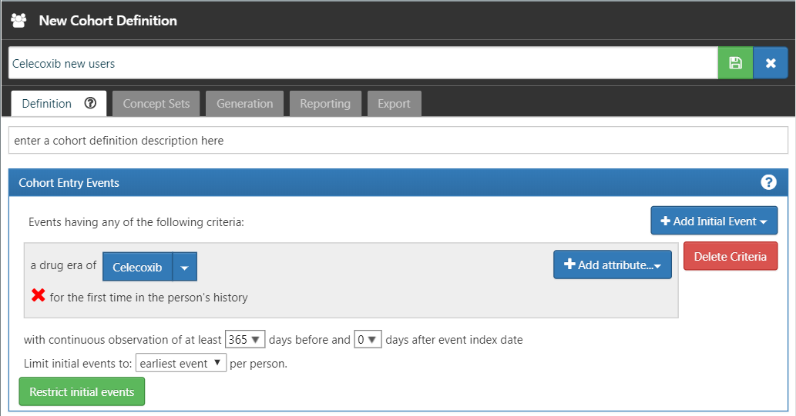

# Réponses suggérées {#SuggestedAnswers}

Cette annexe contient les réponses suggérées pour les exercices du livre.

## Le modèle de données commun {#Cdmanswers}

#### Exercice \@ref(exr:exerciseJohnPerson) {-}

Basé sur la description de l'exercice, le dossier de John devrait ressembler à la Table \@ref(tab:johnPerson).

Table: (\#tab:johnPerson) La table PERSON.

Nom de colonne|Valeur|Explication
:---------------------|:-----------|:--------------------------------------
|PERSON_ID|2|Un entier unique.|
|GENDER_CONCEPT_ID|8507|L'identifiant de concept pour le genre masculin est [8507](http://athena.ohdsi.org/search-terms/terms/8507).|
|YEAR_OF_BIRTH|1974||
|MONTH_OF_BIRTH|8||
|DAY_OF_BIRTH|4||
|BIRTH_DATETIME|1974-08-04 00:00:00|Lorsque l'heure n'est pas connue, minuit est utilisé.|
|DEATH_DATETIME|NULL||
|RACE_CONCEPT_ID|8516|L'identifiant de concept pour noir ou afro-américain est [8516](http://athena.ohdsi.org/search-terms/terms/8516).|
|ETHNICITY_ CONCEPT_ID|38003564| [38003564](http://athena.ohdsi.org/search-terms/terms/38003564) se réfère à "Non hispanique".|
|LOCATION_ID||Son adresse n'est pas connue.|
|PROVIDER_ID||Son fournisseur de soins primaires n'est pas connu.|
|CARE_SITE||Son site de soins principal n'est pas connu.|
|PERSON_SOURCE_ VALUE|NULL|Non fourni.|
|GENDER_SOURCE_ VALUE|Homme|Le texte utilisé dans la description.|
|GENDER_SOURCE_ CONCEPT_ID|0||
|RACE_SOURCE_ VALUE|Afro-américain|Le texte utilisé dans la description.|
|RACE_SOURCE_ CONCEPT_ID|0||
|ETHNICITY_SOURCE_ VALUE|NULL||
|ETHNICITY_SOURCE_ CONCEPT_ID|0||

#### Exercice \@ref(exr:exerciseJohnOp) {-}

Basé sur la description de l'exercice, le dossier de John devrait ressembler à la Table \@ref(tab:johnOp).

Table: (\#tab:johnOp) La table OBSERVATION_PERIOD.

Nom de colonne|Valeur|Explication
:----------------------|:----------|:--------------------------------------
|OBSERVATION_ PERIOD_ID|2|Un entier unique.|
|PERSON_ID|2|Ceci est une clé étrangère vers le dossier de John dans la table PERSON.|
|OBSERVATION_PERIOD_ START_DATE|2015-01-01|La date de l'inscription.|
|OBSERVATION_PERIOD_ END_DATE|2019-07-01|Aucune donnée ne peut être attendue après la date d'extraction des données.|
|PERIOD_TYPE_ CONCEPT_ID|44814722| [44814724](http://athena.ohdsi.org/search-terms/terms/44814722) se réfère à "Période d'adhésion à une assurance".|

#### Exercice \@ref(exr:exerciseJohnDrug) {-}

Basé sur la description de l'exercice, le dossier de John devrait ressembler à la Table \@ref(tab:johnDrug).

Table: (\#tab:johnDrug) La table DRUG_EXPOSURE.

Nom de colonne|Valeur|Explication
:---------------------|:-----------|:--------------------------------------
|DRUG_EXPOSURE_ID|1001|Un entier unique|
|PERSON_ID|2|Ceci est une clé étrangère vers le dossier de John dans la table PERSON.|
|DRUG_CONCEPT_ID|19078461|Le code NDC fourni se rapporte au concept standard [19078461](http://athena.ohdsi.org/search-terms/terms/19078461).|
|DRUG_EXPOSURE_ START_DATE|2019-05-01|La date de début de l'exposition à la drogue.|
|DRUG_EXPOSURE_ START_DATETIME|2019-05-01 00:00:00|Minuit est utilisé car l'heure n'est pas connue.|
|DRUG_EXPOSURE_ END_DATE|2019-05-31|Basé sur la date de début + l'approvisionnement en jours.|
|DRUG_EXPOSURE_ END_DATETIME|2019-05-31 00:00:00|Minuit est utilisé car l'heure n'est pas connue.|
|VERBATIM_END_DATE|NULL|Non fourni.|
|DRUG_TYPE_ CONCEPT_ID|38000177| [38000177](http://athena.ohdsi.org/search-terms/terms/38000177) indique "Prescription écrite".|
|STOP_REASON|NULL||
|REFILLS|NULL||
|QUANTITY|NULL|Non fourni.|
|DAYS_SUPPLY|30|Comme décrit dans l'exercice.|
|SIG|NULL|Non fourni.|
|ROUTE_CONCEPT_ID|4132161| [4132161](http://athena.ohdsi.org/search-terms/terms/4132161) indique "Oral".|
|LOT_NUMBER|NULL|Non fourni.|
|PROVIDER_ID|NULL|Non fourni.|
|VISIT_OCCURRENCE_ ID|NULL|Aucune information sur la visite n'a été fournie.|
|VISIT_DETAIL_ID|NULL||
|DRUG_SOURCE_ VALUE|76168009520|Il s'agit du code NDC fourni.|
|DRUG_SOURCE_ CONCEPT_ID|583945| [583945](http://athena.ohdsi.org/search-terms/terms/750264) représente la valeur source du médicament (code NDC "76168009520").|
|ROUTE_SOURCE_ VALUE|NULL||

#### Exercice \@ref(exr:exerciseGiBleedRecords) {-}

Pour trouver l'ensemble des dossiers, nous pouvons interroger la table CONDITION_OCCURRENCE :

```{r eval=FALSE}
library(DatabaseConnector)
connection <- connect(connectionDetails)
sql <- "SELECT *
FROM @cdm.condition_occurrence
WHERE condition_concept_id = 192671;"

result <- renderTranslateQuerySql(connection, sql, cdm = "main")
head(result)
```
```{r echo=FALSE,message=FALSE,eval=TRUE}
cat("  CONDITION_OCCURRENCE_ID PERSON_ID CONDITION_CONCEPT_ID ...
1                    4657       273               192671 ...
2                    1021        61               192671 ...
3                    5978       351               192671 ...
4                    9798       579               192671 ...
5                    9301       549               192671 ...
6                    1997       116               192671 ...
")
```

#### Exercice \@ref(exr:exercisePersonSource) {-}

Pour trouver l'ensemble des dossiers, nous pouvons interroger la table CONDITION_OCCURRENCE en utilisant le champ CONDITION_SOURCE_VALUE :

```{r eval=FALSE}
sql <- "SELECT *
FROM @cdm.condition_occurrence
WHERE condition_source_value = 'K92.2';"

result <- renderTranslateQuerySql(connection, sql, cdm = "main")
head(result)
```
```{r echo=FALSE,message=FALSE,eval=TRUE}
cat("  CONDITION_OCCURRENCE_ID PERSON_ID CONDITION_CONCEPT_ID ...
1                    4657       273               192671 ...
2                    1021        61               192671 ...
3                    5978       351               192671 ...
4                    9798       579               192671 ...
5                    9301       549               192671 ...
6                    1997       116               192671 ...
")
```

#### Exercice \@ref(exr:exercisePerson61Records) {-}

Ces informations sont stockées dans la table OBSERVATION_PERIOD :

```{r eval=FALSE}
library(DatabaseConnector)
connection <- connect(connectionDetails)
sql <- "SELECT *
FROM @cdm.observation_period
WHERE person_id = 61;"

renderTranslateQuerySql(connection, sql, cdm = "main")

```
```{r echo=FALSE,message=FALSE,eval=TRUE}
cat("  OBSERVATION_PERIOD_ID PERSON_ID OBSERVATION_PERIOD_START_DATE ...
1                    61        61                    1968-01-21 ...
")
```

## Vocabulaires standardisés {#Vocabanswers}

#### Exercice \@ref(exr:exerciseVocab1) {-}

Identifiant de concept 192671 ("Hémorragie gastro-intestinale")

#### Exercice \@ref(exr:exerciseVocab2) {-}

Codes ICD-10CM :

- K29.91 "Gastroduodénite, non spécifiée, avec saignement"
- K92.2 "Hémorragie gastro-intestinale, non spécifiée"

Codes ICD-9CM :

- 578 "Hémorragie gastro-intestinale"
- 578.9 "Hémorragie du tractus gastro-intestinal, non spécifiée"

#### Exercice \@ref(exr:exerciseVocab3) {-}

Termes préférentiels MedDRA :

- "Hémorragie gastro-intestinale" (Identifiant de concept 35707864)
- "Hémorragie intestinale" (Identifiant de concept 35707858)


## Extraction, transformation et chargement {#Etlanswers}

#### Exercice \@ref(exr:exerciseEtl1) {-}

A) Les experts en données et les experts en CDM conçoivent ensemble l'ETL
C) Les personnes ayant des connaissances médicales créent les mappages de codes
B) Une personne technique implémente l'ETL
D) Tous sont impliqués dans le contrôle de qualité

#### Exercice \@ref(exr:exerciseEtl2) {-}

Colonne | Valeur | Réponse
:---------------- |:----------- |:-----------------------
PERSON_ID | A123B456 | Cette colonne a un type de données d'entier donc la valeur d'enregistrement source doit être traduite en une valeur numérique.
GENDER_CONCEPT_ID | 8532 |
YEAR_OF_BIRTH | NULL | Si nous ne connaissons pas le mois ou le jour de naissance, nous ne devinons pas. Une personne peut exister sans un mois ou un jour de naissance. Si une personne manque d'une année de naissance, cette personne devrait être exclue. Cette personne devrait être exclue en raison de l'absence d'année de naissance.
MONTH_OF_BIRTH | NULL |
DAY_OF_BIRTH | NULL |
RACE_CONCEPT_ID | 0 | La race est BLANCHE, ce qui devrait être cartographié à 8527.
ETHNICITY_CONCEPT_ ID | 8527 | Aucune ethnicité n'a été fournie, ceci devrait être cartographié à 0.
PERSON_SOURCE_ VALUE | A123B456 |
GENDER_SOURCE_ VALUE | F |
RACE_SOURCE_VALUE | BLANC |
ETHNICITY_SOURCE_ VALUE | AUCUN FOURNI |

#### Exercice \@ref(exr:exerciseEtl3) {-}

Colonne | Valeur
:------------------------ |:-------------
VISIT_OCCURRENCE_ID | 1
PERSON_ID | 11
VISIT_START_DATE | 2004-09-26
VISIT_END_DATE | 2004-09-30
VISIT_CONCEPT_ID | 9201
VISIT_SOURCE_VALUE | hospitalisation

## Cas d'utilisation des analyses de données {#UseCasesanswers}

#### Exercice \@ref(exr:exerciseUseCases1) {-}

1. Caractérisation

2. Prédiction au niveau du patient

3. Estimation au niveau de la population

#### Exercice \@ref(exr:exerciseUseCases2) {-}

Probablement pas. Définir une cohorte non exposée comparable à votre cohorte d'exposition au diclofénac est souvent impossible, car les gens prennent du diclofénac pour une raison. Cela empêche une comparaison entre les personnes. Il pourrait être possible de faire une comparaison au sein d'une même personne, donc pour chaque patient dans la cohorte de diclofénac, identifier le temps où ils ne sont pas exposés, mais un problème similaire se produit ici : ces moments sont probablement incomparables, car il y a des raisons pour lesquelles à un moment donné quelqu'un est exposé et à d'autres moments non.
## SQL et R {#SqlAndRanswers}

#### Exercise \@ref(exr:exercisePeopleCount) {-}

Pour calculer le nombre de personnes, nous pouvons simplement interroger la table PERSON:

```{r eval=FALSE}
library(DatabaseConnector)
connection <- connect(connectionDetails)
sql <- "SELECT COUNT(*) AS person_count
FROM @cdm.person;"

renderTranslateQuerySql(connection, sql, cdm = "main")
```
```{r echo=FALSE,message=FALSE,eval=TRUE}
cat("  PERSON_COUNT
1         2694
")
```

#### Exercise \@ref(exr:exerciseCelecoxibUsers) {-}

Pour calculer le nombre de personnes ayant au moins une prescription de célécoxib, nous pouvons interroger la table DRUG_EXPOSURE. Pour trouver tous les médicaments contenant l'ingrédient célécoxib, nous faisons une jointure avec les tables CONCEPT_ANCESTOR et CONCEPT:

```{r eval=FALSE}
library(DatabaseConnector)
connection <- connect(connectionDetails)
sql <- "SELECT COUNT(DISTINCT(person_id)) AS person_count
FROM @cdm.drug_exposure
INNER JOIN @cdm.concept_ancestor
  ON drug_concept_id = descendant_concept_id
INNER JOIN @cdm.concept ingredient
  ON ancestor_concept_id = ingredient.concept_id
WHERE LOWER(ingredient.concept_name) = 'celecoxib'
  AND ingredient.concept_class_id = 'Ingredient'
  AND ingredient.standard_concept = 'S';"

renderTranslateQuerySql(connection, sql, cdm = "main")
```
```{r echo=FALSE,message=FALSE,eval=TRUE}
cat("  PERSON_COUNT
1         1844
")
```

Notez que nous utilisons `COUNT(DISTINCT(person_id))` pour trouver le nombre de personnes distinctes, en tenant compte du fait qu'une personne peut avoir plus d'une prescription. Notez également que nous utilisons la fonction `LOWER` pour rendre notre recherche de "celecoxib" insensible à la casse.

Alternativement, nous pouvons utiliser la table DRUG_ERA, qui est déjà agrégée au niveau des ingrédients:

```{r eval=FALSE}
library(DatabaseConnector)
connection <- connect(connectionDetails)

sql <- "SELECT COUNT(DISTINCT(person_id)) AS person_count
FROM @cdm.drug_era
INNER JOIN @cdm.concept ingredient
  ON drug_concept_id = ingredient.concept_id
WHERE LOWER(ingredient.concept_name) = 'celecoxib'
  AND ingredient.concept_class_id = 'Ingredient'
  AND ingredient.standard_concept = 'S';"

renderTranslateQuerySql(connection, sql, cdm = "main")
```
```{r echo=FALSE,message=FALSE,eval=TRUE}
cat("  PERSON_COUNT
1         1844
")
```

#### Exercise \@ref(exr:exerciseGiBleedsDuringCelecoxib) {-}

Pour calculer le nombre de diagnostics pendant l'exposition, nous étendons notre requête précédente en joignant la table CONDITION_OCCURRENCE. Nous faisons une jointure avec la table CONCEPT_ANCESTOR pour trouver tous les concepts de conditions impliquant une hémorragie gastro-intestinale:

```{r eval=FALSE}
library(DatabaseConnector)
connection <- connect(connectionDetails)
sql <- "SELECT COUNT(*) AS diagnose_count
FROM @cdm.drug_era
INNER JOIN @cdm.concept ingredient
  ON drug_concept_id = ingredient.concept_id
INNER JOIN @cdm.condition_occurrence
  ON condition_start_date >= drug_era_start_date
    AND condition_start_date <= drug_era_end_date
INNER JOIN @cdm.concept_ancestor
  ON condition_concept_id =descendant_concept_id
WHERE LOWER(ingredient.concept_name) = 'celecoxib'
  AND ingredient.concept_class_id = 'Ingredient'
  AND ingredient.standard_concept = 'S'
  AND ancestor_concept_id = 192671;"

renderTranslateQuerySql(connection, sql, cdm = "main")
```
```{r echo=FALSE,message=FALSE,eval=TRUE}
cat("  DIAGNOSE_COUNT
1         41
")
```

Notez que dans ce cas, il est essentiel d'utiliser la table DRUG_ERA au lieu de la table DRUG_EXPOSURE, parce que les expositions aux médicaments avec le même ingrédient peuvent se chevaucher, mais les périodes des médicaments ne peuvent pas. Cela pourrait conduire à un double comptage. Par exemple, imaginez qu'une personne ait reçu deux médicaments contenant du célécoxib en même temps. Cela serait enregistré comme deux expositions aux médicaments, donc tout diagnostic survenant pendant l'exposition serait compté deux fois. Les deux expositions seront fusionnées en une seule période de médicament non chevauchante.


## Définir des Cohortes {#Cohortsanswers}

#### Exercise \@ref(exr:exerciseCohortsAtlas) {-}

Nous créons des critères d'événement initiaux encodant ces exigences :

- Nouveaux utilisateurs de diclofénac
- Agés de 16 ans ou plus
- Avec au moins 365 jours d'observation continue avant l'exposition

Lorsqu'on a terminé, la section des événements d'entrée de cohorte devrait ressembler à la Figure \@ref(fig:cohortsAtlasInitialEvents).

```{r cohortsAtlasInitialEvents, fig.cap="Cohort entry event settings for new users of diclofenac",echo=FALSE, out.width='100%', fig.align='center'}
knitr::include_graphics("images/SuggestedAnswers/cohortsAtlasInitialEvents.png")
```

L'expression du jeu de concepts pour le diclofénac devrait ressembler à la Figure \@ref(fig:cohortsAtlasConceptSet1), incluant l'ingrédient 'Diclofénac' et tous ses descendants, incluant ainsi tous les médicaments contenant l'ingrédient diclofénac.

```{r cohortsAtlasConceptSet1, fig.cap="Concept set expression for diclofenac.",echo=FALSE, out.width='100%', fig.align='center'}
knitr::include_graphics("images/SuggestedAnswers/cohortsAtlasConceptSet1.png")
```

Ensuite, nous nécessitons qu'il n'y ait pas d'exposition antérieure à un AINS, comme montré dans la Figure \@ref(fig:cohortsAtlasInclusion1).

```{r cohortsAtlasInclusion1, fig.cap="Requiring no prior exposure to any NSAID.",echo=FALSE, out.width='100%', fig.align='center'}
knitr::include_graphics("images/SuggestedAnswers/cohortsAtlasInclusion1.png")
```

L'expression du jeu de concepts pour les AINS devrait ressembler à la Figure \@ref(fig:cohortsAtlasConceptSet2), incluant la classe AINS et tous ses descendants, incluant ainsi tous les médicaments contenant un AINS quelconque.

```{r cohortsAtlasConceptSet2, fig.cap="Concept set expression for NSAIDs",echo=FALSE, out.width='100%', fig.align='center'}
knitr::include_graphics("images/SuggestedAnswers/cohortsAtlasConceptSet2.png")
```

De plus, nous nécessitons qu'il n'y ait pas de diagnostic antérieur de cancer, comme montré dans la Figure \@ref(fig:cohortsAtlasInclusion2).

```{r cohortsAtlasInclusion2, fig.cap="Requiring no prior cancer diagnosis.",echo=FALSE, out.width='100%', fig.align='center'}
knitr::include_graphics("images/SuggestedAnswers/cohortsAtlasInclusion2.png")
```

L'expression du jeu de concepts pour les "Larges malignités" devrait ressembler à la Figure \@ref(fig:cohortsAtlasConceptSet3), incluant le concept de haut niveau "Maladie néoplasique maligne" et tous ses descendants.

```{r cohortsAtlasConceptSet3, fig.cap="Concept set expression for broad malignancies",echo=FALSE, out.width='100%', fig.align='center'}
knitr::include_graphics("images/SuggestedAnswers/cohortsAtlasConceptSet3.png")
```

Enfin, nous définissons les critères de sortie de cohorte comme la cessation de l'exposition (en permettant une interruption de 30 jours), comme montré dans la Figure \@ref(fig:cohortsAtlasExit).

```{r cohortsAtlasExit, fig.cap="Setting the cohort exit date.",echo=FALSE, out.width='100%', fig.align='center'}
knitr::include_graphics("images/SuggestedAnswers/cohortsAtlasExit.png")
```

#### Exercise \@ref(exr:exerciseCohortsSql) {-}

Pour plus de lisibilité, nous scindons ici le SQL en deux étapes. Nous trouvons d'abord toutes les occurrences de condition de l'infarctus du myocarde et les stockons dans une table temporaire appelée "#diagnoses":

```{r eval=FALSE}
library(DatabaseConnector)
connection <- connect(connectionDetails)
sql <- "SELECT person_id AS subject_id,
  condition_start_date AS cohort_start_date
INTO #diagnoses
FROM @cdm.condition_occurrence
WHERE condition_concept_id IN (
    SELECT descendant_concept_id
    FROM @cdm.concept_ancestor
    WHERE ancestor_concept_id = 4329847 -- Infarctus du myocarde
)
  AND condition_concept_id NOT IN (
    SELECT descendant_concept_id
    FROM @cdm.concept_ancestor
    WHERE ancestor_concept_id = 314666 -- Vieil infarctus du myocarde
);"

renderTranslateExecuteSql(connection, sql, cdm = "main")
```

Nous sélectionnons ensuite seulement celles qui se produisent pendant une visite en hospitalisation ou aux urgences, en utilisant un COHORT_DEFINITION_ID unique (nous avons sélectionné '1'):

```{r eval=FALSE}
sql <- "INSERT INTO @cdm.cohort (
  subject_id,
  cohort_start_date,
  cohort_definition_id
  )
SELECT subject_id,
  cohort_start_date,
  CAST (1 AS INT) AS cohort_definition_id
FROM #diagnoses
INNER JOIN @cdm.visit_occurrence
  ON subject_id = person_id
    AND cohort_start_date >= visit_start_date
    AND cohort_start_date <= visit_end_date
WHERE visit_concept_id IN (9201, 9203, 262); -- Hospitalisation ou urgences ;"

renderTranslateExecuteSql(connection, sql, cdm = "main")
```

Notez qu'une autre approche aurait été de joindre les conditions aux visites en se basant sur le VISIT_OCCURRENCE_ID, au lieu d'exiger que la date de la condition tombe dans l'intervalle des dates de début et de fin de la visite. Cela serait probablement plus précis, car cela garantirait que la condition a été enregistrée en relation avec la visite en hospitalisation ou aux urgences. Cependant, de nombreuses bases de données observationnelles n'enregistrent pas le lien entre la visite et le diagnostic, et nous avons donc choisi d'utiliser les dates à la place, nous donnant probablement une sensibilité plus élevée mais peut-être une spécificité plus faible.

Notez également que nous avons ignoré la date de fin de cohorte. Souvent, lorsqu'une cohorte est utilisée pour définir un résultat, nous ne nous intéressons qu'à la date de début de cohorte, et il est inutile de créer une date de fin de cohorte (mal définie).

Il est recommandé de nettoyer toutes les tables temporaires lorsqu'elles ne sont plus nécessaires:

```{r eval=FALSE}
sql <- "TRUNCATE TABLE #diagnoses;
DROP TABLE #diagnoses;"

renderTranslateExecuteSql(connection, sql)
```


## Caractérisation {#Characterizationanswers}

#### Exercice \@ref(exr:exerciseCharacterization1) {-}

Dans ATLAS, nous cliquons sur  et sélectionnons la source de données qui nous intéresse. Nous pourrions sélectionner le rapport sur l'Exposition aux Médicaments, sélectionner l'onglet "Table", et rechercher "celecoxib" comme indiqué dans la Figure \@ref(fig:dataSourcesAtlas). Ici, nous voyons que cette base de données particulière inclut des expositions à diverses formulations de celecoxib. Nous pourrions cliquer sur l'un de ces médicaments pour obtenir une vue plus détaillée, par exemple montrant la répartition par âge et par sexe pour ces médicaments.

```{r dataSourcesAtlas, fig.cap="Data source characterization.",echo=FALSE, out.width='100%', fig.align='center'}
knitr::include_graphics("images/SuggestedAnswers/dataSourcesAtlas.png")
```


#### Exercice \@ref(exr:exerciseCharacterization2) {-}

Cliquez sur  puis sur "New cohort" pour créer une nouvelle cohorte. Donnez à la cohorte un nom significatif (par exemple "Nouvel utilisateur de celecoxib") et allez à l'onglet "Concept Sets". Cliquez sur "New Concept Set", et donnez à votre ensemble de concepts un nom significatif (par exemple "Celecoxib"). Ouvrez le module , recherchez "celecoxib", restreignez la Classe à "Ingrédient" et le Concept Standard à "Standard", et cliquez sur le  pour ajouter le concept à votre ensemble de concepts comme indiqué dans la Figure \@ref(fig:conceptSearchAtlas).

```{r conceptSearchAtlas, fig.cap="Selecting the standard concept for the ingredient \"celecoxib\".",echo=FALSE, out.width='100%', fig.align='center'}
knitr::include_graphics("images/SuggestedAnswers/conceptSearchAtlas.png")
```

Cliquez sur la flèche gauche montrée en haut à gauche de la Figure \@ref(fig:conceptSearchAtlas) pour revenir à la définition de votre cohorte. Cliquez sur "+Add Initial Event" puis sur "Add Drug Era". Sélectionnez l'ensemble de concepts précédemment créé pour le critère de la période de médicament. Cliquez sur "Add attribute..." et sélectionnez "Add First Exposure Criteria." Définissez l'observation continue requise à au moins 365 jours avant la date d'index. Le résultat devrait ressembler à la Figure \@ref(fig:celecoxibCohortDefinition). Laissez les sections Critères d'inclusion, Sortie de cohorte et Périodes de cohorte telles qu'elles sont. Assurez-vous de sauvegarder la définition de cohorte en cliquant sur , et fermez-la en cliquant sur .

```{r celecoxibCohortDefinition, fig.cap="A simple celecoxib new user cohort definition.",echo=FALSE, out.width='100%', fig.align='center'}

```

Maintenant que nous avons défini notre cohorte, nous pouvons la caractériser. Cliquez sur  puis sur "New Characterization". Donnez à votre caractérisation un nom significatif (par exemple "Caractérisation des nouveaux utilisateurs de celecoxib"). Sous Définition des cohortes, cliquez sur "Import" et sélectionnez votre définition de cohorte récemment créée. Sous "Analyses des caractéristiques", cliquez sur "Import" et sélectionnez au moins une analyse de conditions médicales et une analyse de médicaments, par exemple "Drug Group Era Any Time Prior" et "Condition Group Era Any Time Prior". Votre définition de caractérisation devrait maintenant ressembler à la Figure \@ref(fig:celecoxibCharacterization). Assurez-vous de sauvegarder les paramètres de caractérisation en cliquant sur .

```{r celecoxibCharacterization, fig.cap="Characterization settings.",echo=FALSE, out.width='100%', fig.align='center'}

```

Cliquez sur l'onglet "Executions", et cliquez sur "Generate" pour l'une des sources de données. Cela peut prendre un certain temps pour que la génération se termine. Une fois terminé, nous pouvons cliquer sur "View latest results". L'écran résultant ressemblera à quelque chose comme la Figure \@ref(fig:celecoxibCharacterizationResults), montrant par exemple que la douleur et l'arthropathie sont souvent observées, ce qui ne devrait pas nous surprendre car ce sont des indications pour le celecoxib. Plus bas sur la liste, nous pourrons voir des conditions que nous ne nous attendions pas à trouver.

```{r celecoxibCharacterizationResults, fig.cap="Characterization settings.",echo=FALSE, out.width='100%', fig.align='center'}

```

#### Exercice \@ref(exr:exerciseCharacterization3) {-}

Cliquez sur  puis sur "New cohort" pour créer une nouvelle cohorte. Donnez à la cohorte un nom significatif (par exemple "Hémorragie digestive") et allez à l'onglet "Concept Sets". Cliquez sur "New Concept Set", et donnez à votre ensemble de concepts un nom significatif (par exemple "Hémorragie digestive"). Ouvrez le module , recherchez "Hémorragie gastro-intestinale", et cliquez sur le  à côté du concept principal pour ajouter le concept à votre ensemble de concepts comme indiqué dans la Figure \@ref(fig:giBleedSearch).

```{r giBleedSearch, fig.cap="Selecting the standard concept for \"Gastrointestinal hemorrhage\".",echo=FALSE, out.width='100%', fig.align='center'}
knitr::include_graphics("images/SuggestedAnswers/giBleedSearch.png")
```

Cliquez sur la flèche gauche montrée en haut à gauche de la Figure \@ref(fig:giBleedSearch) pour revenir à la définition de votre cohorte. Ouvrez à nouveau l'onglet "Concept Sets", et cochez "Descendants" à côté du concept d'hémorragie gastro-intestinale, comme indiqué dans la Figure \@ref(fig:giBleedDescendants).

```{r giBleedDescendants, fig.cap="Adding all descendants to \"Gastrointestinal hemorrhage\".",echo=FALSE, out.width='100%', fig.align='center'}
knitr::include_graphics("images/SuggestedAnswers/giBleedDescendants.png")
```

Retournez à l'onglet "Definition", cliquez sur "+Add Initial Event" puis sur "Add Condition Occurrence". Sélectionnez l'ensemble de concepts précédemment créé pour le critère de survenue de condition. Le résultat devrait ressembler à la Figure \@ref(fig:giBleedCohortDefinition). Laissez les sections Critères d'inclusion, Sortie de cohorte et Périodes de cohorte telles qu'elles sont. Assurez-vous de sauvegarder la définition de cohorte en cliquant sur , et fermez-la en cliquant sur .

```{r giBleedCohortDefinition, fig.cap="A simple gastrointestinal bleed cohort definition.",echo=FALSE, out.width='100%', fig.align='center'}

```

Maintenant que nous avons défini notre cohorte, nous pouvons calculer le taux d'incidence. Cliquez sur  puis sur "New Analysis". Donnez à votre analyse un nom significatif (par exemple "Incidence de l'hémorragie digestive après l'initiation du celecoxib"). Cliquez sur "Add Target Cohort" et sélectionnez notre cohorte de nouveaux utilisateurs de celecoxib. Cliquez sur "Add Outcome Cohort" et ajoutez notre nouvelle cohorte d'hémorragie digestive. Définissez le Temps à Risque pour se terminer 1095 jours après la date de début. L'analyse devrait maintenant ressembler à la Figure \@ref(fig:irAnalysis). Assurez-vous de sauvegarder les paramètres d'analyse en cliquant sur .

```{r irAnalysis, fig.cap="A incidence rate analysis.",echo=FALSE, out.width='100%', fig.align='center'}
knitr::include_graphics("images/SuggestedAnswers/irAnalysis.png")
```

Cliquez sur l'onglet "Generation", et cliquez sur "Generate". Sélectionnez l'une des sources de données et cliquez sur "Generate". Une fois terminé, nous pouvons voir le taux d'incidence et la proportion calculés, comme indiqué dans la Figure \@ref(fig:irResults).

```{r irResults, fig.cap="Incidence results.",echo=FALSE, out.width='100%', fig.align='center'}
knitr::include_graphics("images/SuggestedAnswers/irResults.png")
```
## Estimation Au Niveau De La Population {#Pleanswers}

#### Exercice \@ref(exr:exercisePle1) {-}

Nous spécifions l'ensemble par défaut des covariables, mais nous devons exclure les deux médicaments que nous comparons, ainsi que tous leurs descendants, car sinon notre modèle de propension deviendra parfaitement prédictif :

```{r eval=FALSE}
library(CohortMethod)
nsaids <- c(1118084, 1124300) # celecoxib, diclofenac
covSettings <- createDefaultCovariateSettings(
  excludedCovariateConceptIds = nsaids,
  addDescendantsToExclude = TRUE)

# Charger les données :
cmData <- getDbCohortMethodData(
  connectionDetails = connectionDetails,
  cdmDatabaseSchema = "main",
  targetId = 1,
  comparatorId = 2,
  outcomeIds = 3,
  exposureDatabaseSchema = "main",
  exposureTable = "cohort",
  outcomeDatabaseSchema = "main",
  outcomeTable = "cohort",
  covariateSettings = covSettings)
summary(cmData)
```

```{r echo=FALSE,message=FALSE,eval=TRUE}
cat("Résumé de l'objet CohortMethodData

ID concept de traitement : 1
ID concept de comparateur : 2
ID(s) concept de résultat : 3

Personnes traitées : 1800
Personnes comparatrices : 830

Comptes de résultats :
  Compte d'événements Compte de personnes
3         479          479

Covariables :
Nombre de covariables : 389
Nombre de valeurs de covariables non nulles : 26923
")
```

#### Exercice \@ref(exr:exercisePle2) {-}

Nous créons la population de l'étude en suivant les spécifications et produisons le diagramme d'attrition :

```{r eval=FALSE}
studyPop <- createStudyPopulation(
  cohortMethodData = cmData,
  outcomeId = 3,
  washoutPeriod = 180,
  removeDuplicateSubjects = "remove all",
  removeSubjectsWithPriorOutcome = TRUE,
  riskWindowStart = 0,
  startAnchor = "cohort start",
  riskWindowEnd = 99999)
drawAttritionDiagram(studyPop)
```

```{r echo=FALSE, out.width='80%', fig.align='center'}
knitr::include_graphics("images/SuggestedAnswers/attrition.png")
```

Nous voyons que nous n'avons perdu aucun sujet par rapport aux cohortes originales, probablement car les restrictions utilisées ici étaient déjà appliquées dans les définitions de cohorte.

#### Exercice \@ref(exr:exercisePle3) {-}

Nous ajustons un modèle de résultat simple en utilisant une régression de Cox :

```{r eval=FALSE}
model <- fitOutcomeModel(population = studyPop,
                         modelType = "cox")
model
```

```{r echo=FALSE,message=FALSE,eval=TRUE}
cat("Type de modèle : cox
Stratifié : FAUX
Utilisation des covariables : FAUX
Utilisation du poids de la probabilité inverse du traitement : FAUX
Statut : OK

          Estimation inférieur .95 supérieur .95   logRr seLogRr
traitement  1.34612   1.10065   1.65741 0.29723  0.1044
")
```

Il est probable que les utilisateurs de célécoxib ne soient pas interchangeables avec les utilisateurs de diclofénac, et que ces différences de base entraînent déjà des risques différents de l'issue. Si nous n'ajustons pas ces différences, comme dans cette analyse, nous produisons probablement des estimations biaisées.

#### Exercice \@ref(exr:exercisePle4) {-}

Nous ajustons un modèle de propension sur notre population d'étude, en utilisant toutes les covariables extraites. Nous montrons ensuite la distribution du score de préférence :

```{r eval=FALSE}
ps <- createPs(cohortMethodData = cmData,
               population = studyPop)
plotPs(ps, showCountsLabel = TRUE, showAucLabel = TRUE)
```
```{r echo=FALSE, out.width='80%', fig.align='center'}
knitr::include_graphics("images/SuggestedAnswers/ps.png")
```

Notez que cette distribution semble un peu étrange, avec plusieurs pics. Cela est dû au fait que nous utilisons un très petit ensemble de données simulées. Les distributions réelles des scores de préférence tendent à être beaucoup plus lisses.

Le modèle de propension atteint une AUC de 0.63, ce qui suggère qu'il existe des différences entre cohorte cible et cohorte comparateur. Nous voyons beaucoup de chevauchement entre les deux groupes suggérant que l'ajustement PS peut les rendre plus comparables.


#### Exercice \@ref(exr:exercisePle5) {-}

Nous stratifions la population sur la base des scores de propension et calculons l'équilibre des covariables avant et après la stratification :

```{r eval=FALSE}
strataPop <- stratifyByPs(ps, numberOfStrata = 5)
bal <- computeCovariateBalance(strataPop, cmData)
plotCovariateBalanceScatterPlot(bal,
                                showCovariateCountLabel = TRUE,
                                showMaxLabel = TRUE,
                                beforeLabel = "Avant stratification",
                                afterLabel = "Après stratification")
```
```{r echo=FALSE, out.width='70%', fig.align='center'}

```

Nous voyons que diverses covariables de base présentaient une grande (>0.3) différence standardisée des moyennes avant la stratification (axe des x). Après la stratification, l'équilibre est augmenté, avec une différence standardisée maximale <= 0.1.

#### Exercice \@ref(exr:exercisePle6) {-}

Nous ajustons un modèle de résultat en utilisant une régression de Cox, mais nous le stratifions par les strates de PS :

```{r eval=FALSE}
adjModel <- fitOutcomeModel(population = strataPop,
                         modelType = "cox",
                         stratified = TRUE)
adjModel
```

```{r echo=FALSE,message=FALSE,eval=TRUE}
cat("Type de modèle : cox
Stratifié : VRAI
Utilisation des covariables : FAUX
Utilisation du poids de la probabilité inverse du traitement : FAUX
Statut : OK

          Estimation inférieur .95 supérieur .95   logRr seLogRr
traitement  1.13211   0.92132   1.40008 0.12409  0.1068
")
```

Nous voyons que l'estimation ajustée est inférieure à l'estimation non ajustée, et que l'intervalle de confiance à 95% inclut désormais 1. Cela est dû au fait que nous ajustons maintenant les différences de base entre les deux groupes d'exposition, réduisant ainsi le biais.


## Prédiction Au Niveau Des Patients {#Plpanswers}

#### Exercice \@ref(exr:exercisePlp1) {-}

Nous spécifions un ensemble de paramètres de covariable et utilisons la fonction `getPlpData` pour extraire les données de la base de données :

```{r eval=FALSE}
library(PatientLevelPrediction)
covSettings <- createCovariateSettings(
  useDemographicsGender = TRUE,
  useDemographicsAge = TRUE,
  useConditionGroupEraLongTerm = TRUE,
  useConditionGroupEraAnyTimePrior = TRUE,
  useDrugGroupEraLongTerm = TRUE,
  useDrugGroupEraAnyTimePrior = TRUE,
  useVisitConceptCountLongTerm = TRUE,
  longTermStartDays = -365,
  endDays = -1)

plpData <- getPlpData(connectionDetails = connectionDetails,
                      cdmDatabaseSchema = "main",
                      cohortDatabaseSchema = "main",
                      cohortTable = "cohort",
                      cohortId = 4,
                      covariateSettings = covSettings,
                      outcomeDatabaseSchema = "main",
                      outcomeTable = "cohort",
                      outcomeIds = 3)

summary(plpData)
```
```{r echo=FALSE,message=FALSE,eval=TRUE}
cat("Résumé de l'objet plpData

ID concept de cohorte à risque : -1
ID(s) concept de résultat : 3

Personnes : 2630

Comptes de résultats :
  Compte d'événements Compte de personnes
3         479          479

Covariables :
Nombre de covariables : 245
Nombre de valeurs de covariables non nulles : 54079
")
```

#### Exercice \@ref(exr:exercisePlp2) {-}

Nous créons une population d'étude pour l'issue d'intérêt (dans ce cas, le seul résultat pour lequel nous avons extrait des données), en supprimant les sujets ayant connu l’issue avant de commencer le NSAID et en exigeant 364 jours de temps à risque :

```{r eval=FALSE}
population <- createStudyPopulation(plpData = plpData,
                                    outcomeId = 3,
                                    washoutPeriod = 364,
                                    firstExposureOnly = FALSE,
                                    removeSubjectsWithPriorOutcome = TRUE,
                                    priorOutcomeLookback = 9999,
                                    riskWindowStart = 1,
                                    riskWindowEnd = 365,
                                    addExposureDaysToStart = FALSE,
                                    addExposureDaysToEnd = FALSE,
                                    minTimeAtRisk = 364,
                                    requireTimeAtRisk = TRUE,
                                    includeAllOutcomes = TRUE)
nrow(population)
```
```{r echo=FALSE,message=FALSE,eval=TRUE}
cat("[1] 2578")
```

Dans ce cas, nous avons perdu quelques personnes en supprimant celles ayant eu l'issue au préalable et en exigeant un temps à risque d'au moins 364 jours.

#### Exercice \@ref(exr:exercisePlp3) {-}

Nous exécutons un modèle LASSO en créant d'abord un objet de paramètres de modèle, puis en appelant la fonction `runPlp`. Dans ce cas, nous faisons une division par personnes, en entraînant le modèle sur 75% des données et en évaluant sur 25% des données :

```{r eval=FALSE}
lassoModel <- setLassoLogisticRegression(seed = 0)

lassoResults <- runPlp(population = population,
                       plpData = plpData,
                       modelSettings = lassoModel,
                       testSplit = 'person',
                       testFraction = 0.25,
                       nfold = 2,
                       splitSeed = 0)
```

Notez que pour cet exemple, définissez les graines aléatoires à la fois pour la validation croisée LASSO et pour la division train-test afin de garantir que les résultats seront identiques à plusieurs reprises.

Nous pouvons maintenant voir les résultats en utilisant l'application Shiny :

```{r eval=FALSE}
viewPlp(lassoResults)
```

Cela lancera l'application comme montré dans la Figure \@ref(fig:plpShiny). Ici, nous voyons une AUC sur le jeu de test de 0.645, ce qui est meilleur que de deviner au hasard, mais peut-être pas suffisant pour la pratique clinique.

```{r plpShiny, fig.cap="Patient-level prediction Shiny app.",echo=FALSE, out.width='100%', fig.align='center'}
knitr::include_graphics("images/SuggestedAnswers/plpShiny.png")
```
## Qualité des données {#DataQualityanswers}

#### Exercice \@ref(exr:exerciseRunAchilles) {-}

Pour exécuter ACHILLES :

```{r eval=FALSE}
library(ACHILLES)
result <- achilles(connectionDetails,
                   cdmDatabaseSchema = "main",
                   resultsDatabaseSchema = "main",
                   sourceName = "Eunomia",
                   cdmVersion = "5.3.0")

```

#### Exercice \@ref(exr:exerciseRunDQD) {-}

Pour exécuter le Data Quality Dashboard :

```{r eval=FALSE}
DataQualityDashboard::executeDqChecks(
  connectionDetails,
  cdmDatabaseSchema = "main",
  resultsDatabaseSchema = "main",
  cdmSourceName = "Eunomia",
  outputFolder = "C:/dataQualityExample")
```

#### Exercice \@ref(exr:exerciseViewDQD) {-}

Pour consulter la liste des vérifications de qualité des données :

```{r eval=FALSE}
DataQualityDashboard::viewDqDashboard(
  "C:/dataQualityExample/Eunomia/results_Eunomia.json")
```
