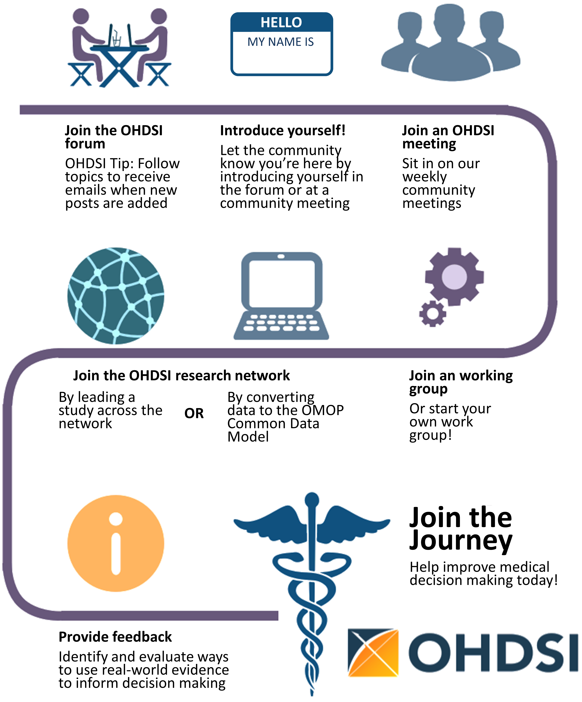

# Par où commencer {#WhereToBegin}

*Responsables du chapitre : Hamed Abedtash & Kristin Kostka*

> "Un voyage de mille lieues commence par un seul pas." - Lao Tzu

La communauté OHDSI représente une mosaïque de parties prenantes à travers le milieu académique, l'industrie et les entités gouvernementales. Notre travail bénéficie à une gamme d'individus et d'organisations, y compris les patients, les prestataires et les chercheurs, ainsi que les systèmes de santé, l'industrie et les agences gouvernementales. Ce bénéfice est réalisé en améliorant à la fois la qualité des analyses de données de santé et l'utilité des données de santé pour ces parties prenantes. Nous croyons que la recherche observationnelle est un domaine qui tire grand profit de la pensée disruptive. Nous recherchons activement et encourageons de nouvelles approches méthodologiques dans notre travail. \index{community}
## Rejoignez le voyage
Tout le monde est invité à participer activement à OHDSI, que vous soyez patient, professionnel de la santé, chercheur ou simplement quelqu'un qui croit en notre cause. OHDSI maintient un modèle d'adhésion inclusif. Devenir collaborateur OHDSI ne nécessite aucun frais d'adhésion. La collaboration est aussi simple que lever la main pour être inclus dans le décompte annuel des membres d'OHDSI. L'engagement est totalement volontaire. Un collaborateur peut avoir n'importe quel niveau de contribution au sein de la communauté, allant de la participation aux appels hebdomadaires de la communauté à la direction d'études de réseau ou de groupes de travail OHDSI. Les collaborateurs n'ont pas besoin d'être détenteurs de données pour être considérés comme des membres actifs de la communauté. La communauté OHDSI vise à servir les détenteurs de données, les chercheurs, les prestataires de soins de santé ainsi que les patients et consommateurs. Un registre des profils des collaborateurs est maintenu et périodiquement mis à jour sur le site web d'OHDSI. L'adhésion est encouragée via les appels communautaires OHDSI, les groupes de travail et les chapitres régionaux.\index{join the journey} \index{workgroups} \index{chapters}

```{r jointhejourney, fig.cap="Rejoignez le voyage - Comment devenir collaborateur OHDSI.", echo=FALSE, out.width='90%', fig.align='center'}

```


### Forums OHDSI
Le forum OHDSI[^forumUrl] est un site de discussion en ligne où les collaborateurs de la communauté OHDSI peuvent tenir des conversations sous forme de messages postés. Le forum se compose d'une structure répertoire en arbre. Le niveau supérieur est "Catégories". Les forums peuvent être divisés en catégories pour les discussions pertinentes. Sous les catégories se trouvent des sous-forums et ces sous-forums peuvent avoir d'autres sous-forums. Les sujets (couramment appelés fils de discussion) se trouvent sous le niveau le plus bas des sous-forums et c'est là que les membres des forums peuvent lancer leurs discussions ou posts.

[^forumUrl]: https://forums.ohdsi.org

Dans les forums OHDSI, vous pouvez trouver des catégories de contenu incluant :

- **Général :** pour des discussions générales sur la communauté OHDSI et comment s'impliquer
- **Implémenteurs :** pour discuter de la mise en œuvre du Modèle de Données Commun et du cadre analytique OHDSI dans votre environnement local
- **Développeurs :** pour discuter du développement open-source d'applications OHDSI et d'autres outils utilisant le CDM OMOP
- **Chercheurs :** pour discuter de la recherche basée sur le CDM, y compris la génération de preuves, la recherche collaborative, les méthodes statistiques et autres sujets d'intérêt pour le Réseau de Recherche OHDSI
- **Constructeurs de CDM :** pour discuter du développement en cours du CDM, y compris les exigences, le vocabulaire et les aspects techniques
- **Utilisateurs de vocabulaire :** pour discuter du contenu du vocabulaire
- **Chapitres régionaux (par exemple, Corée, Chine, Europe) :** pour des discussions régionales dans leurs langues natales liées aux implémentations locales d'OMOP et aux activités de la communauté OHDSI

Pour commencer à poster vos propres sujets, vous devrez vous inscrire pour un compte. Une fois que vous avez un compte sur le forum, il est encouragé de vous présenter dans le Sujet Général sous le fil de discussion appelé "Bienvenue chez OHDSI! - Merci de vous présenter". Vous êtes invités à répondre et 1) À vous présenter et nous dire un peu ce que vous faites et 2) À nous faire savoir comment vous aimeriez aider dans la communauté (ex. développement de logiciels, exécution d'études, rédaction de documents de recherche, etc.). Maintenant, vous êtes sur votre chemin OHDSI! À partir de là, vous êtes encouragés à participer aux discussions. La Communauté OHDSI encourage l'utilisation des Forums comme moyen de poser des questions, de discuter de nouvelles idées et de collaborer. \index{forum}

```{block2, type='rmdimportant'}
Vous pouvez sélectionner des sujets à "suivre". Cela signifie que chaque fois qu'un nouveau post est ajouté dans un sujet que vous suivez, vous recevrez un e-mail et pourrez répondre directement au post via votre e-mail. Suivez le fil général pour recevoir des détails sur les prochains ordres du jour des réunions, les opportunités de collaboration et recevez le digest hebdomadaire OHDSI directement dans votre boîte de réception!

```

### Événements OHDSI
OHDSI organise régulièrement des événements en personne pour offrir aux collaborateurs des opportunités d'apprendre les uns des autres et de se connecter pour favoriser de futures collaborations. Ces événements sont communiqués sur le site Web d'OHDSI et sont gratuits pour toute personne intéressée à y assister.

Les symposiums OHDSI sont des conférences scientifiques organisées annuellement aux États-Unis, en Europe et en Asie, où les collaborateurs peuvent présenter leurs dernières recherches par des conférences plénières, des présentations de posters et des démonstrations de logiciels. Les symposiums OHDSI offrent un excellent lieu de réseautage et d'apprentissage des progrès les plus récents au sein de la communauté. Les symposiums OHDSI sont généralement accompagnés de tutoriels OHDSI, enseignés par des collaborateurs OHDSI en tant que professeurs du cours, qui offrent aux nouveaux membres de la communauté l'opportunité de s'engager de manière pratique sur des sujets autour des standards de données et des meilleures pratiques d'analyse. Ces tutoriels sont généralement enregistrés en vidéo et mis à disposition sur le site Web OHDSI après les événements pour ceux qui ne peuvent pas y assister en personne.

Les événements face-à-face des collaborateurs OHDSI sont des forums plus restreints centrés sur un problème d'intérêt commun à aborder pendant le temps passé ensemble. Les événements passés ont inclus un hackathon de phénotype, un hackathon de qualité des données et un hackathon de documentation de logiciels open-source. OHDSI a organisé plusieurs événements Study-a-thon, où l'objectif de la session de plusieurs jours est de collaborer en équipe sur une question de recherche particulière en concevant et en mettant en œuvre une analyse observationnelle appropriée, en exécutant l'étude à travers le réseau OHDSI et en synthétisant les preuves pour une diffusion publique. Dans tous ces événements, il y a un désir commun de résoudre un problème commun mais aussi un intérêt partagé pour fournir un environnement accueillant qui encourage l'apprentissage et l'amélioration continue du processus de résolution collaborative de problèmes.

Découvrez la puissance de la Communauté OHDSI. Explorez les anciens symposiums, les réunions en face-à-face et regardez les tutoriels OHDSI en visitant la section [Événements passés OHDSI](https://www.ohdsi.org/past-events/) sur le site Web d'OHDSI. Les événements passés sont mis à jour régulièrement pour archiver les événements de la communauté.

### Appels de la communauté OHDSI
Les appels de la communauté OHDSI sont une opportunité hebdomadaire de mettre en lumière l'activité en cours au sein de la communauté OHDSI. Tenus chaque mardi de 11h à 12h ET, ces téléconférences sont un moment pour la communauté OHDSI de se réunir pour partager les développements récents et reconnaître les accomplissements des collaborateurs individuels, des groupes de travail et de la communauté dans son ensemble. La réunion de chaque semaine est enregistrée et les présentations sont archivées dans les ressources du site Web OHDSI.

Tous les collaborateurs OHDSI sont invités à participer à cette téléconférence hebdomadaire et encouragés à proposer des sujets pour les discussions communautaires. Les appels communautaires OHDSI peuvent être un forum pour partager des résultats de recherche, présenter et recueillir des commentaires sur les travaux en cours, démontrer des outils logiciels open-source en cours de développement, débattre des meilleures pratiques communautaires pour la modélisation des données et les analyses, et brainstormer sur de futures opportunités de collaboration pour les subventions/publications/ateliers de conférence. Si vous êtes un collaborateur avec un sujet pour une prochaine réunion des collaborateurs OHDSI, vous êtes invités à poster vos pensées sur les forums OHDSI.

En tant que nouveau membre de la communauté OHDSI, il est encouragé d'ajouter cette série d'appels à votre calendrier pour vous familiariser avec ce qui se passe dans tout le réseau OHDSI. Si vous souhaitez rejoindre un appel OHDSI, veuillez consulter les [Forums OHDSI](https://forums.ohdsi.org/) pour les annonces. Les sujets des appels communautaires varient d'une semaine à l'autre. Vous pouvez également consulter le digest hebdomadaire OHDSI sur le forum OHDSI pour plus d'informations sur les sujets de présentation hebdomadaires. Les nouveaux arrivants sont invités à se présenter lors de leur premier appel et à parler à la communauté d'eux-mêmes, de leur parcours et de ce qui les a amenés à OHDSI. \index{community!community calls}

### Groupes de travail OHDSI
OHDSI a une variété de projets en cours dirigés par des équipes de groupes de travail. Chaque groupe de travail a son propre groupe de direction qui détermine les objectifs, les buts et les artefacts du projet à contribuer à la communauté. La participation aux groupes de travail est ouverte à tous ceux qui ont un intérêt à contribuer aux objectifs et buts du projet. Les groupes de travail peuvent être des objectifs stratégiques à long terme ou des projets à court terme pour atteindre un besoin spécifique dans la communauté. La cadence des réunions des groupes de travail est déterminée par les dirigeants du projet et variera d'un groupe à l'autre. Une liste des groupes de travail actifs est maintenue sur le [Wiki OHDSI](https://www.ohdsi.org/web/wiki/doku.php?id=projects:overview). \index{workgroups}

Le tableau \@ref(tab:OHDSIworkgroups) fournit une référence rapide aux groupes de travail OHDSI actifs. Vous êtes encouragés à rejoindre un appel et à en savoir plus.

Table: (\#tab:OHDSIworkgroups) Groupes de travail OHDSI notables

|Nom du groupe de travail|Objectif|Public cible|
|:---- |:------------------ |:--------- |
|Atlas & WebAPI|Atlas et WebAPI font partie de l'architecture logicielle open-source OHDSI qui vise à fournir des capacités analytiques standardisées basées sur la fondation du Modèle de Données Commun OMOP.|Développeurs de logiciels Java et JavaScript visant à améliorer et contribuer à la plateforme open-source Atlas/WebAPI|
|CDM & Vocabulaire|Continuer à développer le Modèle de Données Commun OMOP dans le but d'analyses systématiques, standardisées et à grande échelle appliquées aux données cliniques des patients. Améliorer la qualité des Vocabulaires Standardisés en augmentant leur couverture des systèmes de codage internationaux et des aspects cliniques des soins aux patients afin de soutenir les analyses standardisées développées par d'autres groupes de travail.|Toute personne ayant un intérêt à améliorer le Modèle de Données Commun OMOP et les Vocabulaires Standardisés pour répondre à tous les besoins et cas d'utilisation|
|Génomique|Étendre le CDM OMOP pour incorporer les données génomiques des patients. Le groupe définira un schéma compatible avec le CDM qui pourra stocker des informations sur les variantes génétiques provenant de divers processus de séquençage.|Ouvert à tous|
|Estimation au niveau de la population|Développer des méthodes scientifiques pour la recherche observationnelle menant à des estimations des effets au niveau de la population qui soient précises, fiables et reproductibles, et faciliter l'utilisation de ces méthodes par la communauté.|Ouvert à tous|
|Traitement du Langage Naturel|Promouvoir l'utilisation des informations textuelles des dossiers de santé électroniques (DSE) pour les études observationnelles sous l'égide d'OHDSI. Pour faciliter cet objectif, le groupe développera des méthodes et des logiciels qui pourront être mis en œuvre pour utiliser le texte clinique pour les études de la communauté OHDSI.|Ouvert à tous|
|Prédiction au niveau des patients|Établir un processus standardisé pour développer des modèles de prédiction centrés sur le patient qui soient précis et bien calibrés et puissent être utilisés pour plusieurs résultats d'intérêt et appliqués aux données de soins observables de toute sous-population de patients d'intérêt|Ouvert à tous|
|Bibliothèque de phénotypes de référence|Permettre aux membres de la communauté OHDSI de trouver, évaluer et utiliser des définitions de cohortes validées par la communauté pour la recherche et d'autres activités|Ouvert à tous ceux qui s'intéressent à la curation et à la validation des phénotypes|
|Groupe de travail FHIR|Établir la feuille de route pour l'intégration OHDSI FHIR et faire des recommandations à la communauté plus large concernant l'utilisation de l'implémentation FHIR et des données dans la communauté des DSE pour les études observationnelles basées sur OHDSI et pour la diffusion des données et des résultats de recherche OHDSI via les outils et API basés sur FHIR.|Ouvert à tous ceux qui s'intéressent à l'interopérabilité|
|SIG|Étendre le CDM OMOP et utiliser les outils OHDSI afin que les historiques d'exposition environnementale des patients puissent être liés à leurs phénotypes cliniques|Ouvert à tous ceux qui s'intéressent aux attributs géographiques liés à la santé|
|Essais cliniques|Comprendre les cas d'utilisation des essais cliniques où la plateforme et l'écosystème OHDSI peuvent aider les essais à tout aspect, et contribuer à la mise à jour des outils OHDSI pour soutenir.|Ouvert à tous ceux qui s'intéressent aux essais cliniques|
|THEMIS|L'objectif de THEMIS est de développer des conventions standard, au-delà des conventions du CDM OMOP, pour garantir que les protocoles ETL conçus sur chaque site OMOP soient de la plus haute qualité, reproductibles et efficaces.|Ouvert à tous ceux qui s'intéressent à la standardisation ETL|
|Métadonnées & Annotations|Notre objectif est de définir un processus standard pour stocker des métadonnées et des annotations rédigées par des humains et des machines dans le Modèle de Données Commun afin de s'assurer que les chercheurs peuvent consommer et créer des artefacts de données utiles sur les ensembles de données observationnelles.|Ouvert à tous|
|Données de santé générées par les patients (PGHD)|L'objectif de ce GT est de développer des conventions ETL, un processus d'intégration avec les données cliniques et un processus analytique pour les PGHD, qui sont générées par des téléphones intelligents/appareils/appareils portables.|Ouvert à tous|
|Femmes d'OHDSI|Fournir un forum pour les femmes au sein de la communauté OHDSI pour se réunir et discuter des défis qu'elles rencontrent en tant que femmes travaillant dans les domaines des sciences, de la technologie, de l'ingénierie et des mathématiques (STEM). Nous visons à faciliter des discussions où les femmes peuvent partager leurs perspectives, soulever des préoccupations, proposer des idées sur la façon dont la communauté OHDSI peut soutenir les femmes dans les STEM, et inspirer les femmes à devenir des leaders au sein de la communauté et de leurs domaines respectifs.|Ouvert à toutes celles qui se reconnaissent dans cette mission|
|Comité de pilotage|Maintenir la mission, la vision et les valeurs d'OHDSI en s'assurant que toutes les activités et événements OHDSI sont alignés sur les besoins de notre communauté en croissance. De plus, le groupe sert de groupe consultatif pour le centre de coordination OHDSI basé à Columbia en fournissant des conseils sur la direction future d'OHDSI.|Leaders au sein de la communauté|

### Chapitres régionaux OHDSI
Un chapitre régional OHDSI représente un groupe de collaborateurs OHDSI situés dans une zone géographique qui souhaitent organiser des événements de réseautage locaux et des réunions pour aborder des problèmes spécifiques à leur localisation géographique. Aujourd'hui, les chapitres régionaux OHDSI incluent OHDSI en Europe[^europeUrl], OHDSI en Corée du Sud[^koreaUrl] et OHDSI en Chine.[^chinaUrl] Si vous souhaitez créer un chapitre régional OHDSI dans votre région, vous pouvez le faire en suivant le processus de chapitre régional OHDSI décrit sur le [site web OHDSI](https://www.ohdsi.org/who-we-are/regional-chapters). \index{chapters}

[^europeUrl]: https://www.ohdsi-europe.org/
[^koreaUrl]: https://forums.ohdsi.org/c/For-collaborators-wishing-to-communicate-in-Korean
[^chinaUrl]: https://ohdsichina.org/

### Réseau de recherche OHDSI
De nombreux collaborateurs OHDSI sont intéressés par la conversion de leurs données au Modèle de Données Commun OMOP. Le réseau de recherche OHDSI représente une communauté diversifiée et mondiale de bases de données observationnelles qui ont subi des processus d'Extraction-Tranform-Load (ETL) pour devenir conformes au modèle OMOP. Si votre parcours dans la communauté OHDSI inclut la transformation de données, de nombreuses ressources communautaires sont disponibles pour vous aider, y compris des tutoriels sur le CDM OMOP et les Vocabulaires, des outils gratuits pour aider à la conversion et des groupes de travail ciblant des domaines spécifiques ou des types de conversions de données. Les collaborateurs OHDSI sont encouragés à utiliser le forum OHDSI pour discuter et résoudre les défis qui surviennent pendant les conversions CDM.
## Où vous situez-vous
À ce stade, vous vous demandez peut-être : *où me situe-je dans la communauté OHDSI ?*

**Je suis un chercheur clinique cherchant à démarrer une étude.** Si vous êtes un chercheur clinique intéressé par l'utilisation du réseau de recherche OHDSI pour répondre à une question spécifique -- peut-être même publier un article -- vous êtes au bon endroit. Vous pouvez commencer par poster votre idée sur le [Sujet des chercheurs OHDSI](https://forums.ohdsi.org/c/researchers) sur le forum OHDSI. Cela vous aidera à vous connecter avec des chercheurs ayant des intérêts similaires. OHDSI aime publier et dispose de nombreuses ressources pour accélérer la transformation de votre question de recherche en une analyse et un article. Vous pouvez trouver plus d'informations dans les chapitres \@ref(Characterization), \@ref(PopulationLevelEstimation) et \@ref(PatientLevelPrediction).

**Je veux lire et consommer les informations produites par la communauté OHDSI.** Que vous soyez un patient, un clinicien en exercice ou un expert en la matière dans le domaine de la santé, OHDSI souhaite vous fournir des preuves de haute qualité pour vous aider à mieux comprendre les résultats de santé. Peut-être que cela fait un moment que vous n'avez pas écrit de code. Peut-être que vous n'avez jamais programmé. Vous avez une place dans cette communauté. Nous vous appelons un *consommateur de preuves* -- vous êtes les personnes qui transforment la recherche OHDSI en action. Vous examinez pour savoir quelles preuves OHDSI a générées et génère, souhaitant peut-être également suggérer des questions pertinentes pour vous. Nous vous invitons à rejoindre la discussion. Commencez à poser des questions sur le [Forum OHDSI](http://forums.ohdsi.org). Assistez aux appels communautaires et découvrez les dernières recherches. Assistez aux symposiums et aux réunions en face à face de l'OHDSI pour vous engager directement avec la communauté. Vos questions sont une partie importante de la communauté OHDSI. Prenez la parole et aidez-nous à en apprendre davantage sur les preuves que vous recherchez !

**Je travaille dans un rôle de leadership en santé. Je peux être un propriétaire de données et/ou représenter un. J'évalue l'utilité du CDM OMOP et des outils analytiques OHDSI pour mon organisation.** En tant qu'administrateur/leader d'une organisation, vous avez peut-être entendu parler d'OHDSI et vous vous demandez si le CDM OMOP pourrait fonctionner pour vos cas d'utilisation. Vous pouvez commencer par regarder les matériaux des [Événements passés d'OHDSI](https://www.ohdsi.org/past-events/) pour voir le corpus de recherche. Vous pouvez rejoindre un appel communautaire et simplement écouter. Vous pouvez également trouver que le chapitre \@ref(DataAnalyticsUseCases) (Cas d'utilisation de l'analyse de données) vous aide à comprendre le type de recherche que les outils analytiques CDM OMOP et OHDSI peuvent permettre. La communauté OHDSI est là pour vous accompagner tout au long de votre parcours. N'ayez pas peur de prendre la parole et de demander des exemples si vous avez des domaines spécifiques qui vous intéressent. Plus de 200 organisations dans le monde collaborent avec OHDSI, il y a de nombreuses histoires de succès pour démontrer la valeur de cette communauté.

**Je suis un administrateur de base de données cherchant à ETL/converter les données de mon institution au CDM OMOP.** Choisir de "OMOP" vos données est une entreprise novatrice et utile. Si vous débutez dans votre processus ETL, consultez les [Diapositives du tutoriel ETL de la communauté OHDSI](https://www.ohdsi-europe.org/images/symposium-2019/tutorials/OHDSI_Vocabulary_CDM_Tutorial.pdf) ou inscrivez-vous pour la prochaine session lors d'un symposium OHDSI à venir. Envisagez de participer aux appels du groupe de travail THEMIS et de vous engager sur le forum OHDSI avec vos questions. Vous trouverez une mine de connaissances dans la communauté intéressée à aider votre mise en œuvre réussie du CDM OMOP. Ne soyez pas timide!

**Je suis un biostatisticien et/ou un développeur de méthodes intéressé à contribuer à la pile d'outils OHDSI.** Vous êtes doué en R. Vous savez comment faire un commit sur Git. Surtout, vous êtes impatient d'apporter votre expertise à la bibliothèque de méthodes OHDSI et de développer davantage ces méthodologies. Vous voudrez commencer par rejoindre les appels des groupes de travail sur l'estimation au niveau de la population ou la prédiction au niveau du patient pour en savoir plus sur les priorités actuelles de la communauté. Lorsque vous utilisez les outils OHDSI, vous pouvez également signaler des problèmes sous le dépôt GitHub correspondant (par exemple, s'il s'agit d'un problème lié au package SQL Render, vous déposeriez sous le dépôt GitHub de OHDSI/SqlRender). Nous accueillons vos contributions !

**Je suis un développeur de logiciels intéressé à construire un outil qui complète la pile d'outils OHDSI.** Bienvenue dans la communauté! Dans le cadre de la mission OHDSI, nos outils sont open source et régis sous les licences Apache. Vous êtes invités à développer des solutions qui complètent la pile d'outils OHDSI. N'hésitez pas à rejoindre un groupe de travail et à proposer vos idées. Veuillez noter que OHDSI est fortement investie dans la science ouverte et la collaboration ouverte. Les algorithmes et solutions logicielles propriétaires sont les bienvenus mais ne sont pas le principal focus de nos efforts de développement de logiciels.

**Je suis un consultant cherchant à conseiller la communauté OHDSI.** Bienvenue dans la communauté ! Votre expertise est précieuse et appréciée. Vous pouvez promouvoir vos services sur le forum OHDSI, le cas échéant. Vous êtes invités à nous rejoindre lors des tutoriels OHDSI et à envisager de contribuer en partageant votre expertise lors des symposiums et des réunions en face à face tout au long de l'année.

**Je suis un étudiant cherchant à en apprendre davantage sur OHDSI.** Vous êtes au bon endroit ! Envisagez de rejoindre un appel communautaire OHDSI et de vous présenter. Vous êtes encouragé à vous plonger dans les tutoriels OHDSI, à assister aux symposiums OHDSI et aux réunions en face à face pour en savoir plus sur les méthodes et les outils offerts par la communauté OHDSI. Si vous avez un intérêt de recherche spécifique, faites-le nous savoir en postant dans le sujet des chercheurs sur le forum OHDSI. De nombreuses organisations proposent des opportunités de recherche parrainées par OHDSI (par exemple, post-Doc, bourses de recherche). Le forum OHDSI vous fournira les dernières informations sur ces opportunités et plus encore.

## Résumé

```{block2, type='rmdsummary'}
- Démarrer dans la communauté OHDSI est aussi simple que de dire bonjour ! Postez sur le **forum OHDSI** et rejoignez un appel communautaire.
- Postez vos questions de recherche ou ETL sur le forum OHDSI.

```
